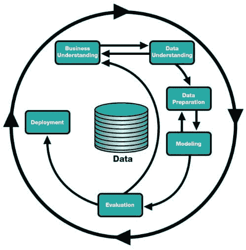
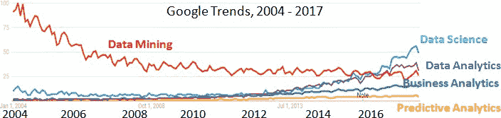
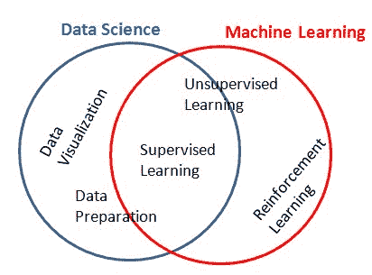
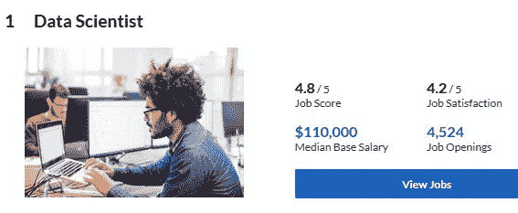
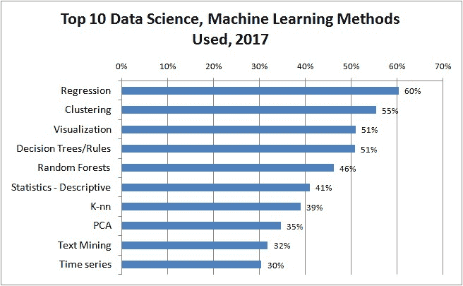

# 你需要了解的数据科学的 5 件事。

> 原文：[`www.kdnuggets.com/2018/02/5-things-about-data-science.html`](https://www.kdnuggets.com/2018/02/5-things-about-data-science.html)

我经常被问到有关数据科学的问题，因此这里是我对一些常见问题的回答，以及关于数据科学和数据科学家的 5 件有用的事宜。

**1\. 商业智能、业务分析、数据科学、数据分析、数据挖掘、预测分析——它们之间的区别是什么？**

**商业智能 或 BI** 主要关注数据分析和报告，但不包括预测建模，因此 BI 可以被视为数据科学的一个子集。

其他术语：*业务分析，数据分析，数据挖掘，预测分析* 本质上与数据科学相同。

数据科学 关注于分析数据并从中提取有用的知识。建立预测模型通常是数据科学家最重要的活动。

然而，由于“数据科学”这个术语相对较新，该名称尚未被广泛接受，其他名称常用于同一领域。

数据科学可以通过 数据科学过程 理解，其中包括业务理解、数据理解、数据准备、建模、评估和部署，如 CRISP-DM 框架所描述：

 **图 1：CRISP-DM - 数据科学过程。**

许多大学最近创建了商业分析、数据分析或数据科学学位。商业分析，如其名称所示，更注重商业技能和方法，而“数据科学”和“数据分析”则更注重数据工程方面。

在科学界，这个领域最受欢迎的名称随着时间的推移发生了变化。

+   数据挖掘：首次出现在 1970 年代，约在 2002 年达到顶峰，但今天仍在使用。

+   KDD（知识发现与数据挖掘）：在 1990 年代使用，KDD 会议开始后使用，但现在仅在研究界使用。

+   预测分析：出现在 2000 年代，由 预测分析世界 推广，但尚未为大众所熟知。

+   数据科学，2012 年至今，受到了“数据科学家”职位流行的推动。

这个 [Google Trends](https://trends.google.com/trends/explore?date=2004-01-01%202017-12-31&q=Data%20Science,Data%20Mining,Predictive%20Analytics,Business%20Analytics,Data%20Analytics) 图表显示了 2004 年至 2017 年间与数据科学相关的 5 个术语的相对流行度变化。

**图 2：2004-2017 年间数据挖掘、数据科学、数据分析、业务分析、预测分析的 Google 趋势。**

**2\. 数据科学与机器学习：有什么区别？**

数据科学和机器学习可以被视为亲密的“亲戚”。

它们的共同点在于使用监督学习方法——从历史数据中学习。

然而，数据科学还涉及数据可视化以及以人们易于理解的形式呈现结果。数据科学更加注重数据准备和数据工程。

机器学习的主要关注点是学习算法——例如，它不涉及数据可视化。机器学习不仅研究从历史数据中学习，还包括实时学习。机器学习的重要组成部分是为在环境中行动并从其行为中学习的智能体设计算法。这被称为强化学习（RL）。要了解更多关于 RL 的历史和现状，请参见我与强化学习之父 Rich Sutton 的访谈。

RL 是 AlphaGo Zero 和 AlphaZero 最近成功的关键部分。

**Q3\. 数据科学家是个好工作吗？**

是的！数据科学家被 Glassdoor 评选为美国最佳职位已经连续 3 年——请参见

+   数据科学家 - 连续 3 年被评为美国最佳职位

+   数据科学家 - 2017 年被评为美国最佳职位

+   数据科学家 - 2016 年被评为美国最佳职位

最近的 LinkedIn 经济图谱报告也为这一领域带来了好消息。机器学习工程师和数据科学家在 2017 年是美国的顶级新兴职位，机器学习工程师的职位在 5 年内增长了 9.8 倍，数据科学家的职位增长了 6.5 倍。

**4\. 我可以在哪里学习数据科学？**

数据科学教育是 KDnuggets 上最受欢迎的话题之一，有一个专门的部分用于介绍这一主题。

学习数据科学及相关主题有很多选择。

我们最近进行了一系列关于最佳分析与数据科学硕士课程的调查，还考察了学费和课程排名。请参见

+   **最佳在线数据科学与分析硕士课程**

+   **美国/加拿大最佳数据科学与分析硕士课程**

+   **最佳数据科学与分析硕士课程 - 欧洲版**

+   **最佳数据科学与分析硕士课程 - 亚洲和澳大利亚版**

以下是第一篇文章中排名前列的项目概览图：

 **分析、数据科学 - 在线与校园课程**，来自这篇帖子

符号颜色为在线课程的蓝色，校园课程的绿色；形状为分析硕士的圆形；数据科学硕士的方形。

我们注意到排名与学费之间几乎没有相关性。大多数高排名的大学不提供在线学位。伯克利和 CMU 是例外。

我们调查的 MS 学位中略多于一半被称为“数据科学”——其中大部分是技术导向的，而略少于一半被称为“分析”——大多是商业导向的。

还有许多选择

+   分析、 大数据、数据科学、机器学习的证书与认证

+   数据科学在线课程和课程。

+   分析、大数据和数据科学的训练营

另见 KDnuggets 关于数据科学课程和教育的相关帖子

+   标签：在线教育（201）

+   标签：数据科学教育（167）

+   标签：理学硕士（64）

+   标签：数据科学硕士（40）

+   标签：分析硕士（27）

+   标签：商业分析硕士（25）

**5\. 数据科学家使用哪些算法和方法？**

尽管深度学习似乎每天都在推动最先进的技术，并且像 XGBoost 这样的先进方法赢得了许多 Kaggle 比赛，但大多数数据科学工作涉及的是更基础的算法和方法。

KDnuggets 最近的调查

> 你在过去 12 个月中为实际应用使用了哪些数据科学/机器学习方法和工具？

排名前十的结果如下：

**2017 年 KDnuggets 调查中使用的前 10 大数据科学、机器学习方法**

大约 20%的受访者使用了深度学习。

我们的调查还发现了哪些方法与行业联系最紧密：

+   提升建模（连续第二年）

+   异常/偏差检测

+   梯度提升机

最“学术”的方法是与深度学习相关的高级主题：

+   生成对抗网络（GAN）

+   强化学习

+   循环神经网络（RNN）

+   卷积网络

在 Kaggle 2017 调查中，[数据科学与机器学习现状](https://www.kaggle.com/surveys/2017)的工作中最常用的数据科学方法包括：

+   逻辑回归，63.5%

+   决策树，49.9%

+   随机森林，46.3%

+   神经网络，37.6%

+   贝叶斯技术，30.6%

要了解更多关于最重要算法的内容，请查看我们关于算法的最受欢迎的文章。

+   **初学者的十大机器学习算法**

+   **数据科学家需要掌握的 10 种统计技术**

+   **逻辑回归：简明技术概述**

+   **2118 年将使用哪些机器学习算法？**

+   **机器学习算法：为你的问题选择哪个**

+   **随机森林（r）解析**

+   **XGBoost：Kaggle 上的顶级机器学习方法解析**

+   **机器学习算法：简明技术概述 - 第一部分**

+   **自驾车中使用的机器学习算法**

+   **保持简单！如何理解梯度下降算法**

+   **机器学习工程师需要了解的 10 种算法**

以及 KDnuggets 标签文章

+   算法 (116)

+   解析 (37)

### 更多相关话题

+   [你需要知道的 6 件数据管理事宜及其重要性…](https://www.kdnuggets.com/2022/05/6-things-need-know-data-management-matters-computer-vision.html)

+   [构建 LLM 应用程序时需要知道的 5 件事](https://www.kdnuggets.com/2023/08/5-things-need-know-building-llm-applications.html)

+   [7 件你不知道可以用低代码工具做的事](https://www.kdnuggets.com/2022/09/7-things-didnt-know-could-low-code-tool.html)

+   [KDnuggets 新闻，4 月 13 日：数据科学家应该了解的 Python 库…](https://www.kdnuggets.com/2022/n15.html)

+   [你可能不知道的 SAS 数据科学学院的 3 件事](https://www.kdnuggets.com/2022/07/sas-3-things-didnt-know-sas-academy-data-science.html)

+   [在扩展你的网络数据驱动产品时需要知道的事](https://www.kdnuggets.com/2023/08/things-know-scaling-web-datadriven-product.html)
