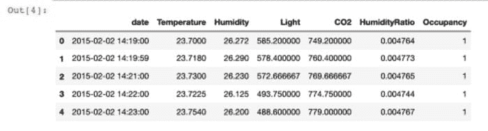
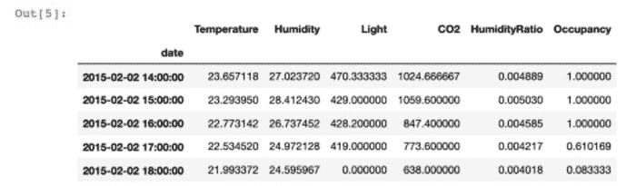
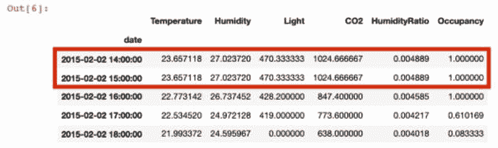
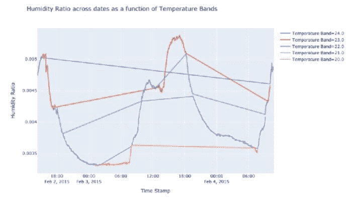
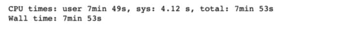
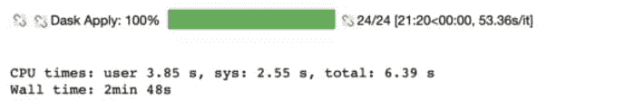
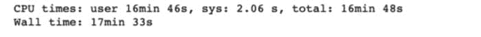
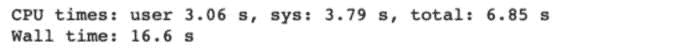

# 使我作为数据科学家的工作更轻松的 5 件事

> 原文：[`www.kdnuggets.com/2021/08/5-things-job-data-scientist-easier.html`](https://www.kdnuggets.com/2021/08/5-things-job-data-scientist-easier.html)

评论

**由[Shree Vandana](https://www.linkedin.com/in/shree-vandana-kachroo/)，数据科学家**


图片由[Boitumelo Phetla](https://unsplash.com/@writecodenow?utm_source=medium&utm_medium=referral)提供，来源于[Unsplash](https://unsplash.com/?utm_source=medium&utm_medium=referral)

## **1\. 使用 Pandas 处理时间序列数据**

* * *

## 我们的前三个课程推荐

 1\. [谷歌网络安全证书](https://www.kdnuggets.com/google-cybersecurity) - 快速开启网络安全职业之路。

 2\. [谷歌数据分析专业证书](https://www.kdnuggets.com/google-data-analytics) - 提升你的数据分析技能

 3\. [谷歌 IT 支持专业证书](https://www.kdnuggets.com/google-itsupport) - 支持你的组织的 IT 需求

* * *

如果你处理时间序列数据，你可能花费了大量时间来处理缺失记录或通过 SQL 查询或编写自定义函数在特定时间粒度下聚合数据。Pandas 有一个非常高效的[重采样函数](https://pandas.pydata.org/pandas-docs/stable/reference/api/pandas.DataFrame.resample.html)，通过将 DataFrame 索引设置为时间戳列，你可以按特定频率处理数据。

我将使用房间占用数据集来举例说明这个函数。你可以在[这里](https://archive.ics.uci.edu/ml/datasets/Occupancy+Detection+)找到数据集。这个数据集记录了每分钟的观察数据。

```py
import pandas as pd
data = pd.read_csv('occupancy_data/datatest.txt').reset_index(drop = True)
data.head(5)
```



首先，我展示一个简单的聚合方法，用于在每小时级别获取指标。

```py
data.index = pd.to_datetime(data['date'])
pd.DataFrame(data.resample('H').agg({'Temperature':'mean',
                                     'Humidity':'mean',
                                     'Light':'last',
                                     'CO2':'last',
                                     'HumidityRatio' : 'mean',
                                     'Occupancy' : 'mean'})).head(5)
```



尽管这个数据集并不稀疏，但在现实世界中，我们常常遇到缺失记录的数据。处理这些记录非常重要，因为你可能需要将缺失的记录填充为 0，或者使用前一个或下一个时间步长进行插补。下面，我删除了 15 小时的记录，展示了如何使用 14 小时的时间戳来填补缺失的值：

```py
data = pd.read_csv('occupancy_data/datatest.txt').reset_index(drop = True)data_missing_records = data[~(pd.to_datetime(data.date).dt.hour == 15)].reset_index(drop = True)data_missing_records.index = pd.to_datetime(data_missing_records['date'])data_missing_records.resample('H', base = 1).agg({'Temperature':'mean',
        'Humidity':'mean',
        'Light':'last',
        'CO2':'last',
        'HumidityRatio' : 'mean',
         'Occupancy' : 'mean'}).fillna(method  = 'ffill').head(5)
```



## **2\. 通过 Plotly Express 进行快速可视化**

从分析到模型训练再到模型报告，通常需要可视化。特别是在时间序列图中，我发现自己花费了很多时间尝试自定义 matplotlib 中 x 轴刻度的大小和角度。在切换到使用 Plotly Express 后，我将使图表看起来更清晰的时间减少了大约 70%。如果我想在我的可视化中实现特定的细节，我仍然可以使用 Plotly Graph Objects。此外，Plotly 通过 Express 提供了很多简单的选项，例如在图表中设置组颜色，这样可以产生更强大的可视化效果。

```py
import plotly.express as px
data['Temp_Bands'] = np.round(data['Temperature'])
fig = px.line(data, x = 'date',
              y = 'HumidityRatio',
              color = 'Temp_Bands',
             title = 'Humidity Ratio across dates as a function of
             Temperature Bands',
             labels = {'date' : 'Time Stamp',
                      'HumidityRatio' : 'Humidity Ratio',
                      'Temp_Bands' : 'Temperature Band'})
fig.show()
```

使用上述提到的占用数据集，我用 Plotly Express 创建了颜色分组的折线图。我们可以看到仅用两个函数就能轻松创建这些图表。



## **3\. 通过 Swifter 加速 pandas apply()**

我有时遇到处理 pandas 列时的长时间等待，即使在一个大实例的笔记本上运行代码也是如此。相反，只需添加一个简单的单词就可以加快 pandas DataFrame 中的 apply 功能。只需导入 swifter 库即可。

```py
def custom(num1, num2):

    if num1 > num2:
        if num1 < 0:
            return "Greater Negative"
        else:
            return "Greater Positive"
    elif num2 > num1:
        if num2 < 0:
            return "Less Negative"
        else:
            return "Less Positive"
    else:
        return "Rare Equal"import swifter 
import pandas as pd
import numpy as npdata_sample = pd.DataFrame(np.random.randint(-10000, 10000, size = (50000000, 2)), columns = list('XY'))
```

我创建了一个 5000 万行的数据框，并比较了通过 swifter 的 apply() 和原生 apply() 处理它所需的时间。我还创建了一个具有简单 if else 条件的虚拟函数，以测试这两种方法。

```py
%%timeresults_arr = data_sample.apply(lambda x : custom(x['X'], x['Y']), axis = 1)
```



```py
%%timeresults_arr = data_sample.swifter.apply(lambda x : custom(x['X'], x['Y']), axis = 1)
```



我们将处理时间从 7 分钟 53 秒减少了 64.4%，到 2 分钟 38 秒。

## **4\. Python 中的多线程**

在减少时间复杂度的话题上，我经常需要处理多个粒度的数据集。使用 Python 中的多线程可以通过利用多个工作线程来节省时间。

我展示了使用相同的 5000 万行数据框的多线程效果，除了这次我添加了一个分类变量，这是从一组元音中随机选择的值。

```py
import pandas as pd
import numpy as np
import randomstring =  'AEIOU'data_sample = pd.DataFrame(np.random.randint(-10000, 10000, size = (50000000, 2)), columns = list('XY'))
data_sample['random_char'] = random.choices(string, k = data_sample.shape[0])
unique_char = data_sample['random_char'].unique()
```

我使用了一个 for 循环与来自 concurrent.futures 的 Process Pool 执行器，展示了我们可以实现的运行时减少。

```py
%%timearr = []for i in range(len(data_sample)):

    num1 = data_sample.X.iloc[i]
    num2 = data_sample.Y.iloc[i]

    if num1 > num2:
        if num1 < 0:
            arr.append("Greater Negative")
        else:
            arr.append("Greater Positive")
    elif num2 > num1:
        if num2 < 0:
            arr.append("Less Negative")
        else:
            arr.append("Less Positive")
    else:
        arr.append("Rare Equal")
```



```py
def custom_multiprocessing(i):

    sample = data_sample[data_sample['random_char'] == \
    unique_char[i]]

    arr = []

    for j in range(len(sample)):
        if num1 > num2:
            if num1 < 0:
                arr.append("Greater Negative")
            else:
                arr.append("Greater Positive")
        elif num2 > num1:
            if num2 < 0:
                arr.append("Less Negative")
            else:
                arr.append("Less Positive")
        else:
            arr.append("Rare Equal")

    sample['values'] = arr

    return sample
```

我创建了一个函数，允许我单独处理每个元音分组：

```py
 %%time 
import concurrentdef main():
    aggregated = pd.DataFrame()

    with concurrent.futures.ProcessPoolExecutor(max_workers = 5) as executor:
        results = executor.map(custom_multiprocessing, range(len(unique_char)))if __name__ == '__main__':
    main()
```



我们看到 CPU 时间减少了 99.3%。不过，必须记住谨慎使用这些方法，因为它们不会序列化输出，因此通过分组使用它们可以很好地利用这一能力。

## **5\. MASE 作为指标**

随着时间序列预测中机器学习和深度学习方法的兴起，使用的指标**不**仅仅基于预测值和实际值之间的距离。预测模型的指标还应考虑时间趋势中的错误，以评估模型的表现，而不仅仅是瞬时误差估计。引入[均值绝对尺度误差](https://robjhyndman.com/publications/another-look-at-measures-of-forecast-accuracy/)! 该指标考虑了如果我们使用随机游走方法，即最后一个时间戳的值将是下一个时间戳的预测值时，我们会得到的误差。它将模型的误差与天真预测的误差进行比较。

```py
def MASE(y_train, y_test, pred): 

    naive_error = np.sum(np.abs(np.diff(y_train)))/(len(y_train)-1)        
    model_error = np.mean(np.abs(y_test - pred))return model_error/naive_error
```

如果 MASE > 1，则模型的表现不如随机游走。MASE 越接近 0，预测模型的效果越好。

在这篇文章中，我们介绍了一些我经常使用的技巧，以便作为数据科学家让自己的工作更轻松。评论分享你的一些技巧吧！我很想了解其他数据科学家在工作中使用的技巧。

这也是我的第一篇 Medium 文章，我感觉像是在对着虚空发言，如果你有任何反馈，请随时批评和联系我 :)

感谢 Anne Bonner。

**个人简介：[Shree Vandana](https://www.linkedin.com/in/shree-vandana-kachroo/)** 是亚马逊的数据科学家，拥有罗切斯特大学的数据科学硕士学位，对数据和机器学习充满热情！

[原文](https://towardsdatascience.com/5-things-that-make-my-job-as-a-data-scientist-easier-dc0820f0f136)。经许可转载。

**相关：**

+   如何为你的数据科学问题选择初始模型

+   ROC 曲线解释

+   如何查询你的 Pandas 数据框

### 相关话题

+   [如何让文档编写代码更容易](https://www.kdnuggets.com/2022/12/make-documenting-code-easier.html)

+   [Ploomber vs Kubeflow：让 MLOps 变得更简单](https://www.kdnuggets.com/2022/02/ploomber-kubeflow-mlops-easier.html)

+   [选择下一个数据科学职位前需要记住的 5 件事](https://www.kdnuggets.com/2022/01/5-things-keep-mind-selecting-next-job.html)

+   [数据分析中的就业趋势：NLP 在就业趋势分析中的应用](https://www.kdnuggets.com/job-trends-in-data-analytics-nlp-for-job-trend-analysis)

+   [区分数据科学家与其他职业的 5 个因素](https://www.kdnuggets.com/2021/11/5-things-set-data-scientist-apart-other-professions.html)

+   [数据科学职位标题导航：数据分析师 vs. 数据科学家…](https://www.kdnuggets.com/navigating-data-science-job-titles-data-analyst-vs-data-scientist-vs-data-engineer)
