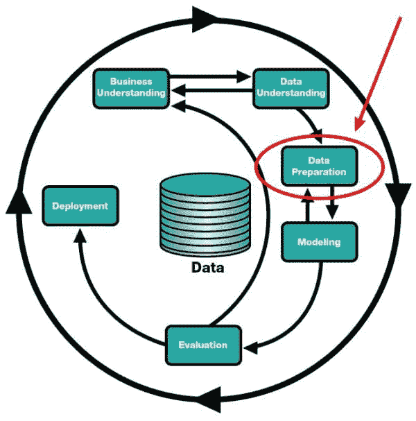
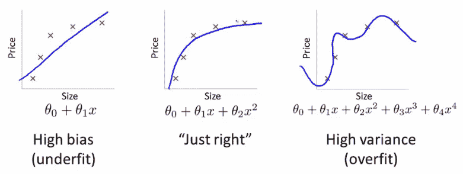
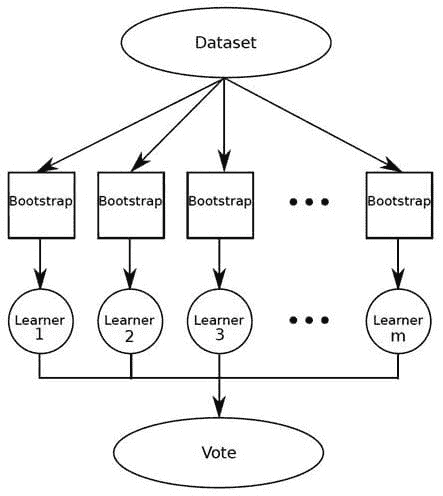

# 5 件你需要知道的关于机器学习的事

> 原文：[`www.kdnuggets.com/2018/03/5-things-know-about-machine-learning.html`](https://www.kdnuggets.com/2018/03/5-things-know-about-machine-learning.html)

 评论

在任何快速发展的领域总有新的东西可以学习，机器学习也不例外。这篇文章将指出 5 件你可能不知道的、可能不曾意识到的，或曾经知道但现在已忘记的关于机器学习的事。

请注意，这篇文章的标题不是“最重要的 5 件事...”或“关于机器学习的前 5 件事...”；它*只是*“5 件事”。这不是权威或详尽的，而是 5 件可能有用的事情的集合。

* * *

## 我们的前 3 个课程推荐

 1\. [Google 网络安全证书](https://www.kdnuggets.com/google-cybersecurity) - 快速进入网络安全职业道路。

 2\. [Google 数据分析专业证书](https://www.kdnuggets.com/google-data-analytics) - 提升你的数据分析能力

 3\. [Google IT 支持专业证书](https://www.kdnuggets.com/google-itsupport) - 支持你组织的 IT 工作

* * *

### 1\. 数据准备占机器学习的 80%，所以...

数据准备在机器学习任务中确实占用了不成比例的时间。或者说，**看起来**占用了不成比例的时间。

在这些讨论中，除了执行数据准备的具体细节和其重要性原因外，常常缺乏的是*为什么你应该关心数据准备*。我指的不仅仅是为了获得合规的数据，而更像是哲学上的讨论，为什么你应该接受数据准备。活在数据准备中，与数据准备融为一体。



在[CRISP-DM 模型](https://en.wikipedia.org/wiki/Cross_Industry_Standard_Process_for_Data_Mining)中的数据准备。

我能想到的一些最佳机器学习建议是，因为你最终注定会花费大量时间准备数据以迎接大场面，所以决心成为最优秀的数据准备专业人士是一个相当不错的目标。由于这不仅耗时且对后续步骤（垃圾进，垃圾出）极为重要，拥有一个出色的数据准备者的声誉也不会是世界上最糟糕的事情。

所以，是的，虽然数据准备可能需要花费一些时间来执行和掌握，但这其实并不是一件坏事。这一必要性带来的机会，不仅可以在你的角色中脱颖而出，还有认识到你在工作中很优秀的内在价值。

若要获取更多关于数据准备的实用见解，可以从以下几个地方开始：

+   掌握 Python 数据准备的 7 个步骤

+   从零开始的 Python 机器学习工作流 第一部分：数据准备

### 2\. 性能基准的价值

所以你使用特定算法对一些数据进行了建模，花时间调整了超参数，进行了特征工程和/或选择，并且你很高兴地发现训练准确率达到了 75%。你为自己的辛勤工作感到自豪。

但你在将结果与什么进行比较呢？如果没有基准 -- [一个简单的合理检查包括将估计器与简单的经验法则进行比较](http://scikit-learn.org/stable/modules/model_evaluation.html#dummy-estimators) -- 那么你实际上是在将那辛苦的工作与 **空无** 进行比较。合理的假设是，没有可以比较的东西，几乎任何准确度都可以被认为值得拍背。

随机猜测不是基准的最佳策略；相反，存在用于确定基准准确度的公认方法。例如，Scikit-learn 提供了一系列基准分类器，位于其 `[DummyClassifier](http://scikit-learn.org/stable/modules/model_evaluation.html#dummy-estimators)` 类中：

> +   `stratified` 通过尊重训练集类别分布来生成随机预测。
> +   
> +   `most_frequent` 总是预测训练集中最频繁的标签。
> +   
> +   `prior` 总是预测最大化类别先验的类别（例如，```pymost_frequent`) and ``predict_proba``` 返回类别先验。
> +   
> +   `uniform` 生成均匀随机的预测。
> +   
> +   `constant` 总是预测由用户提供的常量标签。

基准不仅仅适用于分类器；例如，存在用于基准回归任务的统计方法。

在进行探索性数据分析和数据准备及预处理之后，建立基准是机器学习工作流中的逻辑下一步。

### 3\. 验证：超越训练和测试

当我们构建机器学习模型时，我们使用 *训练数据* 进行训练。当我们测试结果模型时，我们使用 *测试数据*。那么验证在哪里呢？

[Rachel Thomas](https://twitter.com/math_rachel) 在 [fast.ai](http://www.fast.ai/) 最近写了一篇关于 如何及为何创建良好验证集 的深入文章。在其中，她介绍了这三种数据类型：

> +   训练集用于训练给定模型
> +   
> +   验证集用于在模型之间进行选择（例如，随机森林还是神经网络更适合你的问题？你想要一个有 40 棵树还是 50 棵树的随机森林？）
> +   
> +   测试集告诉你你的表现如何。如果你尝试了很多不同的模型，你可能会偶然间得到一个在验证集上表现良好的模型，而有一个测试集有助于确保这不是偶然的。



来源：斯坦福大学 Andrew Ng 的机器学习课程

那么，将数据随机拆分为测试集、训练集和验证集总是一个好主意吗？事实证明，不一定。Rachel 在时间序列数据的背景下讨论了这一点：

> Kaggle 目前有一个竞赛，旨在[预测厄瓜多尔连锁超市的销售情况](https://www.kaggle.com/c/favorita-grocery-sales-forecasting)。Kaggle 的“训练数据”涵盖了 2013 年 1 月 1 日至 2017 年 8 月 15 日，而测试数据的时间跨度为 2017 年 8 月 16 日至 2017 年 8 月 31 日。一个好的方法是将 2017 年 8 月 1 日至 8 月 15 日作为你的验证集，将所有早期的数据作为训练集。

其余部分的内容将数据集拆分与 Kaggle 竞赛数据相关联，这些是实用的信息，同时也涉及交叉验证的讨论，这部分我留给你自己去探索。

其他时候，数据的随机拆分也会有用；这取决于你获取数据时的状态（数据是否已经被拆分为训练集/测试集？），以及数据的类型（见上面的时间序列摘录）。

对于随机拆分**可行**的情况，Scikit-learn 可能没有 `train_validate_test_split` 方法，但你可以利用标准 Python 库来创建你自己的方法，[例如这里提到的](https://stackoverflow.com/questions/38250710/how-to-split-data-into-3-sets-train-validation-and-test)。

### 4\. 集成方法不仅仅是树的集合

对于机器学习新手来说，算法选择可能是一个挑战。通常在构建分类器时，尤其是对于初学者，采用的方法会考虑单个算法的单个实例。

然而，在特定场景中，将分类器串联或分组在一起，利用投票、加权和组合的技术，以追求最准确的分类器可能会更有用。集成学习器就是以各种方式提供这种功能的分类器。

随机森林是一个非常突出的集成学习器的例子，它在单一预测模型中使用了大量的决策树。随机森林已经成功地应用于许多问题，并因此受到赞誉。但它们并不是唯一存在的集成方法，还有许多其他方法也值得一看。

**Bagging** 的操作原理很简单：构建多个模型，观察这些模型的结果，然后选择多数结果。我最近在车的后轴组件上遇到了问题：我对经销商的诊断不太信服，于是把车送到了另外 2 家车库，这两家车库都认为问题与经销商所说的不同。*瞧*。Bagging 在实际应用中。随机森林基于修改过的 bagging 技术。



Bagging，或*自助聚合*。

**Boosting** 与 bagging 类似，但有一个概念上的修改。与给模型分配相等的权重不同，boosting 为分类器分配不同的权重，并根据加权投票得出最终结果。

再次考虑我的汽车问题，或许我曾经去过某个特定的车库多次，并且稍微更信任他们的诊断。此外，假设我对与经销商的先前互动不太满意，并且对他们的见解不太信任。我分配的权重将会反映这种情况。

**Stacking** 与之前的两种技术略有不同，因为它训练多个单一分类器，而不是相同学习器的不同版本。虽然 bagging 和 boosting 使用使用同一种分类算法（例如决策树）的多个模型，stacking 则使用不同的分类算法（可能是决策树、逻辑回归、人工神经网络或其他组合）来构建模型。

随后，训练一个组合算法来利用其他算法的预测做出最终预测。这个组合器可以是任何集成技术，但逻辑回归通常被发现是一种有效且简单的组合算法。除了分类，堆叠也可以应用于无监督学习任务，如密度估计。

了解更多细节，请阅读这篇关于集成学习者的介绍。你可以在这篇非常详尽的教程中阅读更多关于在 Python 中实现集成学习的内容。

### 5\. Google Colab？

最后，让我们来看一些更实用的内容。Jupyter Notebook 已经成为一个*事实上的*数据科学开发工具，大多数人都在本地或通过其他需要大量配置的方法（如 Docker 容器或虚拟机）运行 Notebook。Google 的 Colaboratory 是一个可以直接在你的 Google Drive 中运行 Jupyter 风格和兼容的 Notebook 的项目，无需配置。

Colaboratory 预配置了许多流行的 Python 库，并且可以在 Notebook 中安装更多库，这得益于支持的包管理。例如，TensorFlow 已包含在内，但 Keras 尚未包含，然而通过 `pip` 安装 Keras 只需几秒钟。

在可能是最好的消息中，如果你正在使用神经网络，你可以免费使用 GPU 硬件加速进行训练，每次最长可达 12 小时。这并不是一剂灵丹妙药，但它是一个额外的好处，也是实现 GPU 访问民主化的良好开端。

阅读 3 个必备的 Google Colaboratory 提示与技巧 了解如何充分利用 Colaboratory 的云端笔记本。

**相关**：

+   数据科学你需要知道的 5 件事

+   掌握 Python 机器学习的 7 个步骤

+   你可能不知道的 4 个机器学习和人工智能的应用

### 相关主题

+   [每个数据科学家都应该了解的三个 R 语言库（即使你使用 Python）](https://www.kdnuggets.com/2021/12/three-r-libraries-every-data-scientist-know-even-python.html)

+   [停止学习数据科学去寻找目标，然后去寻找目标……](https://www.kdnuggets.com/2021/12/stop-learning-data-science-find-purpose.html)

+   [学习数据科学统计学的顶级资源](https://www.kdnuggets.com/2021/12/springboard-top-resources-learn-data-science-statistics.html)

+   [9 亿美元的人工智能失败案例分析](https://www.kdnuggets.com/2021/12/9b-ai-failure-examined.html)

+   [成功数据科学家的 5 个特征](https://www.kdnuggets.com/2021/12/5-characteristics-successful-data-scientist.html)

+   [是什么让 Python 成为初创公司的理想编程语言](https://www.kdnuggets.com/2021/12/makes-python-ideal-programming-language-startups.html)
