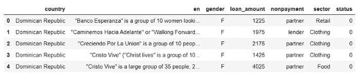
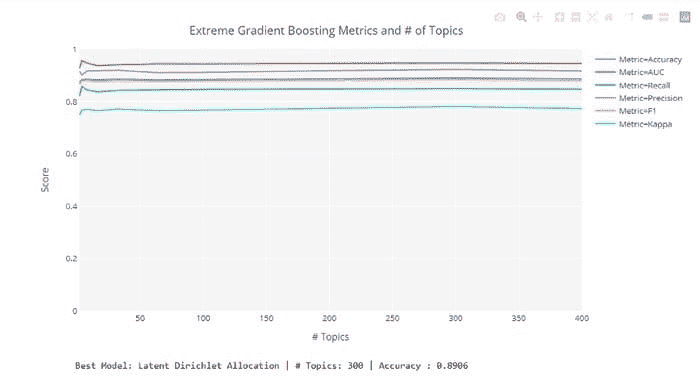
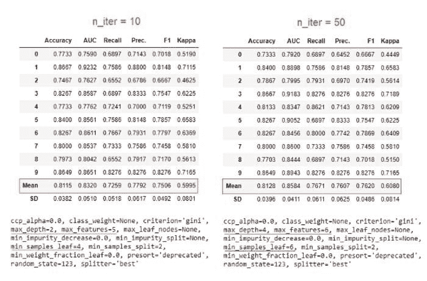
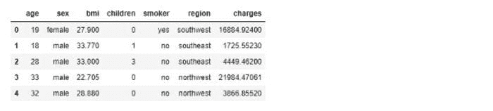
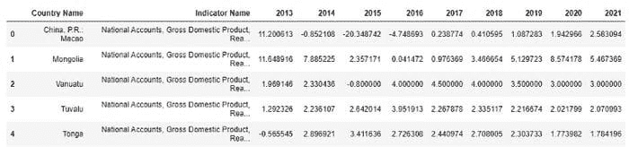
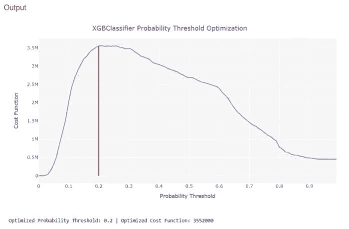

# 关于 PyCaret 的 5 件你不知道的事

> 原文：[`www.kdnuggets.com/2020/07/5-things-pycaret.html`](https://www.kdnuggets.com/2020/07/5-things-pycaret.html)

评论

**作者：[Moez Ali](https://www.linkedin.com/in/profile-moez/)，PyCaret 创始人及作者**


来自 PyCaret 的作者

### PyCaret

PyCaret 是一个开源的 Python 机器学习库，用于在**低代码**环境中训练和部署监督和无监督机器学习模型。它以易用性和高效性著称。

与其他开源机器学习库相比，PyCaret 是一个低代码库，可以用少量的代码替代数百行代码。

如果你以前没有使用过 PyCaret 或想了解更多，可以从[这里](https://towardsdatascience.com/announcing-pycaret-an-open-source-low-code-machine-learning-library-in-python-4a1f1aad8d46)开始。

> “在与许多每天使用 PyCaret 的数据科学家交谈后，我筛选出了 5 个较少为人知但非常强大的 PyCaret 特性。”
> 
> — Moez Ali

### 你可以在无监督实验中调整“n 参数”。

在无监督机器学习中，“n 参数”即聚类实验中的簇数、异常检测中的离群点比例以及主题建模中的主题数量，是至关重要的。

当实验的最终目标是使用无监督实验的结果来预测结果（分类或回归）时，**pycaret.clustering** 模块、**pycaret.anomaly** 模块和**pycaret.nlp**模块中的 tune_model() 函数会非常有用。

为了理解这一点，让我们使用“[Kiva](https://raw.githubusercontent.com/pycaret/pycaret/master/datasets/kiva.csv)”数据集来看一个例子。



这是一个微型银行贷款数据集，每一行代表一个借款人及其相关信息。‘en’列捕获每个借款人的贷款申请文本，‘status’列表示借款人是否违约（违约 = 1，未违约 = 0）。

你可以使用**tune_model**函数在**pycaret.nlp**中优化**num_topics**参数，基于监督实验的目标变量（即预测所需的最佳主题数量以提高最终目标变量的预测）。你可以通过**estimator**参数定义训练模型（在这种情况下为‘xgboost’）。该函数返回一个训练好的主题模型和一个显示每次迭代的监督指标的可视化图。

```py
tuned_lda = tune_model(model='lda', supervised_target='status', estimator='xgboost')
```



### 通过增加“n_iter”可以改善超参数调整的结果。

**pycaret.classification**模块和**pycaret.regression**模块中的**tune_model**函数使用随机网格搜索而非预定义网格搜索进行超参数调优。这里默认的迭代次数设置为 10。

**tune_model**的结果不一定会优于使用**create_model**创建的基础模型的结果。由于网格搜索是随机的，你可以增加**n_iter**参数来提高性能。参见下面的示例：

```py
#tune with default n_iter i.e. 10
tuned_dt1 = tune_model('dt')

#tune with n_iter = 50
tuned_dt2 = tune_model('dt', n_iter = 50)
```



### ????你可以以编程方式定义数据类型

当你初始化**setup**函数时，**你将被要求通过用户输入确认数据类型**。当你作为工作流的一部分运行脚本或将其作为远程内核（例如 Kaggle Notebooks）执行时，这种情况下需要以编程方式提供数据类型，而不是通过用户输入框。

参见下面使用 “[insurance](https://raw.githubusercontent.com/pycaret/pycaret/master/datasets/insurance.csv)” 数据集的示例。



```py
# import regression module
from pycaret.regression import *

# init setup
reg1 = setup(data, target = 'charges', silent=True, 
            categorical_features=['sex', 'smoker', 'region', 'children'], 
            numeric_features=['age', 'bmi'])
```

**silent** 参数设置为 True 以避免输入，**categorical_features** 参数以字符串形式接收分类列的名称，**numeric_features** 参数以字符串形式接收数值列的名称。

### ????你可以忽略某些列进行模型构建

在许多情况下，你的数据集中有些特征你不一定想要删除，但希望在训练机器学习模型时忽略它们。一个好的例子是聚类问题，在创建集群时你想要忽略某些特征，但后来你需要这些列来分析集群标签。在这种情况下，你可以在**setup**中使用**ignore_features**参数来忽略这些特征。

在下面的示例中，我们将进行一个聚类实验，并希望忽略**‘Country Name’**和**‘Indicator Name’**。



```py
from pycaret.clustering import *
clu1 = setup(data, ignore_features = ['Country Name', 'Indicator Name'])
```

### ????你可以在二分类中优化概率阈值%

在分类问题中，**假阳性**的成本几乎从来不与**假阴性**的成本相同。因此，如果你正在优化一个商业问题的解决方案，其中**类型 1**和**类型 2**错误的影响不同，你可以通过分别定义真正例、真负例、假阳性和假阴性的成本来优化分类器的概率阈值，以优化自定义损失函数。默认情况下，所有分类器的阈值为 0.5。

参见下面使用 “[credit](https://raw.githubusercontent.com/pycaret/pycaret/master/datasets/credit.csv)” 数据集的示例。

```py
# Importing dataset
from pycaret.datasets import get_data

credit = get_data('credit')
# Importing module and initializing setup
from pycaret.classification import *
clf1 = setup(data = credit, target = 'default')

# create a model
xgboost = create_model('xgboost')

# optimize threshold for trained model
optimize_threshold(xgboost, true_negative = 1500, false_negative = -5000)
```



然后您可以将 **0.2** 作为 **probability_threshold** 参数传递到 **predict_model** 函数中，以使用 0.2 作为分类正类的阈值。请参见下面的示例：

```py
predict_model(xgboost, probability_threshold=0.2)
```

### PyCaret 2.0.0 即将推出！

我们收到了数据科学社区的热烈支持和反馈。我们正在积极改进 PyCaret 并为下一个版本做准备。**PyCaret 2.0.0 将更大更好**。如果您想分享反馈并进一步帮助我们改进，可以在网站上 [填写此表单](https://www.pycaret.org/feedback) 或在我们的 [GitHub](https://www.github.com/pycaret/) 或 [LinkedIn](https://www.linkedin.com/company/pycaret/) 页面留下评论。

关注我们的 [LinkedIn](https://www.linkedin.com/company/pycaret/) 并订阅我们的 [YouTube](https://www.youtube.com/channel/UCxA1YTYJ9BEeo50lxyI_B3g) 频道，以了解更多关于 PyCaret 的信息。

### 想了解特定模块吗？

自第一次发布 1.0.0 版本以来，PyCaret 提供了以下模块供使用。点击下面的链接查看 Python 中的文档和工作示例。

+   [分类](https://www.pycaret.org/classification)

+   [回归](https://www.pycaret.org/regression)

+   [聚类](https://www.pycaret.org/clustering)

+   [异常检测](https://www.pycaret.org/anomaly-detection)

+   [自然语言处理](https://www.pycaret.org/nlp)

+   [关联规则挖掘](https://www.pycaret.org/association-rules)

### 另见：

PyCaret 入门教程在 Notebook 中：

+   [分类](https://www.pycaret.org/clf101)

+   [回归](https://www.pycaret.org/reg101)

+   [聚类](https://www.pycaret.org/clu101)

+   [异常检测](https://www.pycaret.org/anom101)

+   [自然语言处理](https://www.pycaret.org/nlp101)

+   [关联规则挖掘](https://www.pycaret.org/arul101)

### 想贡献吗？

PyCaret 是一个开源项目。欢迎大家贡献。如果您想贡献，请随时处理 [开放问题](https://github.com/pycaret/pycaret/issues)。接受带有单元测试的 dev-1.0.1 分支的拉取请求。

如果你喜欢 PyCaret，请在我们的 [GitHub repo](https://www.github.com/pycaret/pycaret) 上给我们 ⭐️。

Medium: [`medium.com/@moez_62905/`](https://medium.com/@moez_62905/machine-learning-in-power-bi-using-pycaret-34307f09394a)

LinkedIn: [`www.linkedin.com/in/profile-moez/`](https://www.linkedin.com/in/profile-moez/)

Twitter: [`twitter.com/moezpycaretorg1`](https://twitter.com/moezpycaretorg1)

**个人简介: [Moez Ali](https://www.linkedin.com/in/profile-moez/)** 是数据科学家，同时也是 PyCaret 的创始人和作者。

[原文](https://towardsdatascience.com/5-things-you-dont-know-about-pycaret-528db0436eec)。经许可转载。

**相关：**

+   宣布 PyCaret 1.0.0

+   在 Power BI 中使用 PyCaret 进行机器学习

+   在 AWS Fargate 上部署机器学习管道

* * *

## 我们的三大课程推荐

 1\. [Google 网络安全证书](https://www.kdnuggets.com/google-cybersecurity) - 快速进入网络安全职业轨道

 2\. [Google 数据分析专业证书](https://www.kdnuggets.com/google-data-analytics) - 提升您的数据分析能力

 3\. [Google IT 支持专业证书](https://www.kdnuggets.com/google-itsupport) - 支持您的组织的 IT

* * *

### 更多相关话题

+   [你不知道的 7 个低代码工具使用方式](https://www.kdnuggets.com/2022/09/7-things-didnt-know-could-low-code-tool.html)

+   [关于数据管理及其重要性的 6 个事项…](https://www.kdnuggets.com/2022/05/6-things-need-know-data-management-matters-computer-vision.html)

+   [你不知道的关于 SAS 数据科学学院的 3 件事](https://www.kdnuggets.com/2022/07/sas-3-things-didnt-know-sas-academy-data-science.html)

+   [扩展您的网页数据驱动产品时需要知道的事项](https://www.kdnuggets.com/2023/08/things-know-scaling-web-datadriven-product.html)

+   [构建 LLM 应用程序时需要知道的 5 件事](https://www.kdnuggets.com/2023/08/5-things-need-know-building-llm-applications.html)

+   [如何在没有相关学位的情况下进入数据分析领域](https://www.kdnuggets.com/2021/12/how-to-get-into-data-analytics.html)
