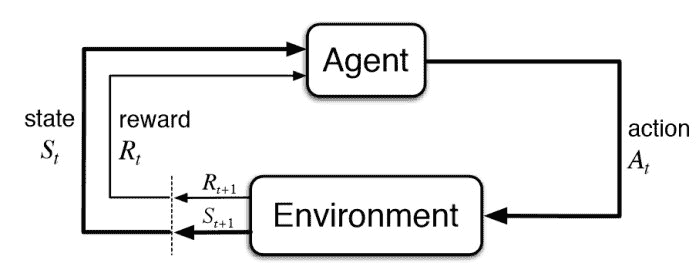
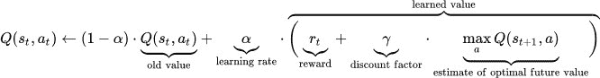
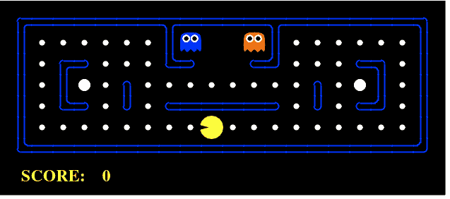
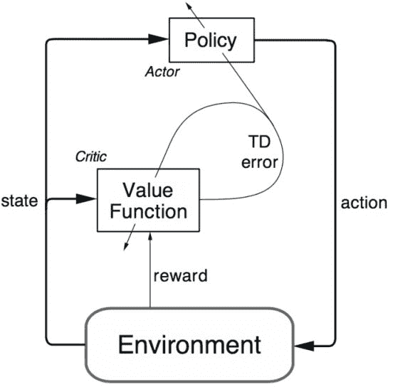

# 关于强化学习的 5 个重要事项

> 原文：[`www.kdnuggets.com/2018/03/5-things-reinforcement-learning.html`](https://www.kdnuggets.com/2018/03/5-things-reinforcement-learning.html)

评论

强化学习是当前最热门的研究主题之一，它的受欢迎程度日益增长。让我们来看一下关于强化学习的 5 个有用的知识点。

1.  **什么是强化学习？它如何与其他机器学习技术相关？**

强化学习（RL）是一种机器学习技术，使代理能够通过试错法在互动环境中学习，利用其自身行动和经验的反馈。

尽管监督学习和强化学习都使用输入和输出之间的映射，但不同于监督学习中代理收到的是执行任务的正确动作集合，强化学习使用奖励和惩罚作为正面和负面行为的信号。

与无监督学习相比，强化学习在目标上有所不同。无监督学习的目标是找到数据点之间的相似性和差异性，而强化学习的目标是找到一个合适的动作模型，以最大化代理的总累计奖励。下图表示了强化学习模型中的基本思想和元素。

图 1

1.  **如何制定基本的强化学习问题？**

描述 RL 问题元素的一些关键术语包括：

**环境**：代理操作的物理世界

**状态**：代理的当前情况

**奖励**：来自环境的反馈

**策略**：将代理的状态映射到动作的方法

**价值**：代理在特定状态下采取某个动作所获得的未来奖励

强化学习问题可以通过游戏来最好地解释。以《吃豆人》游戏为例，代理（吃豆人）的目标是吃掉网格中的食物，同时避开幽灵。网格世界是代理的互动环境。吃豆人吃到食物会获得奖励，被幽灵杀死（输掉游戏）则会受到惩罚。状态是吃豆人在网格世界中的位置，总累计奖励是吃豆人赢得游戏。

为了建立一个最佳策略，代理面临在探索新状态的同时最大化奖励的困境。这被称为**探索与利用的权衡**。

[马尔可夫决策过程（MDPs）](https://en.wikipedia.org/wiki/Markov_decision_process)是描述强化学习环境的数学框架，几乎所有的 RL 问题都可以用 MDP 进行形式化。一个 MDP 由一组有限的环境状态 S、一组在每个状态下的可能动作 A(s)、一个实值奖励函数 R(s)和一个转移模型 P(s’，s | a)组成。然而，现实世界的环境往往缺乏关于环境动态的先验知识。在这种情况下，无模型的 RL 方法非常有用。

[**Q 学习**](https://en.wikipedia.org/wiki/Q-learning)是一种常用的无模型方法，可用于构建自我对弈的 PacMan 代理。它围绕更新 Q 值的概念展开，这些 Q 值表示在状态*s*下执行动作*a*的价值。价值更新规则是 Q 学习算法的核心。

**图 2: 强化学习更新规则**

**图 3: PacMan**

这是一个[视频](https://www.youtube.com/watch?v=QilHGSYbjDQ)，展示了一个深度强化学习的 PacMan 代理

1.  **一些最常用的强化学习算法有哪些？**

Q 学习和 SARSA（状态-动作-奖励-状态-动作）是两种常用的无模型 RL 算法。它们在探索策略上有所不同，而在利用策略上则相似。Q 学习是一种离策略方法，其中代理基于从另一策略中派生的动作 a*来学习价值，而 SARSA 是一种在策略方法，其中代理基于当前策略中派生的当前动作*a*来学习价值。这两种方法简单易实现，但缺乏通用性，因为它们无法估计未见过状态的值。

这可以通过更先进的算法来克服，例如使用神经网络来估计 Q 值的[深度 Q 网络（DQN）](https://deepmind.com/research/dqn/)。但 DQN 只能处理离散的低维动作空间。[DDPG（深度确定性策略梯度）](https://arxiv.org/abs/1509.02971)是一种无模型、离策略、演员-评论家算法，通过在高维连续动作空间中学习策略来解决这个问题。

**图 4: 强化学习的演员-评论家架构**

1.  **强化学习的实际应用有哪些？**

由于强化学习（RL）需要大量数据，因此它最适用于那些模拟数据随手可得的领域，如游戏和机器人技术。

+   强化学习在构建用于玩计算机游戏的人工智能方面被广泛使用。[AlphaGo Zero](https://deepmind.com/blog/alphago-zero-learning-scratch/)是第一个击败围棋世界冠军的计算机程序。其他包括 ATARI 游戏、双陆棋等。

+   在机器人技术和工业自动化中，强化学习用于使机器人创建一个高效的自适应控制系统，该系统通过自身的经验和行为进行学习。[DeepMind 的工作](https://deepmind.com/research/publications/deep-reinforcement-learning-robotic-manipulation/)在异步策略更新的机器人操作中的深度强化学习是一个很好的例子。

+   观看这个有趣的演示[视频](https://www.youtube.com/watch?v=ZhsEKTo7V04&t=48s)。

+   强化学习的其他应用包括文本摘要引擎、对话代理（文本、语音），这些代理能够从用户互动中学习并随着时间的推移不断改进，医疗保健中的最佳治疗政策学习，以及基于强化学习的在线股票交易代理。

1.  **我如何开始强化学习？**

要理解强化学习的基本概念，

+   **强化学习导论**，这是强化学习之父[理查德·萨顿](https://en.wikipedia.org/wiki/Richard_S._Sutton)和他的博士生导师[安德鲁·巴托](https://en.wikipedia.org/wiki/Andrew_Barto)合著的一本书。该书的在线草稿可以在这里找到 [`incompleteideas.net/book/the-book-2nd.html`](http://incompleteideas.net/book/the-book-2nd.html)

+   [**教学材料**](http://www0.cs.ucl.ac.uk/staff/d.silver/web/Teaching.html)由**大卫·西尔弗**提供，包括视频讲座，是入门强化学习的绝佳课程。

+   这是**彼得·阿贝尔**和**约翰·舒尔曼**（Open AI/伯克利人工智能研究实验室）提供的另一个[技术教程](http://people.eecs.berkeley.edu/~pabbeel/nips-tutorial-policy-optimization-Schulman-Abbeel.pdf)。

+   要开始构建和测试强化学习代理，

+   [这个博客](http://karpathy.github.io/2016/05/31/rl/)由**安德烈·卡帕西**撰写，讲述了如何通过策略梯度从原始像素中训练一个神经网络 ATARI Pong 代理，它将帮助你用仅 130 行 Python 代码启动你的第一个深度强化学习代理。

+   [DeepMind Lab](https://deepmind.com/blog/open-sourcing-deepmind-lab/) 是一个开源的类似 3D 游戏的平台，专为基于代理的人工智能研究创建，具有丰富的模拟环境。

+   [Project Malmo](https://www.microsoft.com/en-us/research/project/project-malmo/) 是另一个人工智能实验平台，用于支持人工智能的基础研究。

+   [OpenAI gym](https://gym.openai.com/) 是一个用于构建和比较强化学习算法的工具包。

**简历：[Shweta Bhatt](https://www.linkedin.com/in/shweta-bhatt-1a930b12/)** 是一位在私营和公共部门有经验的人工智能研究员，热衷于从数据中提取知识以解决具有挑战性的问题。她喜欢用数据讲故事，现居伦敦。

**相关：**

+   [1983-2010 年人工智能的复兴](https://www.kdnuggets.com/2018/02/resurgence-ai-1983-2010.html)

+   [**独家：与强化学习之父 Rich Sutton 的采访**](https://www.kdnuggets.com/2017/12/interview-rich-sutton-reinforcement-learning.html)

+   [强化学习何时不应使用？](https://www.kdnuggets.com/2017/12/when-reinforcement-learning-not-used.html)

+   [简化机器学习](https://www.kdnuggets.com/2018/03/databricks-ebook-making-machine-learning-simple.html)

* * *

## 我们的前三大课程推荐

 1\. [Google 网络安全证书](https://www.kdnuggets.com/google-cybersecurity) - 快速进入网络安全职业轨道

 2\. [Google 数据分析专业证书](https://www.kdnuggets.com/google-data-analytics) - 提升你的数据分析技能

 3\. [Google IT 支持专业证书](https://www.kdnuggets.com/google-itsupport) - 支持你的组织进行 IT 维护

* * *

### 更多相关话题

+   [构建 LLM 应用时你需要知道的 5 件事](https://www.kdnuggets.com/2023/08/5-things-need-know-building-llm-applications.html)

+   [关于数据管理你需要知道的 6 件事及其重要性…](https://www.kdnuggets.com/2022/05/6-things-need-know-data-management-matters-computer-vision.html)

+   [7 件你不知道可以用低代码工具做的事情](https://www.kdnuggets.com/2022/09/7-things-didnt-know-could-low-code-tool.html)

+   [KDnuggets 新闻，4 月 13 日：数据科学家应该了解的 Python 库…](https://www.kdnuggets.com/2022/n15.html)

+   [扩展你的网页数据驱动产品时应该知道的事项](https://www.kdnuggets.com/2023/08/things-know-scaling-web-datadriven-product.html)

+   [关于 SAS 数据科学学院你不知道的 3 件事](https://www.kdnuggets.com/2022/07/sas-3-things-didnt-know-sas-academy-data-science.html)
