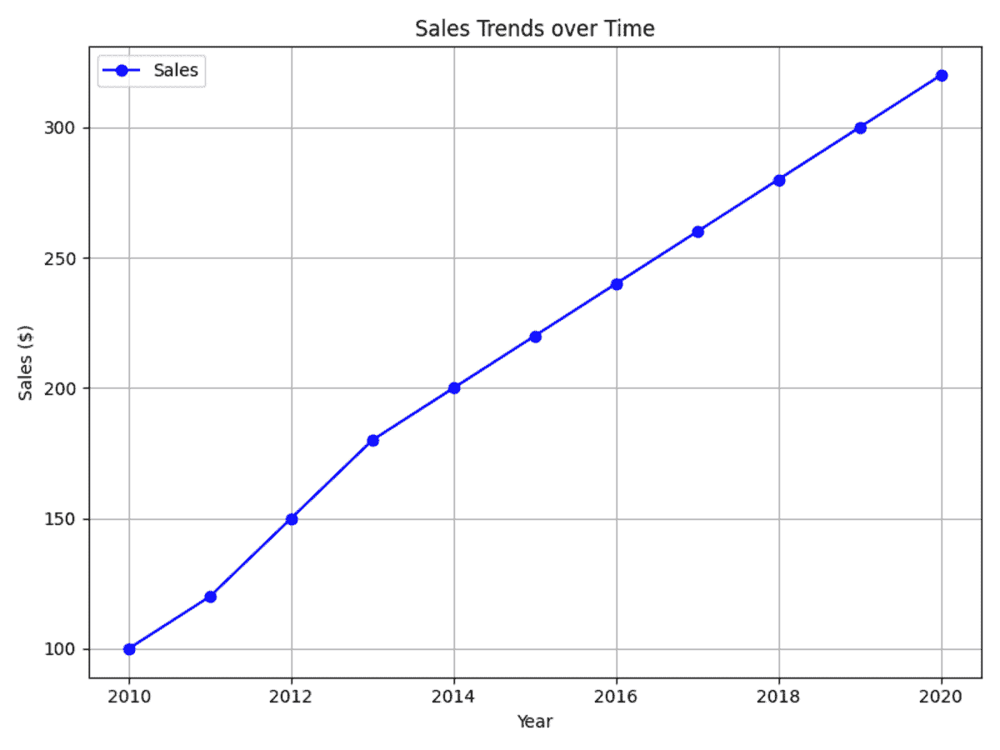
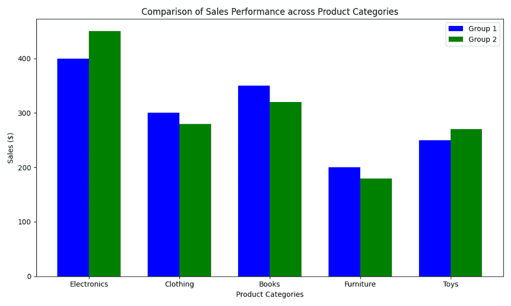
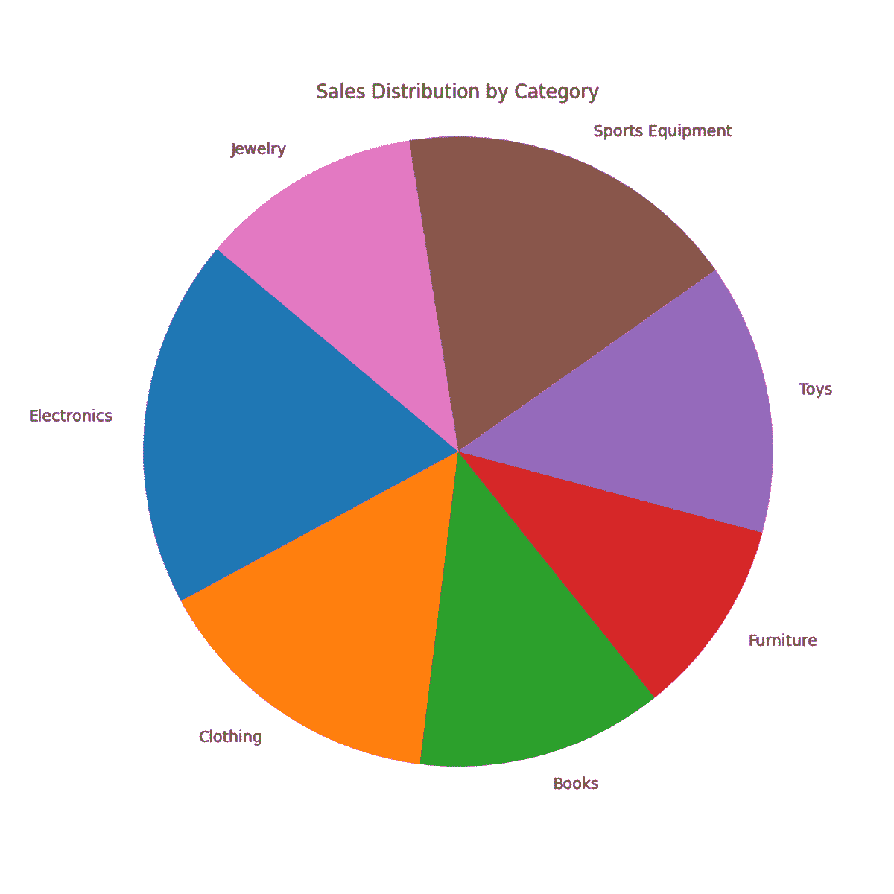

# 5 个有效数据可视化的技巧

> 原文：[`www.kdnuggets.com/5-tips-for-effective-data-visualization`](https://www.kdnuggets.com/5-tips-for-effective-data-visualization)

图片来源：编辑 | Midjourney

你是否曾想过如何将数据转化为清晰且有意义的见解？数据可视化正是实现这一目标的工具。它们将复杂的信息转化为简单的视觉图表，使每个人都能快速理解。本文将探讨五个技巧，帮助你创建强大的数据可视化图表。

* * *

## 我们的前三个课程推荐

 1\. [Google 网络安全证书](https://www.kdnuggets.com/google-cybersecurity) - 快速进入网络安全职业生涯。

 2\. [Google 数据分析专业证书](https://www.kdnuggets.com/google-data-analytics) - 提升你的数据分析技能

 3\. [Google IT 支持专业证书](https://www.kdnuggets.com/google-itsupport) - 支持你的组织在 IT 领域

* * *

## 1\. 了解你的受众

了解你的受众是有效数据可视化的关键。根据他们的需求和期望调整你的视觉图表。根据观众的背景、角色和兴趣来识别他们。例如，投资者关注财务指标，而管理者则优先考虑运营效率。根据你的受众调整细节层次。专家可能需要深入的数据分析，而决策者则更喜欢用于战略决策的清晰总结。考虑受众的首选格式。有些人喜欢互动仪表盘，其他人则偏好静态信息图或详细报告。例如，营销团队可能会更喜欢互动仪表盘来跟踪实时的广告活动绩效指标。与此同时，公关团队可能发现静态信息图对于直观展示媒体覆盖率非常有用。确保每个人都能访问数据。考虑语言能力和视觉障碍等因素。

## 2\. 选择合适的视觉图表

不同类型的视觉图表各有其优点。选择适合的图表对于每个目的来说都非常重要。

使用折线图来显示随时间变化的趋势。在提供的示例中，折线图用于绘制多年来的销售趋势。

当比较不同组中的类别时，选择柱状图。例如，柱状图可以比较五种不同产品类别的销售表现。

避免使用饼图来清晰地表示数据。饼图难以准确阅读和比较。切片之间的小差异难以辨别。如果类别过多，饼图会显得杂乱。下面的饼图展示了不同类别的销售比例。由于类别众多且每个类别的销售差异小，因此很难解读饼图。

## 3\. 避免误导性的可视化

误导性的可视化可能会扭曲事实，导致数据的误解。使用准确的刻度来真实地表示数据。避免使用截断的坐标轴或不一致的刻度，这些都会扭曲数据点之间的差异。标注可视化中的所有元素：坐标轴、数据点和类别。不明确或缺失的标签可能会让观众感到困惑。所有数据点和坐标轴中应使用一致的单位，以避免混淆。三维效果可能会扭曲数据的感知。除非第三维度提供了有意义的信息，否则应使用二维表示。注意形状（如圆形或方形）表示数量时的准确性。确保它们的大小或面积与它们所表示的数值相符。在创建可视化之前验证数据的准确性。数据收集或处理中的错误可能会导致误导性的表现。

## 4\. 保持简洁

在创建数据可视化时，简洁是提升清晰度和有效性的关键。清晰且直接的视觉效果帮助观众快速准确地理解信息，而不会有不必要的干扰或困惑。使用简洁的标签来明确描述可视化中的每个元素。避免使用可能会让非专家困惑的技术术语。选择易于阅读的字体。确保文字足够大，方便在屏幕或打印件上阅读。专注于传达信息的核心元素。策略性地使用空白以保持视觉平衡，避免过度拥挤。确保一致使用颜色方案，以增强而不是分散对数据的关注。

## 5\. 讲述故事

讲故事始于围绕数据本身构建叙述。确定数据分析旨在解决的具体问题。使用图表或图形来说明变量之间的模式。解释发现以发现有意义的见解。总结分析中最重要的发现。

想象一个零售连锁店正在分析其门店的客户购买行为。他们想知道哪些产品最受欢迎以及顾客为什么偏爱某些商品。图表和图形展示了多个地点的各种产品类别的销售数据。这些数据显示了过去一年客户偏好和购买模式的趋势。研究结果揭示了畅销产品以及客户偏好的地区差异。

## 总结

总之，使用这些技巧来创建清晰且有影响力的数据可视化。现在就应用它们，以改善理解并利用数据做出更好的决策。

**[Jayita Gulati](https://www.linkedin.com/in/jayitagulati1998/)** 是一位对构建机器学习模型充满热情的机器学习爱好者和技术作家。她拥有利物浦大学计算机科学硕士学位。

### 更多相关话题

+   [数据可视化最佳实践与有效沟通资源](https://www.kdnuggets.com/2023/04/data-visualization-best-practices-resources-effective-communication.html)

+   [赢得会议：创建和传递有效的数据驱动演示…](https://www.kdnuggets.com/2022/04/franks-winning-room-creating-delivering-effective-data-driven-presentation.html)

+   [为有效的 Tableau 和 Power BI 仪表板准备数据](https://www.kdnuggets.com/2022/06/prepare-data-effective-tableau-power-bi-dashboards.html)

+   [解锁数据洞察：有效分析的关键 Pandas 函数](https://www.kdnuggets.com/unlocking-data-insights-key-pandas-functions-for-effective-analysis)

+   [有效的数据科学经理的五个标志](https://www.kdnuggets.com/2022/06/five-signs-effective-data-science-manager.html)

+   [机器学习的有效测试](https://www.kdnuggets.com/2022/01/effective-testing-machine-learning.html)
