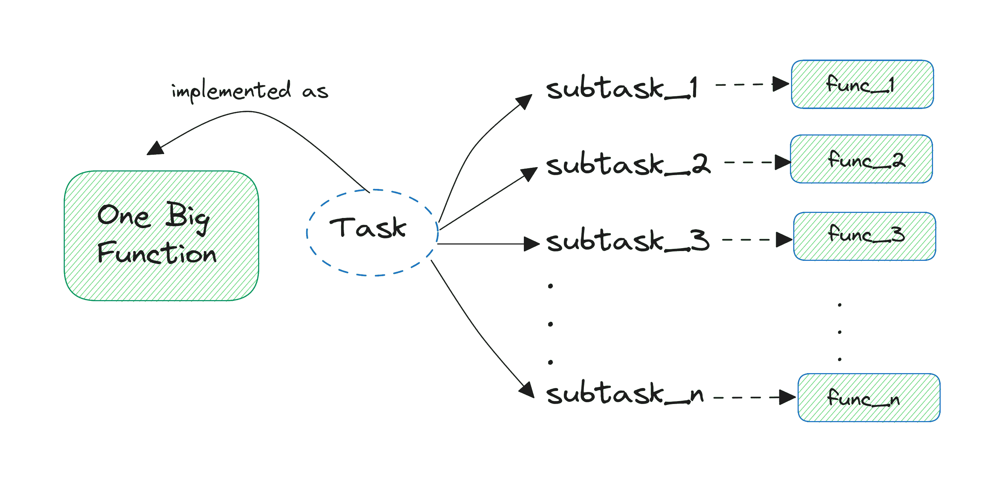
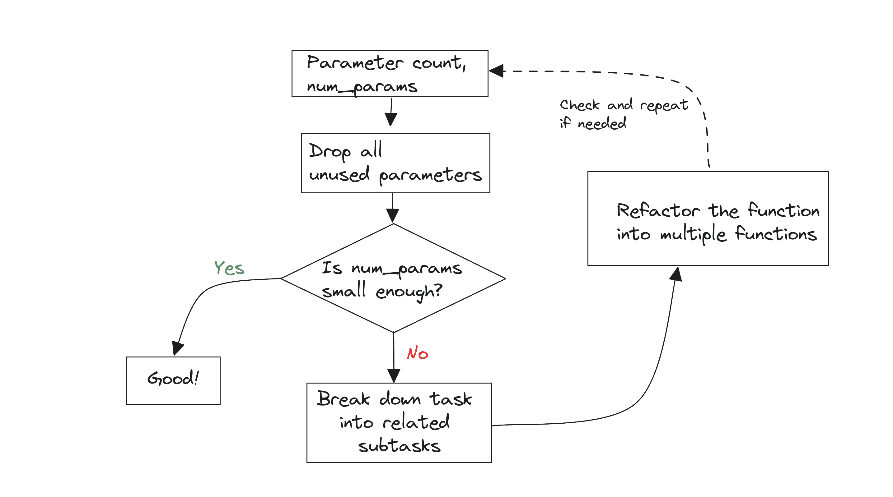

# 提高 Python 函数质量的 5 个技巧

> 原文：[`www.kdnuggets.com/5-tips-for-writing-better-python-functions`](https://www.kdnuggets.com/5-tips-for-writing-better-python-functions)


图片来自作者

我们在 Python 中编写函数时，都会写函数。但我们是否总是编写*优质*函数呢？好吧，让我们来找出答案。

* * *

## 我们的前三大课程推荐

 1\. [Google 网络安全证书](https://www.kdnuggets.com/google-cybersecurity) - 快速进入网络安全职业。

 2\. [Google 数据分析专业证书](https://www.kdnuggets.com/google-data-analytics) - 提升你的数据分析能力

 3\. [Google IT 支持专业证书](https://www.kdnuggets.com/google-itsupport) - 支持你组织的 IT

* * *

Python 中的函数让你编写模块化代码。当你在多个地方需要执行一个任务时，你可以将该任务的逻辑封装到一个 Python 函数中。然后，每次需要执行该特定任务时，你可以调用这个函数。虽然开始使用 Python 函数看起来很简单，但编写可维护且高性能的函数并非那么直接。

这就是为什么我们将探讨一些实践，帮助你编写更干净、更易维护的 Python 函数。让我们开始吧……

## 1\. 编写只做一件事的函数

在 Python 中编写函数时，通常会有把所有相关任务放入一个函数中的诱惑。虽然这可以帮助你快速编写代码，但它只会让你的代码在不久的将来变得难以维护。这不仅使理解函数的作用变得更加困难，还会导致其他问题，比如参数过多（稍后会详细介绍！）。

作为一种良好的实践，你应该始终尝试让你的函数只做一件事——一个任务——并且做到最好。但有时，对于一个任务，你可能需要通过一系列子任务来完成。那么你怎么决定函数是否以及如何重构呢？

根据*函数试图做什么*和任务的复杂程度，你可以解决子任务之间的关注点分离。然后确定一个合适的层次来将函数重构成多个函数——每个函数专注于一个特定的子任务。



重构函数 | 图片来自作者

这是一个示例。看看函数 `analyze_and_report_sales`：

```py
# fn. to analyze sales data, calculate sales metrics, and write it to a file
def analyze_and_report_sales(data, report_filename):
	total_sales = sum(item['price'] * item['quantity'] for item in data)
	average_sales = total_sales / len(data)

	with open(report_filename, 'w') as report_file:
    	    report_file.write(f"Total Sales: {total_sales}\n")
    	    report_file.write(f"Average Sales: {average_sales}\n")

	return total_sales, average_sales 
```

很容易看出，它可以重构成两个函数：一个计算销售指标，另一个将销售指标写入文件，如下所示：

```py
# refactored into two funcs: one to calculate metrics and another to write sales report
def calculate_sales_metrics(data):
	total_sales = sum(item['price'] * item['quantity'] for item in data)
	average_sales = total_sales / len(data)
	return total_sales, average_sales

def write_sales_report(report_filename, total_sales, average_sales):
	with open(report_filename, 'w') as report_file:
    	    report_file.write(f"Total Sales: {total_sales}\n")
    	    report_file.write(f"Average Sales: {average_sales}\n") 
```

现在更容易分别调试销售指标计算和文件操作中的任何问题。下面是一个示例函数调用：

```py
data = [{'price': 100, 'quantity': 2}, {'price': 200, 'quantity': 1}]
total_sales, average_sales = calculate_sales_metrics(data)
write_sales_report('sales_report.txt', total_sales, average_sales) 
```

你应该能在工作目录中看到包含销售指标的‘sales_report.txt’文件。这是一个简单的示例来开始，但在处理更复杂的函数时尤其有用。

## 2\. 添加类型提示以改善可维护性

Python 是一种动态类型语言。所以你不需要为创建的变量声明类型。但你可以添加类型提示来指定变量的预期数据类型。当你定义函数时，可以添加参数和返回值的预期数据类型。

因为 Python 在运行时不强制类型，所以添加类型提示在运行时没有效果。但使用类型提示仍然有好处，特别是在可维护性方面：

+   向 Python 函数添加类型提示作为内联文档，能够更好地了解函数的功能以及它处理和返回的值。

+   当你给函数添加类型提示时，可以配置你的 IDE 以利用这些类型提示。如果你尝试传递不正确类型的参数，或实现返回值类型不匹配的函数，IDE 会给出有用的警告。这样可以提前最小化错误。

+   你可以选择使用像 [mypy](https://mypy.readthedocs.io/en/stable/) 这样的静态类型检查器，以便及早捕捉错误，而不是让类型不匹配引入难以调试的微妙错误。

这是一个处理订单详细信息的函数：

```py
# fn. to process orders
def process_orders(orders):
	total_quantity = sum(order['quantity'] for order in orders)
	total_value = sum(order['quantity'] * order['price'] for order in orders)
	return {
    	'total_quantity': total_quantity,
    	'total_value': total_value
	} 
```

现在让我们像这样给函数添加类型提示：

```py
# modified with type hints
from typing import List, Dict

def process_orders(orders: List[Dict[str, float | int]]) -> Dict[str, float | int]:
	total_quantity = sum(order['quantity'] for order in orders)
	total_value = sum(order['quantity'] * order['price'] for order in orders)
	return {
    	'total_quantity': total_quantity,
    	'total_value': total_value
	} 
```

使用修改后的版本，你可以知道函数接受一个字典列表。字典的键应为字符串，值可以是整数或浮点值。函数还返回一个字典。让我们看一个示例函数调用：

```py
# Sample data
orders = [
	{'price': 100.0, 'quantity': 2},
	{'price': 50.0, 'quantity': 5},
	{'price': 150.0, 'quantity': 1}
]

# Sample function call
result = process_orders(orders)
print(result) 
```

这是输出结果：

```py
{'total_quantity': 8, 'total_value': 600.0} 
```

在这个例子中，类型提示帮助我们更好地了解函数的工作原理。今后，我们将为我们编写的所有更好的 Python 函数添加类型提示。

## 3\. 只接受实际需要的参数

如果你是初学者或刚刚开始你的第一个开发角色，在定义函数签名时考虑不同的参数非常重要。函数签名中引入额外的参数，而这些参数函数实际上并未处理，是很常见的。

确保函数只接受实际必要的参数，使函数调用更简洁、易于维护。相关的，函数签名中参数过多也会使维护变得困难。**那么如何定义易于维护的函数，并使用正确数量的参数呢？**

如果你发现自己在编写函数签名时参数数量不断增加，第一步是从签名中删除所有未使用的参数。如果即使在这一步之后参数仍然过多，请回到提示 #1：将任务分解为多个子任务，并将函数重构为多个较小的函数。这将有助于控制参数数量。



保持 num_params 受控 | 作者提供的图片

现在是一个简单的示例。这里计算学生成绩的函数定义包含一个从未使用的 `instructor` 参数：

```py
# takes in an arg that's never used!
def process_student_grades(student_id, grades, course_name, instructor'):
	average_grade = sum(grades) / len(grades)
	return f"Student {student_id} achieved an average grade of {average_grade:.2f} in {course_name}." 
```

你可以这样重写函数，去掉 `instructor` 参数：

```py
# better version!
def process_student_grades(student_id: int, grades: list, course_name: str) -> str:
	average_grade = sum(grades) / len(grades)
	return f"Student {student_id} achieved an average grade of {average_grade:.2f} in {course_name}."

# Usage
student_id = 12345
grades = [85, 90, 75, 88, 92]
course_name = "Mathematics"
result = process_student_grades(student_id, grades, course_name)
print(result) 
```

这是函数调用的输出：

```py
Student 12345 achieved an average grade of 86.00 in Mathematics.
```

## 4\. 强制关键字仅参数以最小化错误

实际上，大多数 Python 函数接受多个参数。你可以将参数作为位置参数、关键字参数或两者的混合传递给 Python 函数。阅读 [Python 函数参数：权威指南](https://www.kdnuggets.com/2023/02/python-function-arguments-definitive-guide.html) 以快速了解函数参数。

一些参数自然是位置参数。但有时仅包含位置参数的函数调用可能会令人困惑。当函数接受多个相同数据类型的参数时，尤其如此，有些是必需的，有些是可选的。

如果你记得，使用位置参数时，参数按照它们在函数调用中出现的*相同*顺序传递到函数签名中的参数。因此，参数顺序的变化可能会引入微妙的错误和类型错误。

将*可选*参数设置为*仅限关键字*通常很有帮助。这也使添加可选参数变得更容易——而不会破坏现有的调用。

这是一个示例。`process_payment` 函数接受一个可选的 `description` 字符串：

```py
# example fn. for processing transaction
def process_payment(transaction_id: int, amount: float, currency: str, description: str = None):
	print(f"Processing transaction {transaction_id}...")
	print(f"Amount: {amount} {currency}")
	if description:
    		print(f"Description: {description}") 
```

假设你想将可选的 `description` 改为仅限关键字的参数。以下是你可以做到的方式：

```py
# enforce keyword-only arguments to minimize errors
# make the optional `description` arg keyword-only
def process_payment(transaction_id: int, amount: float, currency: str, *, description: str = None):
	print(f"Processing transaction {transaction_id}:")
	print(f"Amount: {amount} {currency}")
	if description:
    		print(f"Description: {description}") 
```

让我们来一个示例函数调用：

```py
process_payment(1234, 100.0, 'USD', description='Payment for services')
```

这输出：

```py
Processing transaction 1234...
Amount: 100.0 USD
Description: Payment for services 
```

现在尝试将所有参数作为位置参数传递：

```py
# throws error as we try to pass in more positional args than allowed!
process_payment(5678, 150.0, 'EUR', 'Invoice payment') 
```

你将得到如示所示的错误：

```py
Traceback (most recent call last):
  File "/home/balapriya/better-fns/tip4.py", line 9, in <module>process_payment(1234, 150.0, 'EUR', 'Invoice payment')
TypeError: process_payment() takes 3 positional arguments but 4 were given</module> 
```

## 5\. 不要从函数返回列表；改用生成器

编写生成序列（例如数值列表）的 Python 函数很常见。但尽可能地，你应该避免从 Python 函数返回列表。你可以将它们重写为生成器函数。生成器使用惰性求值，因此它们按需生成序列元素，而不是事先计算所有值。阅读 [Python 生成器入门](https://www.kdnuggets.com/2023/02/getting-started-python-generators.html) 了解生成器在 Python 中的工作原理。

例如，考虑以下生成斐波那契序列直到某个上限的函数：

```py
# returns a list of Fibonacci numbers
def generate_fibonacci_numbers_list(limit):
	fibonacci_numbers = [0, 1]
	while fibonacci_numbers[-1] + fibonacci_numbers[-2] <= limit:
    		fibonacci_numbers.append(fibonacci_numbers[-1] + fibonacci_numbers[-2])
	return fibonacci_numbers 
```

这是一个递归实现，计算开销较大，填充列表并返回似乎比必要的要冗长。以下是使用生成器的改进版函数：

```py
# use generators instead
from typing import Generator

def generate_fibonacci_numbers(limit: int) -> Generator[int, None, None]:
	a, b = 0, 1
	while a <= limit:
    		yield a
    	a, b = b, a + b
```

在这种情况下，函数返回一个生成器对象，你可以遍历它来获取序列的元素：

```py
limit = 100
fibonacci_numbers_generator = generate_fibonacci_numbers(limit)
for num in fibonacci_numbers_generator:
	print(num) 
```

这是输出结果：

```py
0
1
1
2
3
5
8
13
21
34
55
89 
```

如你所见，使用生成器在处理大输入量时可以更加高效。此外，你可以将多个生成器链式连接，从而创建高效的数据处理管道。

## 总结

就这样。你可以在[GitHub](https://github.com/balapriyac/python-basics/tree/main/write-better-funcs)上找到所有的代码。以下是我们讨论的不同技巧的回顾：

+   编写只做一件事的函数。

+   添加类型提示以提高可维护性

+   仅接受实际需要的参数

+   强制使用仅关键字参数以减少错误

+   不要从函数返回列表；使用生成器代替。

希望你觉得这些技巧有帮助！如果你还没尝试过，写 Python 函数时可以尝试这些实践。祝编程愉快！

**[](https://twitter.com/balawc27)**[Bala Priya C](https://www.kdnuggets.com/wp-content/uploads/bala-priya-author-image-update-230821.jpg)** 是一位来自印度的开发者和技术作家。她喜欢在数学、编程、数据科学和内容创作的交汇处工作。她的兴趣和专业领域包括 DevOps、数据科学和自然语言处理。她喜欢阅读、写作、编码和喝咖啡！目前，她正在学习并通过撰写教程、操作指南、观点文章等与开发者社区分享她的知识。Bala 还创作引人入胜的资源概述和编码教程。**

### 相关主题

+   [掌握 Python：7 种编写清晰、有组织且高效代码的策略](https://www.kdnuggets.com/mastering-python-7-strategies-for-writing-clear-organized-and-efficient-code)

+   [宣布博客写作比赛，获胜者将获得 NVIDIA GPU！](https://www.kdnuggets.com/2022/11/blog-writing-contest-nvidia-gpu.html)

+   [Python 中的统计函数](https://www.kdnuggets.com/2022/10/statistical-functions-python.html)

+   [Python Lambda 函数解析](https://www.kdnuggets.com/2023/01/python-lambda-functions-explained.html)

+   [4 个你可能不知道的 Python itertools 筛选函数](https://www.kdnuggets.com/2023/08/4-python-itertools-filter-functions-probably-didnt-know.html)

+   [10 个 Python 统计函数](https://www.kdnuggets.com/10-python-statistical-functions)
