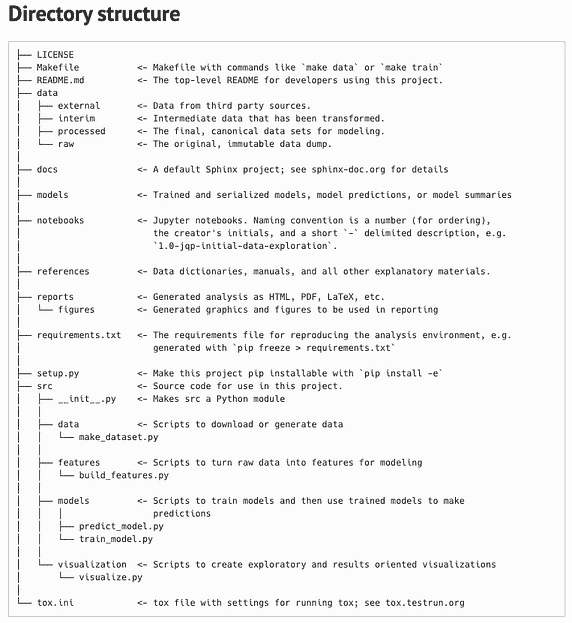
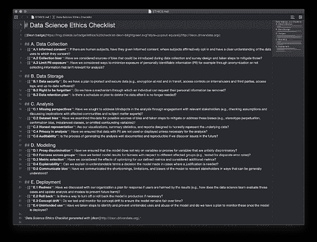

# 轻松进行数据科学的 5 种工具

> 原文：[`www.kdnuggets.com/2021/01/5-tools-effortless-data-science.html`](https://www.kdnuggets.com/2021/01/5-tools-effortless-data-science.html)

评论

图片由 [Chevanon Photography](https://www.pexels.com/@chevanon?utm_content=attributionCopyText&utm_medium=referral&utm_source=pexels) 提供，来自 [Pexels](https://www.pexels.com/photo/art-blur-cappuccino-close-up-302899/?utm_content=attributionCopyText&utm_medium=referral&utm_source=pexels)

* * *

## 我们的三大课程推荐

 1\. [谷歌网络安全证书](https://www.kdnuggets.com/google-cybersecurity) - 快速进入网络安全职业轨道

 2\. [谷歌数据分析专业证书](https://www.kdnuggets.com/google-data-analytics) - 提升你的数据分析技能

 3\. [谷歌 IT 支持专业证书](https://www.kdnuggets.com/google-itsupport) - 支持你的组织在 IT 方面

* * *

在斯蒂芬·柯维的经典著作 *高效能人士的七个习惯* 中，第七个习惯是“磨快锯子”。这指的是提升我们的资产，以寻求在工作中的持续改进。正如亚伯拉罕·林肯所说，

> 给我八小时砍倒一棵树，我会花前六小时磨快锯子。

更好的工具来 **构建、简化和拓展** 我们的数据科学工作，将使我们成为更有效的思考者、决策者和从业者。

在这篇文章中，我们将探讨如何磨快我们的数据科学锯子——并调查未解之谜，即谁在给如此多的激励讲师发锯子。

这里有五种轻松进行数据科学的工具。

### #1 — Cookiecutter

**用例**：通过这个预构建的文件结构设置来构建你的数据科学项目的仓库。

数据科学家应该有条理，以便通过可重复的项目获取见解。 [DrivenData 的 Cookiecutter](https://drivendata.github.io/cookiecutter-data-science/) 帮助我们通过有组织的仓库结构共享和执行数据科学任务。要开始使用，只需在命令行运行 `cookiecutter [`github.com/drivendata/cookiecutter-data-science`](https://github.com/drivendata/cookiecutter-data-science)`。这将创建 Cookiecutter 文件结构。

初学者可以从 DrivenData 团队在构建最佳实践到这个仓库结构中的专业知识中受益。专家可以使用这个模板作为他们项目的灵活启动。



通过 [DrivenData](https://drivendata.github.io/cookiecutter-data-science/)

最终，Cookiecutter 促进了逻辑上的标准化。这使得你、你的合作者和项目相关者更容易找到数据、笔记本、报告、可视化等。Cookiecutter 促进了可重复性和代码质量。使用 Cookiecutter 设置数据科学实验既快速又极其有用。

目录结构中提到的两个附加工具：

+   [Sphinx](https://www.sphinx-doc.org/en/master/) — 文档生成器，将一组纯文本源文件转换为各种输出格式，自动生成交叉引用

+   [Tox](https://tox.readthedocs.io/en/latest/) — [virtualenv](https://towardsdatascience.com/10-underrated-python-skills-dfdff5741fdf) 管理和测试命令行工具，以确保包可以在不同的 Python 版本和解释器上正确安装；它还可以作为持续集成服务器的前端。

**如何使用：** 使用 `cookiecutter [`github.com/drivendata/cookiecutter-data-science`](https://github.com/drivendata/cookiecutter-data-science)` 开始你的下一个项目。

### #2 — Deon

**使用案例：** 解决数据科学项目的伦理考虑并记录你的发现。

检查清单是一种有效的方式来限制盲点和减少错误。作为负责任的数据科学伦理检查清单，[Deon](https://deon.drivendata.org/) 代表了任何项目的有希望的起点。团队应使用此工具评估从数据收集到机器学习模型部署的各种考虑因素。

从项目文件结构的根目录运行 `deon -o ETHICS.md` 将生成一个 Markdown 文件，你可以在其中记录对模型伦理考虑的审查。



通过 [DrivenData](https://www.drivendata.org/)

Deon 激发的细致讨论可以确保机器学习技术固有的风险不会对模型的对象或组织的声誉产生不利影响。*阅读更多*：

[**3 种开源伦理 AI 工具**](https://medium.com/atlas-research/ethical-ai-tools-b9d276a49fea)

在将人工智能集成到组织的工作流程之前，考虑这些工具以防止机器…

**如何使用：** 通过运行 `deon -o ETHICS.md` 将检查清单 Markdown 文件添加到你的根文件夹中，然后安排与相关者的对话以填写检查清单。

### #3 — PyCaret

**使用案例：** 只需几行代码，就能通过 PyCaret 库简化数据科学工作，提升你的潜力。

Pycaret 非常适合初学者或希望提高效率的资深编码员。这个库帮助你用更少的代码实现数据科学工作流的典型步骤。

**如何使用：** 利用 PyCaret 的功能进行预处理和建模 — 例如

```py
from pycaret.regression import *
exp_name = setup(data = boston,  target = 'medv', train_size = 0.7)
```

### #4 — ktrain

**用例：** 一个低代码的 Keras 包装器，将机器学习最佳实践融入超参数和模型训练管道。

[Arun Maiya](https://medium.com/u/4581d07591d5?source=post_page-----f16ecd91c95d--------------------------------)，一位机器学习研究员和数据科学团队负责人，将 arXiv 上的最新进展整理成可以轻松部署于计算机视觉、自然语言处理和图基方法的功能。

**使用方法：** 简化最先进的机器学习模型的训练、检查和应用——例如。

```py
model = txt.text_classifier ('bert', trn , preproc = preproc)
```

### #5 — MLFlow

**用例：** 将你的实验跟踪从手动 Excel 日志迁移到这个自动化平台。

[ML Flow](https://mlflow.org/docs/latest/index.html)实现了参数、代码版本、指标和输出文件的自动跟踪。MlflowClient 函数创建和管理实验、管道运行和模型版本。使用`mlflow.log_artifact`、`.log_metric()`和`.log_param()`记录工件（例如数据集）、指标和超参数。

你可以通过本地浏览器轻松查看所有实验的元数据和结果，使用`mlflow ui`命令。

**使用方法：** 配置 MLFlow…

```py
**if** __name__ **==** "__main__":
    *# Log a parameter (key-value pair)*
    log_param("param1", randint(0, 100))
```

…然后使用`mlflow run`命令运行现有项目，该命令可以从本地目录或 GitHub URL 运行项目。

### 总结

好吧，我可能稍微有些[夸张](https://quoteinvestigator.com/2014/03/29/sharp-axe/)关于亚伯拉罕·林肯的简洁伐木工名言，但我希望你仍然喜欢这篇文章。拥有正确的工具确实能让任务变得容易得多。希望你现在已经具备了一些新的方法，将数据与战略成果连接起来。

**如果你喜欢这篇文章**，请关注我的[Medium](https://medium.com/@nicolejaneway)、[LinkedIn](http://www.linkedin.com/in/nicole-janeway-bills)、[YouTube](https://www.youtube.com/channel/UCO6JE24WY82TKabcGI8mA0Q?view_as=subscriber)和[Twitter](https://twitter.com/Nicole_Janeway)账号，获取更多提升你数据科学技能的想法。

### 更多资源

[**10 个被低估的 Python 技能**](https://towardsdatascience.com/10-underrated-python-skills-dfdff5741fdf)

通过这些技巧提升你的数据科学技能，以便更好地进行 EDA、目标分析、特征…

[**5 篇必读的数据科学论文（及其使用方法）**](https://towardsdatascience.com/must-read-data-science-papers-487cce9a2020)

保持在数据科学领域领先的基础理念。

[**10 个他们在训练营中没有教的 Python 技能**](https://towardsdatascience.com/10-python-skills-419e5e4c4d66)

通过这份编码技巧清单，在数据科学和机器学习领域达到新高度。

[**如何使你的数据科学项目具备未来适应性**](https://towardsdatascience.com/model-selection-and-deployment-cf754459f7ca)

机器学习模型选择与部署的 5 个关键要素

[**10 个适合初学者的 Python 技能**](https://towardsdatascience.com/10-python-skills-beginners-3066305f0d3c)

Python 是增长最快、最受喜爱的编程语言。通过这些数据科学技巧开始你的学习吧。

**简介：[Nicole Janeway Bills](https://www.linkedin.com/in/nicole-janeway-bills/)** 是一名拥有商业和联邦咨询经验的数据科学家。她帮助组织利用他们的顶级资产：一个简单而强大的数据战略。[**注册获取她更多的文章**](https://page.co/ahje9p)。

[原文](https://towardsdatascience.com/data-science-tools-f16ecd91c95d)。经许可转载。

**相关内容：**

+   每个数据科学家都应该知道的命令行基础

+   10 种被低估的 Python 技能

+   我从查看 200 种机器学习工具中学到了什么

### 更多相关内容

+   [KDnuggets 新闻，5 月 25 日：每个……的 6 种 Python 机器学习工具](https://www.kdnuggets.com/2022/n21.html)

+   [KDnuggets 新闻，7 月 13 日：数据科学中的线性代数；10 种现代……](https://www.kdnuggets.com/2022/n28.html)

+   [2022 年顶级数据科学工具](https://www.kdnuggets.com/2022/03/top-data-science-tools-2022.html)

+   [如何通过使用自动 EDA 工具来取得数据科学评估测试的好成绩](https://www.kdnuggets.com/2022/04/ace-data-science-assessment-test-automatic-eda-tools.html)

+   [5 种更多的数据科学命令行工具](https://www.kdnuggets.com/2023/03/5-command-line-tools-data-science.html)

+   [5 种对数据科学至关重要的 AI 工具](https://www.kdnuggets.com/2023/04/5-essential-ai-tools-data-science.html)
