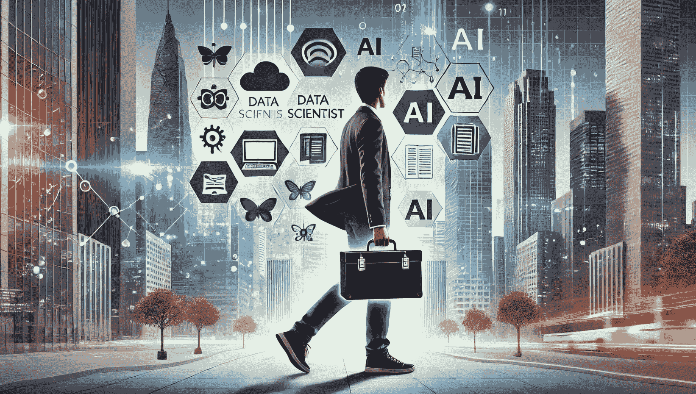

# 2024 年数据科学家工具箱中必备的 5 种工具

> 原文：[`www.kdnuggets.com/5-tools-every-data-scientist-needs-in-their-toolbox-in-2024`](https://www.kdnuggets.com/5-tools-every-data-scientist-needs-in-their-toolbox-in-2024)

图片来源于 DALL-E

随着数据世界的发展，数据科学的世界也在增长。跟上数据科学的步伐本身就是一份全职工作。市场不断扩展，工具也在不断发展和涌现，造成了混乱。然后你还要面对学习这些新工具的问题，了解它们的全部潜力，它们能替代什么，或者只是另一个附加工具。

* * *

## 我们的三大课程推荐

 1\. [Google 网络安全证书](https://www.kdnuggets.com/google-cybersecurity) - 加速进入网络安全职业生涯。

 2\. [Google 数据分析专业证书](https://www.kdnuggets.com/google-data-analytics) - 提升你的数据分析技能

 3\. [Google IT 支持专业证书](https://www.kdnuggets.com/google-itsupport) - 支持你所在组织的 IT

* * *

跟上这一切可能会很耗费精力。这就是为什么在你的数据科学家工具箱中拥有合适的工具对你出色完成工作至关重要。

一款好的工具改善你的工作方式。一款伟大的工具改善你的思维方式。

## Python

如果你要为数据科学选择一种编程语言，它很可能是 Python。它是黄金标准，拥有最大的用户群体。许多数据科学工具都是用 Python 编写的，社区是最大、增长最快、最活跃的。你不把它纳入工具箱中实在是太傻了！

学习 Python 的课程：

+   [Python 快速入门课程](https://imp.i384100.net/xkWQxy)

+   [数据科学、人工智能与开发的 Python](https://imp.i384100.net/Qyo4q6)

+   [Python 3 编程专业化](https://imp.i384100.net/jrkZEZ)

## 数学和统计学

数学和统计学。这些数据科学的基本要素确保数据科学有意义！它们是机器学习算法的基石。它们帮助你理解问题，并使你能够用它们找到解决方案。从识别模式到从大型复杂数据集中输出期望结果，数据科学家可以利用数学和统计学提取洞察并可靠地解释结果。

学习数学和统计学的课程：

+   [数据科学数学技能](https://imp.i384100.net/DKPnEa)

+   [机器学习和数据科学数学专业化](https://imp.i384100.net/rQZOvy)

+   [机器学习与数据科学的概率与统计](https://imp.i384100.net/PyX4LN)

## 数据可视化工具

作为数据科学家，你应该为你的发现感到自豪，并让它们看起来漂亮！但也要记住，其他利益相关者可能技术水平不高，因此可视化对他们很重要。这是他们理解数据科学的方式。能够以各种方式可视化你的洞察力将帮助你更好地传达这些洞察，而不必多说。

你可以使用不同的库，例如 Matplotlib，或者使用可视化工具，如 Tableau——你只需找到适合你和你组织的工具即可。

学习数据可视化的课程：

+   [使用 Python 进行数据可视化](https://imp.i384100.net/21EMOa)

+   [使用 Tableau 进行数据可视化的专业化课程](https://imp.i384100.net/3eno2k)

+   [微软 Power BI 数据分析师专业证书](https://imp.i384100.net/daQnx7)

## SQL

结构化查询语言，简称 SQL，是一种用于管理关系数据库中数据的编程语言。作为数据科学家，你将管理大量数据库，而 SQL 是你浏览数据的关键。通过 SQL，你将能够处理存储在数据库中的结构化数据，轻松地提取、操作和分析数据。你可能主要想学习 Python 或 SQL，或者你想全面掌握，学习两者！

学习 SQL 的课程：

+   [数据科学中的 SQL](https://imp.i384100.net/rQZOVy)

+   [使用 Python 进行数据库和 SQL 数据科学](https://imp.i384100.net/k0eZ53)

+   [结构化查询语言 (SQL) 入门](https://imp.i384100.net/GmeGa9)

## 框架

随着数据科学、机器学习和人工智能在我们日常生活中变得越来越重要，确保从头到尾管道的准确性和有效性也很重要。框架提供了一系列灵活的软件组件，帮助开发人员加速从软件开发到生产部署的过程。

在框架方面，数据科学界有一系列流行的框架，例如 TensorFlow、PyTorch、Pandas、Keras 等。作为数据科学家，你必须学习所有这些框架，因为它们在不同的时间可能对你有帮助。

学习不同框架的课程：

+   [TensorFlow 开发者专业证书](https://imp.i384100.net/NkZ45b)

+   [AI 工程师专业证书](https://imp.i384100.net/9gROmj)

## 总结

数据科学家的学习之旅是无止境的。市场上总会有新的工具和软件出现。然而，如果你的工具箱里有合适的工具，学习新技能将会轻松很多。

[Nisha Arya](https://www.linkedin.com/in/nisha-arya-ahmed/)**是数据科学家、自由技术撰稿人，以及 KDnuggets 的编辑和社区经理。她特别感兴趣于提供数据科学职业建议或教程，以及围绕数据科学的理论知识。Nisha 涵盖广泛的话题，并希望探索人工智能如何促进人类寿命的不同方式。作为一个热衷学习者，Nisha 希望拓宽她的技术知识和写作技能，同时帮助指导他人。**

### 主题更多信息

+   [2024 年每位数据科学家必备的 5 项基本技能](https://www.kdnuggets.com/5-essential-skills-every-data-scientist-needs-in-2024)

+   [未来证明你的数据游戏：2023 年每位数据科学家需要的顶级技能](https://www.kdnuggets.com/futureproof-your-data-game-top-skills-every-data-scientist-needs-in-2023)

+   [每位数据科学家需要的软技能](https://www.kdnuggets.com/soft-skills-every-data-scientist-needs)

+   [Python f-Strings 魔法：每位程序员需要了解的 5 个颠覆性技巧](https://www.kdnuggets.com/python-fstrings-magic-5-gamechanging-tricks-every-coder-needs-to-know)

+   [KDnuggets™ 新闻 22:n03，1 月 19 日：深入了解 13 个数据…](https://www.kdnuggets.com/2022/n03.html)

+   [深入了解 13 个数据科学家角色及其职责](https://www.kdnuggets.com/2022/01/deep-look-13-data-scientist-roles-responsibilities.html)
