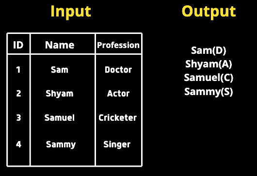
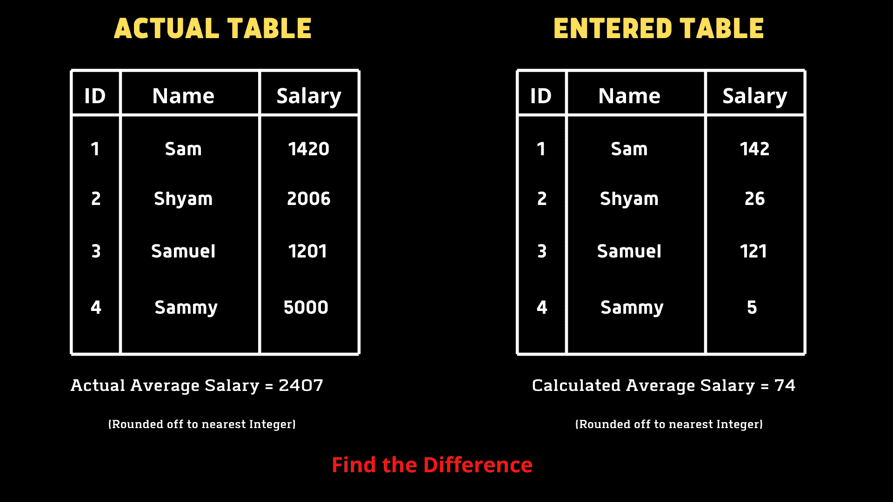
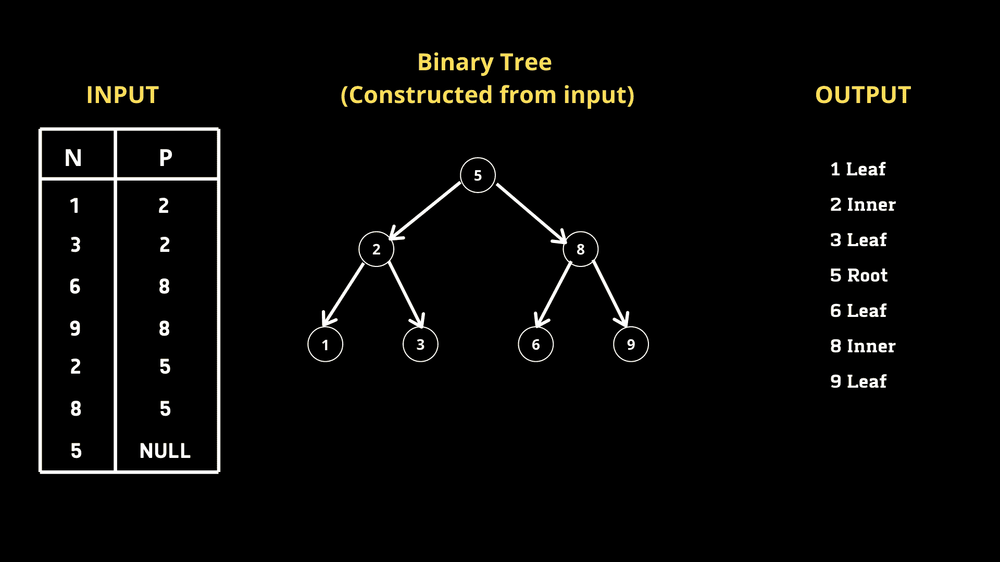
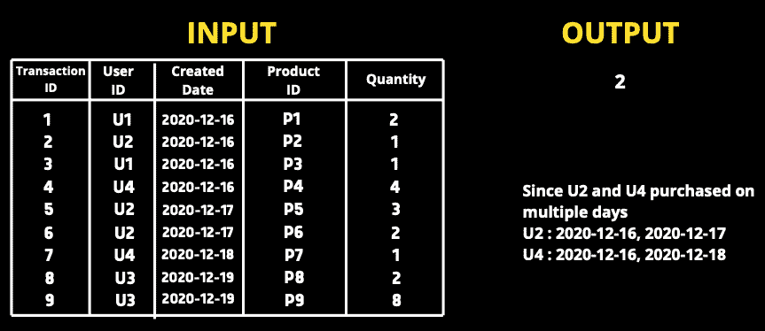
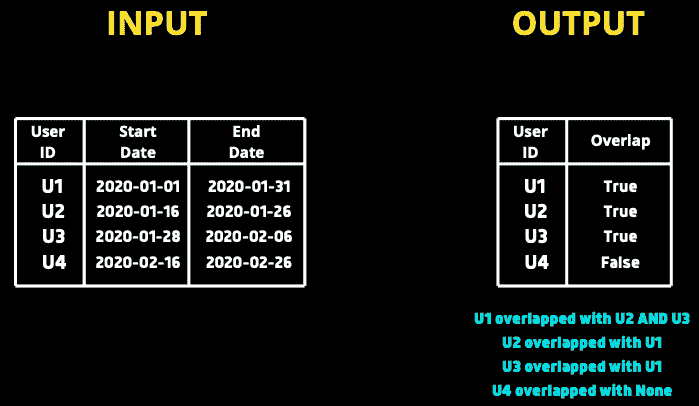
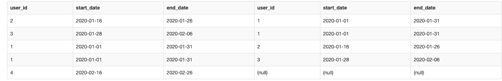
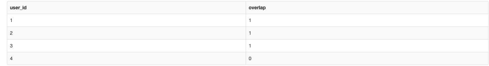

# 5 个棘手的 SQL 查询解决方案

> 原文：[`www.kdnuggets.com/2020/11/5-tricky-sql-queries-solved.html`](https://www.kdnuggets.com/2020/11/5-tricky-sql-queries-solved.html)


[Sql 向量由 freepik 创建 - www.freepik.com](https://www.freepik.com/vectors/sql)

SQL（结构化查询语言）是数据科学家工具箱中的一个非常重要的工具。掌握 SQL 不仅在面试中至关重要，而且通过能够解决复杂查询的良好理解，会让我们在竞争中脱颖而出。

在本文中，我将讨论我找到的 5 个棘手问题及其解决方法。

> **注意 —** 每个查询可以用不同的方式编写。在查看我的解决方案之前，尝试思考一下方法。你也可以在回复部分建议不同的方法。

# 查询 1

我们给定了一个包含两列的表，**名称**和**职业**。我们需要查询*所有名称后面紧跟着职业列中的第一个字母，并用括号括起来*。



**我的解决方案**

```py
**SELECT**
**CONCAT**(Name, ’(‘, **SUBSTR**(Profession, 1, 1), ’)’) 
**FROM** table;
```

由于我们需要组合名称和职业，可以使用 `CONCAT`。我们还需要在括号中只包含*一个字母*。因此，我们将使用 `SUBSTR` 并传入列名、起始索引、结束索引。由于我们只需要第一个字母，我们将传入 1,1（起始索引包含，结束索引不包含）

# 查询 2

Tina 被要求计算她创建的 EMPLOYEES 表中所有员工的平均薪资，但结果显示的平均值非常低，发现键盘上的零键无法工作。她希望我们帮助找出计算错误的平均值与实际平均值之间的差异。

我们必须编写一个查询来找出错误（实际 AVG — 计算 AVG）。



**我的解决方案**

```py
**SELECT** 
**AVG**(Salary) - **AVG**(**REPLACE**(Salary, 0, ’’))  
**FROM** table;
```

需要注意的是，我们只有一个表，其中包含实际薪资值。为了创建错误场景，我们使用 `REPLACE` 来替换 0。我们将传入列名、要替换的值和替换值。然后，我们使用聚合函数 `AVG` 来找出平均值的差异。

# 查询 3

我们给定了一个表格，它是一个 [二叉搜索树](https://en.wikipedia.org/wiki/Binary_search_tree)，包含两列 **节点** 和 **父节点**。我们必须编写一个查询，根据节点值的升序返回节点类型。有 3 种类型。

1.  根节点 — 如果该节点是根节点

1.  叶子节点 — 如果该节点是叶子节点

1.  内部节点 — 如果该节点既不是根节点也不是叶子节点。



**我的解决方案**

经过初步分析，我们可以得出结论，如果给定节点 N 的相应 P 值为 NULL，则它是根节点。如果给定节点 N 存在于 P 列中，则它不是内部节点。基于这一想法，让我们编写一个查询。

```py
**SELECT CASE**
    **WHEN** P **IS NULL** **THEN** **CONCAT**(N, ' Root')
    **WHEN** N **IN** **(SELECT DISTINCT** P from BST) **THEN** **CONCAT**(N, ' Inner')
    **ELSE** **CONCAT**(N, ' Leaf')
    **END**
**FROM** BST
**ORDER BY** N asc;
```

我们可以使用`CASE`，它作为一个开关函数。正如我提到的，如果 P 对于给定的节点 N 为空，则 N 是根节点。因此，我们使用`CONCAT`来组合节点值和标签。同样，如果一个给定的节点 N 在列 P 中，它就是一个内部节点。为了获得列 P 中的所有节点，我们编写了一个子查询，返回列 P 中的所有不同节点。由于我们被要求按节点值的升序排序输出，我们使用了`ORDER BY`子句。

# 查询 4

我们给定了一个交易表，包含**transaction_id、user_id、transaction_date、product_id 和 quantity**。我们需要查询那些在多个日期购买产品的用户的数量（注意，一个用户可以在同一天购买多个产品）。



**我的解决方案**

为了解决这个查询，我们不能直接计算用户 ID 的出现次数，如果出现次数多于一个则返回该用户 ID，因为一个用户在单一天内可能有多个交易。因此，如果一个用户 ID 与多个不同的日期相关联，意味着他在多个日期购买了产品。按照相同的方法，我编写了一个查询。（内部查询）

```py
**SELECT COUNT**(user_id)
**FROM**
(
**SELECT** user_id
 **FROM** orders
 **GROUP BY** user_id
 **HAVING COUNT**(**DISTINCT DATE**(date)) > 1
) t1
```

由于问题询问的是用户 ID 的数量而不是用户 ID 本身，因此我们在外部查询中使用`COUNT`。

# 查询 5

我们给定了一个订阅表，其中包含每个用户的订阅开始和结束日期。我们需要编写一个查询，根据日期与其他用户的重叠情况返回每个用户的 true/false。例如，如果用户 1 的订阅期与其他用户重叠，查询必须返回**True**给用户 1。



**我的解决方案**

初步分析后，我们了解到我们必须将每个订阅与其他所有订阅进行比较。让我们将**userA**的开始和结束日期分别记作`**startA**`和`**endA**`，同样地，对于**userB**，分别记作`**startB**`和`**endB**`**。

如果`**startA**`**≤**`**endB**`**和**`**endA**`**≥**`**startB**`，那么我们可以说这两个日期范围重叠。让我们先比较 U1 和 U3。

`startA` = 2020–01–01

`endA` = 2020–01–31

`startB` = 2020–01–16

`endB` = 2020–01–26

在这里我们可以看到`**startA**`（2020–01–01）小于`**endB**`**（2020–01–26），同样，**endA**（2020–01–31）大于`**startB**`（2020–01–16），因此可以得出日期重叠的结论。类似地，如果你比较 U1 和 U4，上述条件不成立，将返回 false。

我们还必须确保一个用户不会与自己的订阅进行比较。我们还希望对自身执行左连接，以匹配满足条件的每个其他用户。现在我们将创建两个副本 s1 和 s2。

```py
**SELECT** *
**FROM** subscriptions **AS** s1
**LEFT** **JOIN** subscriptions **AS** s2
    **ON** s1.user_id != s2.user_id
        AND s1.start_date <= s2.end_date
        AND s1.end_date >= s2.start_date
```

鉴于条件连接，s2 中的一个 user_id 应该存在于 s1 中的每一个 user_id 上，只要存在日期重叠的情况。

**输出**



我们可以看到，每个用户在日期重叠的情况下存在另一个用户。对于用户 1，有 2 行显示他与 2 个用户匹配。对于用户 4，相应的 id 为 null，表示他与其他用户没有匹配。

现在总结一下，我们可以按 s1.user_id 字段分组，并检查 s2.user_id IS NOT NULL 的情况下是否存在任何值为 true。

**最终查询**

```py
**SELECT**
    s1.user_id
    , (**CASE** **WHEN** s2.user_id **IS** NOT NULL **THEN** 1 **ELSE** 0 **END**) **AS** overlap
**FROM** subscriptions **AS** s1
**LEFT** **JOIN** subscriptions **AS** s2
    **ON** s1.user_id != s2.user_id
        AND s1.start_date <= s2.end_date
        AND s1.end_date >= s2.start_date
**GROUP** **BY** s1.user_id
```

我们使用了`CASE`语句来根据给定用户的 s2.user_id 值标记 1 和 0。最终输出如下 -



在结束之前，我想推荐一本我非常喜欢并且觉得非常有用的 SQL 书籍。

[SQL 食谱：数据库开发者的查询解决方案和技术 (Cookbooks (O’Reilly))](https://www.amazon.in/gp/product/B0026OR3KI/ref=as_li_tl?ie=UTF8&camp=3638&creative=24630&creativeASIN=B0026OR3KI&linkCode=as2&tag=kurasaiteja-21&linkId=e1ca4cf824b67c4fff6865a5163712c2)

# 结论

掌握 SQL 需要大量的练习。在这篇文章中，我选择了 5 个棘手的问题并解释了解决方法。SQL 的特点是每个查询可以用多种不同的方式编写。请随时分享你的方法。我希望你今天学到了新东西！

如果你想联系我，**请在**[**LinkedIn**](https://www.linkedin.com/in/saiteja-kura-49803b13b/)**上与我连接**。

[原文](https://medium.com/towards-artificial-intelligence/5-tricky-sql-queries-solved-919266e2d524)。经授权转载。

**[Saiteja Kura](https://www.linkedin.com/in/saiteja-kura-49803b13b/)** 诚恳、友好、雄心勃勃，对网页开发、数据科学和自然语言处理感兴趣。

* * *

## 我们的三大课程推荐

 1\. [谷歌网络安全证书](https://www.kdnuggets.com/google-cybersecurity) - 快速进入网络安全职业生涯。

 2\. [谷歌数据分析专业证书](https://www.kdnuggets.com/google-data-analytics) - 提升你的数据分析技能

 3\. [谷歌 IT 支持专业证书](https://www.kdnuggets.com/google-itsupport) - 支持你的组织在 IT 方面

* * *

### 更多相关话题

+   [解决 5 个复杂 SQL 问题：难题查询解析](https://www.kdnuggets.com/2022/07/5-hardest-things-sql.html)

+   [4 个有用的中级 SQL 查询用于数据科学](https://www.kdnuggets.com/2022/12/4-useful-intermediate-sql-queries-data-science.html)

+   [KDnuggets 新闻，12 月 7 日：揭穿 10 个数据科学神话 • 4…](https://www.kdnuggets.com/2022/n47.html)

+   [如何优化 SQL 查询以加快数据检索速度](https://www.kdnuggets.com/2023/06/optimize-sql-queries-faster-data-retrieval.html)

+   [如何使用索引加速 SQL 查询 [Python 版]](https://www.kdnuggets.com/2023/08/speed-sql-queries-indexes-python-edition.html)

+   [利用 GPT 模型将自然语言转换为 SQL 查询](https://www.kdnuggets.com/leveraging-gpt-models-to-transform-natural-language-to-sql-queries)
