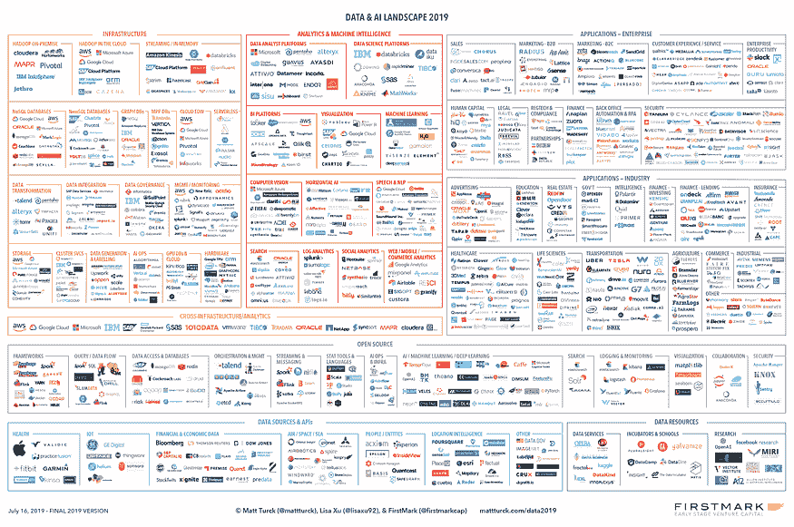
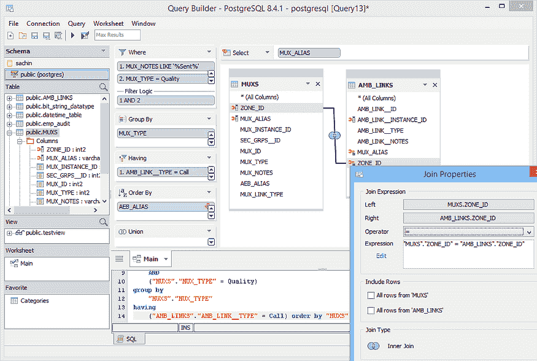
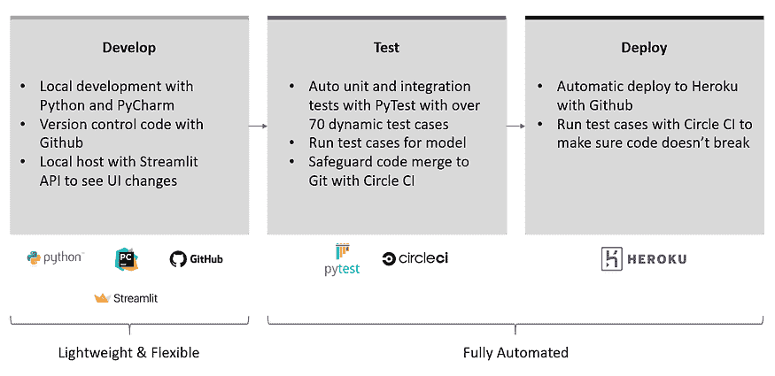
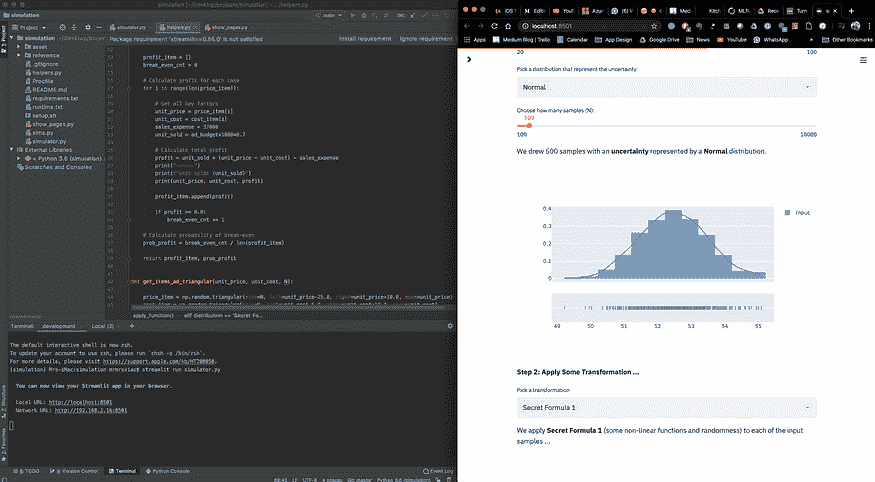
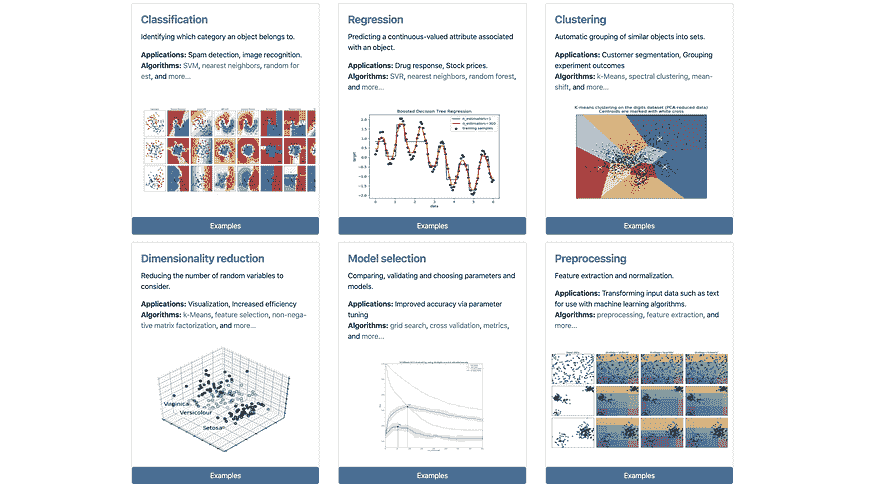
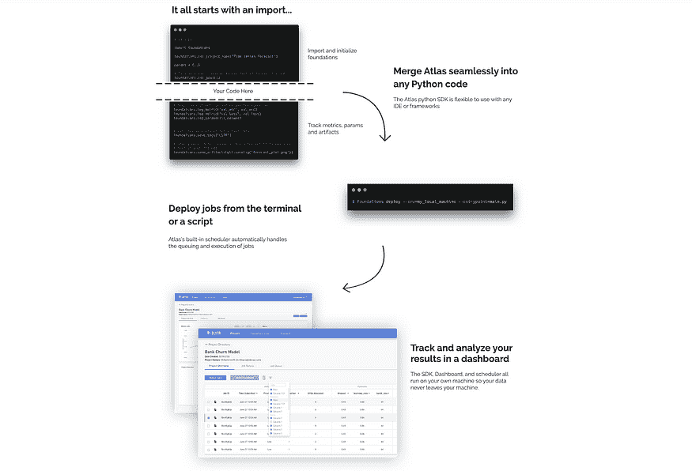
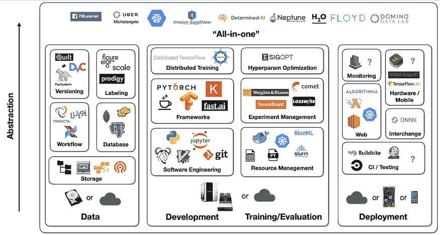

# 每个懒惰的全栈数据科学家都应该使用的 5 种最有用的机器学习工具

> 原文：[`www.kdnuggets.com/2020/11/5-useful-machine-learning-tools.html`](https://www.kdnuggets.com/2020/11/5-useful-machine-learning-tools.html)

评论

**由 [Ian Xiao](https://www.linkedin.com/in/ianxiao/)，数据 | 机器学习 | 市场营销**。

* * *

## 我们的前三大课程推荐

 1\. [谷歌网络安全证书](https://www.kdnuggets.com/google-cybersecurity) - 快速开启网络安全职业生涯。

 2\. [谷歌数据分析专业证书](https://www.kdnuggets.com/google-data-analytics) - 提升你的数据分析技能

 3\. [谷歌 IT 支持专业证书](https://www.kdnuggets.com/google-itsupport) - 支持你的组织的 IT

* * *

*照片由 [Creatv Eight](https://unsplash.com/@creatveight?utm_source=unsplash&utm_medium=referral&utm_content=creditCopyText) 提供，发布在 [Unsplash](https://unsplash.com/collections/8641367/image-for-blogs/56c1d67cd0eb64f06855199bd065aa08?utm_source=unsplash&utm_medium=referral&utm_content=creditCopyText) 上。*

构建优秀的机器学习应用程序就像制作米其林风格的菜肴。一个组织良好且管理得当的厨房至关重要，但选择的选项太多。在这篇文章中，我突出了在交付专业项目时发现有用的工具，并分享了一些想法和替代方案。像所有工具讨论一样，清单并不详尽。我尝试专注于最有用和最简单的工具。

***免责声明***: 本文未获得任何认证或赞助。我将数据科学和机器学习交替使用。

> “我如何构建好的机器学习应用程序？”

这个问题在与学校的有抱负的数据科学家、寻求转行的专业人士以及团队经理的聊天中多次出现，并以不同的形式出现。

交付专业数据科学项目涉及许多方面。像许多人一样，我喜欢使用厨房烹饪的类比：有食材（数据）、食谱（设计）、烹饪过程（你的独特方法），最后是实际的厨房（工具）。

因此，本文走访了我的**厨房**。它突出了设计、开发和部署**全栈机器学习**应用程序的**最有用工具**——这些解决方案与系统集成或在生产环境中服务于用户。

### 令人眼花缭乱的可能性

我们正处于一个黄金时代。如果你在谷歌上搜索“机器学习工具”或询问顾问，你可能会得到类似这样的结果：

*数据与人工智能格局 2019，[图片来源](https://www.google.com/url?sa=i&url=https%3A%2F%2Fmattturck.com%2Fdata2019%2F&psig=AOvVaw0oXq7zJf_Hz_RjdI-F70rq&ust=1583513401048000&source=images&cd=vfe&ved=0CAIQjRxqFwoTCPCR2KPlg-gCFQAAAAAdAAAAABAJ)。*

目前有**（太多）工具**；可能的组合是无限的。这可能会令人困惑和不知所措。所以，让我帮助你缩小范围。也就是说，没有完美的设置。一切都取决于你的需求和限制。所以根据需要选择和修改。

我的列表优先考虑以下（不按顺序）：

+   免费

+   容易学习和设置

+   未来证明（采纳与工具成熟度）

+   工程优于研究

+   在初创公司或大型企业中，适用于大小项目

+   完成任务即可

*警告：我 99%的时间使用 Python。所以这些工具与 Python 原生兼容或是用 Python 构建的。我没有测试过其他编程语言，如 R 或 Java。*

### 1\. 冰箱：数据库

**[PostgreSQL](https://www.postgresql.org/)**

一个免费的开源关系数据库管理系统（RDBMS），强调扩展性和技术标准的符合性。它设计用于处理各种工作负载，从单台机器到数据仓库或有多个并发用户的网络服务。

*[图片来源](https://www.google.com/url?sa=i&url=https%3A%2F%2Fwww.aquafold.com%2Fdbspecific%2Fpostgresql_client&psig=AOvVaw2Q_9WB3s7LFAJq4NStNNm_&ust=1583516333356000&source=images&cd=vfe&ved=0CAIQjRxqFwoTCMjw2Znwg-gCFQAAAAAdAAAAABAD)。*

*替代方案：*[*MySQL*](https://www.mysql.com/)*, *[*SAS*](https://www.sas.com/en_ca/home.html)*, *[*IBM DB2*](https://www.ibm.com/analytics/db2)*, *[*Oracle*](https://www.oracle.com/database/)*, *[*MongoDB*](https://www.mongodb.com/)*, *[*Cloudera*](https://www.cloudera.com/)*, *[*GCP*](https://cloud.google.com/storage)*, *[*AWS*](https://aws.amazon.com/products/storage/)*, *[*Azure*](https://azure.microsoft.com/en-ca/services/storage/)*, *[*PaperSpace*](https://www.paperspace.com/)

### 2\. 操作台：部署管道工具

管道工具对于开发的速度和质量至关重要。我们应该能够在最小的手动处理下快速迭代。这里有一个有效的设置。查看我的[12 小时 ML 挑战](https://towardsdatascience.com/build-full-stack-ml-12-hours-50c310fedd51)文章以了解更多细节。每个*懒惰*的数据科学家应该在项目早期尝试这个方法。

*作者的工作，[12 小时 ML 挑战](https://towardsdatascience.com/build-full-stack-ml-12-hours-50c310fedd51)。*

**[Github](https://github.com/)**

它提供了 Git 的分布式版本控制和源代码管理（SCM）功能，以及自己的特性。它提供访问控制和若干协作功能，如错误跟踪、功能请求、任务管理和每个项目的维基。

*备选方案：*[*DVC*](https://dvc.org/)*， *[*BitBucket*](https://bitbucket.org/product)*， *[*GitLab*](https://about.gitlab.com/)*

**[PyCharm](https://www.jetbrains.com/pycharm/) 社区版**

一种集成开发环境（IDE），用于计算机编程，特别是针对 Python 语言。由捷克公司 JetBrains 开发。它提供代码分析、图形调试器、集成单元测试器、与版本控制系统（VCS）的集成，并支持 Django 的 Web 开发以及使用 Anaconda 进行的数据科学。

*备选方案：*[*Atom*](https://atom.io/)*， *[*Sublime*](https://www.sublimetext.com/)*

**[Pytest](https://docs.pytest.org/en/latest/index.html)**

框架使得编写小型测试变得简单，同时也能支持复杂的功能测试，适用于应用程序和库。它节省了大量的手动测试时间。如果你每次更改代码时都需要测试某些内容，可以使用 Pytest 进行自动化测试。

*备选方案：*[*Unittest*](https://docs.python.org/3/library/unittest.html)*

**[CircleCi](https://circleci.com/)**

CircleCI 是一个持续集成和部署工具。它在你提交到 Github 时使用远程 Docker 创建自动化测试工作流。CircleCI 拒绝任何未通过 PyTest 设置的测试用例的提交。这确保了代码质量，尤其是在你与更大的团队合作时。

*备选方案：*[*Jenkins*](https://jenkins.io/)*， *[*Travis CI*](https://travis-ci.com/)*， *[*Github Action*](https://github.com/features/actions)*

**[Heroku](https://www.heroku.com/) （仅在需要网络托管时使用）**

一种平台即服务（PaaS），使开发人员能够完全在云中构建、运行和操作应用程序。你可以与 CircleCI 和 Github 集成以实现自动部署。

*备选方案：*[*Google App Engine*](https://cloud.google.com/appengine)*， *[*AWS Elastic Compute Cloud*](https://aws.amazon.com/ec2/)*， *[*其他*](https://medium.com/@brenda.clark/heroku-alternatives-top-5-picks-9095cef91d91)*

**[Streamlit](https://www.streamlit.io/) （仅在需要交互式用户界面时使用）**

Streamlit 是一个开源应用框架，专为机器学习和数据科学团队设计。近年来，它已成为我最喜欢的工具之一。查看我如何使用它以及本节中的其他工具创建一个 [电影](https://towardsdatascience.com/build-full-stack-ml-12-hours-50c310fedd51) 和 [模拟](https://towardsdatascience.com/how-to-design-monte-carlo-simulation-138e9214910a) 应用程序。

*备选方案：*[*Flask*](https://palletsprojects.com/p/flask/)*， *[*Django*](https://www.djangoproject.com/)*， *[*Tableau*](https://www.tableau.com/en-ca)*

### 3. iPad：探索工具

**[Streamlit](https://www.streamlit.io/) （再一次）**

忘记 Jupyter Notebook 吧。没错，就是这样。

Jupyter *曾经* 是我探索数据、进行分析以及试验不同数据和建模过程的首选工具。但我不记得有多少次：

1.  我花了很多时间调试（并且揪心），但最终意识到我忘记从顶部运行代码；Streamlit 修复了这个问题。

1.  我必须等待一段时间让数据管道重新运行，即使是小的代码更改；Streamlit Caching 修复了这个问题。

1.  我不得不重写或转换 Jupyter 的代码到可执行文件——以及花费在重新测试上的时间；Streamlit 提供了一个捷径。

这很令人沮丧。因此，我使用 Streamlit 进行**早期探索**并提供最终的前端——一举两得。以下是我的典型屏幕设置。左侧是 PyCharm IDE，右侧是结果可视化。试试看吧。

*IDE（左侧）+ Streamlit 实时更新（右侧），作者的工作来自 [被遗忘的算法](https://towardsdatascience.com/how-to-design-monte-carlo-simulation-138e9214910a)*

替代方案：[*Jupyter Notebook*](https://jupyter.org/)*，*[*Spyder from Anaconda*](https://www.spyder-ide.org/)*，*[*Microsoft Excel*](https://products.office.com/en-ca/excel)*（真的）

### 4\. 刀具：ML 框架

就像使用真正的刀具一样，你应该根据食物和你想切割的方式选择合适的刀具。有通用刀和专业刀。

**请谨慎。** 使用专业的寿司刀切骨头将花费很长时间，尽管寿司刀更闪亮。选择合适的工具完成工作。

**[Scikit-Learn](https://scikit-learn.org)（常见 ML 使用案例）**

用于在 Python 中进行一般机器学习的首选框架。不多说了。

*Scikit-Learn 的使用案例，[来源](https://scikit-learn.org/stable/)。*

*替代方案：没有。*

**[PyTorch](https://pytorch.org/)（深度学习使用案例）**

基于 Torch 库的开源机器学习库。鉴于深度学习的重点，它主要用于计算机视觉和自然语言处理等应用。它主要由 Facebook 的 AI 研究实验室（FAIR）开发。最近，许多知名 AI 研究机构，如 [Open AI](https://openai.com/blog/openai-pytorch/)，正在将 PyTorch 作为他们的标准工具。

*替代方案：*[*Tensorflow*](https://www.tensorflow.org/)*，*[*Keras*](https://keras.io/)*，*[*Fast.ai*](https://docs.fast.ai/)*

**[Open AI Gym](https://gym.openai.com/)（强化学习使用案例）**

一个用于开发和比较强化学习算法的工具包。它提供 API 和可视化环境。这是一个社区正在构建工具的活跃领域。尚未有许多打包良好的工具。

*替代方案：许多小项目，但没有多少维护得像 Gym 那样好。*

### 5\. 炉子：实验管理

**[Atlas](https://www.atlas.dessa.com/)**

一个免费的工具，允许数据科学家用几个代码片段设置实验，并将结果展示到基于 web 的仪表板上。

*Atlas 过程，[来源](https://www.atlas.dessa.com/)。*

**免责声明**：我曾在 Dessa 工作，该公司创建了 Altas。

*替代方案：*[*ML Flow*](https://mlflow.org/)*，*[*SageMaker*](https://aws.amazon.com/sagemaker/)*，*[*Comet*](https://www.comet.ml/site/)*，*[*Weights & Biases*](https://www.wandb.com/)*，*[*Data Robot*](https://www.datarobot.com/)*，*[*Domino*](https://www.dominodatalab.com/)*

### 另一种视角

正如我提到的，没有完美的设置。这一切都取决于你的需求和限制。这是另一个可用工具及其如何协同工作的视角。

*来自 [Sergey Karayev](https://www.linkedin.com/in/ACoAABqncBAB7JVSkewnHs3jvPfOOm-U23LAlTo/) 在 [全栈深度学习](https://full-stack-deep-learning.aerobaticapp.com/b172_eb327323-811b-4de9-8894-76ec4cfd6458/assets/slides/fsdl_4_infra_tooling.pdf) 的演讲，2019 年。*

[原始文章](https://towardsdatascience.com/the-most-useful-ml-tools-2020-e41b54061c58)。经允许转载。

**相关：**

+   [数据科学工具插图学习指南](https://www.kdnuggets.com/2020/08/data-science-tools-illustrated-study-guides.html)

+   [我从研究 200 种机器学习工具中学到了什么](https://www.kdnuggets.com/2020/07/200-machine-learning-tools.html)

+   [每个数据科学家都应该知道的 10 大数据可视化工具](https://www.kdnuggets.com/2020/05/top-10-data-visualization-tools-every-data-scientist.html)

### 更多相关话题

+   [KDnuggets 新闻，5 月 25 日：每个数据科学家都应该了解的 6 个 Python 机器学习工具…](https://www.kdnuggets.com/2022/n21.html)

+   [KDnuggets 新闻 3 月 30 日：最受欢迎的编程入门…](https://www.kdnuggets.com/2022/n13.html)

+   [每个数据科学家都应该了解的 6 个 Python 机器学习工具](https://www.kdnuggets.com/2022/05/6-python-machine-learning-tools-every-data-scientist-know.html)

+   [每个数据科学家都应该知道的三个 R 库（即使你使用 Python）](https://www.kdnuggets.com/2021/12/three-r-libraries-every-data-scientist-know-even-python.html)

+   [每个数据科学家都应该知道的工具：实用指南](https://www.kdnuggets.com/tools-every-data-scientist-should-know-a-practical-guide)

+   [KDnuggets™ 新闻 22:n01，1 月 5 日：追踪和可视化的 3 个工具…](https://www.kdnuggets.com/2022/n01.html)
