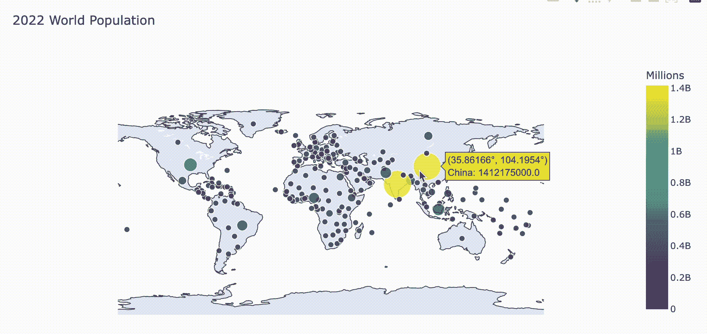
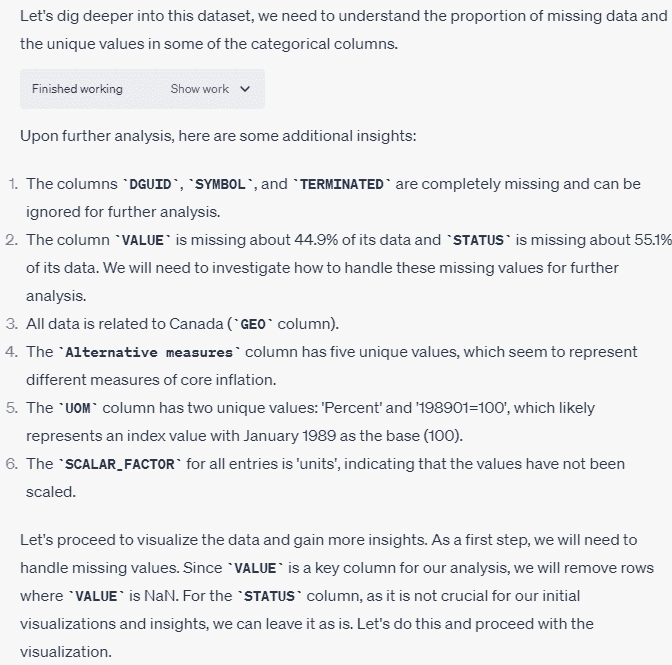
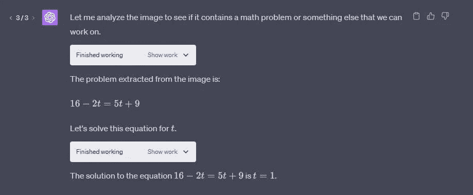
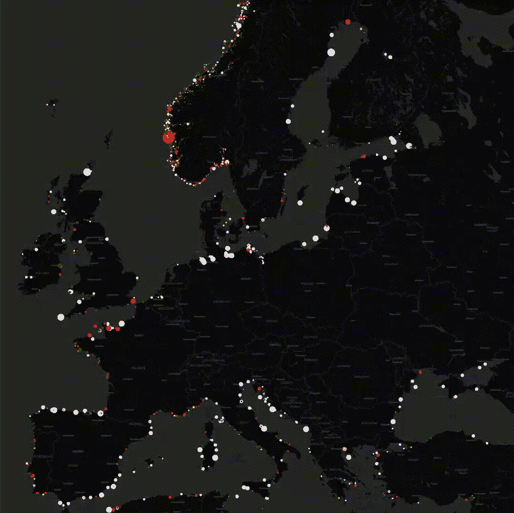
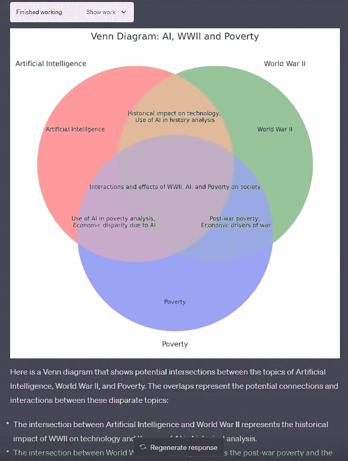

# 5 种使用 ChatGPT 代码解释器进行数据科学的方式

> 原文：[`www.kdnuggets.com/2023/08/5-ways-chatgpt-code-interpreter-data-science.html`](https://www.kdnuggets.com/2023/08/5-ways-chatgpt-code-interpreter-data-science.html)

图片来源：作者

通过代码解释器集成，ChatGPT 现在可以在沙盒环境中编写和执行 Python 代码，从而提供更准确和精确的答案。这使得它能够通过代码执行而非仅仅文本预测来进行复杂计算、生成可视化等。用户可以上传数据文件供代码处理，并收到像输出文件这样的结果。一般而言，代码解释器功能减少了大语言模型中常见的错误，并显著扩展了 ChatGPT 从数据可视化到生成动画的能力。

* * *

## 我们的前 3 名课程推荐

 1. [Google 网络安全证书](https://www.kdnuggets.com/google-cybersecurity) - 快速进入网络安全职业生涯。

 2. [Google 数据分析专业证书](https://www.kdnuggets.com/google-data-analytics) - 提升你的数据分析技能

 3. [Google IT 支持专业证书](https://www.kdnuggets.com/google-itsupport) - 支持你的组织的 IT 工作

* * *

在这篇博客中，我们将探讨五种使用 ChatGPT 代码解释器来处理数据科学任务和项目的简单方法，并附有示例。

# 1. 数据分析

ChatGPT 在 Python 数据分析方面具有显著能力。凭借其新的代码解释器集成，它现在可以执行 Python 代码并返回结果。它甚至可以生成带有动画的交互式可视化。

提供一个 CSV 文件，ChatGPT 将生成数据可视化和总结统计，甚至处理数据。只需一个自然的提示来描述你所需的分析。

ChatGPT 自然语言理解与运行 Python 代码的能力相结合，为非技术经理解锁了快速和自动化的数据分析。

图片来源 [Soner Yıldırım](https://towardsdatascience.com/chatgpt-code-interpreter-how-it-saved-me-hours-of-work-3c65a8dfa935)

# 2. 数据清理

数据清理可能是数据科学家最繁琐的任务之一。手动清理 CSV 文件或编写自定义 Python 脚本非常耗时。然而，ChatGPT 的新功能简化了这一过程。它与代码解释器的集成使得通过简单的对话提示实现自动化数据清理成为可能。

例如，提供 ChatGPT 一个 CSV 文件，并要求它分析数据质量。ChatGPT 会检查数据框，识别如缺失值等问题，并提出解决方案。现在，助手可以彻底调查数百列数据。ChatGPT 甚至会生成自定义 Python 函数来实现推荐的数据清理步骤。

图片来自 [DataCamp](https://www.datacamp.com/tutorial/how-to-use-chat-gpt-code-interpreter)

# 数学

ChatGPT 已扩展了理解技术文档（如研究论文）的能力。只需提供 PDF 或方程式的图像，其集成的 OCR 将提取并理解数学内容。

例如，上传一篇解释新机器学习技术的论文。要求 ChatGPT 求解关键方程，并逐步演示推导过程。Code Interpreter 可以解析图像文件和 PDF 中的复杂公式，进行计算，并用简单语言解释方程的含义。

图片来自 [DatHero](https://medium.com/@eldatero/top-10-ways-to-use-chatgpt-code-interpreter-8afc80202520)

# 转换文件

使用这一创新功能让你的数据栩栩如生。只需上传一个包含欧洲灯塔位置的 CSV 文件。Code Interpreter 会自动生成一个动画地图，每个灯塔在黑暗的背景下闪烁如星星。

可能性还不止于此。轻松将你的 CSV 文件转换为 Excel 表格以进行进一步分析。或者上传图像文件，Code Interpreter 将其转化为独特的 GIF 动画。

图片来自 [Ethan Mollick](https://twitter.com/emollick/status/1485467613190832130)

# 图示

ChatGPT 提供以文本形式的有用回答。使用 Code Interpreter 可以将信息以可视化形式呈现。例如，生成 Venn 图在寻找多个主题之间的共同点时特别有用。

在多个主题之间难以找到共同点？轻松创建一个 Venn 图以突出交集。计划新的系统架构？Code Interpreter 将其呈现为专业的工作流程图。教授复杂概念？通过定制的图示吸引学生，展示关键点。

图片来自 [DatHero](https://medium.com/@eldatero/top-10-ways-to-use-chatgpt-code-interpreter-8afc80202520)

# 结论

ChatGPT 正日益成为所有数据相关问题的首选平台。通过简单的提示，用户可以生成数据分析报告，解决复杂的问题、数学方程式，转换文件，并创建维恩图。ChatGPT 的自然语言能力和执行 Python 代码的能力使其可供任何人执行技术性和复杂的任务。

## 资源

1.  [使用 ChatGPT 代码解释器的前 10 种方法 | 作者：DatHero | 2023 年 7 月 | Medium](https://medium.com/@eldatero/top-10-ways-to-use-chatgpt-code-interpreter-8afc80202520)

1.  [如何使用 ChatGPT 代码解释器 | DataCamp](https://www.datacamp.com/tutorial/how-to-use-chat-gpt-code-interpreter)

1.  [代码解释器是 ChatGPT 最强大的版本，这里有 10 种令人难以置信的使用案例：ChatGPT](https://www.reddit.com/r/ChatGPT/comments/14ublwc/code_interpreter_is_the_most_powerful_version_of/)

1.  [ChatGPT 代码解释器：它如何节省了我数小时的工作 | 作者：Soner Yıldırım | 2023 年 7 月 | Towards Data Science](https://towardsdatascience.com/chatgpt-code-interpreter-how-it-saved-me-hours-of-work-3c65a8dfa935)

**[Abid Ali Awan](https://www.polywork.com/kingabzpro)** ([@1abidaliawan](https://www.linkedin.com/in/1abidaliawan/)) 是一位认证的数据科学专业人士，他喜欢构建机器学习模型。目前，他专注于内容创作，并撰写关于机器学习和数据科学技术的技术博客。Abid 拥有技术管理硕士学位和电信工程学士学位。他的愿景是利用图神经网络构建一个 AI 产品，帮助那些遭受心理疾病困扰的学生。

### 相关主题

+   [5 种使用 ChatGPT 视觉进行数据分析的方法](https://www.kdnuggets.com/5-ways-you-can-use-chatgpt-vision-for-data-analysis)

+   [ChatGPT 代码解释器：在几分钟内完成数据科学任务](https://www.kdnuggets.com/2023/07/chatgpt-code-interpreter-data-science-minutes.html)

+   [ChatGPT 如何使你编码更好、更快的 7 种方式](https://www.kdnuggets.com/2023/06/7-ways-chatgpt-makes-code-better-faster.html)

+   [免费 ChatGPT 课程：使用 OpenAI API 进行 5 个项目编码](https://www.kdnuggets.com/2023/05/free-chatgpt-course-openai-api-code-5-projects.html)

+   [企业如何从机器学习中受益的 6 种方式](https://www.kdnuggets.com/2022/08/6-ways-businesses-benefit-machine-learning.html)

+   [为数据科学家分享代码块的新方法](https://www.kdnuggets.com/2022/03/new-ways-sharing-code-blocks.html)
