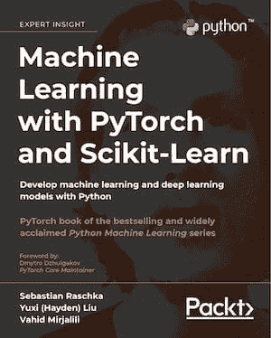

# 扩展数据科学知识的 5 种方法

> 原文：[`www.kdnuggets.com/2022/04/5-ways-expand-knowledge-data-science-beyond-online-courses.html`](https://www.kdnuggets.com/2022/04/5-ways-expand-knowledge-data-science-beyond-online-courses.html)

图片来源于 Gabriella Marino，来自 Unsplash

## **关键要点**

+   在当今的信息技术现代世界中，学习数据科学的在线资源是无限的。

+   大多数数据科学资源仅提供表面知识。

+   要在在线课程之外扩展你的知识，你必须付出额外的努力，以深入掌握核心数据科学概念。

* * *

## 我们的前 3 个课程推荐

 1\. [Google Cybersecurity Certificate](https://www.kdnuggets.com/google-cybersecurity) - 快速进入网络安全职业道路

 2\. [Google Data Analytics Professional Certificate](https://www.kdnuggets.com/google-data-analytics) - 提升你的数据分析技能

 3\. [Google IT Support Professional Certificate](https://www.kdnuggets.com/google-itsupport) - 支持你的组织 IT

* * *

学习数据科学的在线资源是无限的。这些资源可以在 YouTube、KDnuggets、Medium 等平台上找到，或者在提供大规模开放在线课程的数据科学平台上找到，如下所示：

1.  **edx**: [`www.edx.org/`](https://www.edx.org/)

1.  **Coursera**: [`www.coursera.org/`](https://www.coursera.org/)

1.  **DataCamp**: [`www.datacamp.com/`](https://www.datacamp.com/)

1.  **Udemy**: [`www.udemy.com/`](https://www.udemy.com/)

1.  **Udacity**: [`www.udacity.com/`](https://www.udacity.com/)

1.  **Lynda**: [`www.lynda.com/`](https://www.lynda.com/)

虽然使用这些资源作为学习数据科学基础知识的起点是有益的，但要扩展知识至基础知识之外，还需要更多的努力。

# **扩展知识的其他方法**

## **数据科学教材**

教材是很好的教学工具，适合那些希望深入学习在线课程内容以外的高级学习者。对我个人来说，有一本教材给我留下了深刻的印象（在进行数据科学项目时我仍然把这本书作为主要参考书），这本书是：**“*****Machine Learning with PyTorch and Scikit-Learn*****”，作者 Sebastian Raschka。** 这本书提供了数据科学和机器学习的绝佳入门，包含代码。该书的 GitHub 仓库可以通过点击以下链接访问：[`github.com/rasbt/machine-learning-book`](https://github.com/rasbt/machine-learning-book)

这本书是针对初学者的最佳数据科学书籍之一。作者以非常易于理解的方式讲解了数据科学和机器学习的基本概念。此外，还包括了代码，你可以实际使用提供的代码进行练习并构建自己的模型。我个人发现这本书在我的数据科学学习旅程中非常有用。我会推荐这本书给任何数据科学志愿者。你只需要具备基础的线性代数和编程技能即可理解这本书。还有许多其他优秀的数据科学教材，如 Wes McKinney 的“[Python for Data Analysis](https://sushilapalwe.files.wordpress.com/2018/04/python-for-data-analytics-book.pdf)”、Kuhn & Johnson 的“[Applied Predictive Modeling](https://vuquangnguyen2016.files.wordpress.com/2018/03/applied-predictive-modeling-max-kuhn-kjell-johnson_1518.pdf)”和 Ian H. Witten, Eibe Frank & Mark A. Hall 的“[Data Mining: Practical Machine Learning Tools and Techniques](https://www.wi.hs-wismar.de/~cleve/vorl/projects/dm/ss13/HierarClustern/Literatur/WittenFrank-DM-3rd.pdf)”。

## **真实世界的数据科学问题**

虽然数据科学的在线课程提供了一些基础知识，但你可以通过将新获得的知识应用到数据科学项目中来提升自己的技能。当你挑战自己将知识应用于真实的数据科学项目时，它将帮助你深入理解核心的数据科学概念。Kaggle 的数据科学竞赛为具有高级知识的个人提供了很好的挑战项目。

## **与数据科学专业人士建立网络**

根据我的个人经验，通过与其他数据科学志愿者组队，参与每周的群体讨论，我学到了很多关于数据科学和机器学习的知识。与其他数据科学志愿者和专业人士建立网络；在 GitHub 上分享你的代码；在 LinkedIn、Kaggle 或 Medium 等平台展示你的技能。这将帮助你在短时间内学到很多新概念和工具。你还会接触到新的方法，以及前沿的算法和技术。建立网络也能提升你的沟通能力和团队合作技能。

## **通过写博客分享你的数据科学知识**

学习的最佳方式是通过教学。当你教别人时，你会被迫理解核心概念，你的目标是以易于理解的方式向学生或公众解释这些核心概念。写博客是提升和扩展你数据科学知识的绝佳方式。当我尝试学习新事物时，我总是挑战自己写一篇关于这个主题的博客。这是一种证明自己理解了概念的方式。数据科学领域有很多博客平台，如 [Medium](https://medium.com)、KDnuggets 等。你还可以通过博客赚取收入，这对于补充收入非常好。

## **实习或兼职工作**

实习将为你提供将数据科学知识应用于实际环境的机会。这将帮助你增加数据科学方面的知识。实习还提供了发展重要软技能的机会，例如沟通能力和团队合作能力。

总的来说，互联网上有无数的在线资源可以学习数据科学。大多数数据科学资源仅提供表层知识。为了将知识拓展到在线课程之外，需要额外的努力。这将使你深入了解核心数据科学概念。

**[本杰明·O·塔约](https://www.linkedin.com/in/benjamin-o-tayo-ph-d-a2717511/)** 是一位物理学家、数据科学教育者和作家，同时也是 DataScienceHub 的所有者。此前，本杰明曾在中奥克拉荷马大学、大峡谷大学和匹兹堡州立大学教授工程学和物理学。

### 更多相关内容

+   [理解贝叶斯定理的三种方法将提升你的数据科学水平](https://www.kdnuggets.com/2022/06/3-ways-understanding-bayes-theorem-improve-data-science.html)

+   [用数据科学翻倍收入的 5 种方法](https://www.kdnuggets.com/2022/05/5-ways-double-income-data-science.html)

+   [启动 SQL 学习的 6 个最佳免费在线课程](https://www.kdnuggets.com/2022/10/corise-6-best-free-online-courses-jumpstart-learning-sql.html)

+   [学习 Python 并提升职业生涯的 6 个最佳免费在线课程](https://www.kdnuggets.com/2022/11/corise-6-best-free-online-courses-python-boost-career.html)

+   [本周提升搜索应用的 8 种方法](https://www.kdnuggets.com/2022/09/corise-8-ways-improve-search-application-week.html)

+   [加速 Python 代码的 3 种简单方法](https://www.kdnuggets.com/2022/10/3-simple-ways-speed-python-code.html)
