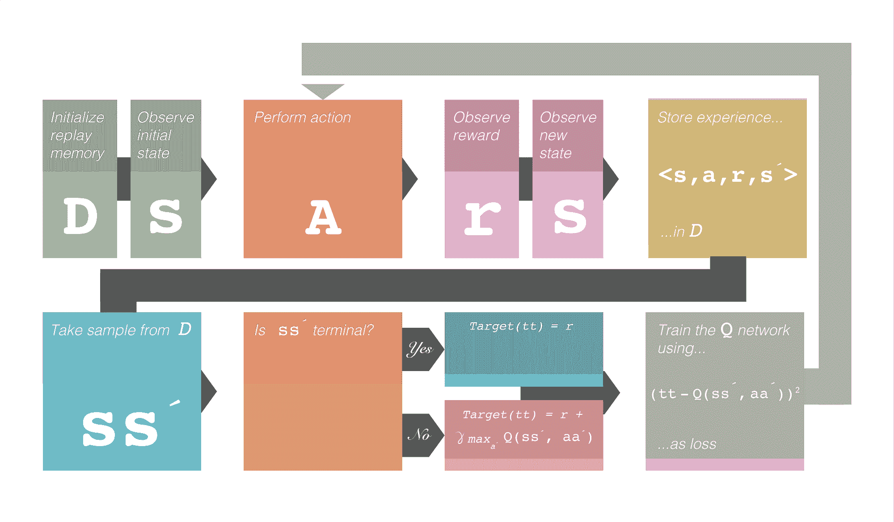
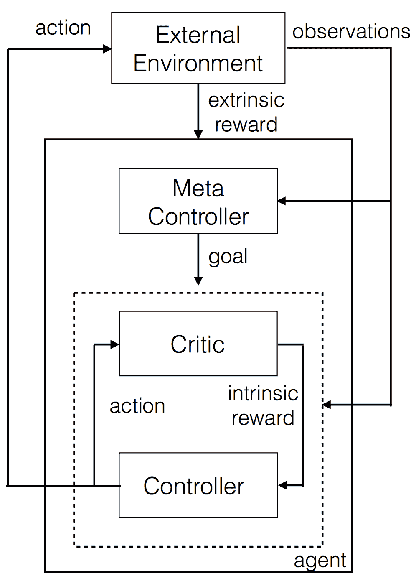
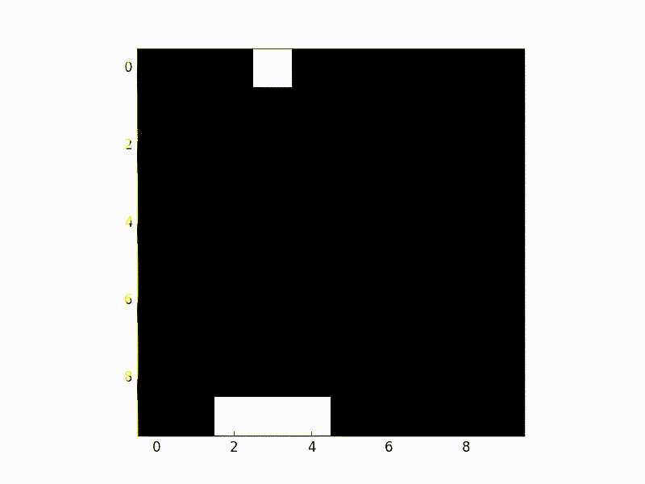

# 强化学习入门的 5 种方法

> 原文：[`www.kdnuggets.com/2017/09/5-ways-get-started-reinforcement-learning.html`](https://www.kdnuggets.com/2017/09/5-ways-get-started-reinforcement-learning.html)

艺术作品由 [Robert Aguilera](http://robertaguileradesign.com/)

机器学习算法，特别是神经网络，被认为是引发新一轮人工智能“革命”的原因。在本文中，我将介绍强化学习的概念，但技术细节有限，以便具有不同背景的读者能够理解该技术的本质、能力和局限性。

*在文章末尾，我将提供* ***链接*** *到一些* ***资源*** *，用于实施强化学习。*

### 什么是强化学习？

广义上讲，数据驱动的算法可以分为三种类型：**监督学习**、**无监督学习**和**强化学习**。

前两种方法通常用于执行图像分类、检测等任务。虽然它们的准确性很高，但这些任务与我们期望的“智能”存在的任务有所不同。

这就是强化学习的作用所在。其概念非常简单，就像我们的进化过程一样：环境奖励代理正确的行为，并惩罚其错误的行为。主要的挑战是开发出学习数百万种可能行为的能力。

### Q 学习与深度 Q 学习

Q 学习是一种广泛使用的强化学习算法。在不涉及详细数学的情况下，某个行动的质量由代理所在的状态决定。代理通常执行能获得最大奖励的行动。详细的数学内容可以在[**这里**](https://en.wikipedia.org/wiki/Q-learning)找到。

在这个算法中，代理根据环境给予的奖励量来学习每个行动（行动也称为策略）的质量（Q 值）。每个环境状态的值以及 Q 值通常存储在表格中。随着代理与环境的交互，Q 值会从随机值更新为实际有助于最大化奖励的值。

#### 深度 Q 学习

使用 Q 学习和表格的问题在于其扩展性较差。如果状态数量过多，表格将无法存储在内存中。这时可以应用深度 Q 学习。深度学习基本上是一种通用的逼近机器，它可以理解并生成抽象表示。深度学习可以用来逼近 Q 值，也可以通过梯度下降轻松学习最优 Q 值。

> *趣味事实：*
> 
> 谷歌对深度 Q 学习的一些元素拥有专利：[US20150100530](https://www.google.com/patents/US20150100530)

### 探索与利用

代理通常会记住一条路径而不会尝试探索其他路径。一般来说，我们希望代理不仅能利用好的路径，还能有时探索新的路径以执行操作。因此，一个名为*ε*的超参数用于控制探索新路径与利用旧路径的平衡。

### 经验重放

在训练神经网络时，数据不平衡发挥着非常重要的作用。如果模型是在代理与环境交互时进行训练的，就会存在不平衡。最新的操作显然比旧的操作有更多的影响。

因此，所有状态及相关数据都存储在内存中，神经网络可以随机挑选一批交互并进行学习（这使得它与监督学习非常相似）。

### 训练框架

这就是深度 Q 学习的整个框架。注意到*γ*。这表示折扣奖励。它是一个超参数，用于控制未来奖励的权重。符号***´*** 表示下一个。例如，s´ 表示下一个状态。

**图 1.0** 深度 Q 学习训练框架。致谢：[Robert Aguilera](http://robertaguileradesign.com/)

### 扩展强化学习

强化学习在许多方面表现良好（如 [**AlphaGo**](https://deepmind.com/research/alphago/)），但在反馈稀疏的地方经常失败。代理不会探索在长期内实际有益的行为。有时，探索一些行动是为了其自身的目的（内在动机），而不是直接解决问题。

这样做允许代理执行复杂的动作，并基本上允许代理‘规划’事务。[**层次化学习**](https://arxiv.org/pdf/1604.06057.pdf) 允许这种抽象学习。

**图 2.0 层次化深度 Q 学习**

在这种设置中，有两个 Q 网络。它们分别表示为控制器和元控制器。元控制器查看原始状态并计算要跟随的‘目标’。控制器接受状态和目标，并输出解决目标的策略。评论者检查目标是否已达到，并给予控制器一些奖励。控制器在回合结束或目标达到时停止。然后，元控制器选择一个新目标，这个过程会重复进行。

‘目标’是最终帮助代理获得最终奖励的东西。这更好，因为可以在层次结构中进行 Q 学习。

### 强化学习的入门资源

这个列表对那些希望开始强化学习的人将会有所帮助：

1.  [**深度 Q 学习基础**](https://www.intelnervana.com/demystifying-deep-reinforcement-learning/)。对理解强化学习的数学和过程非常有帮助。

1.  [**层次学习论文**](https://arxiv.org/pdf/1604.06057.pdf)，适合那些想详细了解层次学习的人。

1.  [**层次学习论文解释**](https://www.youtube.com/watch?v=tyRUql_ZR7Q) 来自作者的视频。

1.  [**深度 RL：概述**](https://arxiv.org/abs/1701.07274) 我认为这是强化学习的手册。它涵盖了理解当前研究水平所需的几乎所有方面。它深入探讨了数学内容，但也提供了高层次的概述。

1.  [**使用单个 python 脚本实现深度 Q 学习。**](https://gist.github.com/EderSantana/c7222daa328f0e885093#file-qlearn-py-L157) 也许是最简单的深度 Q 学习实现。这非常易读，是一个很好的起点。

**图 3.0 深度 Q 学习实际操作。** Python 脚本在第 5 点的输出

### 行动召唤

如果你有评论或问题，请随时在下方回复这篇文章。

***特别感谢*** [***罗伯特·阿吉莱拉***](http://robertaguileradesign.com/) ***制作了艺术作品和流程图。***

[原文](https://buzzrobot.com/5-ways-to-get-started-with-reinforcement-learning-b96d1989c575)。经许可转载。

**相关内容：**

+   从自主学习到智能学习：强化学习基础

+   从零到一的深度学习：5 个令人惊叹的演示和代码，适合初学者

+   强化学习的下一个挑战

* * *

## 我们的 3 个课程推荐

 1\. [谷歌网络安全证书](https://www.kdnuggets.com/google-cybersecurity) - 快速进入网络安全职业道路。

 2\. [谷歌数据分析专业证书](https://www.kdnuggets.com/google-data-analytics) - 提升你的数据分析能力

 3\. [谷歌 IT 支持专业证书](https://www.kdnuggets.com/google-itsupport) - 支持你所在组织的 IT 工作

* * *

### 相关主题

+   [进入数据科学的 3 种可能途径](https://www.kdnuggets.com/2022/03/3-possible-ways-get-data-science.html)

+   [联邦学习：带教程的协作机器学习…](https://www.kdnuggets.com/2021/12/federated-learning-collaborative-machine-learning-tutorial-get-started.html)

+   [7 个适合初学者的 ChatGPT 项目](https://www.kdnuggets.com/2023/08/7-beginnerfriendly-projects-get-started-chatgpt.html)

+   [10 门免费的必修数据科学课程以供入门](https://www.kdnuggets.com/10-free-must-take-data-science-courses-to-get-started)

+   [为什么提升数据可视化技能很重要（& 如何入门）](https://www.kdnuggets.com/2022/07/sphere-upskilling-data-vis-matters.html)

+   [A/B 测试的 3 个好处（+ 从哪里开始）](https://www.kdnuggets.com/2022/08/sphere-3-benefits-ab-testing-get-started.html)
