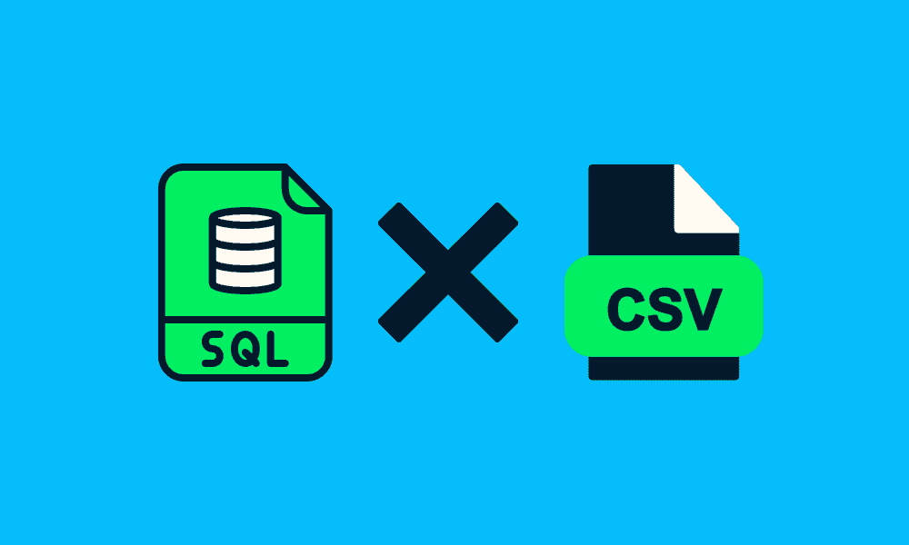
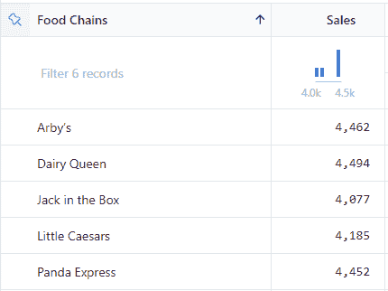

# SQL 与 CSV

> 原文：[`www.kdnuggets.com/2023/01/sql-csvs.html`](https://www.kdnuggets.com/2023/01/sql-csvs.html)



作者提供的图片

您可以在 CSV 文件上运行 SQL 查询：

1.  通过在 [SQL 在线 IDE](https://sqliteonline.com/#) 上导入 CSV 文件。

1.  通过将 CSV 文件直接导入数据库。

1.  通过使用 Python、R 或 Julia 包直接在 CSV 文件上运行 SQL。

1.  通过使用 DuckDB，该工具在大型 CSV 文件上运行快速分析查询表现最佳。

1.  通过使用 CLI 工具。

* * *

## 我们的前 3 个课程推荐

 1\. [Google 网络安全证书](https://www.kdnuggets.com/google-cybersecurity) - 快速开启网络安全职业生涯。

 2\. [Google 数据分析专业证书](https://www.kdnuggets.com/google-data-analytics) - 提升您的数据分析技能

 3\. [Google IT 支持专业证书](https://www.kdnuggets.com/google-itsupport) - 支持您的组织 IT

* * *

在这篇文章中，我们将回顾最流行的 CSV 文件处理 CLI 工具，并学习如何轻松地在 CSV 文件上运行 SQL 查询。

# csvkit

[csvkit](https://csvkit.readthedocs.io/en/latest/) 包含多个命令行转换和处理工具。它是表格文件格式的霸主。

+   您可以将 Excel 转换为 CSV，将 JSON 转换为 CSV，将 CSV 转换为 JSON 文件。

+   通过打印列名、查看列的子集、重新排序列、查找匹配单元格的行和生成汇总统计信息来分析数据。

+   在 CSV 文件上运行 SQL 查询。

+   将数据导入 PostgreSQL 数据库，并将数据从 PostgreSQL 提取到 CSV 文件中。

我们将重点关注运行 SQL 查询并显示和保存结果。

## 安装

您可以使用 PIP 安装 csvkit。

```py
pip install csvkit
```

安装后，通过在 Shell 中输入以下命令或在线阅读 [文档](https://csvkit.readthedocs.io/en/latest/) 来查看文档。

```py
csvsql -h
```

## 语法

要运行 SQL，您需要使用 --query 参数，然后在引号中编写查询。对于较长的 SQL 查询，您可以使用换行符，因为它在 PowerShell/Bash 中效果很好。

```py
csvsql --query "WRITE SQL QUERY HERE" data.csv
```

> **注意：** 文件名必须与查询中的表名相同。

# 使用 csvkit 进行 SQL 查询与 CSV

在本节中，我们将使用修改版的 [美国前 50 大快餐连锁店](https://www.kaggle.com/datasets/iamsouravbanerjee/top-50-fastfood-chains-in-usa) 数据集，运行 SQL 查询并打印和保存结果。

## 简单查询

首先，我们将运行一个简单的查询来测试命令是否有效。

```py
csvsql --query "SELECT * FROM usa_ff LIMIT 2" usa_ff.csv
```

**输出：**

结果显示了四列和美国快餐连锁店的前两条记录。

```py
Chains,Sales,Franchised Stores,Company Stores
Arby's,4462.0,2293.0,1116.0
Baskin-Robbins,686.0,2317.0,0.0
```

## 复杂查询

让我们尝试运行一个复杂的 SQL 查询，以筛选出销售额大于或等于 40 亿美元的前 5 大快餐连锁店。

```py
csvsql --query "
SELECT Chains AS 'Food Chains', Sales
FROM usa_ff
WHERE Sales >= 4000
ORDER BY Sales DESC
LIMIT 5" usa_ff.csv
```

**输出：**

```py
Food Chains,Sales
McDonald's,45960.0
Starbucks,24300.0
Chick-fil-A,16700.0
Taco Bell,12600.0
Wendy's,11111.0
```

## 使用 csvlook 的结果

我们将把“|”结果传递给**csvlook**命令，并将结果转换为表格形式。

```py
csvsql --query "
SELECT Chains AS 'Food Chains', Sales
FROM usa_ff
WHERE Sales >= 4000
ORDER BY Sales DESC
LIMIT 5" usa_ff.csv | csvlook 
```

**输出：**

这改善了 SQL 查询的输出。

```py
| Food Chains |  Sales |
| ----------- | ------ |
| McDonald's  | 45,960 |
| Starbucks   | 24,300 |
| Chick-fil-A | 16,700 |
| Taco Bell   | 12,600 |
| Wendy's     | 11,111 |
```

## 保存结果

我们将使用重定向“>”将 SQL 查询结果保存为 CSV 文件。你可以提供一个文件名或带有完整地址的文件名。

```py
csvsql --query "
SELECT Chains AS 'Food Chains', Sales
FROM usa_ff
WHERE Sales >= 4000
ORDER BY Sales DESC
LIMIT 5" usa_ff.csv > filtered_usa_ff.csv
```

**结果：**

正如我们所看到的，文件已成功保存在当前目录中。



作者提供的图片 | 使用 SQL 过滤的 CSV 文件

# 结论

拥有一个方便的命令行工具可以帮助你自动化任务和数据管道。你甚至可以使用免费的在线 SQL 工具开始数据分析项目。

我建议你使用[Deepnote](https://deepnote.com/)在几秒钟内对 CSV 文件运行 SQL 查询。它在后台使用 DuckDB。

如果你对在 Jupyter Notebook、Deepnote、DuckDB 和 csvkit 中使用 SQL 有疑问，请告诉我。我会尽力帮助你。

**[Abid Ali Awan](https://www.polywork.com/kingabzpro)** ([@1abidaliawan](https://twitter.com/1abidaliawan))是一位认证数据科学专业人士，热衷于构建机器学习模型。目前，他专注于内容创作和撰写关于机器学习和数据科学技术的技术博客。Abid 拥有技术管理硕士学位和电信工程学士学位。他的愿景是利用图神经网络为那些面临心理健康问题的学生开发一个 AI 产品。

### 更多相关内容

+   [用 SQL 查询你的 Pandas DataFrames](https://www.kdnuggets.com/2021/10/query-pandas-dataframes-sql.html)

+   [SQL 数据准备速查表](https://www.kdnuggets.com/2021/05/data-preparation-sql-cheat-sheet.html)

+   [SQL 入门速查表](https://www.kdnuggets.com/2022/08/getting-started-sql-cheatsheet.html)

+   [用 SQL 处理时间序列中的缺失值](https://www.kdnuggets.com/2022/09/handling-missing-values-timeseries-sql.html)

+   [数据科学中的 4 个有用的中级 SQL 查询](https://www.kdnuggets.com/2022/12/4-useful-intermediate-sql-queries-data-science.html)

+   [解决的 5 个棘手的 SQL 查询](https://www.kdnuggets.com/2020/11/5-tricky-sql-queries-solved.html)
