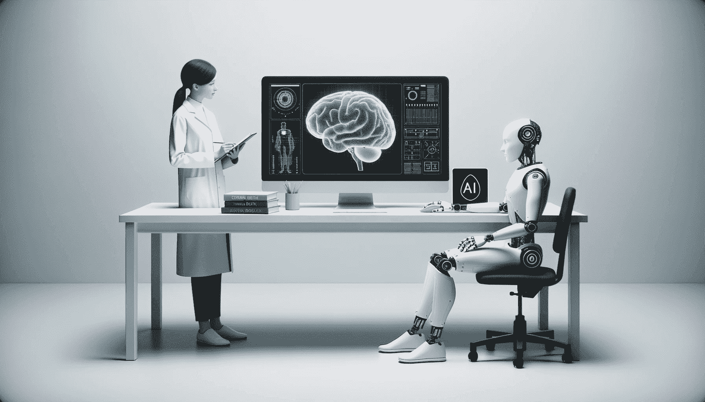

# 6 个人工智能神话破解：分辨事实与虚构

> 原文：[`www.kdnuggets.com/6-artificial-intelligence-myths-debunked-separating-fact-from-fiction`](https://www.kdnuggets.com/6-artificial-intelligence-myths-debunked-separating-fact-from-fiction)

图片由编辑提供

人工智能无疑是我们时代的流行词。它的受欢迎程度，尤其是生成式人工智能应用如 ChatGPT 的出现，使其成为技术讨论的焦点。

每个人都在谈论生成式人工智能应用如 ChatGPT 的影响，以及利用其能力是否公平。

然而，在这场完美风暴中，关于人工智能或 AI 的众多神话和误解突然涌现。

我敢打赌你可能已经听过这些了！

让我们深入探讨这些神话，揭开它们，并了解人工智能的真正本质。

# 1. 人工智能是智能的

与普遍的看法相反，人工智能根本不具备智能。现在大多数人确实认为人工智能模型具有智能。这可能是由于“人工智能”这个名称中包含了“智能”一词。

那么，智能意味着什么呢？

智能是生物体特有的特质，定义为获取和应用知识和技能的能力。这意味着智能使生物体能够与其环境互动，从而学习如何生存。

另一方面，人工智能是一种机器模拟，旨在模仿这种自然智能的某些方面。我们与之互动的大多数人工智能应用，尤其是在商业和在线平台上，依赖于机器学习。

由 Dall-E 生成的图像

这些是经过专门训练的人工智能系统，使用大量数据来处理特定任务。它们在指定的任务中表现出色，无论是玩游戏、翻译语言还是识别图像。

然而，超出其范围的任务，它们通常是相当无用的…… 拥有跨任务类人智能的人工智能概念被称为通用人工智能，而我们距离实现这一里程碑还很遥远。

# 2. 更大总是更好

科技巨头之间的竞争往往围绕着炫耀他们的人工智能模型的规模。

Llama 的 2 个开源大型语言模型（LLM）推出时，以强大的 700 亿特征版本让我们感到惊讶，而谷歌的 Palma 拥有 5400 亿特征，OpenAI 最新推出的 ChatGPT4 以 1.8 万亿特征大放异彩。

然而，LLM 的特征数量并不一定意味着更好的性能。

数据的质量和训练方法通常是模型性能和准确性的更关键因素。这已经通过[斯坦福的 Alpaca 实验](https://crfm.stanford.edu/2023/03/13/alpaca.html)得到证明，在这个实验中，一个简单的 70 亿特征的 Llama 基础 LLM 能与配备 1760 亿特征的 ChatGPT 3.5 相匹敌。

所以这是一个明确的“否”！

更大并不总是更好。优化 LLMs 的规模及其对应的性能将使这些模型的使用在本地得到普及，并使我们能够将其集成到日常设备中。

# 3. AI 的透明度和问责制

一个常见的误解是，AI 是一个神秘的黑箱，缺乏任何透明度。实际上，虽然 AI 系统可以很复杂且仍然相当不透明，但正在进行显著的努力以提高其透明度和问责制。

监管机构正在推动伦理和负责任的 AI 使用。重要的举措如[斯坦福 AI 透明度报告](https://www.reuters.com/technology/stanford-researchers-issue-ai-transparency-report-urge-tech-companies-reveal-2023-10-18/)和[欧洲 AI 法案](https://www.europarl.europa.eu/news/en/headlines/society/20230601STO93804/eu-ai-act-first-regulation-on-artificial-intelligence?&at_campaign=20226-Digital&at_medium=Google_Ads&at_platform=Search&at_creation=RSA&at_goal=TR_G&at_advertiser=Webcomm&at_audience=ai%20eu&at_topic=Artificial_intelligence_Act&at_location=ES&gclid=CjwKCAjwysipBhBXEiwApJOcu1LmQb4wn6mx4gvY-k5rCK9AVDIknxLTvi2jTRjrLUNBM8-ZUsVTgBoCtfoQAvD_BwE)旨在促使公司提升 AI 透明度，并为政府制定这一新兴领域的法规提供依据。

透明 AI 已成为 AI 社区的一个焦点讨论点，涵盖了各种问题，如允许个人确定 AI 模型经过彻底测试的过程以及理解 AI 决策背后的理由。

这就是为什么全球的数据专业人士已经在致力于使 AI 模型更透明的方法。

因此，虽然这可能部分正确，但并不像普遍认为的那么严重！

# 4. AI 的绝对正确性

许多人认为 AI 系统是完美无误的，这远非事实。像任何系统一样，AI 的表现取决于其训练数据的质量，而这些数据通常，甚至总是，由人类创建或策划的。

如果这些数据包含偏见，AI 系统将无意中 perpetuate（延续）这些偏见。

[麻省理工学院团队对广泛使用的预训练语言模型的分析揭示了在将性别与某些职业和情感相关联时的明显偏见](https://news.mit.edu/2023/large-language-models-are-biased-can-logic-help-save-them-0303)。例如，像空乘人员或秘书这样的角色主要与女性特质相关，而律师和法官则与男性特质相关。情感方面也观察到了类似的行为。

其他被检测到的偏见涉及种族问题。随着大型语言模型（LLMs）进入医疗系统，人们担心它们可能会[延续有害的种族医学实践](https://www.nature.com/articles/s41746-023-00939-z#:~:text=Large%20language%20models%20,to%20assess%20whether%20four)，反映出训练数据中固有的偏见。

人类干预对于监督和纠正这些缺陷至关重要，以确保人工智能的可靠性。关键在于使用具有代表性且无偏的数据，并进行算法审计以对抗这些偏见。

# 5\. 人工智能与就业市场

最广泛的恐惧之一是人工智能将导致大规模失业。

然而，历史表明，虽然技术可能使某些工作岗位变得过时，但同时也孕育了新的行业和机会。

图片来自 [LinkedIn](https://www.linkedin.com/posts/josep-ferrer-sanchez_aicommunity-artificialintelligence-productivityboost-activity-7067892146204286976-KAbV?utm_source=share&utm_medium=member_desktop)

例如，世界经济论坛预测，[虽然人工智能可能在 2025 年取代 8500 万个工作岗位，但将创造 9700 万个新岗位。](https://cepr.org/voxeu/columns/impact-artificial-intelligence-growth-and-employment#:~:text=The%20World%20Economic%20Forum%20concluded,information%20security%20and%20digital%20marketing.)

# 6\. 人工智能接管

最终且最具反乌托邦色彩的一个。流行文化中的电影，如《黑客帝国》和《终结者》，描绘了人工智能可能奴役人类的悲惨景象。

尽管像埃隆·马斯克和斯蒂芬·霍金这样的有影响力人物表达了担忧，但当前的人工智能状态远未达到这种反乌托邦的形象。

当今的人工智能模型，如 ChatGPT，旨在协助特定任务，不具备科幻故事中描绘的能力或动机。

所以现在……我们仍然安全！

# 主要结论

总之，随着人工智能不断发展并融入我们的日常生活，分辨事实与虚构至关重要。

只有在清楚理解的基础上，我们才能充分发挥其潜力，并负责任地解决其挑战。

神话可能会遮蔽判断并阻碍进步。

凭借对人工智能实际范围的知识和清晰理解，我们可以继续前进，确保技术服务于人类的最佳利益。

****[Josep Ferrer](https://www.linkedin.com/in/josep-ferrer-sanchez)**** 是来自巴塞罗那的分析工程师。他拥有物理工程学位，目前从事应用于人类流动的数据科学工作。他是一个兼职内容创作者，专注于数据科学和技术。Josep 涵盖了人工智能的所有方面，涉及这一领域的持续爆炸性发展。

### 了解更多相关话题

+   [从虚构到现实：ChatGPT 与科幻中的真正 AI 梦想](https://www.kdnuggets.com/from-fiction-to-reality-chatgpt-and-the-sci-fi-dream-of-true-ai-conversation)

+   [人工智能系统中的不确定性量化](https://www.kdnuggets.com/2022/04/uncertainty-quantification-artificial-intelligencebased-systems.html)

+   [人工智能如何变革数据整合](https://www.kdnuggets.com/2022/04/artificial-intelligence-transform-data-integration.html)

+   [2022 年最需要学习的人工智能技能](https://www.kdnuggets.com/2022/08/indemand-artificial-intelligence-skills-learn-2022.html)

+   [从人工智能到机器学习再到…的演变](https://www.kdnuggets.com/2022/08/evolution-artificial-intelligence-machine-learning-data-science.html)

+   [AI 指数报告概述：人工智能趋势的测量](https://www.kdnuggets.com/2023/04/overview-ai-index-report-measuring-trends-artificial-intelligence.html)
