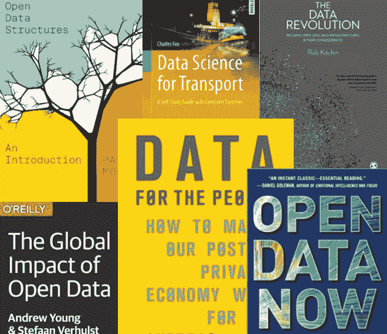

# 每位数据科学家都应阅读的 6 本开放数据书籍

> 原文：[`www.kdnuggets.com/2019/02/6-books-open-data-every-data-scientist-read.html`](https://www.kdnuggets.com/2019/02/6-books-open-data-every-data-scientist-read.html)

 评论

数据科学家预计在未来几年内将 [保持高需求](https://www.ibm.com/analytics/us/en/technology/data-science/quant-crunch.html)。无论你现在是否从事这个领域或希望尽快进入它，很明显，在这里茁壮成长需要不断学习。全球数据分析基础设施在扩大其覆盖面和实用性方面取得了显著进展——但这也进一步强调了开放性和问责制的必要性。

这些书籍中的一些涉及理解开放数据这一不断变化领域所需的硬技能，而另一些则探讨了数字连接世界的伦理影响。每一本书对各地的数据科学家来说都是有益且启发性的阅读。

* * *

## 我们的前三大课程推荐

 1\. [谷歌网络安全证书](https://www.kdnuggets.com/google-cybersecurity) - 快速进入网络安全职业轨道。

 2\. [谷歌数据分析专业证书](https://www.kdnuggets.com/google-data-analytics) - 提升你的数据分析技能

 3\. [谷歌 IT 支持专业证书](https://www.kdnuggets.com/google-itsupport) - 支持你所在组织的 IT 工作

* * *

### **1\. "开放数据结构：入门" — Pat Morin**

Pat Morin 的 [*开放数据结构：入门*](https://www.amazon.com/Open-Data-Structures-Introduction-Enriched/dp/1927356385)，由 CreateSpace 独立出版，是初学者开始探索开放数据的绝佳选择。该书探讨了如何在各种上下文中分析数据结构，包括序列、优先级队列、图、栈以及有序和无序字典。

如果这些听起来像希腊语，对你来说没关系。这毕竟是一个介绍——而且书中确保包含了每个主要组件的 Java 源代码。读者应会发现这是一种易于接触、实用且数学重点突出的方式，让你逐步了解这个复杂但引人入胜的话题。它旨在面向所有自学者以及本科生。

### **2\. "开放数据的全球影响" — Stefaan Verhulst 和 Andrew Young**

全球化是一个充满争议和复杂的概念，但没有人质疑我们数据变得多么流动和全球化。对于任何想要了解全球化与开放数据分析交汇点的现代观点的人来说，向思想领袖寻求帮助是明智的。来自纽约大学 GovLab 的作者 Verhulst 和 Young 编写了[一本 O’Reilly 指南](https://www.oreilly.com/library/view/the-global-impact/9781492042785/)，这本书将吸引数据科学家、政策制定者、小企业主和隐私活动家。

这本书中的案例研究对于数据科学界尤其具有吸引力。一个数据开放、可共享并真正有用的未来，是技术专家与公共和私人实体携手合作以解决共同挑战、制定新标准和 API，并利用数据科学更好地理解天气和气候，甚至规划和预测公共健康危机的未来。

### **3. 《为人民的数据：如何让我们的后隐私经济为你服务》——Andreas Weigend**

Andreas Weigend 的*《为人民的数据》*，[现已在 Hachette Book Group 购得](https://www.hachettebookgroup.com/titles/andreas-weigend/data-for-the-people/9780465096534/?lens=basic-books)，是注重隐私的数据科学家必读的书籍。曾经，公民对其数字生活如何被监控、挖掘以获取盈利洞察甚至卖给不明第三方一无所知的时代已经过去。我们依赖的各种连接设备不仅仅是我们上网浏览习惯的延续——这些设备实际上构成了一个全球监控网络。人们是否将这个网络用于促进社会目标，取决于负责建设它的人的意图。

这就意味着数据科学家。Weigend 本人曾为企业、金融和医疗机构甚至教育界提供咨询。他认为大数据和数据科学是积极变革的工具，但我们尚未建立一个共同的框架来调和大企业的需求与在线隐私权利。这本书提出了“让数据为我们服务”的方法。而“我们”意味着“所有人”。

### **4. 《数据革命：大数据、开放数据、数据基础设施及其后果》——Rob Kitchin**

这本书探讨了全球数据环境如何迅速变化和自我重塑，却始终没有忽视大数据与开放数据之间的区别。Rob Kitchin 的[*《数据革命》*](https://www.amazon.com/Data-Revolution-Infrastructures-Their-Consequences/dp/1446287483)尽管标题如此，却揭示了围绕数据基础设施和分析的许多炒作和夸张——并通过回顾众多组成部分如何汇聚在一起，支持了关于现代数据环境的论点。

此处探讨的“革命”涉及企业、监管机构、地方和国家政府、游说者、记者等各方的数据多样性、广度和可获取性。该书提供了对现代开放数据趋势的“后果主义”解读，使其成为那些想了解在前所未有的数据传输和分析规模下的公民、伦理和政治影响的科学家的重要资源。

### **5\. "开放数据现在：热 startups、智能投资、精明营销和快速创新的秘密" — 乔尔·古林**

作者乔尔·古林将多年多样的经验运用于[*开放数据现在*](https://www.amazon.com/Open-Data-Now-Investing-Innovation/dp/0071829776)一书中。古林曾与非营利组织、记者、政府机构合作，并担任《消费者报告》的执行副总裁，他将开放数据视为帮助各种组织启动新项目和产品、理解数据如何促进创新以及更好地与受众建立联系的工具。

数据科学家不仅需要多种具体技能，还需要了解这些技能如何应用于数据驱动的决策，如投资、创业、研发、社区组织、与公众接触等。这本书非常适合决策者和数据科学家，因为它考虑了“大局”，并提供了在合作、伦理和有意义的方式中进行数据分析的可靠策略。

### **6\. "运输数据科学：带有计算机练习的自学指南" — 查尔斯·福克斯**

难以夸大大数据在未来智能城市和汽车技术中将发挥的重要作用。远程办公的兴起、用电动发动机替代燃烧发动机的紧迫性以及将自动驾驶引入商用和个人车辆的挑战意味着未来的城市规划将与今天大相径庭。

[*运输数据科学*](https://www.springer.com/gp/book/9783319729527)，由 Springer International 出版，展望了未来并强调了数据科学家在实现这一目标中的重要作用。此书深入探讨了研究人员和交通技术专家如何利用数据库和数学模型更好地理解全球交通问题，并提出切实可行、可扩展且包容的解决方案。

我们希望你喜欢这六本对当前和未来数据科学家至关重要的书籍的介绍。如果我们遗漏了你最喜欢的书籍，请在下方评论并告知我们！

**简介: [凯拉·马修斯](http://productivitybytes.com/subscribe-to-productivity-bytes/)** 在《The Week》、《数据中心期刊》和《VentureBeat》等出版物上讨论技术和大数据，并且从事写作已有五年以上。要阅读更多凯拉的文章，[**订阅她的博客 Productivity Bytes**](http://productivitybytes.com/subscribe-to-productivity-bytes/)。

原创。经许可转载。

**相关:**

+   每个数据科学新手在 2019 年应该设定的 6 个目标

+   数据科学如何改善高等教育

+   在 2 年内提升你的数据科学技能的 8 种方法

### 更多相关话题

+   [KDnuggets 新闻，5 月 25 日：每个数据科学爱好者都应该了解的 6 种 Python 机器学习工具…](https://www.kdnuggets.com/2022/n21.html)

+   [2023 年你必须阅读的 5 本免费数据科学书籍](https://www.kdnuggets.com/2023/01/5-free-data-science-books-must-read-2023.html)

+   [你需要在 2022 年阅读的机器学习书籍](https://www.kdnuggets.com/2022/04/machine-learning-books-need-read-2022.html)

+   [KDnuggets 新闻，4 月 27 日：关于带代码论文的简要介绍；…](https://www.kdnuggets.com/2022/n17.html)

+   [2023 年 5 本免费的自然语言处理书籍]https://www.kdnuggets.com/2023/06/5-free-books-natural-language-processing-read-2023.html)

+   [你应该阅读的生成代理研究论文](https://www.kdnuggets.com/generative-agent-research-papers-you-should-read)
