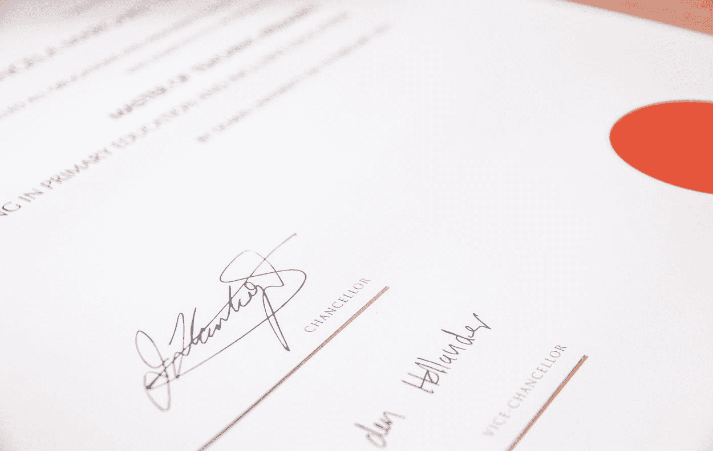

# 6 个数据科学证书，让你的职业生涯更进一步

> 原文：[`www.kdnuggets.com/2021/02/6-data-science-certificates.html`](https://www.kdnuggets.com/2021/02/6-data-science-certificates.html)

评论

*由 [Lewis Keegan](https://unsplash.com/@skillscouter?utm_source=medium&utm_medium=referral) 在 [Unsplash](https://unsplash.com/?utm_source=medium&utm_medium=referral) 提供的照片。*

* * *

## 我们的前三推荐课程

 1\. [谷歌网络安全证书](https://www.kdnuggets.com/google-cybersecurity) - 快速进入网络安全职业的快车道。

 2\. [谷歌数据分析专业证书](https://www.kdnuggets.com/google-data-analytics) - 提升你的数据分析技能

 3\. [谷歌 IT 支持专业证书](https://www.kdnuggets.com/google-itsupport) - 支持你的组织 IT 需求

* * *

由于数据科学领域的吸引力以及高收入的前景，越来越多的人决定加入这个领域。有些人可能来自技术背景，而另一些人则因好奇而加入；无论你决定加入该领域的原因是什么，你的首要目标可能是拥有一个强大而扎实的作品集，以帮助你获得理想的工作。

> 那么，*如何提升你的作品集的吸引力？*

尽管进入数据科学领域并不一定需要任何学位或证书，但有时拥有一些证书可以帮助你在申请工作时脱颖而出。

优秀的数据科学作品集的关键在于收集展示你技能、证明你知识并展示你构建稳固数据科学项目能力的项目。这是一个优秀作品集的核心，但你也可以添加一些证书来证明你投入了时间、精力和金钱来提升技能，成为更合格的数据科学家。

幸运的是，并非所有证书都要求你去考试中心。事实上，大多数受欢迎的数据科学证书可以在舒适的家中获得。

本文向你展示了 6 个极具吸引力的证书，这些证书能提高你获得实习或理想工作的机会。

### Microsoft 认证：Azure 数据科学家助理

微软是技术和软件领域的领先企业之一；他们提供一个[证书](https://docs.microsoft.com/en-us/learn/certifications/azure-data-scientist)，旨在评估你进行实验、训练机器学习模型、优化模型性能并使用 Azure 机器学习工作区进行部署的能力。

要获得该证书，你需要通过一场考试，你可以通过两种方式之一为这场考试做准备。微软提供免费的在线材料供你自学以备考。如果你更喜欢有老师指导，他们还提供了一个收费选项，可以让 Azure 机器学习讲师对你进行辅导。

这次考试的费用大约为$165。费用因你所在的国家/地区而异。

### IBM 数据科学专业证书

该证书由 IBM 颁发，并在一个系列课程结束时提供，该课程系列将带你从一个完全的数据科学初学者成长为一个在线的、按自己节奏的专业数据科学家。

IBM 数据科学专业证书在[Coursera](https://www.coursera.org/professional-certificates/ibm-data-science?aid=true#about)和[edX](https://www.edx.org/professional-certificate/ibm-data-science)上均可获得。在任何一个平台上，你都需要完成一系列涵盖数据科学核心知识的课程，以获得证书和 IBM 徽章。

要获得 Coursera 的证书，你需要每月支付$39 的费用，因此你完成系列课程的时间越早，你需要支付的费用就越少。另一方面，edX 要求支付$793 的费用以获得完整的课程体验，无论你需要多久才能完成它。

### Google 专业数据工程师认证

[Google 的专业数据工程师认证](https://cloud.google.com/certification/data-engineer)旨在考核你作为数据工程师所需的技能。数据工程师可以做出数据驱动的决策，构建可靠的模型，并对其进行训练、测试和优化。

你可以通过直接在 Google 证书的官方网站申请来获得该证书，或者你可以参加[Coursera](https://www.coursera.org/professional-certificates/gcp-data-engineering)上的课程系列和证书。这些课程将教授你有关机器学习和 AI 基础知识的所有内容，以及如何构建高效的数据管道和分析。

要访问 Coursera 上的课程系列，你需要拥有 Coursera Plus 或支付每月$49 的费用，直到你完成系列课程并获得证书。

### Cloudera 认证专业数据工程师（CCP Data Engineer）

Cloudera 针对开源开发者，提供[CCP 数据工程师](https://www.cloudera.com/about/training/certification/ccp-data-engineer.html)证书，让开发者测试他们在 Cloudera CDH 环境中高效收集、处理和分析数据的能力。

要通过这次考试，你将被提供 5-10 个数据科学问题，每个问题都有自己的大数据集和 CDH 集群。你的任务是为这些问题找到高精度的解决方案并正确实施。

要参加这次考试，你需要在考试中至少得分 70%。考试时间为 4 小时，费用为$400。你可以在任何地方在线参加这次考试。

### SAS 认证 AI 与机器学习专业人员

与我们讨论过的证书不同，[SAS AI & 机器学习专业证书](https://www.sas.com/en_id/certification/credentials/advanced-analytics/ai-machine-learning-pro.html)是通过通过三场测试三个不同技能集的考试来获得的。你需要通过的三场考试包括：

1.  机器学习考试将测试你构建、训练、测试性能和优化监督式机器学习模型的技能。

1.  预测和优化测试。在此测试中，将测试你处理、可视化数据、构建数据管道和解决优化问题的能力。

1.  自然语言处理和计算机视觉测试。

SAS 提供免费的 30 天[备考资料](https://www.sas.com/en_id/training/academy-data-science/ai-machine-learning-certification.html)，帮助你准备并通过这三场考试。

### TensorFlow 开发者证书

TensorFlow 是广泛使用的机器学习、人工智能和深度学习应用程序包之一。[TensorFlow 开发者证书](https://www.tensorflow.org/certificate)授予开发者，以展示他们使用 TensorFlow 开发机器学习和深度学习解决方案的能力。

你可以通过完成[DeepLearning.AI TensorFlow 开发者专业证书](https://www.coursera.org/professional-certificates/tensorflow-in-practice)的 Coursera 课程系列来为这个证书做好准备。一旦获得此证书，你的名字和照片将被添加到[Google Developers](https://developers.google.com/certification/directory/tensorflow)网页上。

TensorFlow 开发者证书有效期为 3 年。之后，你需要重新参加考试，以保持你的技能水平与 TensorFlow 包的最新更新同步。

### 收获

如果你问任何数据科学家他们是否需要学位或证书来获得他们的工作，大多数人会告诉你，他们是从非技术背景进入数据科学的，只有一个好奇的心态，想要更多地学习。

尽管你可以通过自学数据科学的核心概念和构建实际项目或可以轻松应用于实际数据的项目来成为数据科学家并获得好工作，但有时拥有一个证书可以帮助你的简历脱颖而出，吸引招聘人员的注意。

由于数据科学是目前流行的领域之一，你会发现网上有大量关于如何成为“优秀数据科学家”或“如何获得梦想的数据科学职位”的教程和指南，更不用说可以获得的证书和免费课程。我曾经也被数据科学领域的信息淹没，但我总是欣赏那些简单、直接的文章，它们直接切入要点，不拖延话题。

[原文](https://towardsdatascience.com/6-data-science-certificates-to-level-up-your-career-275daed7e5df)。经许可转载。

**相关：**

+   [数据科学认证——为什么它很重要以及在哪里获得？](https://www.kdnuggets.com/2020/11/greatlearning-data-science-certification.html)

+   [10 个数据科学自学资源](https://www.kdnuggets.com/2021/02/10-resources-data-science-self-study.html)

+   [7 个最推荐学习的数据科学技能](https://www.kdnuggets.com/2021/02/7-most-recommended-skills-data-scientist.html)

### 更多相关主题

+   [用这 3 个热门证书来提升你的技术职业生涯](https://www.kdnuggets.com/advance-your-tech-career-with-these-3-popular-certificates)

+   [将你的数据科学职业生涯提升到下一个水平](https://www.kdnuggets.com/2021/12/sas-advance-data-science-career-next-level.html)

+   [9 个专业证书可以带你获得学位……如果……](https://www.kdnuggets.com/9-professional-certificates-that-can-take-you-onto-a-degree-if-you-really-want-to)

+   [提升你的机器学习技能的 15 个 YouTube 频道](https://www.kdnuggets.com/2023/03/top-15-youtube-channels-level-machine-learning-skills.html)

+   [谷歌提供的 5 个 MLOps 课程来提升你的 ML 工作流](https://www.kdnuggets.com/5-mlops-courses-from-google-to-level-up-your-ml-workflow)

+   [提升技能的 5 个免费机器学习课程](https://www.kdnuggets.com/top-5-free-machine-learning-courses-to-level-up-your-skills)
