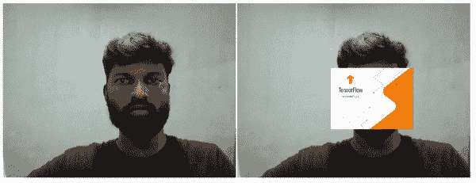
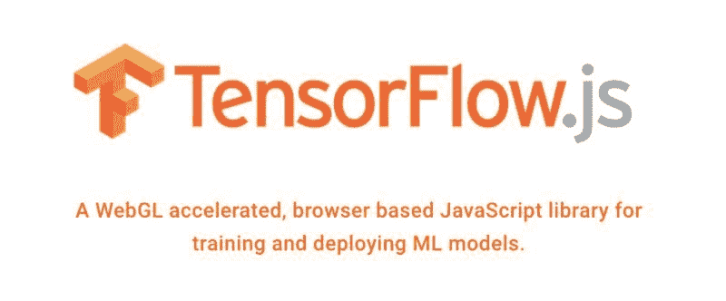

# 使用 Tensorflow.js 实现计算机视觉应用的 6 个简单步骤

> 原文：[`www.kdnuggets.com/2020/06/6-easy-steps-implement-computer-vision-application-tensorflow-js.html`](https://www.kdnuggets.com/2020/06/6-easy-steps-implement-computer-vision-application-tensorflow-js.html)

评论

**由 [Bala Venkatesh](https://www.linkedin.com/in/bala-venkatesh-67964247/)，数据科学家**


[图片来源](https://i.imgur.com/V6uxcpY.jpg)

* * *

## 我们的三大课程推荐

 1\. [谷歌网络安全证书](https://www.kdnuggets.com/google-cybersecurity) - 快速进入网络安全职业生涯。

 2\. [谷歌数据分析专业证书](https://www.kdnuggets.com/google-data-analytics) - 提升你的数据分析能力

 3\. [谷歌 IT 支持专业证书](https://www.kdnuggets.com/google-itsupport) - 支持组织中的 IT 工作

* * *

### 介绍

现在，很多人正在实现计算机视觉应用。你认为学习和实现它很困难吗？我的回答是否定的，因为现在有很多库可以实现如此强大的计算机视觉应用。最近你是否观看了 TensorFlow 峰会 2020？今年 TensorFlow 团队为我们宣布了许多酷炫的东西。现在我们将看到如何使用 Tensorflow.js 模型实现计算机视觉应用！！

### TensorFlow.js 是什么？

> TensorFlow.js 是一个用于机器学习应用的开源库，支持在 JavaScript 中开发 ML 模型，并直接在浏览器或 Node.js 中使用 ML。

### Tensorflow.js 模型是什么？

> Tensorflow.js 模型是预训练模型，这意味着你无需准备/收集数据来训练模型。这些模型托管在 NPM 和 unpkg 上，因此可以立即在任何项目中使用。

在这篇博客中，我们将介绍 Tensorflow.js 中的一个模型，即 [MediaPipe Facemesh](https://github.com/tensorflow/tfjs-models/tree/master/facemesh) 模型。该模型专为移动设备上的前置摄像头设计，适用于面部在视野中占据相对较大画布比例的情况。

### Facemesh 模型演示

我使用了 [facemesh](https://storage.googleapis.com/tfjs-models/demos/facemesh/index.html) 模型来根据我的面部运动移动视频帧。请看下面的演示。我将告诉你实现下面的计算机视觉应用涉及的步骤。



演示

### 演示

**步骤 1：-** 这些是实现计算机视觉应用的三个重要独立脚本标签代码。

```py
<script src="https://cdn.jsdelivr.net/npm/@tensorflow/tfjs-core"></script>
<script src="https://cdn.jsdelivr.net/npm/@tensorflow/tfjs-converter"></script>
<script src="https://cdn.jsdelivr.net/npm/@tensorflow-models/facemesh"></script>
```

> [TensorFlow.js 核心](https://github.com/tensorflow/tfjs/blob/master/tfjs-core)，用于神经网络和数值计算的灵活低级 API。
> 
> [TensorFlow.js 转换器](https://github.com/tensorflow/tfjs/blob/master/tfjs-converter)，将 TensorFlow SavedModel 导入 TensorFlow.js 的工具。
> 
> facemesh 包在图像中找到面部边界和标志点。

**步骤 2:-** 在正文内容中包含视频 HTML 标签，以通过网络摄像头读取面部。

```py
<video width=640 height=480 autoplay muted id=”camera”></video>
```

**步骤 3:-** 使用 canvas 标签通过脚本（通常是 JavaScript）动态绘制图形。

```py
<canvas width=640 height=480 id=”augmented_canvas”></canvas>
```

**步骤 4:-** 包含一个视频标签，在 canvas 标签上播放视频帧，根据面部运动移动视频帧。

```py
<video autoplay loop id=”movie” style=”visibility: hidden”>
<source src=”TensorFlowjs.mp4" type=”video/mp4"></source>
</video>
```

**步骤 5:-** 加载面部模型并估算面部，以找到图像中的面部边界和标志点。

```py
//load camera stream
const frame = document.getElementById("camera");//load movie stream
const movie = document.getElementById("movie");
movie.play();//prepare canvas
const canvas = document.getElementById("augmented_canvas");
const draw = canvas.getContext("2d");const result = await model.estimateFaces(frame, false);
```

**步骤 6:-** 使用以下代码在检测到的面部上绘制视频帧。

```py
//copy camera stream to canvas
draw.drawImage(frame, 0, 0, 640, 480);//check if face is detected
 if(result.length > 0)
 {
  for (let i = 0; i < result.length; i++) {
    const start = result[i].topLeft;
    const end = result[i].bottomRight;
    const size = [end[0] — start[0], end[1] — start[1]];   //Render a rectangle over each detected face.
   draw.drawImage(movie, start[0], start[1], size[0], size[1]);
  }

}
```

### 结论

就这样，我们按照上述六个步骤实现了一个计算机视觉应用。你可以在[这里](https://github.com/balavenkatesh3322/tensorflowjs-demo)获取完整的源代码。

大家都说如果你想成为数据科学家，你应该熟悉 Python 或 R 编程语言，但现在我们可以使用 JavaScript 实现一个机器学习应用。



来源: [`miro.medium.com/max/1400/1*F-1fq9TNjDnAYPAXnZP4Ww.png`](https://miro.medium.com/max/1400/1*F-1fq9TNjDnAYPAXnZP4Ww.png)

> 祝大家学习愉快！如果你需要任何帮助或支持，请通过 [LinkedIn](https://www.linkedin.com/in/bala-venkatesh-67964247/) 和 [Twitter](https://twitter.com/balavenkatesh22) 与我联系。

**个人简介: [Bala Venkatesh](https://www.linkedin.com/in/bala-venkatesh-67964247/)** 是一名数据科学家。他热衷于从根本上理解技术，并分享想法和代码。

[原文](https://towardsdatascience.com/three-lines-code-to-implement-computer-vision-application-using-tensorflow-js-5a3a5e91f74a). 经许可转载。

**相关:**

+   利用 AI 对抗冠状病毒：通过深度学习和计算机视觉改进检测

+   利用机器学习和计算机视觉进行作物疾病检测

+   构建一个使用 TensorFlow 和 Streamlit 生成逼真面孔的应用

### 更多相关话题

+   [计算机视觉中的 TensorFlow - 轻松实现迁移学习](https://www.kdnuggets.com/2022/01/tensorflow-computer-vision-transfer-learning-made-easy.html)

+   [用 Python 在 10 个简单步骤中构建一个 AI 应用](https://www.kdnuggets.com/build-an-ai-application-with-python-in-10-easy-steps)

+   [探索计算机视觉的世界：介绍 MLM 最新的……](https://www.kdnuggets.com/2024/01/mlm-discover-the-world-of-computer-vision-ebook)

+   [计算机视觉的 5 种应用](https://www.kdnuggets.com/2022/03/5-applications-computer-vision.html)

+   [关于数据管理及其重要性的 6 件事](https://www.kdnuggets.com/2022/05/6-things-need-know-data-management-matters-computer-vision.html)

+   [KDnuggets 新闻 2022 年 3 月 9 日：在 5 步内构建一个机器学习网络应用](https://www.kdnuggets.com/2022/n10.html)
