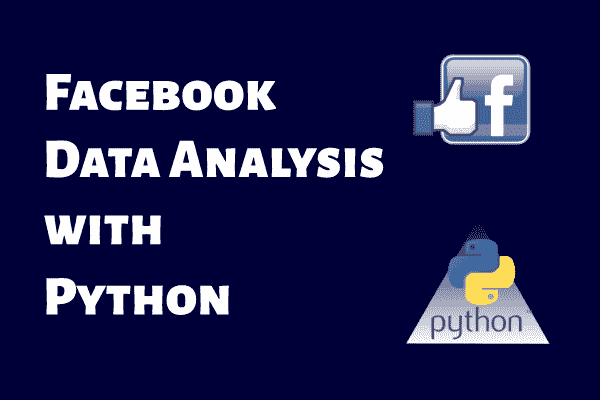

# 用 Python 在 Facebook 数据上可以做的 6 件有趣的事

> 原文：[`www.kdnuggets.com/2017/06/6-interesting-things-facebook-python.html`](https://www.kdnuggets.com/2017/06/6-interesting-things-facebook-python.html)

**作者：Nour Galaby，数据爱好者。**

在这篇文章中，我将分享如何使用 Facebook Graph API 结合 Python 和 pandas 进行分析的经验。

Facebook 拥有大量可供探索的数据，你可以利用这些数据做很多事情，比如：分析 Facebook 页面或群组，利用这些数据进行社交网络分析 (SNA)，进行数字营销的数据分析，甚至为自己的个人项目收集和保存数据。你可以用这些数据做很多事情；一切取决于你。

在这些视频中，我将展示如何进行一些基础操作，例如：

+   从 Facebook 下载数据

+   从 json 转换到更方便的数据结构，以便我们能够处理

+   处理日期变量和 Graph API 中的其他数据

[**课程-01：介绍与理解 Graph API - Facebook 数据分析与 Python**](https://youtu.be/LmhjVT9gIwk)

在这段视频中，我将介绍 GRAPH API，我将使用 GRAPH API Explorer 并展示一些示例请求。

[**课程-02：下载与保存 Facebook 数据 - Facebook 数据分析与 Python**](https://youtu.be/0RcgBgBOiMI)

在这段视频中，我将展示如何下载并保存 Facebook 页面或 Facebook 群组中的所有数据，同时注意一些要点

[**课程-03：设置与清理数据 - Facebook 数据分析与 Python**](https://youtu.be/3KgkGpwEaN4)

在第三节课中，我将使用笔记本来清理和审计我从 Facebook 获得的数据，并使其准备好进行分析

[**课程-04：评论最多的帖子 - Facebook 数据分析与 Python**](https://youtu.be/QVPxMbIOG60)

在第 4 课中，我将向你展示一种简单的方法来获取最受评论的帖子

[**课程-05：点赞最多的帖子及额外内容 - Facebook 数据分析与 Python**](https://youtu.be/5E3j35jJ33s)

在第 05 课中发生了一些有趣的事情，因为我发现了一些被删除的帖子，并通过 API 获得了一些信息

[**课程-06：统计词频 - Facebook 数据分析与 Python**](https://youtu.be/qcc64-XAMqE)

在这段视频中，我将展示如何计算一个组或页面中所有帖子的词频。

你也可以对评论使用相同的函数

[**课程-07：按关键词分组帖子 - Facebook 数据分析与 Python**](https://youtu.be/9zQU2Z9saWU)

在这段视频中，我将分组包含“免费”关键词的帖子，并统计这些帖子中包含该关键词的数量与不包含的数量。

分组是非常有用的，我们将在未来的视频中使用更多变量来进行分组

[**课程-08：按日期分组 - Facebook 数据分析与 Python**](https://youtu.be/qgTDJLRX5nM)

在这个视频中，我们将深入探讨“创建时间”变量，以按年、月或星期几对帖子进行分组。

这可以用来发现发布模式等。

有问题或建议吗？随时与我联系。

**简介： [Nour Galaby](https://www.linkedin.com/in/nourgalaby/)** 是一位对数据科学和机器学习充满热情的数据科学爱好者。

**相关：**

+   初学者 Pandas 推文分析指南

+   数据科学的红利——财务数据分析的温和介绍

+   你可以用 Python 在 Facebook 数据上做的 6 件有趣的事情

* * *

## 我们的前三大课程推荐

 1\. [谷歌网络安全证书](https://www.kdnuggets.com/google-cybersecurity) - 快速进入网络安全职业生涯。

 2\. [谷歌数据分析专业证书](https://www.kdnuggets.com/google-data-analytics) - 提升你的数据分析技能

 3\. [谷歌 IT 支持专业证书](https://www.kdnuggets.com/google-itsupport) - 支持你的组织 IT

* * *

### 了解更多相关内容

+   [使用管道编写干净的 Python 代码](https://www.kdnuggets.com/2021/12/write-clean-python-code-pipes.html)

+   [建立一个可靠的数据团队](https://www.kdnuggets.com/2021/12/build-solid-data-team.html)

+   [每个数据科学家都应该知道的三个 R 库（即使你使用 Python）](https://www.kdnuggets.com/2021/12/three-r-libraries-every-data-scientist-know-even-python.html)

+   [是什么使 Python 成为初创公司的理想编程语言](https://www.kdnuggets.com/2021/12/makes-python-ideal-programming-language-startups.html)

+   [停止学习数据科学以寻找目标，寻找目标以…](https://www.kdnuggets.com/2021/12/stop-learning-data-science-find-purpose.html)

+   [成为优秀数据科学家所需的 5 个关键技能](https://www.kdnuggets.com/2021/12/5-key-skills-needed-become-great-data-scientist.html)
