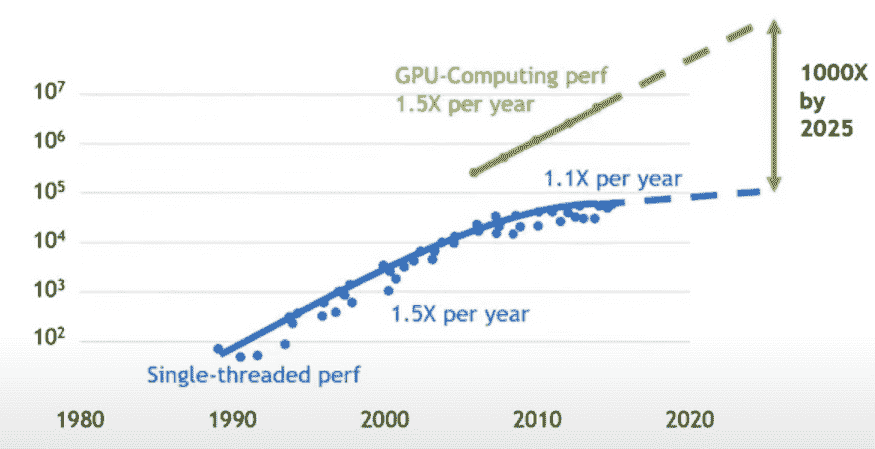
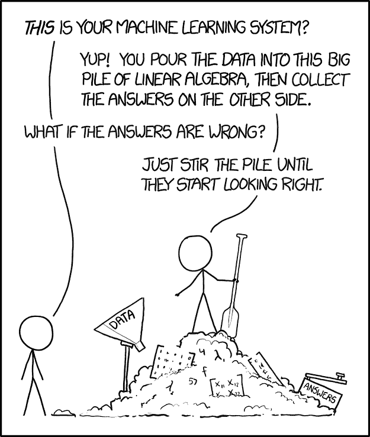

# 在数据科学领域的 6 个月中学到的 6 个教训

> 原文：[`www.kdnuggets.com/2020/10/6-lessons-6-months-data-scientist.html`](https://www.kdnuggets.com/2020/10/6-lessons-6-months-data-scientist.html)

评论

*照片由 [Artem Beliaikin](https://unsplash.com/photos/8AsKha7aIvk) 提供，来源于 Unsplash。*

* * *

## 我们的前三大课程推荐

 1\. [Google 网络安全证书](https://www.kdnuggets.com/google-cybersecurity) - 快速进入网络安全职业的快车道。

 2\. [Google 数据分析专业证书](https://www.kdnuggets.com/google-data-analytics) - 提升你的数据分析技能

 3\. [Google IT 支持专业证书](https://www.kdnuggets.com/google-itsupport) - 支持你所在组织的 IT

* * *

自从我六个月前从顾问转变为数据科学家以来，我的工作满意度比我想象的要高。为了庆祝我在这个引人入胜的领域的第一个半年，这里是我在过程中收集到的六个教训。

### #1 — 阅读 arXiv 论文

你可能知道，查看 arXiv 是个好主意。那里充满了卓越的想法和最前沿的进展。

不过，我对这个平台上所获得的可操作性建议感到非常惊喜。例如，我可能没有访问到[16 个 TPU 和$7k 来从头训练 BERT](https://syncedreview.com/2019/06/27/the-staggering-cost-of-training-sota-ai-models/)，但谷歌大脑团队推荐的超参数设置是一个很好的开始微调的起点（[见附录 A.3](https://arxiv.org/abs/1810.04805)）。

希望你喜欢的新包会在 arXiv 上有一篇启发性的读物，为其文档增添色彩。例如，我通过阅读[关于 ktrain 的极易读且非常有用的文档](https://arxiv.org/abs/2004.10703)学会了如何部署 BERT，该库基于 Keras，提供了一个简化的机器学习接口，适用于文本、图像和图形应用。

### #2 — 收听播客以获得极佳的情境意识

播客虽然不能提高你的编码技能，但能提升你对机器学习领域的最新进展、流行包和工具、未解答的问题、新的解决旧问题的方法、以及职业中普遍存在的心理不安等方面的理解。

我日常收听的播客帮助我保持了对数据科学快速发展的参与感和更新感。

目前我最喜欢的播客是：[2020 年提升数据科学学习的资源](https://towardsdatascience.com/supercharge-data-science-5bb7376d8572)

最近，我特别兴奋地了解到[自然语言处理的进展](https://dataskeptic.com/blog/journalclub/2020/dark-secrets-of-bert-radioactive-data-and-vanishing-gradients)，关注[最新的 GPU 发展](https://soundcloud.com/theaipodcast/ai-jonah-alben)和[云计算](https://www.thecloudcast.net/2020/07/2020-in-review-midyear-edition.html)，并质疑[人工神经网络与神经生物学之间的潜在共生关系](https://braininspired.co/podcast/79/)。

### #3 — 阅读 GitHub 问题

根据我在这片抱怨的海洋中搜寻智慧巨鱼的经验，以下是三个潜在的收获：

1.  我经常从别人使用和/或误用包的方式中得到灵感。

1.  了解包在什么情况下容易崩溃也是有用的，这样可以培养你对自己工作中潜在失败点的感知。

1.  在你设置环境并进行[模型选择](https://medium.com/atlas-research/model-selection-d190fb8bbdda)的预工作阶段，你最好考虑开发者和社区的响应性，然后再将开源工具添加到你的管道中。

### #4 — 理解算法与硬件的关系

我在过去六个月里做了很多自然语言处理，所以让我们再谈谈 BERT。

在 2018 年 10 月，[BERT](https://arxiv.org/abs/1810.04805)问世并震撼了世界。就像超人在一次跃过高楼后那样（*很疯狂地想象超人最初被引入时不能飞！*）

BERT 代表了机器学习在处理文本任务能力上的一步飞跃。其最先进的结果基于其[变换器架构](http://jalammar.github.io/illustrated-transformer/)在[Google 的 TPU 计算芯片](https://www.youtube.com/watch?v=MXxN4fv01c8)上运行的并行性。

*第一次在 GPU 上训练的感觉。通过[GIPHY](https://giphy.com/gifs/superman-vintage-cartoon-10bKPDUM5H7m7u/links)。*

理解 TPU 和[基于 GPU 的机器学习](https://www.youtube.com/watch?v=6eBpjEdgSm0)的含义对提升你作为数据科学家的能力很重要。这也是提高你对[machine learning 软件](https://medium.com/@karpathy/software-2-0-a64152b37c35)与其运行的硬件物理限制之间不可分割的关系的直觉的关键一步。

随着摩尔定律在 2010 年左右逐渐失效，需要越来越有创意的方法来克服数据科学领域的局限，继续向真正智能系统的目标迈进。

*来自[Nvidia 演示](https://youtu.be/EBCtwWbbamw)的图表，显示了每平方毫米的晶体管数量按年变化。这突显了 2010 年左右晶体管数量的停滞和基于 GPU 的计算的兴起。*

我对[ML 模型-计算硬件共同设计](https://twimlai.com/twiml-talk-391-the-case-for-hardware-ml-model-co-designwith-diana-marculescu/)的兴起持乐观态度，对[sparsity and pruning](https://arxiv.org/abs/2002.00585)的依赖增加，甚至是[“无专用硬件”机器学习](https://www.youtube.com/watch?v=zmbCZhlN1xk)也充满期待，这些都可能打破当前以 GPU 为中心的主导地位。

### #5 — 从社会科学中学习

我们的年轻领域可以从 2010 年代中期社会科学中的可重复性危机中学到很多（在某种程度上，这一危机仍在继续）：

*“p-value hacking” 对于数据科学家。 [Randall Monroe 的 xkcd 漫画](https://xkcd.com/1838/)。*

2011 年，一项[学术众包合作](https://osf.io/ezcuj/wiki/home/)旨在复制 100 个已发表的实验和相关的心理学研究。结果失败了——只有 36%的重复实验报告了统计显著的结果，而原始实验的统计显著性为 97%。

心理学的可重复性危机揭示了将“科学”与不稳定的方法论结合的危险和责任。

数据科学需要可测试、可重复的方法来解决问题。为了消除 p-hacking，数据科学家需要设定对数据中预测特征的调查限制，以及评估指标时测试的数量限制。

有许多工具可以帮助进行实验管理。我有使用[ML Flow](https://mlflow.org/)的经验，[这篇优秀的文章](https://towardsdatascience.com/the-most-useful-ml-tools-2020-e41b54061c58)由[Ian Xiao](https://medium.com/u/a0eb4622a0ca?source=post_page-----e875e69aab0a--------------------------------)撰写，还提到了其他六种工具，以及关于机器学习工作流其他四个领域的建议。

我们还可以从数据科学领域近年来的许多失误和算法不当行为中汲取经验教训。

例如，有关方面无需再找其他地方，就可以看到社会工程推荐引擎、歧视性的信用算法和加深现状的刑事司法系统。[我写过一些关于这些社会弊病以及如何通过有效的人本设计来避免它们的文章](https://medium.com/atlas-research/model-selection-d190fb8bbdda)。

好消息是，有许多聪明且积极的从业者正在努力解决这些挑战，并防止未来公众信任的破裂。查看 [Google’s PAIR](https://ai.google/responsibilities/responsible-ai-practices/)、 [Columbia’s FairTest](https://github.com/columbia/fairtest) 和 [IBM’s Explainability 360](https://www.ibm.com/blogs/research/2019/08/ai-explainability-360/)。与社会科学研究人员的合作可以取得丰硕的成果，例如这个关于 [算法审计歧视](https://www.pnas.org/content/early/2020/07/27/1912790117)的项目。

当然，我们还可以从社会科学中学到许多其他东西，例如如何做一个有效的演讲。

学习社会科学对于理解人类对数据推断的直觉何时可能出错至关重要。人类在某些情况下非常擅长从数据中得出结论。我们推理的破坏方式是高度系统化和可预测的。

我们对这一人类心理学方面的理解大部分来自于丹尼尔·卡尼曼的优秀著作*Thinking Fast and Slow*。这本书应该成为任何对决策科学感兴趣的人的必读书。

卡尼曼研究中的一个与你的工作可能立即相关的元素是他对锚定效应的处理，锚定效应是“当人们考虑一个未知量的特定值时发生的现象。”

在传达建模结果（即表示准确性、精确度、召回率、f-1 等的数字）时，数据科学家需要特别注意管理期望。提供一种手动调整的程度是有用的，例如“我们仍在不断破解这个问题，这些指标可能会有所变化”到“这是最终产品，这就是我们期望我们的 ML 解决方案在实际环境中的表现”。

如果你要展示中间结果，卡尼曼建议为每个指标提供一个值范围，而不是具体的数字。例如，“f-1 分数，代表本表中其他指标（精确度和召回率）的调和均值，大致在 80–85% 之间。这表明还有改进的空间。”这种“手动调整”的沟通策略降低了观众在*锚定*你所分享的具体值的风险，而是能得到关于结果的方向性正确的信息。

### #6 — 将数据与业务结果连接起来

在开始工作之前，确保你所解决的问题是值得解决的。

你的组织并没有付钱让你构建一个 90%准确的模型，写报告，在 Jupyter Notebook 中瞎折腾，甚至让你启发自己和他人了解 [图数据库的准魔法属性](https://towardsdatascience.com/you-should-really-learn-about-graph-databases-heres-why-d03c9d706a3)。

你的任务是将数据与业务结果连接起来。

> [注册以便在“2020 年最后几个月的数据科学超级资源”发布时收到通知](https://page.co/ahje9p)

[原文](https://towardsdatascience.com/6-months-data-science-e875e69aab0a)。已获许可转载。

**个人简介：** [妮可·贾纳威·比尔斯](https://www.linkedin.com/in/nicole-janeway-bills/) 是一名机器学习工程师，拥有商业咨询经验，精通 Python、SQL 和 Tableau，同时在自然语言处理（NLP）、云计算、统计测试、定价分析和 ETL 过程方面具有业务经验。妮可专注于将数据与业务结果相连接，并不断发展个人技术技能。

**相关：**

+   [作为数据科学家两年的收获](https://www.kdnuggets.com/2020/09/learned-2-years-data-scientist.html)

+   [我是一名数据科学家，不仅仅是 crunch 你数据的小手](https://www.kdnuggets.com/2020/09/data-scientist-not-just-tiny-hands.html)

+   [成功的数据科学家需要具备什么？](https://www.kdnuggets.com/2020/09/successful-data-scientist.html)

### 相关话题更多内容

+   [我作为数据科学家的前六个月](https://www.kdnuggets.com/2021/12/first-six-months-data-scientist.html)

+   [来自高级数据科学家的经验教训](https://www.kdnuggets.com/2022/09/lessons-senior-data-scientist.html)

+   [KDnuggets 新闻，9 月 28 日：免费 Python 算法课程 •…](https://www.kdnuggets.com/2022/n38.html)

+   [我在数据科学中的六个月成功故事](https://www.kdnuggets.com/2023/04/data-science-six-months-success-story.html)

+   [我如何获得 4 份数据科学工作邀请并在 2 个月内收入翻倍…](https://www.kdnuggets.com/2021/01/data-science-offers-doubled-income-2-months.html)

+   [如何在 18 个月内通过数据科学将收入提高三倍](https://www.kdnuggets.com/2021/10/tripled-my-income-data-science-18-months.html)
