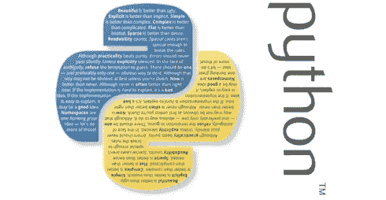

# Python 突然变得非常受欢迎的 6 个原因

> 原文：[`www.kdnuggets.com/2017/07/6-reasons-python-suddenly-super-popular.html`](https://www.kdnuggets.com/2017/07/6-reasons-python-suddenly-super-popular.html)

评论

你可能知道也可能不知道，Python 编程语言并不是年轻的。虽然它没有一些其他语言那么古老，但它存在的时间比大多数人认为的要长。它首次发布于 1991 年，尽管这些年来发生了很大变化，但它仍然用于当时的相同用途。

实际上，这只是它近年来变得如此受欢迎的原因之一——它是一种基于生产的语言，旨在用于企业和一流项目，并且拥有丰富的历史。它几乎可以用于任何事情，这也是它被认为如此多功能的原因。你可以通过 Python 构建 Raspberry Pi 应用程序、桌面程序的脚本以及配置服务器，但这不仅限于这些任务。

使用 Python，确实没有限制。

**Python 有什么特别之处？**

Python 是一种通用语言——有时被称为实用语言——设计上简洁易读。它不是复杂的语言这一点非常重要。设计者更少关注传统语法，使其更易于使用，即使对于非程序员或开发者也是如此。

而且，由于它被认为真正通用并用于满足各种开发需求，这是一种 [为程序员提供大量选择的语言](https://www.python.org/about/success/)。如果他们开始使用 Python 从事某项工作或职业，他们可以轻松转到另一个行业，即使这是一个不相关的领域。这种语言用于系统操作、网页开发、服务器和管理工具、部署、科学建模等。

但令人惊讶的是，许多开发者并没有将 Python 作为主要语言。因为它使用和学习起来非常简单，他们选择将其作为第二或第三语言。这也许是它在开发者中如此受欢迎的另一个原因。

此外，恰好全球最大的科技公司之一——谷歌——将这种语言用于他们的多个应用程序。他们甚至有一个 [专门的 Python 开发者门户](https://developers.google.com/edu/python/)，提供免费的课程，包括练习、讲座视频等。

此外，Django 框架在网页开发中的使用增加以及 PHP 人气的下降也促成了 Python 的成功，但最终，这是一个完美的风暴——恰到好处的开发者和官方支持，以及需求。

以下是 Python 最近几年变得非常受欢迎的一些不那么明显的原因：

**1\. Python 拥有一个健康、活跃且支持性强的社区**

由于显而易见的原因，缺乏文档和开发者支持的编程语言表现总是不佳。Python 不存在这些问题。它已经存在了相当长的时间，因此有大量的文档、指南、教程等等。此外，开发者社区非常活跃。这意味着每当有人需要帮助或支持时，他们都能及时获得帮助。

这个活跃的社区帮助[确保所有技能水平的开发者](https://www.fullstackpython.com/python-community.html)——从初学者到专家——始终可以找到支持。而且，正如任何有经验的程序员或开发者所知道的那样，当你在紧张的开发时遇到问题时，支持可能是决定你成功与否的关键。

**2\. Python 拥有一些优秀的企业赞助商**

编程语言有企业赞助商是非常有帮助的。C# 有微软，Java 曾有 Sun，而 PHP 被 Facebook 使用。谷歌在 2006 年大量采用了 Python，自那以后他们已经在许多平台和应用中使用它。

为什么这很重要？因为如果像谷歌这样的公司希望他们的团队——以及未来的开发者——与他们的系统和应用程序一起工作，他们需要提供资源。在谷歌的案例中，他们创建了大量关于使用 Python 的指南和教程。

这有助于提供不断增长的文档和支持工具列表，并在开发世界中为语言提供免费的广告。

**3\. Python 拥有大数据**

在企业界使用大数据和云计算解决方案也帮助 Python 成功腾飞。它是[数据科学中最受欢迎的语言之一](https://dzone.com/articles/which-are-the-popular-languages-for-data-science)，仅次于 R。它也被用于机器学习和人工智能系统以及各种现代技术。

当然，Python 易于分析和组织成可用数据，这也有所帮助。

**4\. Python 拥有令人惊叹的库**

当你在处理更大的项目时，库可以帮助你节省时间并缩短初始开发周期。Python 拥有丰富的库选择，从用于科学计算的 NumPy 和 SciPy 到用于 Web 开发的 Django。

甚至还有一些专注于特定领域的库，比如用于机器学习应用的 scikit-learn 和用于自然语言处理的 nltk。

此外，像 Encoding.com 这样的巨大云媒体服务[允许与 C 语言家族语言兼容](https://www.encoding.com/blog/2013/11/26/like-json-api-now-supports-json/)。换句话说，有一些类似库的工具提供跨平台支持，这是一大优势。

**5\. Python 可靠且高效**

问问任何一个 Python 开发者——或者任何使用过这种语言的人——他们都会同意 Python 既快速又可靠且高效。你可以在几乎任何环境中使用和部署 Python 应用程序，无论你使用什么平台，几乎不会有性能损失。

再次强调，由于其多功能性，这也意味着你可以跨多个领域工作，包括但不限于——网页开发、桌面应用程序、移动应用程序、硬件等。

你不受限于单一平台或领域，它在任何地方都能提供相同的体验。

**6\. Python 是易于访问的**

对于新手和初学者来说，Python 极其容易学习和使用。实际上，它是最容易接触的编程语言之一。部分原因在于其简化的语法，强调自然语言。但也因为你可以更快地编写和执行 Python 代码。

无论如何，它都是初学者的绝佳语言，因此很多年轻开发者都从这里起步。更重要的是，经验丰富的开发者也不会被遗弃，因为仍有大量工作待做。

**简介: [凯拉·马修斯](http://productivitybytes.com/subscribe-to-productivity-bytes/)** 讨论技术和大数据，曾在《The Week》、《数据中心杂志》和《VentureBeat》等出版物上发表文章，拥有超过五年的写作经验。要阅读凯拉的更多帖子，[**订阅她的博客《生产力字节》**](http://productivitybytes.com/subscribe-to-productivity-bytes/)。

**相关：**

+   2017 年数据科学的前 15 大 Python 库

+   用 Python 掌握数据准备的 7 个步骤

+   数据分析入门 Python

* * *

## 我们的前三大课程推荐

 1\. [谷歌网络安全证书](https://www.kdnuggets.com/google-cybersecurity) - 快速进入网络安全职业轨道。

 2\. [谷歌数据分析专业证书](https://www.kdnuggets.com/google-data-analytics) - 提升你的数据分析技能

 3\. [谷歌 IT 支持专业证书](https://www.kdnuggets.com/google-itsupport) - 支持你的组织的 IT 部门

* * *

### 更多相关话题

+   [使用管道编写干净的 Python 代码](https://www.kdnuggets.com/2021/12/write-clean-python-code-pipes.html)

+   [建立一个坚实的数据团队](https://www.kdnuggets.com/2021/12/build-solid-data-team.html)

+   [是什么让 Python 成为初创公司的理想编程语言](https://www.kdnuggets.com/2021/12/makes-python-ideal-programming-language-startups.html)

+   [每个数据科学家都应该了解的三个 R 库（即使你使用 Python）](https://www.kdnuggets.com/2021/12/three-r-libraries-every-data-scientist-know-even-python.html)

+   [停止学习数据科学以寻找目标，并寻找目标以…](https://www.kdnuggets.com/2021/12/stop-learning-data-science-find-purpose.html)

+   [成为优秀数据科学家所需的 5 项关键技能](https://www.kdnuggets.com/2021/12/5-key-skills-needed-become-great-data-scientist.html)
