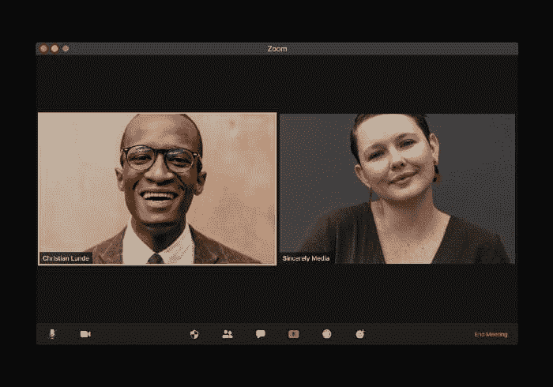

# 6 个远程工作数据科学家的软技能

> 原文：[`www.kdnuggets.com/2022/05/6-soft-skills-data-scientists-working-remotely.html`](https://www.kdnuggets.com/2022/05/6-soft-skills-data-scientists-working-remotely.html)

图片由 [visuals](https://unsplash.com/@visuals?utm_source=medium&utm_medium=referral) 提供，来自 [Unsplash](https://unsplash.com/?utm_source=medium&utm_medium=referral)

## **关键要点**

+   随着远程工作成为常态，沟通技能在数据科学中至关重要。

+   作为数据科学家，你可能拥有出色的技术技能，但如果不能有效沟通，你将无法在虚拟会议中清晰地传达你的想法。

+   因此，在今天的虚拟世界中，将强大的技术技能与沟通能力结合起来尤为重要。

疫情带来了公司业务运营方式的前所未有的变化。许多公司现在允许员工远程工作。无论你是经验丰富的数据科学家还是仍在尝试进入这一领域的数据科学候选人，都必须在硬技能之外培养远程工作的关键软技能。加强沟通技能（包括写作、口语和积极倾听）至关重要。

本文探讨了在今天的虚拟世界中所需的 6 种基本软技能。

# 1\. 口语技能

在虚拟会议中清晰表达你的想法是一项出色的技能，这将使你脱颖而出。一般来说，工业数据科学项目的范围和复杂性都非常广泛，并且非常多学科，涉及不同领域的专家。强大的口语能力将使你能够向团队成员清晰地传达你的想法。如果不能清晰表达，你将无法很好地作为团队成员发挥作用。如果你是一个仍在寻求进入数据科学领域的数据科学候选人，那么良好的口语技能将帮助你在 Zoom 面试过程中清晰地表达你的想法。展示技术能力和沟通技巧的能力将使你在无法清晰表达自己想法的候选人中脱颖而出。

# 2\. 写作技能

写作技能在数据科学中发挥着至关重要的作用。假设你的团队已经成功完成了一个项目。现在是时候准备项目报告了。良好的写作技能将帮助你以清晰简洁的方式呈现项目结果。你希望利用这个机会充分证明项目结果的重要性，并表明如果实施，将能够改善业务的开展方式。你想要说服高管和经理，解释你如何得出解决方案的过程，方式要避免过于技术化。随着远程工作的普及，电子邮件使用量大幅增加。良好的写作技能对于撰写发送给商业高管或团队其他成员的电子邮件非常有帮助。你要确保写出专业且无错误的高质量电子邮件。作为数据科学的有志之士，写作技能将帮助你在面试过程后撰写出色的跟进邮件。

# 3\. 听力技能

听力技能和口语及写作技能同样重要。在与团队成员进行虚拟 Zoom 会议时，仔细倾听非常必要。如果可能的话，记下会议中讨论的关键点。即使你是首席数据科学家，也不要主导会议发言。你必须认真听取团队成员的意见，因为他们经常提供有价值的解决问题的想法。作为数据科学的有志之士，你在面试过程中要认真听取，以确保你理解公司及你角色的所有细节。这将帮助你确定公司是否适合你。

# 4\. 阅读技能

良好的阅读技能将帮助你跟上组织中的业务运作。作为终身学习者，良好的阅读技能还将帮助你了解领域内的新发展。一些帮助你保持更新的博客平台包括 Medium、LinkedIn、GitHub、KDnuggets 和 Kaggle。

# 5\. 专业形象

展现专业形象不仅在求职和面试过程中重要——这也是职业生涯中应持续保持的习惯。你的着装反映了你对工作的看法以及他人如何看待你和你的公司。良好的商务着装将确保你始终展现出适当的形象。穿着休闲服如睡衣参加重要商务会议不是一个好主意。此外，如果参加 Zoom 会议，请确保你在一个安静且干扰有限的区域。你的 Zoom 背景如何？使用一个不会分散他人注意力的背景确实很有帮助。

# 6\. 职业道德技能

作为数据科学家或在任何其他角色中远程工作需要很强的自律。要对自己保持道德和真实。留出时间来完成工作。确保每天投入足够的时间。找到一个没有干扰的工作环境。

总结一下，我们讨论了作为数据科学家远程工作所需的 6 项关键软技能。作为数据科学家，你可能拥有出色的技术技能，但如果不能有效沟通，就无法在虚拟会议中清晰表达你的想法。因此，将强大的技术技能与沟通能力结合起来尤其重要，特别是在今天这个虚拟世界中。

**[本杰明·O·塔约](https://www.linkedin.com/in/benjamin-o-tayo-ph-d-a2717511/)** 是物理学家、数据科学教育者和作家，也是 DataScienceHub 的创始人。此前，本杰明曾在中欧大学、大峡谷大学和匹兹堡州立大学教授工程学和物理学。

### 更多相关话题

+   [想成为数据科学家？第二部分：你需要的 10 项软技能](https://www.kdnuggets.com/want-to-become-a-data-scientist-part-2-10-soft-skills-you-need)

+   [每个数据科学家都需要的软技能](https://www.kdnuggets.com/soft-skills-every-data-scientist-needs)

+   [在实际应用中实现深度学习：数据中心课程](https://www.kdnuggets.com/2022/04/corise-deep-learning-wild-data-centric-course.html)

+   [在实际应用中实现深度学习：数据中心课程](https://www.kdnuggets.com/2022/11/corise-deep-learning-wild-data-centric-course.html)

+   [处理大数据：工具与技术](https://www.kdnuggets.com/working-with-big-data-tools-and-techniques)

+   [在机器学习模型中处理稀疏特征](https://www.kdnuggets.com/2021/01/sparse-features-machine-learning-models.html)
