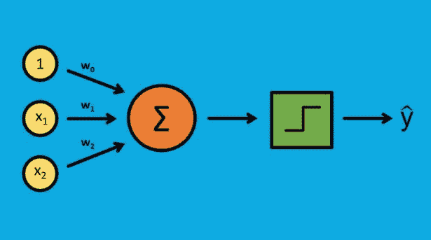
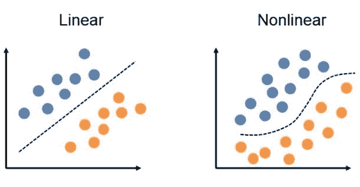
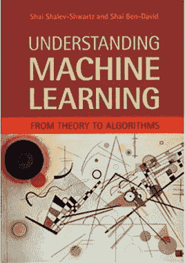
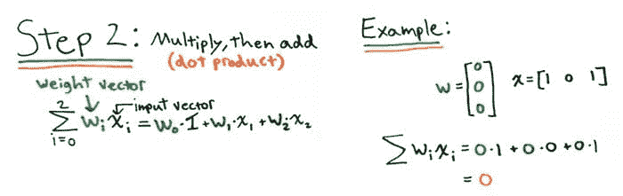
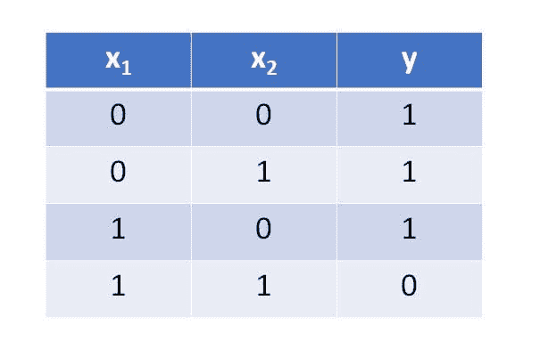
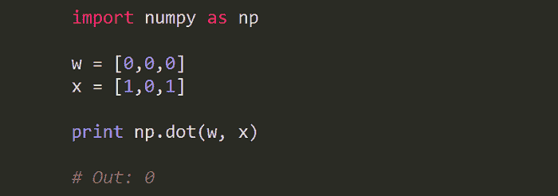
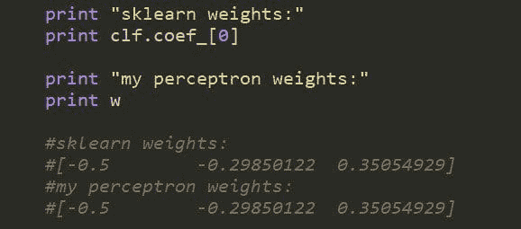

# 从零开始编写任何机器学习算法的 6 步：感知机案例研究

> 原文：[`www.kdnuggets.com/2018/09/6-steps-write-machine-learning-algorithm.html`](https://www.kdnuggets.com/2018/09/6-steps-write-machine-learning-algorithm.html)

 评论

**由 John Sullivan 提供，** [**DataOptimal**](https://www.dataoptimal.com/)

[从零开始编写算法](https://www.dataoptimal.com/machine-learning-from-scratch/)是一个值得的经历，能够带给你那种“啊哈！”的时刻，让你最终明白算法的内部运作。

* * *

## 我们的前三个课程推荐

 1\. [谷歌网络安全证书](https://www.kdnuggets.com/google-cybersecurity) - 快速进入网络安全职业生涯。

 2\. [谷歌数据分析专业证书](https://www.kdnuggets.com/google-data-analytics) - 提升你的数据分析技能

 3\. [谷歌 IT 支持专业证书](https://www.kdnuggets.com/google-itsupport) - 支持你的组织在 IT 方面

* * *

我是说，即使你之前用[scikit-learn](http://scikit-learn.org/stable/index.html)实现过该算法，从零开始编写也会很容易吗？绝对不是。

有些算法比其他算法更复杂，因此从简单的算法开始，例如单层[感知机](https://en.wikipedia.org/wiki/Perceptron)。

我将带你通过一个[从零开始编写算法的 6 步流程](https://www.dataoptimal.com/machine-learning-from-scratch/)，以感知机为案例研究。这种方法论可以很容易地转化为其他机器学习算法。

1.  **对算法有基本理解**

这回到了我最初说的。如果你不理解基础知识，就不要从零开始尝试一个算法。至少，你应该能够回答以下问题：

+   那是什么呢？

+   它通常用于什么？

+   我什么时候不能使用它？

对于感知机，我们先回答这些问题：

+   单层感知机是最基本的神经网络。它通常用于二分类问题（1 或 0，“是”或“否”）。

+   它是一个线性分类器，因此只能在存在线性决策边界时使用。一些简单的应用可能是情感分析（积极或消极反馈）或贷款违约预测（“将违约”，“不会违约”）。对于这两种情况，决策边界都需要是线性的。

+   如果决策边界是非线性的，你确实不能使用感知机。对于这些问题，你需要使用其他方法。

1.  **寻找一些不同的学习资源**

在你对模型有了基本了解后，是时候开始进行研究了。我建议使用多种资源。有些人通过教科书学习效果更好，有些人则通过

视频效果更佳。我个人喜欢跳转使用各种类型的资源。对于数学细节，教科书做得很好，但对于更多实际示例，我更喜欢博客和 YouTube 视频。

关于感知器，这里有一些很好的资源：

+   教科书：

    +   [统计学习的元素](https://web.stanford.edu/~hastie/Papers/ESLII.pdf)，第 4.5.1 节

    +   [理解机器学习：从理论到算法](https://www.cs.huji.ac.il/~shais/UnderstandingMachineLearning/understanding-machine-learning-theory-algorithms.pdf)，第 21.4 节

+   博客：

    +   Jason Brownlee 在他的机器学习精通博客上的文章，[如何从头开始在 Python 中实现感知器算法](https://machinelearningmastery.com/implement-perceptron-algorithm-scratch-python/)

    +   Sebastian Raschka 的博客文章，[单层神经网络和梯度下降](https://sebastianraschka.com/Articles/2015_singlelayer_neurons.html)

+   视频：

    +   [感知器训练](https://www.youtube.com/watch?v=5g0TPrxKK6o)

    +   [感知器算法如何工作](https://www.youtube.com/watch?v=1XkjVl-j8MM)

1.  **将算法分解成块**

现在我们已经收集了资料，是时候开始学习了。先拿些纸和铅笔。与其整章阅读或阅读博客，不如先浏览章节标题及其他重要信息。记下要点，尝试概述算法。

在查看了这些资源之后，我将感知器算法分解成了以下几个部分：

+   初始化权重

+   将权重乘以输入并加总

+   将结果与阈值进行比较以计算输出（1 或 0）

+   更新权重

+   重复

将算法分解成块使学习更容易。基本上，我已经用伪代码概述了算法，现在可以回过头来填充详细信息。这是我对第二步的笔记的图片，即权重和输入的点积：

1.  **从简单示例开始**

在我整理完算法笔记后，是时候开始在代码中实现它了。在处理复杂问题之前，我喜欢从简单示例开始。对于感知器， [NAND 门](https://en.wikipedia.org/wiki/NAND_gate) 是一个完美的简单数据集。如果两个输入都为真（1），则输出为假（0），否则输出为真。这是数据集的一个示例：

现在我有了一个简单的数据集，我将开始实现我在第 3 步中概述的算法。将算法分块编写并测试是个好习惯，而不是尝试一次性完成。这使得在刚开始时更容易调试。当然，最后你可以回去整理一下，让它看起来更漂亮。

这是我在第 3 步中概述的算法中点积部分的 Python 代码示例：

1.  **与可信实现进行验证**

现在我们已经编写了代码并在一个小数据集上进行了测试，是时候将其扩展到 [更大的数据集](https://github.com/dataoptimal/posts/tree/master/algorithms%20from%20scratch)了。为了确保我们的代码在这个更复杂的数据集上正常工作，最好对其进行可信的实现测试。对于 Perceptron，我们可以使用 [sci-kit learn](http://scikit-learn.org/stable/modules/generated/sklearn.linear_model.Perceptron.html) 的实现。

为了测试 [我的代码](https://github.com/dataoptimal/posts/tree/master/algorithms%20from%20scratch)，我将查看权重。如果我正确实现了算法，我的权重应该与 sci-kit learn Perceptron 的权重一致。

起初，我没有得到相同的权重，这是因为我必须调整 scikit-learn Perceptron 中的默认设置。我每次没有实现一个新的随机状态，只是一个固定的种子，因此我必须关闭这个设置。对于洗牌也是如此，我也需要关闭它。为了匹配我的学习率，我将 eta0 改为 0.1。最后，我关闭了 fit_intercept 选项。我在特征数据集中包含了一列全为 1 的虚拟列，因此我已经自动拟合了截距（也称为偏置项）。

这引出了另一个重要的点。当你对模型的现有实现进行验证时，你需要非常关注模型的输入。你绝不能盲目使用一个模型，总是要质疑你的假设，以及每个输入的确切含义。

1.  **撰写你的过程**

这一过程中的最后一步可能是最重要的。你刚刚完成了所有的学习工作，做了笔记，从头编写了算法，并将其与可信的实现进行了比较。不要让所有这些好工作白费！撰写过程文档很重要，原因有两个：

1.  你将获得更深刻的理解，因为你正在教别人你刚刚学到的知识。

1.  你可以将其展示给潜在的雇主。展示你能够实现一个机器学习库中的算法是一回事，但如果你能够从头开始自己实现它，那就更令人印象深刻了。

展示你工作的一个好方法是使用 [GitHub Pages](https://pages.github.com/) 作品集。

### **结论**

从零开始编写算法可以是非常有成就感的经历。这是深入理解模型的绝佳方式，同时还能构建一个令人印象深刻的项目组合。

记得慢慢来，从简单的事情开始。最重要的是，确保记录和分享你的工作。

**简介**：约翰·沙利文是数据科学学习博客 DataOptimal 的创始人。你可以在 Twitter 上关注他 [@DataOptimal](https://twitter.com/dataoptimal)。

**相关内容：**

+   [2018 年 8 月/r/MachineLearning 的顶级帖子：大家快跳舞；斯坦福课堂机器学习备忘单；用于共享巨大数据集的学术数据](https://www.kdnuggets.com/2018/09/top-reddit-machine-learning-august.html)

+   [KDD 2018 的关键要点：去混淆器、Pinterest 的机器学习、知识图谱](https://www.kdnuggets.com/2018/09/kdd-2018-key-takeaways.html)

+   [关于 AutoML 和神经网络架构搜索你需要知道的一切](https://www.kdnuggets.com/2018/09/everything-need-know-about-automl-neural-architecture-search.html)

### 更多相关内容

+   [使用管道编写干净的 Python 代码](https://www.kdnuggets.com/2021/12/write-clean-python-code-pipes.html)

+   [停止学习数据科学以寻找目标，并寻找目标去……](https://www.kdnuggets.com/2021/12/stop-learning-data-science-find-purpose.html)

+   [数据科学学习统计的顶级资源](https://www.kdnuggets.com/2021/12/springboard-top-resources-learn-data-science-statistics.html)

+   [一个 90 亿美元的 AI 失败，解析](https://www.kdnuggets.com/2021/12/9b-ai-failure-examined.html)

+   [成功数据科学家的 5 个特征](https://www.kdnuggets.com/2021/12/5-characteristics-successful-data-scientist.html)

+   [是什么让 Python 成为初创公司的理想编程语言](https://www.kdnuggets.com/2021/12/makes-python-ideal-programming-language-startups.html)
