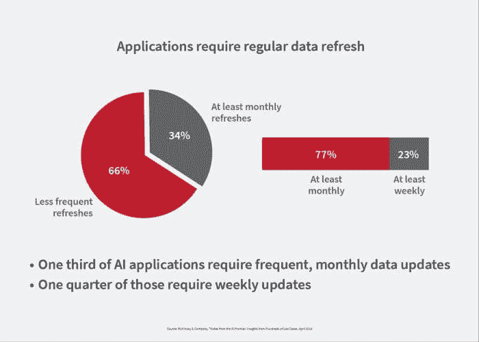

# 机器学习培训数据策略的**6 个提示**

> 原文：[`www.kdnuggets.com/2019/09/6-tips-training-data-strategy-machine-learning.html`](https://www.kdnuggets.com/2019/09/6-tips-training-data-strategy-machine-learning.html)

评论

**作者：[Wilson Pang](https://www.linkedin.com/in/wilsonpang/)，Appen 首席技术官**。

人工智能（AI）和机器学习（ML）这些术语现在使用频繁。AI 指的是机器模仿人类认知的概念。ML 是用于创建 AI 的一种方法。如果 AI 是计算机能够根据指令执行一系列任务，那么 ML 就是机器能够自行摄取、解析和学习数据，从而在完成任务时变得更加准确或精确。

从事汽车、金融、政府、医疗、零售和科技等行业的高管可能已经对 ML 和 AI 有基本了解。然而，并非每个人都擅长制定培训数据策略，这是实现高回报机器学习投资的必要第一步。

AI 系统通过示例进行学习，示例越多、质量越高，它们的学习效果就越好。数据不足或质量低劣可能导致系统不可靠、得出错误结论、做出糟糕决策、无法处理现实世界的变化，并引入或延续偏见等问题。劣质数据也很昂贵。[IBM 估计](https://hbr.org/2016/09/bad-data-costs-the-u-s-3-trillion-per-year) 美国的劣质数据每年使国家经济损失约 3.1 万亿美元。

如果没有明确的数据收集和结构化策略，你可能会面临项目延迟、无法适当扩展以及竞争对手超越你的风险。以下是建立成功培训数据策略的六个提示。

**1: 为培训数据制定预算**

启动新的机器学习项目时，首先要[定义你要实现的目标](https://www.gartner.com/binaries/content/assets/events/keywords/catalyst/catus8/preparing_and_architecting_for_machine_learning.pdf)。这将告诉你需要什么类型的数据以及需要多少个“培训项目”——已分类的数据点——来训练你的系统。

例如，对于计算机视觉或模式识别项目，培训项目可能是由人工标注者标记的图像数据，以识别图像中的内容（树木、停车标志、人物、汽车等）。此外，根据你所构建的解决方案类型，你的模型可能需要不断重新训练或更新。你的解决方案可能需要季度、每月甚至每周更新。

一旦培训项目和更新频率确定后，你就可以评估数据来源的选项，并计算预算。

重要的是要清楚地了解启动、维护和发展这个计划所需的时间和金钱投入——以及你的业务——以便解决方案能够保持相关性和对客户有用。启动机器学习项目是一项长期投资。获得良好的回报需要长期战略。

**2: 获取合适的数据**

你所需的数据类型取决于你所构建的解决方案类型。一些数据来源选项包括现实世界使用数据、调查数据、公共数据集和合成数据。例如，一个能够理解口头指令的语音识别解决方案必须在高质量的语音数据（现实世界数据）上进行训练，并且这些数据已被转录为文本。一个搜索解决方案需要人类评审员注释的文本数据，以告诉它哪些结果最相关。

在机器学习中最常见的数据类型包括图像、视频、语音、音频和文本。在用于机器学习之前，训练数据项必须被注释或标记，以识别它们的内容。注释告诉模型如何处理每一条数据。例如，如果虚拟家庭助手的数据项是录音中有人说“再订购一些双 A 电池”，注释可能会告诉系统在听到“order”时开始向特定的在线零售商下单，在听到“double-A batteries”时搜索“AA batteries”。

**3: 确保数据质量**

根据任务的不同，数据注释可能是相对简单的活动——但它也是重复的、耗时的，并且很难始终如一地做好。它需要人类的参与。

风险很高，因为如果你用不准确的数据来训练模型，模型可能会做出错误的判断。例如，如果你用标记错误为街道的人行道图像来训练自动驾驶汽车的计算机视觉系统，结果可能会非常糟糕。确实，“[劣质数据质量是机器学习广泛、盈利使用的头号敌人](https://hbr.org/2018/04/if-your-data-is-bad-your-machine-learning-tools-are-useless)。”

当我们谈论质量时，我们指的是这些标签的准确性和一致性。准确性是指标签接近真实情况的程度。一致性是指多个训练项上的注释彼此一致的程度。

**4: 了解并减轻数据偏差**

强调数据质量有助于公司在其人工智能项目中减轻偏差，这些偏差可能在你的人工智能解决方案进入市场之前是隐藏的。此时，偏差可能很难修复。

偏差通常来源于项目团队或训练数据中的盲点或无意识的偏好，从项目一开始就存在。人工智能中的偏差可能表现为对不同性别、口音或种族的不均衡语音或面部识别性能。随着人工智能在我们文化中的普及，现在是解决内在偏差的时机。

为了在项目级别避免偏见，要积极地将多样性融入定义目标、路线图、指标和算法的团队中。虽然雇佣一个多样化的数据团队说起来容易，但做起来却难，风险也很高。如果你的团队内部构成与潜在客户的外部构成不符，那么最终产品可能只适合或吸引一部分人，从而错过大众市场机会，甚至更糟：偏见可能导致现实中的歧视。

**5: 在必要时，实施数据安全保护措施**

并不是所有的数据项目都使用个人可识别信息（PII）或敏感数据。对于那些确实利用这类信息的解决方案，数据安全比以往任何时候都更为重要，特别是当你处理客户的 PII、金融或政府记录，或用户生成内容时。政府法规越来越多地规定了公司如何处理客户信息。

保护这些机密数据可以保护你及你的客户的信息。对你的实践保持透明和道德，并遵守服务条款，可以给你带来竞争优势。不这样做会使你面临丑闻和品牌负面影响的风险。

**6: 选择合适的技术**

你的训练数据越复杂或细致，结果就越好。大多数组织需要大量的高质量训练数据，且需要快速大规模地获取。为此，他们必须构建一个数据管道，以提供足够的量，并以刷新模型所需的速度运行。这就是为什么选择合适的数据注释技术至关重要。

你选择的工具必须能够处理与你的计划相关的适当数据类型，允许灵活的标注工作流程设计，管理个别标注员的质量和吞吐量，并提供机器学习辅助的数据标注，以增强人工标注员的表现。

### **制定策略使 AI 成功**

最近一项[来自 IHS Markit 的研究](https://cdn.ihs.com/www/pdf/0419/ihs-markit-digital-orbit-brochure.pdf)显示，87%的组织正在采用至少一种形式的变革性技术，如 AI，但只有 26%认为有合适的商业模式来充分捕捉这些技术的价值。

制定一个坚实的训练数据策略是捕捉 AI 价值的第一步。这包括设定预算、确定数据来源、确保质量，并构建安全措施。一个清晰的数据策略也有助于提供大多数机器学习模型所需的稳定数据管道。仅有的训练数据策略不能保证 AI 成功，但它可以帮助确保公司更好地利用 AI 提供的好处。

**个人简介：** [Wilson Pang](https://www.linkedin.com/in/wilsonpang/) 是一位工程和数据科学技术领导者，精通大数据、数据科学、分布式系统工程、搜索科学、互联网营销和网络应用。Wilson 的热情是通过数据科学和工程创新与聪明的人才一起推动业务发展。

**相关：**

+   [部署机器学习模型的不同方法概述](https://www.kdnuggets.com/2019/06/approaches-deploying-machine-learning-production.html)

+   [以低成本获取标注数据以训练你的模型](https://www.kdnuggets.com/2019/02/labeled-data-train-models.html)

+   [为什么你需要改善你的训练数据，以及如何做到这一点](https://www.kdnuggets.com/2018/06/improve-training-data-how.html)

* * *

## 我们的三大课程推荐

 1\. [谷歌网络安全证书](https://www.kdnuggets.com/google-cybersecurity) - 快速进入网络安全职业道路。

 2\. [谷歌数据分析专业证书](https://www.kdnuggets.com/google-data-analytics) - 提升你的数据分析能力

 3\. [谷歌 IT 支持专业证书](https://www.kdnuggets.com/google-itsupport) - 支持你组织的 IT 需求

* * *

### 更多相关主题

+   [KDnuggets 新闻，6 月 22 日：主要监督学习算法……](https://www.kdnuggets.com/2022/n25.html)

+   [使用 TensorFlow 和 Keras 构建和训练第一个神经网络](https://www.kdnuggets.com/2023/05/building-training-first-neural-network-tensorflow-keras.html)

+   [掌握数据战略的 15 本书](https://www.kdnuggets.com/2022/06/top-15-books-master-data-strategy.html)

+   [GenAI 时代的 AI 转型战略](https://www.kdnuggets.com/the-ai-transformation-strategy-in-the-genai-era)

+   [如何创建有效的 AI 战略](https://www.kdnuggets.com/2022/11/create-effective-ai-strategy.html)

+   [终极 AI 战略手册](https://www.kdnuggets.com/the-ultimate-ai-strategy-playbook)
