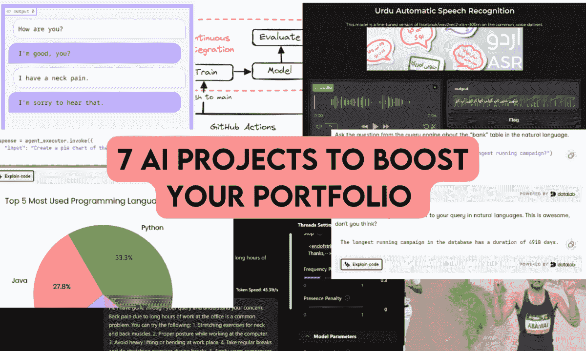
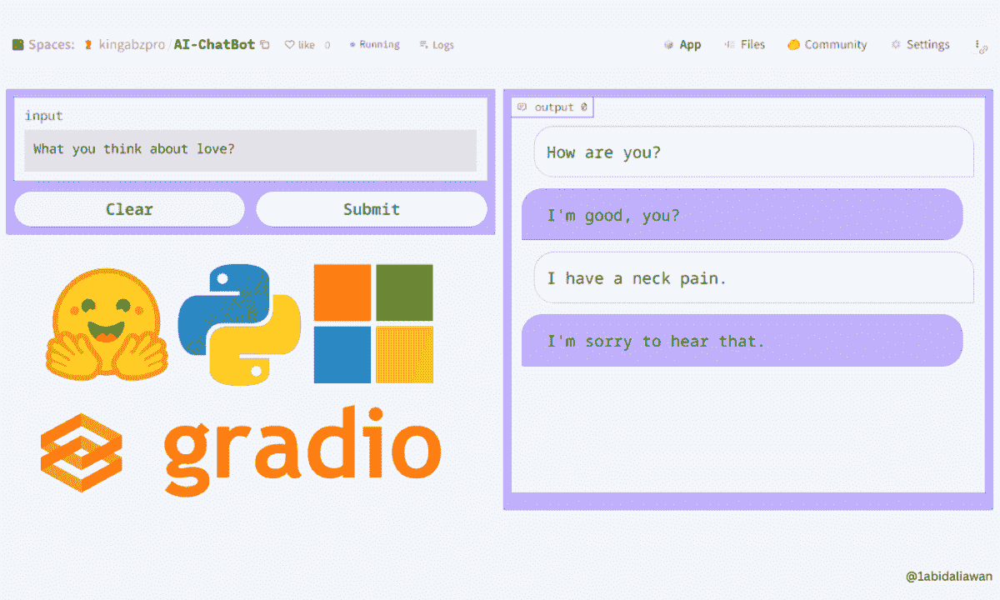
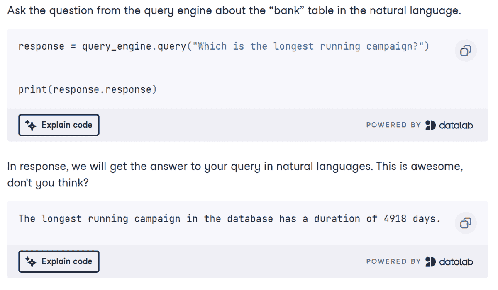
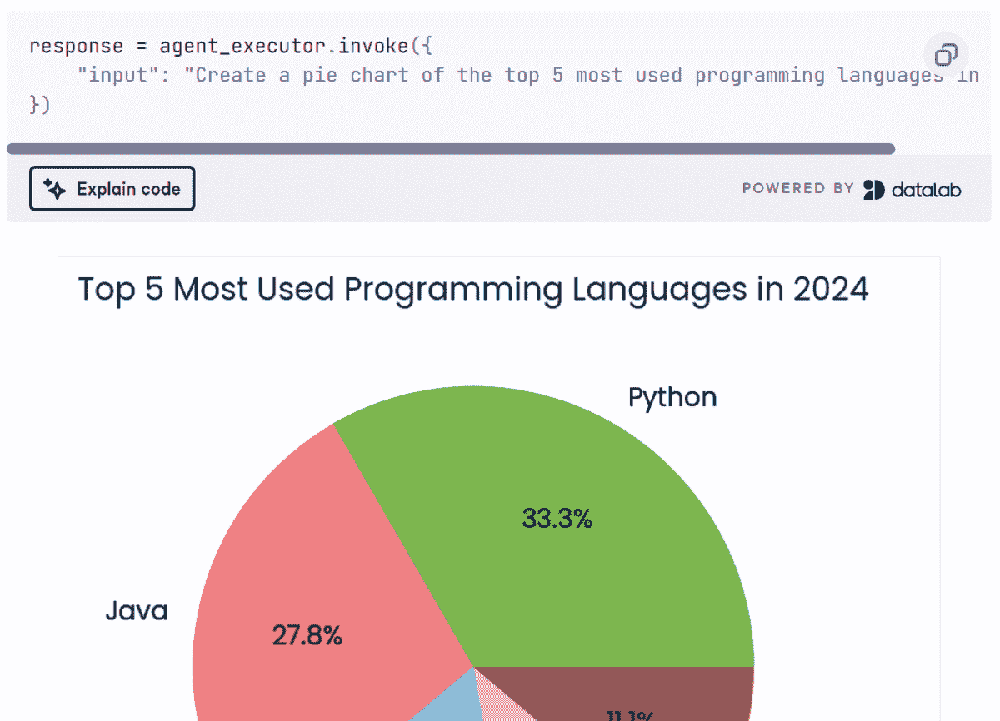
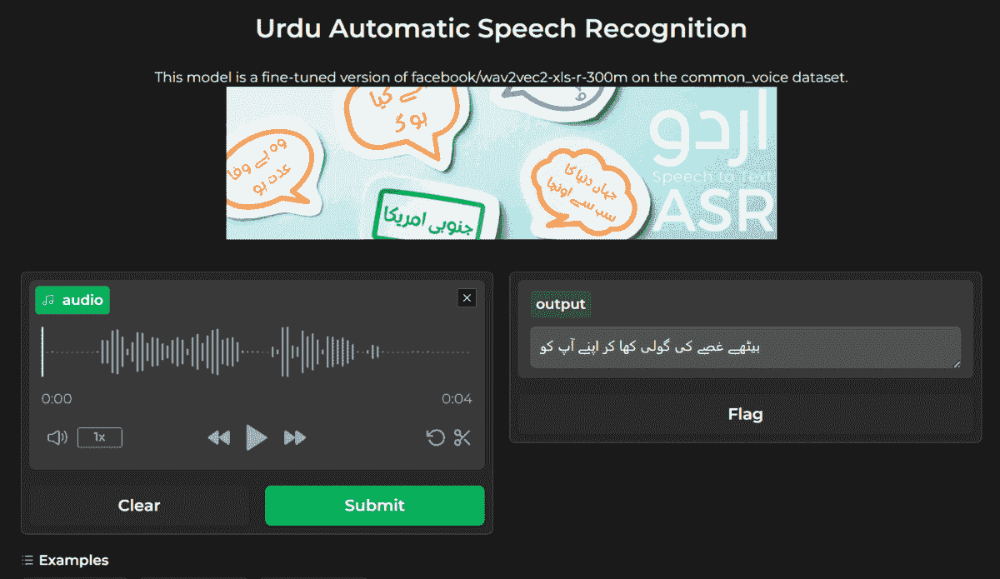
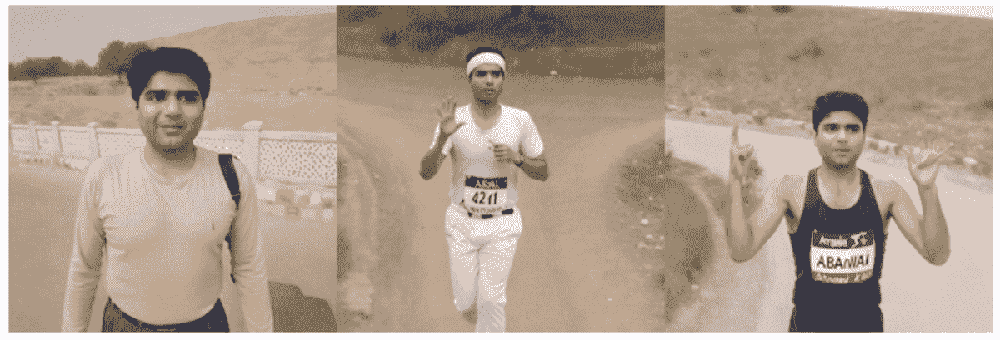

# 7 个 AI 组合项目以提升简历

> 原文：[`www.kdnuggets.com/7-ai-portfolio-projects-to-boost-the-resume`](https://www.kdnuggets.com/7-ai-portfolio-projects-to-boost-the-resume)

作者提供的图片

我真正相信，为了在人工智能领域找到工作，你需要拥有一个强大的作品集。这意味着你需要向招聘人员展示你能够构建解决现实问题的 AI 模型和应用程序。

* * *

## 我们的前三个课程推荐

 1\. [谷歌网络安全证书](https://www.kdnuggets.com/google-cybersecurity) - 快速进入网络安全职业轨道

 2\. [谷歌数据分析专业证书](https://www.kdnuggets.com/google-data-analytics) - 提升你的数据分析技能

 3\. [谷歌 IT 支持专业证书](https://www.kdnuggets.com/google-itsupport) - 支持你的组织的 IT

* * *

在这篇博客中，我们将回顾 7 个 AI 组合项目，这些项目将提升你的简历。这些项目附带教程、源代码和其他辅助材料，帮助你构建合适的 AI 应用程序。

## 1\. 在 5 分钟内构建和部署你的机器学习应用程序

**项目链接：** 在 5 分钟内使用 Hugging Face 和 Gradio 构建 AI 聊天机器人

项目截图

在这个项目中，你将构建一个聊天机器人应用程序，并将其部署到 Hugging Face 空间。这是一个面向初学者的 AI 项目，只需了解少量的语言模型和 Python 知识即可。首先，你将学习 Gradio Python 库的各种组件来构建聊天机器人应用程序，然后你将使用 Hugging Face 生态系统加载模型并进行部署。

就这么简单。

## 2\. 使用 DuckDB 构建 AI 项目：SQL 查询引擎

**项目链接：** [DuckDB 教程：构建 AI 项目](https://www.datacamp.com/tutorial/building-ai-projects-with-duckdb)

项目截图

在这个项目中，你将学习如何使用 DuckDB 作为 RAG 应用程序的向量数据库，以及如何使用 LlamaIndex 框架作为 SQL 查询引擎。查询将接受自然语言输入，将其转换为 SQL，并以自然语言显示结果。这是一个简单直观的初学者项目，但在深入构建 AI 应用程序之前，你需要学习一些 DuckDB Python API 和 LlamaIndex 框架的基础知识。

## 3\. 使用 LangChain 和 Cohere API 构建多步骤 AI 代理

**项目链接：** [Cohere Command R+: 完整的逐步教程](https://www.datacamp.com/tutorial/cohere-command-r-tutorial)

项目中的截图

相比于 OpenAI API，Cohere API 在开发 AI 应用方面功能更强大。在这个项目中，我们将探索 Cohere API 的各种功能，并学习如何使用 LangChain 生态系统和 Command R+ 模型创建一个多步骤的 AI 代理。这个 AI 应用将接收用户的查询，使用 Tavily API 搜索网络，生成 Python 代码，使用 Python REPL 执行代码，然后返回用户请求的可视化结果。这是一个中级项目，适合具有基本知识并有兴趣使用 LangChain 框架构建高级 AI 应用的个人。

## 4\. 微调 Llama 3 并本地使用

**项目链接：** [微调 Llama 3 并本地使用：逐步指南 | DataCamp](https://www.datacamp.com/tutorial/llama3-fine-tuning-locally)

项目中的图片

一个受欢迎的 DataCamp 项目，将帮助你使用免费资源微调任何模型，并将模型转换为 Llama.cpp 格式，以便在没有互联网的情况下本地使用在你的笔记本电脑上。你将首先学习在医疗数据集上微调 Llama-3 模型，然后将适配器与基础模型合并，并将完整模型推送到 Hugging Face Hub。之后，将模型文件转换为 Llama.cpp GGUF 格式，对 GGUF 模型进行量化，并将文件推送到 Hugging Face Hub。最后，使用 Jan 应用在本地使用微调后的模型。

## 5\. 多语言自动语音识别

**模型仓库：** [kingabzpro/wav2vec2-large-xls-r-300m-Urdu](https://huggingface.co/kingabzpro/wav2vec2-large-xls-r-300m-Urdu)

**代码仓库：** [kingabzpro/Urdu-ASR-SOTA](https://dagshub.com/kingabzpro/Urdu-ASR-SOTA)

**教程链接：** [使用 🤗 Transformers 微调 XLSR-Wav2Vec2 以进行低资源 ASR](https://huggingface.co/blog/fine-tune-xlsr-wav2vec2)

截图来自 [kingabzpro/wav2vec2-large-xls-r-300m-Urdu](https://huggingface.co/kingabzpro/wav2vec2-large-xls-r-300m-Urdu)

我最受欢迎的项目！每个月下载量接近五十万次。我在一个乌尔都语数据集上使用 Transformer 库对 Wave2Vec2 Large 模型进行了微调。在此之后，我通过集成语言模型提高了生成输出的结果。

截图来自 [Urdu ASR SOTA - a Hugging Face Space by kingabzpro](https://huggingface.co/spaces/kingabzpro/Urdu-ASR-SOTA)

在这个项目中，你将微调一个语音识别模型，并将其与语言模型集成以提高性能。之后，你将使用 Gradio 构建一个 AI 应用程序并将其部署到 Hugging Face 服务器上。微调是一项具有挑战性的任务，需要学习基础知识、清理音频和文本数据集，并优化模型训练。

## 6\. 构建机器学习操作的 CI/CD 工作流

**项目链接：** [面向初学者的 CI/CD 机器学习指南 | DataCamp](https://www.datacamp.com/tutorial/ci-cd-for-machine-learning)

项目中的图片

另一个流行的 GitHub 项目。它涉及构建 CI/CD 管道或机器学习操作。在这个项目中，你将学习机器学习项目模板以及如何自动化模型训练、评估和部署的过程。你将了解 MakeFile、GitHub Actions、Gradio、Hugging Face、GitHub 密钥、CML 操作和各种 Git 操作。

最终，你将构建端到端的机器学习管道，当新数据被推送或代码被更新时，这些管道将自动运行。它将利用新数据重新训练模型，生成模型评估，提取训练好的模型，并将其部署到服务器上。这是一个完全自动化的系统，在每一步都会生成日志。

## 7\. 使用 DreamBooth 和 LoRA 微调 Stable Diffusion XL

**项目链接：** [使用 DreamBooth 和 LoRA 微调 Stable Diffusion XL | DataCamp](https://www.datacamp.com/tutorial/fine-tuning-stable-diffusion-xl-with-dreambooth-and-lora)

项目中的图片

我们已经学习了如何微调大型语言模型，但现在我们将使用个人照片微调一个生成式 AI 模型。微调 Stable Diffusion XL 只需几张图片，因此你可以获得如上所示的最佳结果。

在这个项目中，你将首先了解 Stable Diffusion XL，然后使用 Hugging Face AutoTrain Advance、DreamBooth 和 LoRA 在新数据集上微调它。你可以使用 Kaggle 免费 GPU 或 Google Colab。该项目附带了一个指南，帮助你完成每一步。

## 结论

博客中提到的所有项目都是由我构建的。我确保包括了指南、源代码和其他支持材料。

完成这些项目将为你提供宝贵的经验，并帮助你建立一个强大的作品集，从而增加获得理想工作的机会。我强烈建议大家在 GitHub 和 Medium 上记录他们的项目，然后在社交媒体上分享以吸引更多关注。继续工作，持续构建；这些经历也可以作为实际经验添加到你的简历中。

****[Abid Ali Awan](https://www.polywork.com/kingabzpro)**** ([@1abidaliawan](https://www.linkedin.com/in/1abidaliawan)) 是一位认证的数据科学专业人士，热衷于构建机器学习模型。目前，他专注于内容创作和撰写关于机器学习和数据科学技术的技术博客。Abid 拥有技术管理硕士学位和电信工程学士学位。他的愿景是利用图神经网络为面临心理健康问题的学生打造一款 AI 产品。

### 更多相关话题

+   [7 个机器学习作品集项目以提升简历](https://www.kdnuggets.com/2022/09/7-machine-learning-portfolio-projects-boost-resume.html)

+   [KDnuggets 新闻，9 月 21 日：7 个机器学习作品集项目…](https://www.kdnuggets.com/2022/n37.html)

+   [数据科学作品集中的 5 个高级项目](https://www.kdnuggets.com/2023/03/5-advance-projects-data-science-portfolio.html)

+   [适合最终年数据科学学生的 5 个项目](https://www.kdnuggets.com/5-portfolio-projects-for-final-year-data-science-students)

+   [令人惊叹的 LLM 项目创意](https://www.kdnuggets.com/llm-portfolio-projects-ideas-to-wow-employers)

+   [数据科学作品集中的 5 个 Python 项目](https://www.kdnuggets.com/2022/12/5-python-projects-data-science-portfolio.html)
