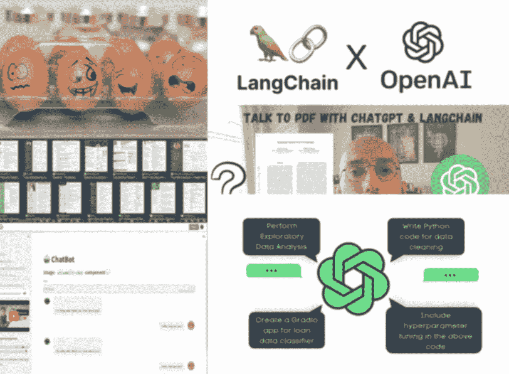
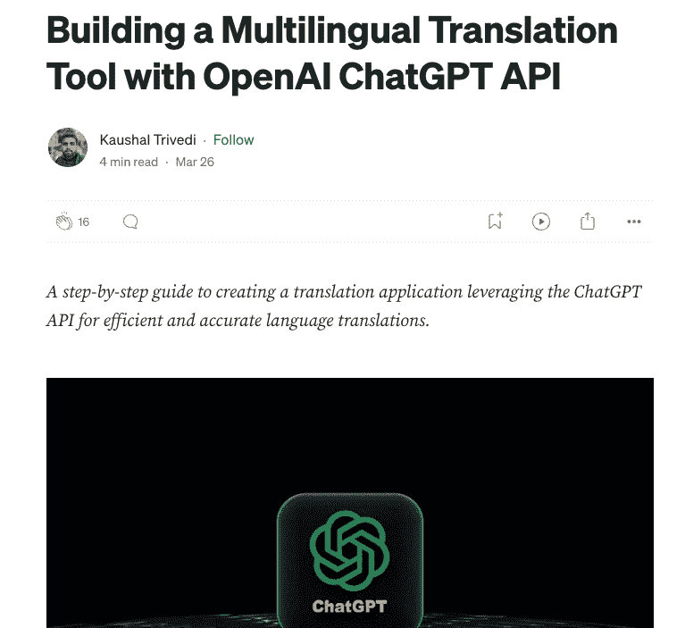
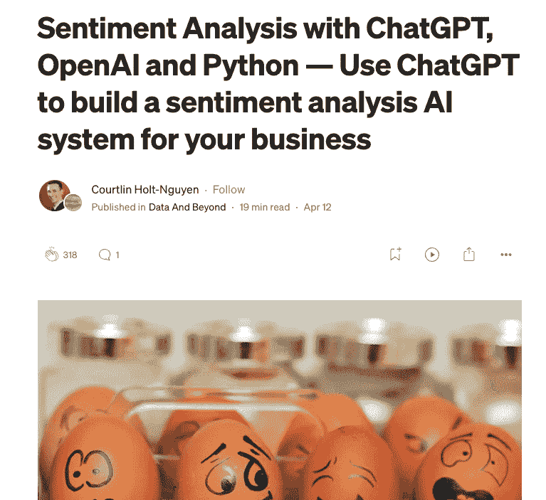
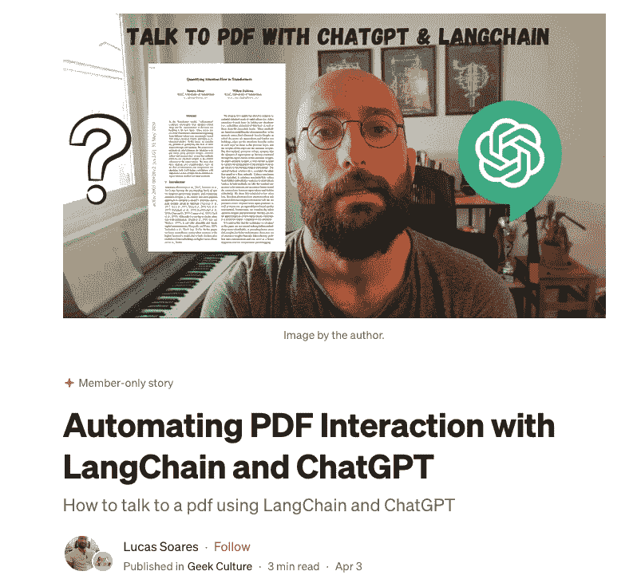
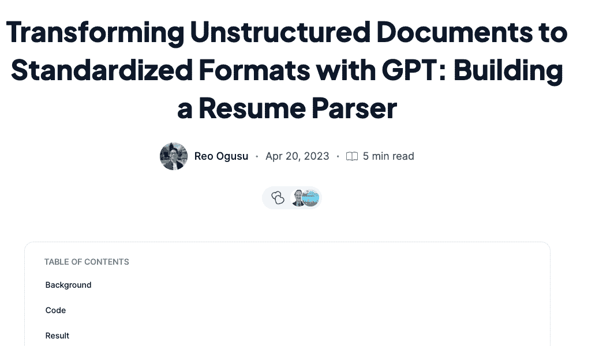
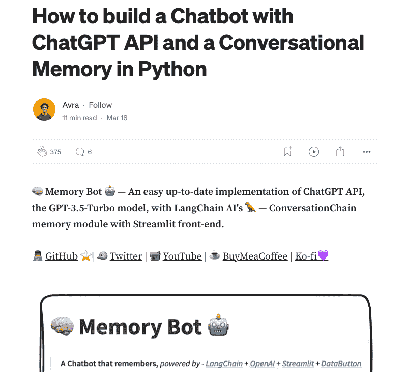
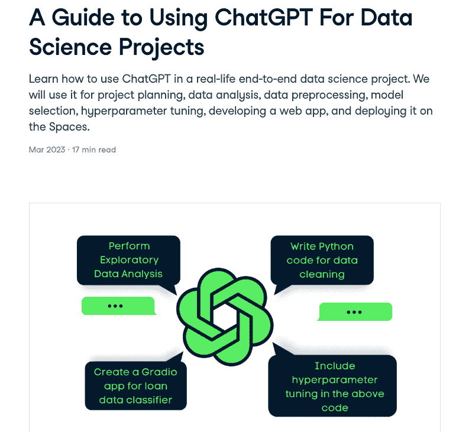

# 7 个初学者友好的项目，帮助你开始使用 ChatGPT

> 原文：[`www.kdnuggets.com/2023/08/7-beginnerfriendly-projects-get-started-chatgpt.html`](https://www.kdnuggets.com/2023/08/7-beginnerfriendly-projects-get-started-chatgpt.html)

作者提供的图像

在技术以空前速度发展的时代，**人工智能？——还是朋友们称之为 AI 🤓，作为最具变革性的力量之一脱颖而出。**

从自动化日常任务到预测复杂模式，AI 正在重塑行业并重新定义可能性。

随着我们站在这场 AI 革命的前沿，**理解其潜力并将其融入我们的日常工作流中是至关重要的。**

*然而……我知道开始使用这些新技术可能会令人感到不知所措。*

所以，如果你在考虑如何开始使用 AI，特别是像 ChatGPT 这样的模型……

**今天我带来了一套 7 个项目，以从零开始学习如何处理这些项目。**

让我们一起探索这些项目吧！ 👇🏻

# 1\. 使用 OpenAI API 生成语言翻译器

LLMs 展示了广泛的应用场景。而最有用的——也是最容易应用的——正是它将任何语言翻译成另一种语言的能力。

在教程[*使用 OpenAI ChatGPT 构建多语言翻译工具*](https://medium.com/@kaushaltrivedi/building-a-multilingual-translation-tool-with-openai-chatgpt-api-84922c971e95) *API* 中，由[Kaushal Trivedi](https://medium.com/@kaushaltrivedi)指导读者使用 OpenAI 的 gpt-3.5-turbo 模型通过 API 创建 AI 驱动的翻译应用程序。

教程的截图。

过程包括以下步骤：

1.  设置 OpenAI API 凭证。

1.  使用 Python 和 OpenAI API 定义翻译功能。

1.  测试功能。

1.  使用 Python 的 Tkinter 库创建用户界面。

1.  测试用户界面。

> 关键的课程是 GPT-3.5 Chat API 在构建强大的 AI 工具中的潜力。在这个案例中，用于创建一个翻译工具。

# 2\. 使用 ChatGPT 构建一个用于你业务的情感分析 AI 系统

LLM 的另一个常见应用是处理大量文本。想象一下你经营一家电商，每天收到成千上万的评论？——你可以利用 AI 驱动的工具来处理这些评论。

这正是 [Courtlin Holt-Nguyen](https://medium.com/@courtlinholt?source=user_profile-------------------------------------) 在他的教程 [*Sentiment Analysis with ChatGPT, OpenAI, and Python?—?Use ChatGPT to build a sentiment analysis AI system for your business*](https://medium.com/data-and-beyond/sentiment-analysis-with-chatgpt-openai-and-python-use-chatgpt-to-build-a-sentiment-analysis-ai-2b89158a37f6)*.* 中展示的内容。他在 Google Colab 上完成了整个教程，并试图强调 ChatGPT 在处理各种 NLP 任务中的多功能性、结构化数据在有效分析中的重要性，以及 ChatGPT 理解和解释其回应的能力。

教程截图。

关键步骤如下：

1.  描述要使用的数据集。你可以使用他的数据集，也可以选择你喜欢的其他数据集。

1.  介绍了 OpenAI API。

1.  在 Google Colab 中安装所需库，并开始使用 ChatGPT OpenAI API 进行情感分析。

1.  GPT 模型处理评论的具体应用。

ChatGPT 强大的 AI 能力可以用于全面的情感分析、摘要生成以及从客户评论中提取可操作的见解。

# 3\. LangChain 和 OpenAI 的基本使用

上个月我写了一篇易于理解的 LangChain 基础介绍文章，标题为 *Transforming AI with LangChain: A Text Data Game Changer*，这是一个旨在最大限度发挥大型语言模型在文本数据处理潜力的 Python 库。

教程截图

LangChain 处理大文本数据的多功能性及其提供结构化输出的能力使其成为处理大型语言模型并创建实际工具的最常用 Python 库之一。

本教程解释了该库的两个简单用例，这些用例可以应用于多种应用程序中。

1.  摘要：

+   短文本摘要：使用 LangChain 和 ChatGPT 来总结短文本。

+   长文本摘要：通过将长文本分割成较小的块并总结每个块来处理较长的文本。

1.  提取：

+   提取特定词汇：在文本中识别特定词汇。

+   使用 LangChain 的响应模式：将大型语言模型的输出结构化为 Python 对象。

> LangChain 提供了一个强大的框架用于文本摘要和提取，简化了自然语言处理应用程序的过程。

# 4\. 使用 LangChain 和 ChatGPT 自动化 PDF 交互

在前一篇教程的基础上，还有一篇更高级的文章，讲解如何导入 PDF 并使用 OpenAI 的 GPT 模型与其交互。

教程截图。

[Lucas Soares](https://medium.com/@lucas-soares?source=post_page-----e723337f26a6--------------------------------) 在他的教程 [*使用 LangChain 和 ChatGPT 自动化 PDF 互动*](https://medium.com/geekculture/automating-pdf-interaction-with-langchain-and-chatgpt-e723337f26a6) 中向我们展示了如何利用 ChatGPT 和 LangChain 框架与 PDF 互动。这个过程分为三个主要步骤：

1.  加载文档。

1.  生成嵌入和向量化内容。

1.  查询 PDF 中的特定信息。

这种方法允许用户直接向 PDF 提问，从而简化信息检索。你可以选择阅读他的文章或 [观看他的 YouTube 频道。](https://www.youtube.com/watch?v=v2i1YDtrIwk&t=189s) 根据你的喜好来选择！

> 关键的教训是 AI 在简化与传统静态文档的互动中的潜力，使数据访问变得更加动态和直观。

# 5\. 使用 ChatGPT 构建简历解析器

[Reo Ogusu](https://hashnode.com/@Oggreo) 带来了一个易于跟随的项目，通过使用 OpenAI API 和 LangChain 来完成一个简历解析器。在教程 [*使用 GPT 将非结构化文档转换为标准化格式：构建简历解析器*](https://seeai.hashnode.dev/transforming-unstructured-documents-to-standardized-formats-with-gpt-building-a-resume-parser) 中，他演示了如何使用 GPT 将非结构化文档，特别是简历，转换为标准化的 YAML 格式。

教程截图

主要步骤如下：

1.  使用 PyPDF2 库从 PDF 中提取文本。

1.  利用 LangChain 这个由社区驱动的框架来简化语言模型驱动应用程序的开发。

1.  定义一个 YAML 模板来构建简历数据。

1.  使用 LangChain 调用 OpenAI API 指示 GPT 按照 YAML 模板格式化数据。

GPT 证明了它在将非结构化数据转换为结构化格式方面的强大功能，提供了各种数据转换应用的潜力。

# 6\. 使用 OpenAI API 生成一个简单的聊天机器人

要生成一个简单的聊天机器人，我们可以遵循 [Avra](https://medium.com/@avra42?source=post_page-----8d856cda4542--------------------------------) 的教程 [*如何使用 ChatGPT API 和 Python 中的对话记忆构建聊天机器人*](https://medium.com/@avra42/how-to-build-a-chatbot-with-chatgpt-api-and-a-conversational-memory-in-python-8d856cda4542)，他在其中解释了如何使用 ChatGPT API 和 GPT-3.5-Turbo 模型构建聊天机器人实现。

它集成了 LangChain AI 的 ConversationChain 记忆模块，并具备 Streamlit 前端。

教程截图。

文章强调了对话记忆在聊天机器人的重要性，指出传统的无状态聊天机器人缺乏记忆过去互动的能力。

通过融入记忆，聊天机器人可以提供更无缝和自然的对话体验，类似于人类互动。

> 关键要点是上下文保留在增强聊天机器人与人类沟通中的重要性。

# 7\. 一个完整的数据科学项目与 ChatGPT

作为最终项目，我带来一个非常有趣的数据科学教程，直接使用 ChatGPT 界面。

[Abid Ali Awan](https://www.datacamp.com/portfolio/kingabzpro) 通过他的教程 [*使用 ChatGPT 进行数据科学项目的指南*](https://www.datacamp.com/tutorial/chatgpt-data-science-projects) 教我们如何将 ChatGPT 集成到数据科学项目的各个阶段。它展示了 ChatGPT 在数据科学领域的强大功能。

从项目规划和探索性数据分析到特征工程、模型选择和部署，ChatGPT 可以协助每一个步骤。

*最终产品是什么？*

一个完全功能的贷款审批分类网页应用！

教程截图。

教程涵盖：

1.  **项目规划：** 与 ChatGPT 互动以概述项目。

1.  **探索性数据分析 (EDA)：** 利用 Python 进行数据可视化和理解。

1.  **特征工程：** 通过创建新特征来增强数据。

1.  **预处理：** 清理数据、处理类别不平衡以及特征缩放。

1.  **模型选择：** 训练各种模型并评估其性能。

1.  **超参数调优：** 优化所选择的模型。

1.  **网页应用创建：** 设计一个基于 Gradio 的贷款数据分类器网页应用。

1.  **部署：** 在 Hugging Face Spaces 上发布应用。

教程强调了 ChatGPT 在自动化和增强各种数据科学任务中的强大作用，特别是在项目规划和代码生成方面。

> 关键要点是 AI 工具如 ChatGPT 与人类专业知识之间的协同作用，两者相辅相成，以实现最佳结果。

# 总结思考

上述项目集只是 ChatGPT 潜力的冰山一角。

开源社区正在积极开发新工具和改进现有工具，以帮助你创造你能想到的一切。LangChain 只是众多例子之一。

这就是为什么无论你是 ChatGPT 的初学者还是高级专家，都要记住在 AI 的世界里，唯一的限制就是你的想象力！

*那么，为什么还要等待？*

**深入探索，进行实验，让生成式 AI 模型的世界为你打开无限可能的大门！**

**[Josep Ferrer](https://www.linkedin.com/in/josep-ferrer-sanchez)** 是来自巴塞罗那的分析工程师。他毕业于物理工程专业，目前在应用于人类移动性的 数据科学领域工作。他还是一名兼职内容创作者，专注于数据科学和技术。你可以通过 [LinkedIn](https://www.linkedin.com/in/josep-ferrer-sanchez/)、[Twitter](https://twitter.com/rfeers) 或 [Medium](https://medium.com/@rfeers) 联系他。

### 更多相关话题

+   [10 个网站获取令人惊叹的数据，用于数据科学项目](https://www.kdnuggets.com/2023/04/10-websites-get-amazing-data-data-science-projects.html)

+   [联邦学习：协作式机器学习教程……](https://www.kdnuggets.com/2021/12/federated-learning-collaborative-machine-learning-tutorial-get-started.html)

+   [为什么在数据可视化中提升技能很重要（及如何开始）](https://www.kdnuggets.com/2022/07/sphere-upskilling-data-vis-matters.html)

+   [A/B 测试的 3 大好处（+ 从哪里开始）](https://www.kdnuggets.com/2022/08/sphere-3-benefits-ab-testing-get-started.html)

+   [10 门必修的免费数据科学课程来入门](https://www.kdnuggets.com/10-free-must-take-data-science-courses-to-get-started)

+   [停止在 ChatGPT 上做这些事，超越 99% 的用户](https://www.kdnuggets.com/2023/05/stop-chatgpt-get-ahead-99-users.html)
