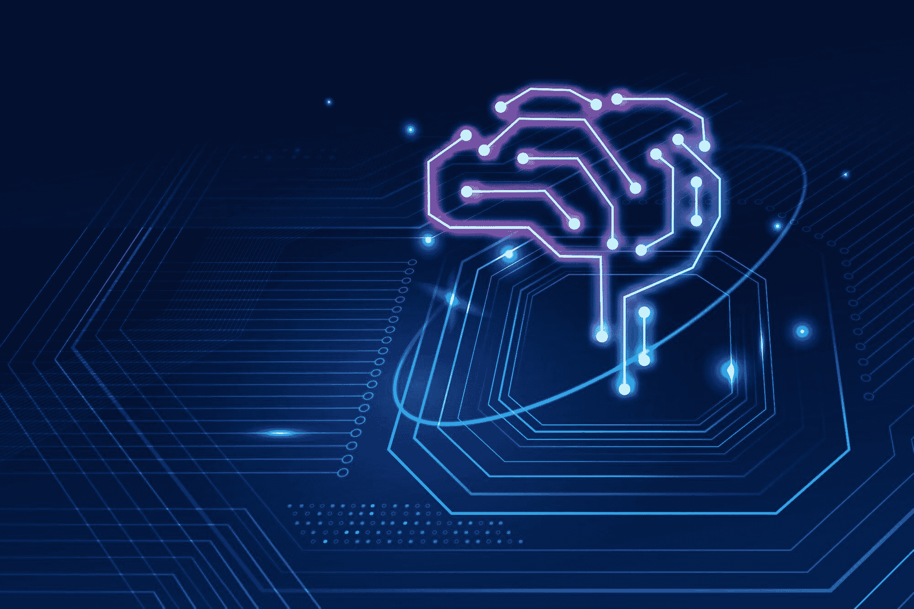

# 7 种最佳机器学习库解析

> 原文：[`www.kdnuggets.com/2023/01/7-best-libraries-machine-learning-explained.html`](https://www.kdnuggets.com/2023/01/7-best-libraries-machine-learning-explained.html)



图片由 [rawpixel.com](https://www.freepik.com/free-photo/ai-technology-brain-background-digital-transformation-concept_17164388.htm#query=machine%20learning&position=4&from_view=search&track=sph) 提供，来源于 Freepik

## 主要要点

* * *

## 我们的前三大课程推荐

 1\. [谷歌网络安全证书](https://www.kdnuggets.com/google-cybersecurity) - 快速进入网络安全职业的轨道。

 2\. [谷歌数据分析专业证书](https://www.kdnuggets.com/google-data-analytics) - 提升你的数据分析能力

 3\. [谷歌 IT 支持专业证书](https://www.kdnuggets.com/google-itsupport) - 支持你在 IT 领域的组织

* * *

+   机器学习库是构建和部署机器学习模型的重要工具

+   它们提供了一系列功能和算法，可用于训练和测试模型，并基于数据进行预测和决策。

+   有许多不同的机器学习库可供选择，每个库都有其自身的优势和能力，因此选择适合你项目的库非常重要。

+   机器学习库是机器学习生态系统的重要组成部分，全球的开发者和数据科学家广泛使用它们。

# 介绍

机器学习的概念可以追溯到 1950 年代，当时早期的人工智能（AI）系统和用于从数据中训练模型的算法开始出现。然而，第一批现代机器学习库，即提供用于实现和训练机器学习模型的工具和框架的库，直到 1980 年代和 1990 年代才出现。

最早的机器学习库之一是 1980 年代在卡内基梅隆大学开发的***Statlib*** ***库***。该库提供了用于统计分析和机器学习的工具，包括对决策树和神经网络的支持。

其他早期的机器学习库包括 1990 年代在新西兰怀卡托大学开发的***Weka*** ***库***，以及 1990 年代末在台湾大学开发的 LIBSVM 库。这些库提供了用于各种机器学习任务的工具，包括分类、回归和聚类。

随着时间的推移，机器学习领域不断发展壮大，如今有许多机器学习库可供选择，每个库都有其独特的功能和特点。

机器学习是一个快速发展的领域，具有在各个行业的众多应用。机器学习中常用的工具之一是库。在本文中，我们将解释什么是机器学习库以及如何使用它们。

在编程中，库是一个预先编写的代码集合，可以在程序中用于执行特定任务或任务集。库通常作为一种方式提供，供程序员重用已经编写和测试过的代码，而无需每次都从头编写所有代码。

机器学习库是提供构建和实施机器学习模型的工具和函数的软件库。它们是机器学习生态系统的重要组成部分，因为它们提供了一系列功能，使开发人员和数据科学家能够轻松构建、训练和部署机器学习模型。

有许多机器学习库可用，每个库都有自己独特的功能和能力。一些最受欢迎的机器学习库包括 NumPy、Matplotlib、Pandas、Scikit-Learn、TensorFlow、PyTorch 和 Keras。

# NumPy

NumPy 是一个用于科学计算的 Python 库，在机器学习领域被广泛使用。它提供了一个高性能的多维数组对象，以及用于操作这些数组的工具。在机器学习中，NumPy 通常用于存储和操作作为机器学习模型输入的大量数据，并对这些数据进行数学运算，以便为机器学习算法的使用做准备。NumPy 可以按如下方式在 Python 中导入：

```py
import numpy as np
```

# Matplotlib

Matplotlib 是一个全面的库，用于在 Python 中创建静态、动画和交互式可视化。Matplotlib 可以按如下方式导入：

```py
import matplotlib.pyplot as plt
```

# pandas

Pandas 是一个快速、强大、灵活且易于使用的开源数据分析和操作工具，基于 Python 编程语言构建。Pandas 可以按如下方式导入：

```py
import pandas as pd
```

# Scikit-learn

Scikit-learn 是一个用于 Python 的机器学习库。它被设计为易于使用，并提供了一系列构建和训练机器学习模型的工具。Scikit-learn 重点关注监督学习，并提供分类、回归和聚类的各种算法。它还具有特征选择、降维和模型评估的工具。由于其简单直观的界面和丰富的文档，scikit-learn 是初学者和专家的热门选择。以下是一些 Scikit-learn 的示例：

```py
from sklearn.preprocessing import OneHotEncoder

from sklearn.model_selection import train_test_split

from sklearn.model_selection import train_test_split

from sklearn.linear_model import LinearRegression

from sklearn.metrics import r2_score
```

# TensorFlow

TensorFlow 是一个由 Google 开发的机器学习库。它广泛用于构建、训练和部署机器学习模型，尤其侧重于深度学习。TensorFlow 提供了一整套构建和训练神经网络的工具，包括对卷积神经网络（CNN）和长短期记忆（LSTM）网络的支持。它还具有灵活高效的执行模型，使开发者能够构建可以在各种硬件上运行的模型，包括 CPU、GPU 和 TPU。可以通过以下方式在 Python 中导入 TensorFlow：

```py
import tensorflow as tf
```

# PyTorch

PyTorch 是一个由 Facebook 开发的 Python 机器学习库。它设计用于快速灵活的原型开发，特别侧重于深度学习。PyTorch 具有动态执行模型，允许开发者在训练过程中轻松修改模型。它还支持 GPU 加速，非常适合训练大型和复杂的模型。PyTorch 拥有一个不断增长的社区，并被广泛用于研究和生产机器学习应用。可以通过以下方式导入 PyTorch：

```py
import torch
```

# Keras

Keras 是一个构建在 TensorFlow 之上的高级机器学习库。它旨在简化深度学习模型的构建和训练。Keras 提供了一系列层和模型，可用于构建神经网络和其他机器学习模型。

```py
import tensorflow as tf
from tensorflow import keras 
```

除了这些库，还有许多其他机器学习库可用，包括 Theano、MXNet 和 Scipy。这些库各自具有独特的功能和能力，选择适合你项目的库将取决于你的具体需求和要求。

# 案例研究

使用 Python 库实现多元回归机器学习模型，用于预测邮轮的船员数量。


图片来源：Unsplash

在此案例研究中，使用了多元回归模型来构建一个机器学习模型，用于根据特征如 ['Tonnage', 'passengers', 'length', 'cabins'] 预测邮轮的船员数量。此案例研究中使用了以下库：

+   *NumPy*

+   *Matplotlib*

+   *Pandas*

+   *Scikit-learn*

本项目的数据集和代码可以从这里下载：

[`github.com/bot13956/ML_Model_for_Predicting_Ships_Crew_Size`](https://github.com/bot13956/ML_Model_for_Predicting_Ships_Crew_Size)

总之，机器学习库是构建和部署机器学习模型的重要工具。它们提供了一系列功能和算法，可用于训练和测试模型，以及根据数据进行预测和决策。现有许多不同的机器学习库，每种库都有其独特的优势和能力，因此选择适合你项目的库非常重要。机器学习库是机器学习生态系统的核心部分，被全球的开发者和数据科学家广泛使用。

**[本杰明·O·泰约](https://www.linkedin.com/in/benjamin-o-tayo-ph-d-a2717511/)** 是一位物理学家、数据科学教育者和作家，也是 DataScienceHub 的所有者。之前，本杰明曾在中央俄克拉荷马大学、大峡谷大学和匹兹堡州立大学教授工程学和物理学。

### 更多相关话题

+   [数据科学、数据可视化及…的前 38 大 Python 库](https://www.kdnuggets.com/2020/11/top-python-libraries-data-science-data-visualization-machine-learning.html)

+   [机器学习关键术语解释](https://www.kdnuggets.com/2016/05/machine-learning-key-terms-explained.html)

+   [KDnuggets 新闻，11 月 16 日：LinkedIn 如何使用机器学习 •…](https://www.kdnuggets.com/2022/n45.html)

+   [5 种机器学习模型解释，5 分钟](https://www.kdnuggets.com/5-machine-learning-models-explained-in-5-minutes)

+   [一分钟内解释的机器学习算法](https://www.kdnuggets.com/2022/07/machine-learning-algorithms-explained-less-1-minute.html)

+   [KDnuggets 新闻，7 月 20 日：机器学习算法解释…](https://www.kdnuggets.com/2022/n29.html)
