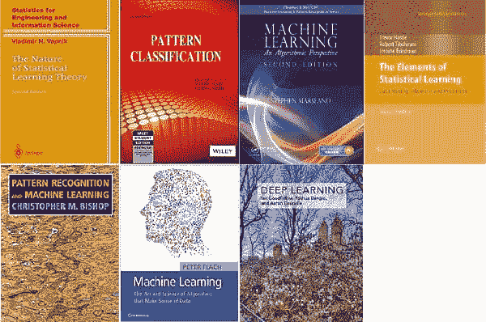

# 掌握数据科学和机器学习数学基础的 7 本书

> 原文：[`www.kdnuggets.com/2018/04/7-books-mathematical-foundations-data-science.html`](https://www.kdnuggets.com/2018/04/7-books-mathematical-foundations-data-science.html)

 评论

大多数人学习数据科学时侧重于编程。然而，要真正精通数据科学（和机器学习），你不能忽视数据科学背后的数学基础。在这篇文章中，我展示了七本我在学习数据科学数学基础时喜欢的书籍。‘喜欢’可能不是最合适的词，因为这项工作很艰难！

那么，为什么你应该努力学习数据科学的数学基础呢？

* * *

## 我们的前三大课程推荐

 1\. [谷歌网络安全证书](https://www.kdnuggets.com/google-cybersecurity) - 快速进入网络安全职业生涯。

 2\. [谷歌数据分析专业证书](https://www.kdnuggets.com/google-data-analytics) - 提升你的数据分析技能

 3\. [谷歌 IT 支持专业证书](https://www.kdnuggets.com/google-itsupport) - 支持你的组织的 IT

* * *

**以下是一些激励我的原因：**

AI 正在迅速变化。[Geoffrey Hinton 已经认为我们应该重新思考反向传播](https://www.quora.com/Why-is-Geoffrey-Hinton-suspicious-of-backpropagation-and-wants-AI-to-start-over)。理解数学将帮助你更好地理解 AI 的演变。它将帮助你区别于那些从表面层次接触 AI 的人。这也将帮助你更好地看到 AI 的知识产权(IP)潜力。最后，理解数据科学背后的数学也可能使你获得更高端的 AI 和数据科学职位。

我有两个额外的动机来研究这些书籍。

1.  首先，作为我在牛津大学教授物联网数据科学课程的一部分，以及[我个人在 AI 应用方面的教学](http://www.opengardensblog.futuretext.com/archives/2018/03/ai-deep-learning-applications-course-limited-spaces.html)，我包括了基于数学的方法。

1.  其次，我正在写一本书，旨在从数学角度简化 AI，以适合 14 至 18 岁的学生。要理解数据科学和 AI 的数学基础，你需要了解四个方面，即线性代数、概率论、多变量微积分和优化。大多数这些内容在高中（至少部分）会教授。因此，我试图将高中数学与 AI 和数据科学联系起来，重点是数学建模。欢迎对这种方法提出评论。

**所以，这是带有我评论的书单：**

1\. **[统计学习理论的本质](https://www.amazon.com/Nature-Statistical-Learning-Theory/dp/8132202597/ref=redir_mobile_desktop?_encoding=UTF8&dpID=11poThT9XmL&dpPl=1&keywords=vapnik&pi=AC_SX118_SY170_QL70&qid=1522414077&ref=plSrch&ref_=mp_s_a_1_1&sr=8-1)**

作者：弗拉基米尔·瓦普尼克

> 你不能创建一个关于数学书籍的列表而不包括伟大的俄罗斯数学家！所以，我列表中的第一个是*统计学习理论的本质*，作者是弗拉基米尔·瓦普尼克。在这个列表中的所有书籍中，瓦普尼克的书是最难找到的。我有一本较旧的印度版。弗拉基米尔·瓦普尼克是 SVM 的创造者。他的[维基百科页面](https://en.wikipedia.org/wiki/Vladimir_Vapnik)提供了更多关于他工作的内容。

2\. **[模式分类（理查德·O·杜达）](https://www.amazon.co.uk/dp/B01N9M71LT/ref=cm_sw_r_em_apa_WdJVAb3037FVR)**

作者：理查德·O·杜达

> 像瓦普尼克博士的书一样，杜达的书也是另一个时代的经典。首次出版于 1973 年，25 年后（2000 年）更新一次，之后没有再更新！但仍然是一个重要的资源。这本书采用了模式识别的方法，提供了广泛的算法覆盖。

3\. **[机器学习：算法视角（第二版）（Chapman & Hall/Crc 机器学习与模式识别）](https://www.amazon.co.uk/Machine-Learning-Algorithmic-Perspective-Recognition/dp/1466583282/ref=sr_1_1?ie=UTF8&qid=1522398255&sr=8-1&keywords=marsland+machine+learning&dpID=51JVZWc%252BctL&preST=_SY291_BO1,204,203,200_QL40_&dpSrc=srch)**

作者：斯蒂芬·马斯兰

> 斯蒂芬·马斯兰的书现在已经是第二版了。马斯兰是我早期读过的书之一（我只有第一版）。两版都非常好。我相信第二版有更多的 Python 代码。和前两本书一样，这本书也对算法给予了很大关注。

4\. **[统计学习的要素：数据挖掘、推断与预测（第二版）](https://www.amazon.co.uk/dp/0387848576/ref=cm_sw_r_em_apa_o-aWAbXMMFM4Z)**

作者：特雷弗·哈斯提，罗伯特·蒂布希拉尼，杰罗姆·弗里德曼

> Hastie 是另一本经典之作。我拥有的版本印刷得很好，颜色丰富。这是另一本参考书。

5\. **[模式识别与机器学习（信息科学与统计）](https://www.amazon.co.uk/Pattern-Recognition-Learning-Information-Statistics/dp/0387310738/ref=sr_1_1?ie=UTF8&qid=1522510002&sr=8-1&keywords=bishop&dpID=61FKyOeM7KL&preST=_SY344_BO1,204,203,200_QL70_&dpSrc=srch)**

作者：克里斯托弗·M·比 ishop

> 克里斯托弗·M·比 ishop 的《模式识别与机器学习（信息科学与统计）》也是一本深入且表现良好的参考书。

6\. **[机器学习：使数据有意义的算法的艺术与科学](https://www.amazon.co.uk/Machine-Learning-Science-Algorithms-Sense/dp/1107422221/ref=sr_1_1?ie=UTF8&qid=1522570580&sr=8-1&keywords=machine+learning+peter+flach)**

作者：彼得·弗拉奇

> 我喜欢彼得·弗拉赫（Peter Flach）的书，尽管一些亚马逊评论称其内容冗长，并指出缺乏代码。我尤其喜欢弗拉赫对算法的分组（逻辑模型、线性模型、概率模型）以及对主题的整体处理。

最后，我最推荐的书：

7\. **[深度学习](https://www.amazon.co.uk/Deep-Learning-Adaptive-Computation-Machine/dp/0262035618/ref=sr_1_1?ie=UTF8&qid=1523226978&sr=8-1&keywords=bengio+deep+learning)**

作者：古德费洛（Goodfellow）、本吉奥（Bengio）和考维尔（Corville）

> 如果有一本书你应该从头到尾读，那就是这本。这本书详细且现代，涵盖了你能想到的一切。

**再推荐两本值得一读的书**

+   [《机器学习入门（第二版）（机器学习与模式识别）》作者：西蒙·罗杰斯（Simon Rogers）、马克·吉罗拉米（Mark Girolami）](https://www.amazon.co.uk/Course-Machine-Learning-Pattern-Recognition/dp/1498738486/ref=sr_1_1?s=books&ie=UTF8&qid=1522571642&sr=1-1&keywords=first+course+in+machine+learning&dpID=51DErx%252B11qL&preST=_SY291_BO1,204,203,200_QL40_&dpSrc=srch) 这是我得到的第一本书（第一版）。我不建议初学者阅读，但它仍然是一本很好的书（特别是第二版）。

+   [Kevin Murphy 的《机器学习：概率视角》](https://www.amazon.co.uk/Machine-Learning-Probabilistic-Perspective-Computation/dp/0262018020/ref=pd_sim_14_1?_encoding=UTF8&psc=1&refRID=HGHRTE5MSRMZNVGZTSR4) 评价很高——但我个人还没有读过（因此未在列表中）。

如果你能推荐我遗漏的书，请告诉我。

**总结评论：**

1.  除了可能的古德费洛-本吉奥的书，我不建议从头到尾阅读这些书。我更喜欢按需按主题阅读这些书，即作为参考书。我还喜欢不同作者的例子，比如杜达（Duda）的鱼分类；- 哈斯蒂（Hastie）的广告数据销售电视和广播；弗拉赫（Flach）用海洋动物的例子解释假设空间等等。

1.  我发现这些书教会了我一种谦逊感，即我们知道的非常有限，而这个领域则非常广阔复杂。

1.  这些书是永恒的。弗拉基米尔·瓦普尼克（Vladimir Vapnik）现在 81 岁了。杜达（Duda）的书首次出版于 1973 年。我预计 50 年后，业内仍会继续阅读这些书，就像经历了时间考验的老朋友。这是一个令人安慰的想法。它展示了基于数学的方法的持久性。

**相关：**

+   [深度学习的 8 本免费必读书籍](https://www.kdnuggets.com/2018/04/top-free-books-deep-learning.html)

+   [了解机器学习的 12 件有用的事情](https://www.kdnuggets.com/2018/04/12-useful-things-know-about-machine-learning.html)

+   [不要在 24 小时内学习机器学习](https://www.kdnuggets.com/2018/04/dont-learn-machine-learning-24-hours.html)

### 更多相关内容

+   [建立一个坚实的数据团队](https://www.kdnuggets.com/2021/12/build-solid-data-team.html)

+   [使用管道编写干净的 Python 代码](https://www.kdnuggets.com/2021/12/write-clean-python-code-pipes.html)

+   [成为优秀数据科学家所需的 5 项关键技能](https://www.kdnuggets.com/2021/12/5-key-skills-needed-become-great-data-scientist.html)

+   [每位初学者数据科学家应掌握的 6 种预测模型](https://www.kdnuggets.com/2021/12/6-predictive-models-every-beginner-data-scientist-master.html)

+   [2021 年最佳 ETL 工具](https://www.kdnuggets.com/2021/12/mozart-best-etl-tools-2021.html)

+   [基础回顾 第 1 周：Python 编程与数据科学基础](https://www.kdnuggets.com/back-to-basics-week-1-python-programming-data-science-foundations)
