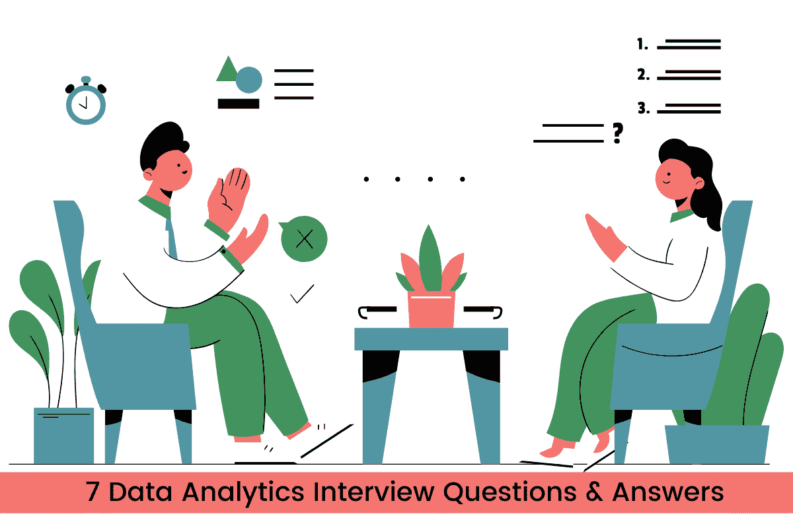

# 7 个数据分析面试问题及答案

> 原文：[`www.kdnuggets.com/2022/09/7-data-analytics-interview-questions-answers.html`](https://www.kdnuggets.com/2022/09/7-data-analytics-interview-questions-answers.html)



图片由作者提供

数据分析面试分为多个部分，如非技术性、技术性和 SQL。招聘经理将评估你对统计工具和概念的了解。此外，你还会被问到情境问题，要求你解释如何准备分析报告、清理数据或进行图表解读。

* * *

## 我们的前三个课程推荐

 1\. [Google 网络安全证书](https://www.kdnuggets.com/google-cybersecurity) - 快速进入网络安全职业轨道

 2\. [Google 数据分析专业证书](https://www.kdnuggets.com/google-data-analytics) - 提升你的数据分析水平

 3\. [Google IT 支持专业证书](https://www.kdnuggets.com/google-itsupport) - 支持你组织的 IT 需求

* * *

在这篇博客中，我们将探讨在数据分析面试中常见的七个具有挑战性的问题。

# 非技术性问题

## 1\. 你如何向非技术观众解释技术概念？

在这个问题中，面试官正在评估你的沟通、演讲和人际交往技能。能够向管理者或客户解释技术概念是一项重要技能。

除了均值、相关性或数据分布等技术术语外，你还需要了解更多关于数据及其特征的知识。尝试连接对业务有意义的点。你需要确保理解业务和受众，以便用通俗的语言解释概念。

## 2\. 定义这个产品成功的前三个指标是什么？你会如何选择？

为了回答这个问题，你需要了解行业、业务和产品的领域知识。你可以请面试官讲述公司的战略和愿景，这有助于你形成答案。

对于社交媒体产品，三个指标可以是每日活跃用户数、前两周内添加好友的用户数量和每周的帖子数量。这些指标基于公司的愿景和产品策略。因此，在面试前最好先研究一下公司。

# 技术性问题

## 3\. 什么是描述性分析、预测性分析和规范性分析？

描述性分析提供对过去的洞察，以回答类似“营销活动与去年相比表现如何”的问题

预测性分析是利用洞察力来预测未来事件或预测增长。

规范性分析用于建议各种行动方案，以防止灾难或改进产品。

## 4\. 数据分析项目涉及哪些步骤？

这个问题完全取决于你。一般来说，数据分析项目包括理解问题陈述、收集数据、清理数据、探索、分析和可视化数据，最后为非技术观众解释结果。你还可以根据具体问题提到工具、技术和额外步骤。

## 5\. 如何处理数据集中的缺失值？

处理缺失数据的方法有很多。最常用的方法是删除缺失值的行，如果数据集较大且平衡的话。

除此之外，你还可以：

+   删除缺失值的列

+   用常数填充。

+   平均值和中位数填补。你将用列的平均值或中位数替换缺失值。

+   使用多元回归分析来估算缺失值

+   考虑多个列，用平均模拟值和随机误差替换缺失值。

# SQL 问题

## 6\. 创建一个 SQL 查询，从 employee_details 中检索重复记录，忽略主键和 EmpId。

解决方案很简单。你将选择所需的列并计算（*Count(*)*）。之后，按唯一标识进行分组，例如员工姓名、经理 ID、入职日期和城市。然后使用*HAVING*来筛选重复项。如果*Count(*)*值大于 1，则为重复记录。

你可以将相同的策略应用于任何表。确保按多个唯一 ID 列（例如姓名和地址）对表进行分组。

**解决方案**：

```py
SELECT fullname,
       managerID,
       joining_date,
       city,
       COUNT(*)
FROM employee_details
GROUP BY fullname,
         managerID,
         joining_date,
         city
HAVING COUNT(*) > 1;
```

## 7\. 编写一个 SQL 查询，以查找在其演示文稿中插入了 1000 到 2000 张图像的用户数量

**表**: event_log

| **user_id** | **event_date_time** |
| --- | --- |
| 1255 | 1535308433 |
| 4566 | 1535308444 |
| 9566 | 1535308476 |
| … | … |

解决方案简单但棘手。首先，你需要计算每个用户的图像数量，然后计算图像数量在 1000 到 2000 之间的用户数量。

内部查询将计算**event_date_time**并按**user_id**分组，以找到每个用户的唯一用户 ID 和每个用户的图像数量。之后，创建外部查询，筛选出图像数量在 1000 到 2000 之间的用户，并计算他们的数量。

**解决方案**：

```py
SELECT COUNT(*)
FROM (
SELECT user_id,
       COUNT(event_date_time) AS image_per_user
FROM event_log
GROUP BY user_id AS image_per_user
WHERE image_per_user < 2000
  AND image_per_user > 1000;
```

## 参考

+   [前 60 名数据分析师面试问题及答案](https://www.simplilearn.com/tutorials/data-analytics-tutorial/data-analyst-interview-questions)

+   [初创公司数据分析师面试的 4 个案例研究问题](https://www.holistics.io/blog/startup-data-analyst-interview-case-studies/)

+   [15 个数据分析师面试问题及答案](https://www.coursera.org/articles/data-analyst-interview-questions-and-answers)

+   [30 个数据分析师的 SQL 面试问题及答案](https://www.projectpro.io/article/sql-interview-questions-and-answers-for-data-analyst/484)

+   [SQL 面试问题：数据分析师的 3 个技术筛选练习](https://data36.com/sql-interview-questions-tech-screening-data-analysts/)

**[Abid Ali Awan](https://www.polywork.com/kingabzpro)** ([@1abidaliawan](https://twitter.com/1abidaliawan)) 是一名认证的数据科学专业人士，热衷于构建机器学习模型。目前，他专注于内容创作，并撰写关于机器学习和数据科学技术的技术博客。Abid 拥有技术管理硕士学位和电信工程学士学位。他的愿景是利用图神经网络构建一个 AI 产品，帮助那些面临心理健康问题的学生。

### 更多相关话题

+   [5 个 Python 面试问题及答案](https://www.kdnuggets.com/2022/09/5-python-interview-questions-answers.html)

+   [20 个问题（附答案）来识别虚假的数据科学家：ChatGPT…](https://www.kdnuggets.com/2023/01/20-questions-detect-fake-data-scientists-chatgpt-1.html)

+   [20 个问题（附答案）来识别虚假的数据科学家：ChatGPT…](https://www.kdnuggets.com/2023/02/20-questions-detect-fake-data-scientists-chatgpt-2.html)

+   [KDnuggets 新闻，5 月 4 日：9 门免费的哈佛课程来学习数据…](https://www.kdnuggets.com/2022/n18.html)

+   [如何回答数据科学编程面试问题](https://www.kdnuggets.com/2022/01/answer-data-science-coding-interview-questions.html)

+   [15 道你必须知道的 Python 编程面试题](https://www.kdnuggets.com/2022/04/15-python-coding-interview-questions-must-know-data-science.html)


[](/news/subscribe.html)

获取免费的电子书《伟大的自然语言处理入门》和《数据科学备忘单全集》，以及有关数据科学、机器学习、人工智能和分析的领先新闻直达你的邮箱。

订阅即表示你接受 KDnuggets 的 [隐私政策](https://www.kdnuggets.com/news/privacy-policy.html)

* * *

[<= 上一篇文章](https://www.kdnuggets.com/2022/09/everything-youve-ever-wanted-to-know-about-machine-learning.html)[下一篇文章 =>](https://www.kdnuggets.com/2017/02/removing-outliers-standard-deviation-python.html)

### 最新帖子

+   [你可能错过的 7 个免费的数据科学云 IDE](https://www.kdnuggets.com/7-free-cloud-ide-for-data-science-that-you-are-missing-out)

+   [启动你的数据科学职业生涯：自学路径指南](https://www.kdnuggets.com/bootstrapping-your-data-science-career-a-guide-to-self-learning-pathways)

+   [开发端到端数据科学管道：数据摄取、处理和可视化](https://www.kdnuggets.com/developing-end-to-end-data-science-pipelines-with-data-ingestion-processing-and-visualization)

+   [如何跟踪 Python 中的内存分配](https://www.kdnuggets.com/how-to-trace-memory-allocation-in-python)

+   [如何在 R 中导入数据](https://www.kdnuggets.com/how-to-import-data-in-r)

+   [从实践者应知的前 5 名机器学习 API](https://www.kdnuggets.com/top-5-machine-learning-apis-practitioners-should-know)

|

## 精选帖子

|

+   [数据科学中 5 个隐藏的 Python 库](https://www.kdnuggets.com/5-hidden-gem-python-libraries-for-data-science)

+   [微软 4 个入门级证书，助你获得热门职位](https://www.kdnuggets.com/4-entry-level-certificates-from-microsoft-to-land-in-demand-jobs)

+   [掌握数据科学数学的 7 个步骤](https://www.kdnuggets.com/7-steps-to-mastering-math-for-data-science)

+   [如何有效管理 Pandas 中的分类数据](https://www.kdnuggets.com/how-to-manage-categorical-data-effectively-with-pandas)

+   [每个数据工程师都应该知道的 10 个内置 Python 模块](https://www.kdnuggets.com/10-built-in-python-modules-every-data-engineer-should-know)

+   [使用 FastAPI 构建机器学习驱动的 Web 应用](https://www.kdnuggets.com/using-fastapi-for-building-ml-powered-web-apps)

+   [我参加了 Udacity 的 Google 免费 A/B 测试课程：我学到了什么](https://www.kdnuggets.com/i-took-udacitys-free-a-b-testing-course-by-google-heres-what-i-learned)

+   [从实践者应知的前 5 名机器学习 API](https://www.kdnuggets.com/top-5-machine-learning-apis-practitioners-should-know)

+   [掌握数据工程的项目创意](https://www.kdnuggets.com/project-ideas-to-master-data-engineering)

+   [在本地使用 FLUX.1](https://www.kdnuggets.com/using-flux-1-locally)

* * *

© 2024 [Guiding Tech Media](https://www.guidingtechmedia.com/)   |   关于我们   |   联系我们   |   广告 |   隐私政策   |   服务条款

由 Abid Ali Awan 于 2022 年 9 月 12 日发布
