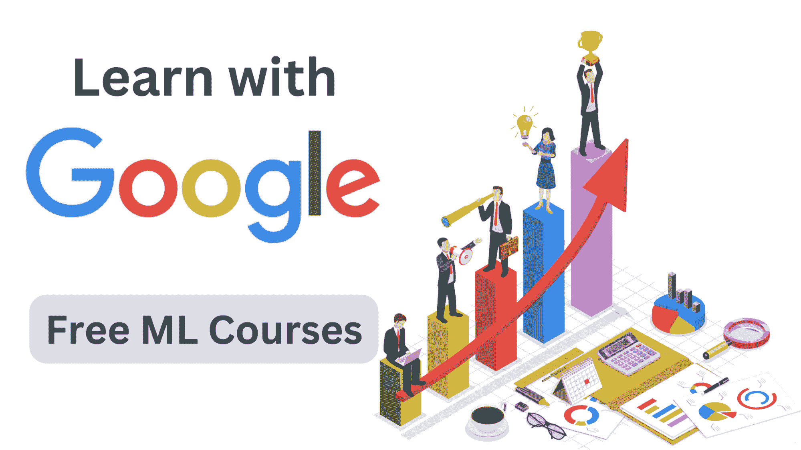

# 成为机器学习工程师的 7 个免费 Google 课程

> 原文：[`www.kdnuggets.com/7-free-google-courses-to-become-a-machine-learning-engineer`](https://www.kdnuggets.com/7-free-google-courses-to-become-a-machine-learning-engineer)

图片来源：作者

作为机器学习工程师，你可以构建有效的机器学习解决方案来应对现实世界的挑战。听起来很激动人心，对吧？那么，如何成为一名机器学习工程师，你应该学习什么？

* * *

## 我们的前三个课程推荐

 1\. [Google 网络安全证书](https://www.kdnuggets.com/google-cybersecurity) - 快速进入网络安全职业生涯。

 2\. [Google 数据分析专业证书](https://www.kdnuggets.com/google-data-analytics) - 提升你的数据分析技能

 3\. [Google IT 支持专业证书](https://www.kdnuggets.com/google-itsupport) - 支持你的组织 IT

* * *

这份来自 Google 的免费课程合集将帮助你从机器学习新手成长为能够理解和框架现实世界问题的熟练 ML 工程师，这些问题可以用机器学习来解决。这些课程还将帮助你学习先进的机器学习技术，以及设计、测试和调试机器学习管道。

让我们开始吧。

# 1\. 机器学习简介

如果你是机器学习新手，可以考虑从这个适合初学者的[机器学习简介](https://developers.google.com/machine-learning/intro-to-ml)课程开始。

在这门课程中，你将学习：

+   机器学习的类型

+   监督学习的关键概念

+   机器学习与传统问题解决方法的不同之处

链接：[机器学习简介](https://developers.google.com/machine-learning/intro-to-ml)

# 2\. 机器学习速成课程

[机器学习速成课程](https://developers.google.com/machine-learning/crash-course)是一个使用 TensorFlow 框架的实践入门课程。你将学习机器学习算法是如何工作的以及如何在 TensorFlow 中实现它们。

这门课程分为以下几个部分：

+   机器学习概念

+   机器学习工程

+   现实世界中的机器学习

链接：[机器学习速成课程](https://developers.google.com/machine-learning/crash-course)

# 3\. 机器学习问题框架

面对一个现实世界的问题，你如何使用机器学习框架来解决它？首先，你怎么确定机器学习是否必要来解决这个特定问题？

这就是[机器学习问题框架](https://developers.google.com/machine-learning/problem-framing)课程变得相关的地方。在这门课程中，你将学习如何：

+   决定机器学习是否是解决你所面临问题的好方法

+   框架机器学习问题

+   选择合适的机器学习模型

+   为模型定义成功指标

链接: [机器学习问题框架介绍](https://developers.google.com/machine-learning/problem-framing)

# 4\. 数据准备与特征工程

机器学习远不止是将原始数据投入并训练机器学习算法。你必须花时间了解你的数据，并专注于特征工程以识别最相关和重要的特征，处理并根据需要进行转换。

[数据准备与特征工程](https://developers.google.com/machine-learning/data-prep)课程将教你以下内容：

+   数据质量和数据大小的影响

+   机器学习工作流中的数据收集与转换

+   收集原始数据并从中构建可用的数据集

+   处理不平衡数据

+   处理数值和类别数据

链接: [数据准备与特征工程](https://developers.google.com/machine-learning/data-prep)

# 5\. 测试与调试

调试和测试机器学习系统比测试传统软件系统更加复杂且不同。

[测试与调试](https://developers.google.com/machine-learning/testing-debugging)机器学习模型的课程将教你以下内容：

+   调试机器学习模型

+   实施测试以帮助调试

+   优化机器学习模型

+   监控模型指标

链接: [测试与调试](https://developers.google.com/machine-learning/testing-debugging)

# 6\. 聚类

聚类是最广泛使用的无监督学习算法之一。在[聚类](https://developers.google.com/machine-learning/clustering)课程中的动手介绍中，你将学习以下内容：

+   机器学习中的聚类

+   准备数据

+   定义相似性

+   K 均值聚类

+   评估聚类算法的结果

链接: [聚类](https://developers.google.com/machine-learning/clustering)

# 7\. 推荐系统

从亚马逊和其他在线购物网站的推荐到 Netflix 上的系列推荐，推荐系统在我们的日常生活中非常相关。

[推荐系统](https://developers.google.com/machine-learning/recommendation)课程将教你推荐系统的组成部分以及如何构建你自己的应用程序。以下是你将学习的内容概述：

+   推荐系统的组成部分

+   嵌入

+   TensorFlow 实现的推荐算法

链接: [推荐系统](https://developers.google.com/machine-learning/recommendation)

# 总结

我希望你发现这些免费课程的总结有帮助。这些课程大多旨在为你提供足够的实践机会，并帮助你构建自己的项目。

因此，尝试构建你自己的项目，以应用你在课程中所学到的知识。这将有助于你巩固理解，并建立你的项目组合。祝学习和编码愉快！

****[Bala Priya C](https://www.kdnuggets.com/wp-content/uploads/bala-priya-author-image-update-230821.jpg)**** 是来自印度的开发者和技术写作者。她喜欢在数学、编程、数据科学和内容创作的交集处工作。她的兴趣和专长领域包括 DevOps、数据科学和自然语言处理。她喜欢阅读、写作、编程和咖啡！目前，她正在通过撰写教程、指南、观点文章等来学习并与开发者社区分享她的知识。Bala 还创建了引人入胜的资源概述和编码教程。

### 更多相关主题

+   [5 门免费 Google 课程，助你成为软件工程师](https://www.kdnuggets.com/5-free-google-courses-to-become-a-software-engineer)

+   [成为专业数据工程师所需的唯一免费课程](https://www.kdnuggets.com/the-only-free-course-you-need-to-become-a-professional-data-engineer)

+   [成为 MLOps 工程师所需的唯一免费课程](https://www.kdnuggets.com/the-only-free-course-you-need-to-become-a-mlops-engineer)

+   [如何成为机器学习工程师](https://www.kdnuggets.com/2022/05/become-machine-learning-engineer.html)

+   [成为 SAS 认证机器学习工程师所需的一切](https://www.kdnuggets.com/2023/11/sas-everything-need-become-sas-certified-machine-learning-engineer)

+   [成为数据工程师所需的 9 项技能](https://www.kdnuggets.com/2021/03/9-skills-become-data-engineer.html)
