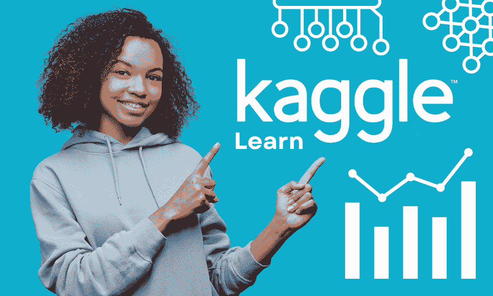

# 7 个免费 Kaggle 微课程

> 原文：[`www.kdnuggets.com/7-free-kaggle-micro-courses-for-data-science-beginners`](https://www.kdnuggets.com/7-free-kaggle-micro-courses-for-data-science-beginners)

编辑器提供的图像

你是否还记得那个你报名但从未完成的数据科学课程？嗯，你并不孤单。

* * *

## 我们的前 3 个课程推荐

 1\. [谷歌网络安全证书](https://www.kdnuggets.com/google-cybersecurity) - 快速入门网络安全职业。

 2\. [谷歌数据分析专业证书](https://www.kdnuggets.com/google-data-analytics) - 提升你的数据分析技能

 3\. [谷歌 IT 支持专业证书](https://www.kdnuggets.com/google-itsupport) - 支持你的组织的 IT 工作

* * *

大多数数据科学初学者会报名一个或多个课程：免费或付费。但由于数据科学课程通常涵盖广泛的主题——从编程到数据分析、可视化等等——需要几周时间才能完成。即使它们起步强劲，大多数学习者在前几个模块后开始感到不知所措，进展缓慢。**进入 Kaggle（微）课程。**

如果你发现长时间课程难以完成，[Kaggle 的微课程](https://www.kaggle.com/learn/) 是一个不错的替代选择。它们是学习数据科学技能的绝佳资源——Python、pandas、机器学习等——而不会感到不堪重负。这些课程设计得仅需几个小时即可完成，并包括教程和实践环节。现在让我们来看看一些适合初学者的课程及其内容。

# 1\. Python

Python 是数据科学中最广泛使用的语言之一。除了帮助你在数据职业中，Python 还对你想要进入软件工程领域时非常有帮助。Kaggle 上的 Python 课程将帮助你学习以下内容：

+   Python 基础（语法和变量）

+   函数

+   布尔值和条件语句

+   列表、循环和列表推导式

+   字符串和字典

+   使用外部库

如果你觉得在深入学习 Python 之前需要一个更简单的编程介绍，你可以查看[编程入门](https://www.kaggle.com/learn/intro-to-programming)课程。

因为随后的 Pandas 和数据可视化课程需要你对本课程内容感到熟悉，所以如果你是编程新手，应该不要跳过 Python 课程。

链接: [学习 Python](https://www.kaggle.com/learn/python)

# 2\. Pandas

一旦你熟悉了基础 Python，你可以 学习 pandas，这是一个强大的数据分析和处理库。

通过一系列简短的课程和动手编码练习，[pandas](https://www.kaggle.com/learn/pandas)将帮助你学习在 pandas 数据框上执行以下操作：

+   创建、读取和写入

+   索引、选择和分配

+   重命名和合并

+   汇总函数和映射

+   分组和排序

+   数据类型和缺失值

链接：[学习 Pandas](https://www.kaggle.com/learn/pandas)

# 3. 数据可视化

现在你知道如何使用 Python 和 pandas 分析数据，是时候通过学习如何可视化数据来进一步提升技能了。

[数据可视化](https://www.kaggle.com/learn/data-visualization)课程涵盖了使用 Python 库 Seaborn 创建有用图表和图形的基础知识。该课程包括以下内容：

+   折线图

+   条形图和热图

+   散点图

+   直方图和密度图

+   选择图表类型

你还需要完成一个最终项目，以应用你所学到的知识。

链接：[学习数据可视化](https://www.kaggle.com/learn/data-visualization)

# 4. SQL 入门

SQL 是你可以学习的单一最重要的数据科学技能。要了解为什么 SQL 对数据科学如此重要，请阅读 KDnuggets 撰稿人 Nate Rosidi 的 "为什么 SQL 是数据科学必学语言"。

[SQL 入门](https://www.kaggle.com/learn/intro-to-sql)课程将教你如何使用 BigQuery Python 客户端查询数据集，并涵盖 SQL 基础知识、过滤和编写可读的 SQL 查询：

+   开始学习 SQL 和 BigQuery

+   选择、从和哪里

+   分组、筛选和计数

+   排序

+   作为和与

+   数据连接

链接：[学习 SQL 入门](https://www.kaggle.com/learn/intro-to-sql)

# 5. 高级 SQL

现在你已经掌握了 SQL 基础，可以参加 [高级 SQL](https://www.kaggle.com/learn/advanced-sql)课程，以进一步提升你的 SQL 技能。此课程基于 SQL 入门课程，并涵盖了以下关于从多个表中结合数据和执行更复杂操作的主题：

+   连接和并集

+   分析函数

+   嵌套和重复数据

+   编写高效查询

链接：[学习高级 SQL](https://www.kaggle.com/learn/advanced-sql)

# 6. 机器学习入门

如果你已经完成了上述课程，你应该能够舒适地进行 Python 和 SQL 编程及数据分析。你现在已经准备好开始学习机器学习。

[机器学习入门](https://www.kaggle.com/learn/intro-to-machine-learning)课程包括：

+   机器学习模型的工作原理

+   基本数据探索

+   模型验证

+   欠拟合和过拟合

+   随机森林

你也可以提交到一个适合初学者的 Kaggle 比赛中。

链接: [学习机器学习简介](https://www.kaggle.com/learn/intro-to-machine-learning)

# 7\. 中级机器学习

[中级机器学习](https://www.kaggle.com/learn/intermediate-machine-learning)课程在机器学习简介课程的基础上进行，教你如何处理缺失值、分类变量，并避免在训练机器学习模型时出现数据泄漏的棘手问题。

涵盖的主题包括：

+   缺失值

+   分类变量

+   机器学习管道

+   交叉验证

+   XGBoost

+   数据泄漏

链接: [中级机器学习](https://www.kaggle.com/learn/intermediate-machine-learning)

# 总结

希望你觉得这次课程总结对你有帮助。

如前所述，这些课程都是免费的。学习一个基础的数据科学技能只需几小时。因此，你可以通过一个个微课程来开始你的数据科学之旅。祝学习愉快！

****[Bala Priya C](https://www.kdnuggets.com/wp-content/uploads/bala-priya-author-image-update-230821.jpg)**是来自印度的开发者和技术作家。她喜欢在数学、编程、数据科学和内容创作的交汇点上工作。她的兴趣和专长领域包括 DevOps、数据科学和自然语言处理。她喜欢阅读、写作、编程和咖啡！目前，她正在通过撰写教程、使用指南、观点文章等来学习和与开发者社区分享她的知识。Bala 还制作了引人入胜的资源概述和编码教程。**

### 更多相关内容

+   [5 门免费的 SQL 课程供数据科学初学者使用](https://www.kdnuggets.com/5-free-sql-courses-for-data-science-beginners)

+   [5 门免费的 Python 课程供数据科学初学者使用](https://www.kdnuggets.com/5-free-python-courses-for-data-science-beginners)

+   [2024 年成为数据科学家的前 10 个 Kaggle 机器学习项目](https://www.kdnuggets.com/top-10-kaggle-machine-learning-projects-to-become-data-scientist-in-2024)

+   [在 Kaggle 竞争的前 4 个技巧及你为什么应该开始](https://www.kdnuggets.com/2022/05/packt-top-4-tricks-competing-kaggle-start.html)

+   [最全面的 Kaggle 解决方案和创意列表](https://www.kdnuggets.com/2022/11/comprehensive-list-kaggle-solutions-ideas.html)

+   [Kaggle 竞赛对现实世界问题有用吗？](https://www.kdnuggets.com/are-kaggle-competitions-useful-for-real-world-problems)
