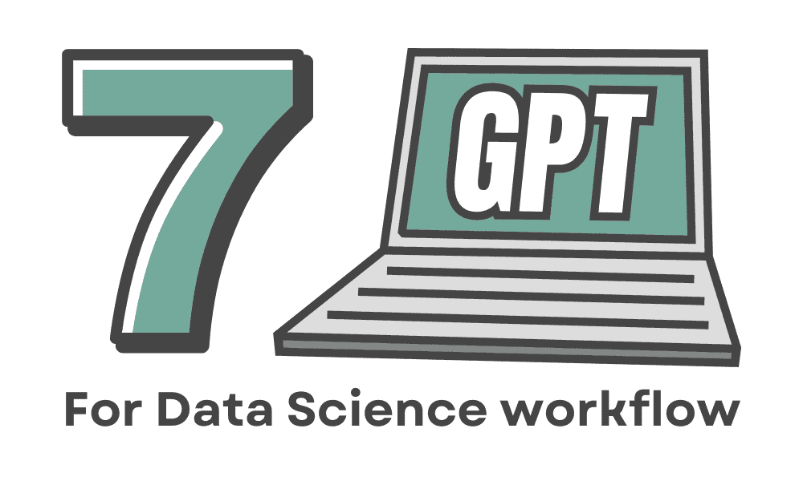
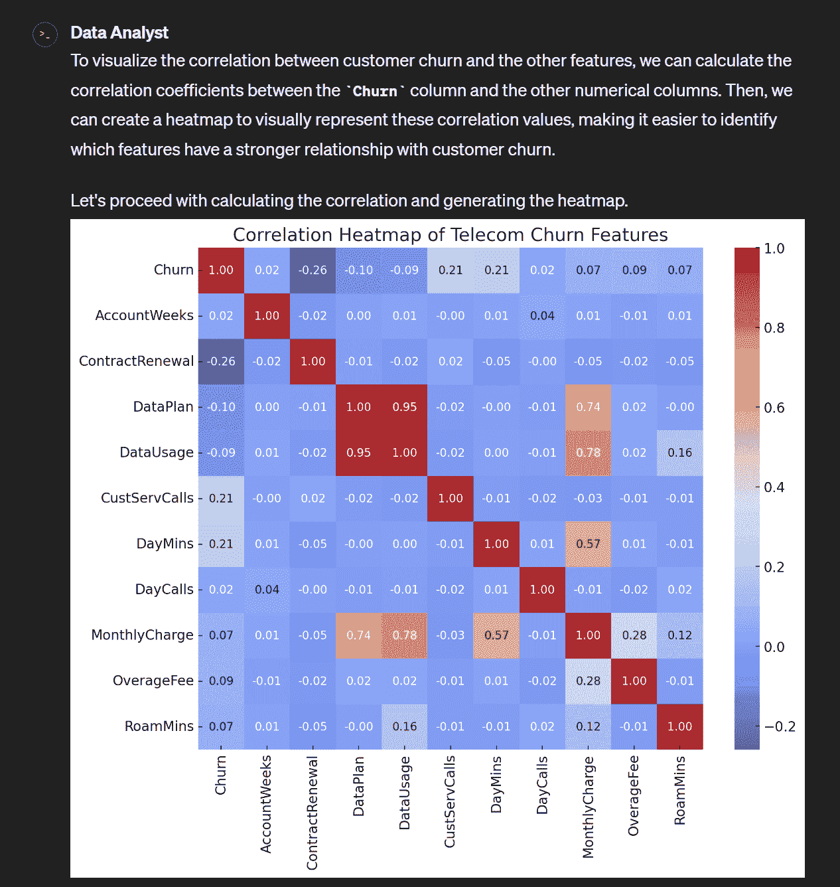
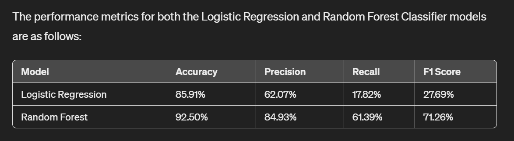
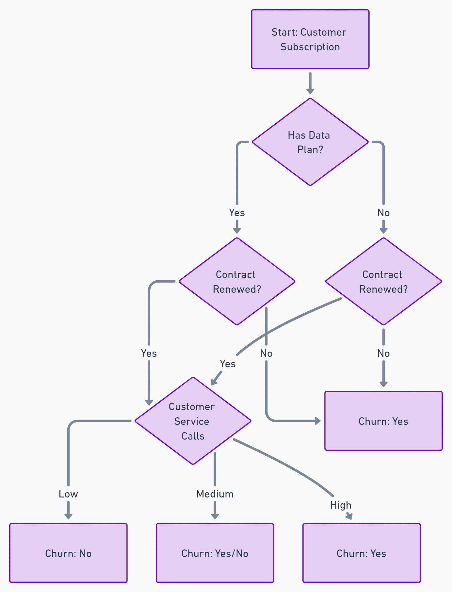
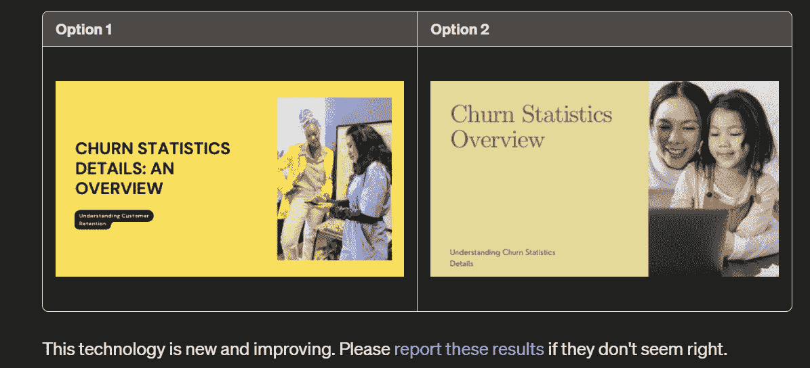

# 提升数据科学工作流程的 7 个 GPT

> 原文：[`www.kdnuggets.com/7-gpts-to-help-improve-your-data-science-workflow`](https://www.kdnuggets.com/7-gpts-to-help-improve-your-data-science-workflow)

图片由编辑提供

ChatGPT 已经成为改变世界运作方式的 OpenAI 产品。许多读者已经在使用它们，或者至少在测试它们。它帮助我们的方式，让我觉得我们可能无法回到过去的工作方式。

* * *

## 我们的前三个课程推荐

 1\. [谷歌网络安全证书](https://www.kdnuggets.com/google-cybersecurity) - 快速进入网络安全职业的快车道。

 2\. [谷歌数据分析专业证书](https://www.kdnuggets.com/google-data-analytics) - 提升你的数据分析水平

 3\. [谷歌 IT 支持专业证书](https://www.kdnuggets.com/google-itsupport) - 支持你所在组织的 IT 需求

* * *

OpenAI 提供的一项创新是 GPT 商店，用户可以在其中开发自己的自定义 GPT 模型并与公众分享。超过 300 万个 ChatGPT 自定义 GPT 模型对外开放。的确，其中一些可能对提升数据科学家的活动有所帮助。

本文将讨论来自 GPT 商店的 7 个 GPT，它们可能会改善你的数据科学工作流程。这些 GPT 是什么？让我们深入了解。

顺便提一下，我会使用[Kaggle 上的电信流失数据集](https://www.kaggle.com/datasets/barun2104/telecom-churn)作为 GPTs 使用的示例数据集。

# 1\. ChatGPT 提供的数据分析师

让我们从 ChatGPT 团队为我们创建的[数据分析师](https://chat.openai.com/g/g-HMNcP6w7d-data-analyst)开始。这是一个专门训练用于分析我们的数据并按需可视化的自定义 GPT。通过上传文件，如 CSV 文件，并提供所需的提示，数据分析师 GPT 可以自动完成工作。

例如，我会要求数据分析师根据我提供的数据集进行流失相关性分析。

数据分析师执行相关性分析（图片由作者提供）

你可以向数据分析师 GPT 请求进一步分析。如果需要，你也可以使用 GPT 提供完整代码自行执行。

# 2\. 由 Maryam Eskandari 撰写的机器学习

我们将讨论的下一个 GPT 是[机器学习 GPT](https://chat.openai.com/g/g-TfiZbdLM0-machine-learning)。这个自定义 GPT 被设计为机器学习和数据科学活动的助手。它的实用性包括讨论、学习和开发适合我们数据项目的算法。

作为一个例子，我请求机器学习 GPT 从我们的示例数据集中执行模型开发以预测流失。以下是结果。

机器学习执行模型实验（图像由作者提供）

这个 GPT 可以提供模型之间的出色比较。如果我们继续，可以让模型迭代更多模型，进行超参数调优，并让 GPT 提供每个行动的理由。

# 3\. 机器学习工程师由 Hustle Playground 提供

与之前的条目类似，[机器学习工程师 GPT](https://chat.openai.com/g/g-SZXWhZnGQ-machine-learning-engineer) 为用户提供了一个助手来开发机器学习模型。你可以输入你的数据集，并要求 GPT 给出必要步骤和完整代码。

机器学习工程师的不同之处在于，他们的 GPT 指定了用于自动化复杂任务的模型设计，特别是在模型部署方面。这个 GPT 适合讨论你如何构建模型以及如何在生产中部署模型。

# 4\. AutoExpert (Dev) 由 llmimagineers.com 提供

说到模型结构，GPT 也适合帮助我们构建机器学习模型的代码。我发现的一个最佳编码助手是[AutoExpert](https://chat.openai.com/g/g-pTF23RJ6f-autoexpert-dev)。它是一个旨在作为你可靠的对编程助手的 GPT。

这个 GPT 具备额外的代码生成能力、访问最新 API 的在线功能，以及保存会话状态的自定义命令，你可以在需要时用于后续会话。

使用这个 GPT，可以帮助你生成任何你在数据科学活动中需要的复杂代码。它还为你提供代码结构和脚本，帮助你更好地执行这些代码。

# 5\. ScholarGPT 由 awesomegpts.ai 提供

让我们从技术编码部分转向理论部分。正如我们所知，数据科学工作是关于持续学习的，特别是在新颖的用例中。随着数据科学研究的不断增长，有时很难找到适合我们用例的完美研究。这时，[ScholarGPT](https://chat.openai.com/g/g-kZ0eYXlJe-scholar-gpt) 就派上用场了。

这个 GPT 将帮助你找到适用于我们用例的最新研究论文。从简单的提示中，它会给我们提供与我们想要解决的问题相关的最新论文选择。

例如，下面的文本是 ScholarGPT 的结果，我上传了我们的数据集，并要求它提供与预测流失相关的研究论文。

标题：“决策透明度：可解释人工智能（XAI）在客户流失分析中的作用”

+   作者：C ÖZKURT

+   年份：2024

+   摘要：本研究侧重于使用机器学习预测流失客户，并解释其背后的原因，具体分析了电信行业的客户流失情况。

+   链接：[阅读论文](https://www.researchsquare.com/article/rs-3937355/latest.pdf)?source?。

ScholarGPT 提供了更多研究论文供你选择，因此你可以选择适用于你用例的论文。

# 6\. 由 whimsical.com 提供的 Whimsical 图表

下一个我们要讨论的 GPT 是 [Whimsical Diagram](https://chat.openai.com/g/g-vI2kaiM9N-whimsical-diagrams)。对于许多数据科学活动来说，这不仅仅是研究和模型开发。我们经常需要可视化我们的工作流程并提供工作如何进行的解释。这正是 Whimsical Diagrams GPT 能够帮助你的地方。

这个 GPT 旨在用流程图、思维导图和序列图解释和可视化概念。提供提示和数据源可以帮助我们提供有助于工作的可视化效果。

例如，我要求模型从 Churn 数据集中提供一个建议图表，它建议通过特征来可视化流失情况。下面是图像结果。

特征流失（由 Whimsical Diagram GPT 生成的图像）

你可以与 GPT 进一步讨论，找到适合你数据科学工作的完美图表工作流程。

# 7\. 由 canva.com 提供的 Canva

最后一个是 [Canva GPT](https://chat.openai.com/g/g-alKfVrz9K-canva)，它可以帮助我们更好地展示我们的结果。众所周知，Canva 是一个设计服务平台，帮助设计从徽标到个人照片、横幅和演示文稿等各种内容。通过 Canva GPT，他们可以帮助我们为我们的分析找到最佳设计。

数据科学的核心是将结果传达给他人，因此拥有有效的结果并以观众能够理解的方式展示是至关重要的。通过 Canva GPT，我们可以请求建议哪种设计最合适。例如，我要求模型提供一个适合展示流失统计数据的设计。

流失统计设计选择（Canva GPT）

GPT 会给出设计选项，我们可以选择喜欢的设计或提供额外提示以获得其他设计。

# 结论

这篇文章讨论了 GPTs Store 中的七个自定义 GPT，这些 GPT 可以改进我们的数据科学工作流程，它们是：

1.  由 ChatGPT 提供的数据分析师

1.  由 Maryam Eskandari 提供的机器学习

1.  由 Hustle Playground 提供的机器学习工程师

1.  AutoExpert (开发) 由 llmimagineers.com 提供

1.  ScholarGPT 由 awesomegpts.ai 提供

1.  由 whimsical.com 提供的 Whimsical 图表

1.  由 canva.com 提供的 Canva

希望这对你有帮助！你是否有任何建议的 GPT 应该出现在此列表中？也请在评论中告诉我们。

**[Cornellius Yudha Wijaya](https://www.linkedin.com/in/cornellius-yudha-wijaya/)** 是数据科学助理经理和数据撰写员。他在印尼安联全职工作，同时通过社交媒体和写作媒体分享 Python 和数据技巧。Cornellius 撰写了各种 AI 和机器学习的主题。

### 更多相关主题

+   [用 ChatGPT 的 GPTs 创建你自己的 GPTs！](https://www.kdnuggets.com/make-your-own-gpts-with-chatgpts-gpts)

+   [生成性 AI 如何帮助你改进数据可视化图表](https://www.kdnuggets.com/how-generative-ai-can-help-you-improve-your-data-visualization-charts)

+   [个性化 AI 简化版：你的一站式无代码指南来适配 GPTs](https://www.kdnuggets.com/personalized-ai-made-simple-your-no-code-guide-to-adapting-gpts)

+   [RAPIDS cuDF 加速你的数据科学工作流](https://www.kdnuggets.com/2023/04/rapids-cudf-speed-next-data-science-workflow.html)

+   [通过 Scikit-learn Pipelines 精简你的机器学习工作流](https://www.kdnuggets.com/streamline-your-machine-learning-workflow-with-scikit-learn-pipelines)

+   [轻松将 LLMs 集成到你的 Scikit-learn 工作流中，使用 Scikit-LLM](https://www.kdnuggets.com/easily-integrate-llms-into-your-scikit-learn-workflow-with-scikit-llm)
