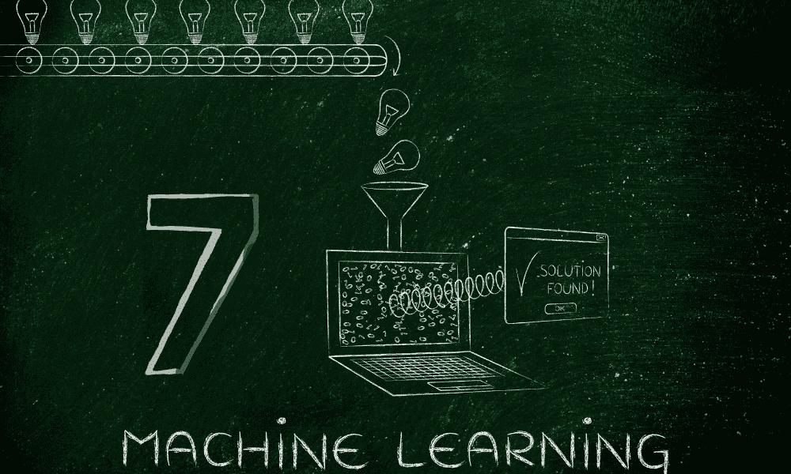

# 7 个你不能错过的机器学习算法

> 原文：[`www.kdnuggets.com/7-machine-learning-algorithms-you-cant-miss`](https://www.kdnuggets.com/7-machine-learning-algorithms-you-cant-miss)

图片由编辑提供

数据科学是一个不断发展且多样化的领域，你作为数据科学家的工作可以涵盖许多任务和目标。学习不同场景下哪种算法效果最佳，将帮助你满足这些不同的需求。

* * *

## 我们的前三个课程推荐

 1\. [谷歌网络安全证书](https://www.kdnuggets.com/google-cybersecurity) - 快速进入网络安全领域的职业生涯。

 2\. [谷歌数据分析专业证书](https://www.kdnuggets.com/google-data-analytics) - 提升你的数据分析技能

 3\. [谷歌 IT 支持专业证书](https://www.kdnuggets.com/google-itsupport) - 支持你所在组织的 IT 工作

* * *

成为每种机器学习模型的专家几乎是不可能的，但你应该了解最常见的模型。以下是每位数据科学家应该了解的七种基本机器学习算法。

# 监督学习

许多公司倾向于使用监督学习模型，因为它们在现实世界应用中准确且直接。虽然无监督学习在增长，但监督学习技术作为数据科学家的入门是一个很好的起点。

## 1\. 线性回归

线性回归是基于连续变量的最基本的预测模型。它假设两个变量之间存在线性关系，并利用这种关系根据给定的输入绘制结果。

在合适的数据集下，这些模型易于训练和实施且相对可靠。然而，现实世界中的关系通常不是线性的，因此在许多业务应用中相关性有限。它也无法很好地处理异常值，因此不适合大规模、多样化的数据集。

## 2\. 逻辑回归

你应该了解的一个相似但不同的机器学习算法是逻辑回归。尽管名字与线性回归相似，它是一个分类算法，而不是估计算法。线性回归预测连续值，而逻辑回归预测数据落入给定类别的概率。

逻辑回归在预测客户流失、天气预报和产品成功率方面很常见。与线性回归类似，它易于实现和训练，但容易过拟合，并且在处理复杂关系时表现不佳。

## 3\. 决策树

决策树是你可以用于分类和回归的基本模型。它们将数据分割成同质组，并将其进一步划分为更小的类别。

由于决策树的工作方式类似于流程图，它们非常适合复杂的决策制定或异常检测。尽管它们相对简单，但训练可能需要时间。

## 4\. 朴素贝叶斯

朴素贝叶斯是另一种简单而有效的分类算法。这些模型基于贝叶斯定理进行操作，[该定理确定条件概率](https://www.investopedia.com/terms/b/bayes-theorem.asp)——基于过去类似事件的结果概率。

这些模型在基于文本和图像的分类中很受欢迎。尽管它们可能对实际的预测分析过于简单，但它们在这些应用中表现优异，并且能够很好地处理大数据集。

## 5\. 随机森林

正如你从名字中可能猜到的那样，随机森林由多个决策树组成。对每棵树进行随机数据训练并对结果进行分组，使这些模型能够产生更可靠的结果。

随机森林比决策树更能抵抗过拟合，并且在实际应用中更为准确。然而，这种可靠性也有代价，因为它们可能比较慢，并且需要更多的计算资源。

# 无监督学习

数据科学家还应了解基本的无监督学习模型。这些是这一较少见但仍重要类别中最受欢迎的一些模型。

## 6\. K-means 聚类

K-means 聚类是最受欢迎的无监督机器学习算法之一。这些模型通过根据相似性将数据分组来对数据进行分类。

K-means 聚类非常适合客户细分。这使得它对希望优化营销或加速入职的企业具有价值，从而在过程中[降低成本和客户流失率](https://www.connectpointz.com/blog/speed-up-customer-onboarding-process)。它对异常检测也很有用。然而，在将数据输入这些算法之前，必须对数据进行标准化。

## 7\. 奇异值分解

奇异值分解（SVD）模型通过将复杂数据集分解为更易理解的部分，并去除冗余信息，来简化数据集。

图像压缩和噪声去除是 SVD 的一些最流行的应用。考虑到[文件大小不断增长](https://arxiv.org/ftp/arxiv/papers/2107/2107.03272.pdf#:~:text=We%20find%20that%20the%20average,influences%20in%20the%20size%20distributions.)，这些用例将随着时间的推移变得越来越有价值。然而，构建和应用这些模型可能会耗时且复杂。

# 了解这些机器学习算法

这七种机器学习算法并不是你作为数据科学家可能会使用的全部。然而，它们是一些最基本的模型类型。理解这些将有助于你启动数据科学职业生涯，并使理解其他建立在这些基础上的更复杂算法变得更容易。

****[April Miller](https://www.linkedin.com/in/april-j-miller/)**** 是 [ReHack](https://rehack.com/) 杂志的消费技术主编。她在创建高质量内容方面有着丰富的经验，这些内容能够吸引流量到她所工作的出版物。

### 更多相关话题

+   [5 张超实用的 SQL 备忘单你不能错过！](https://www.kdnuggets.com/5-super-helpful-sql-cheat-sheets-you-cant-miss)

+   [2024 年你不能错过的 5 大 AI 播客](https://www.kdnuggets.com/top-5-ai-podcasts-you-cant-miss-in-2024)

+   [不要错过！在 2023 年结束前注册免费课程](https://www.kdnuggets.com/dont-miss-out-enroll-in-free-courses-before-2023-ends)

+   [9 个专业证书，能帮你迈向学位… 如果…](https://www.kdnuggets.com/9-professional-certificates-that-can-take-you-onto-a-degree-if-you-really-want-to)

+   [如何使用机器学习自动标记数据](https://www.kdnuggets.com/2022/02/machine-learning-automatically-label-data.html)

+   [2024 年你可以参加的 5 个顶级机器学习课程](https://www.kdnuggets.com/5-top-machine-learning-courses-you-can-take-in-2024)
