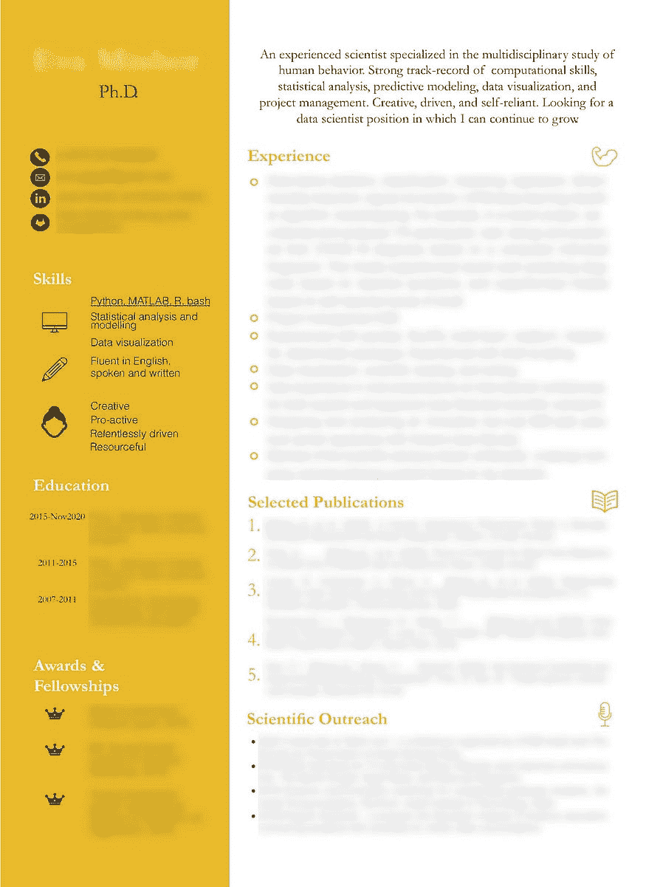
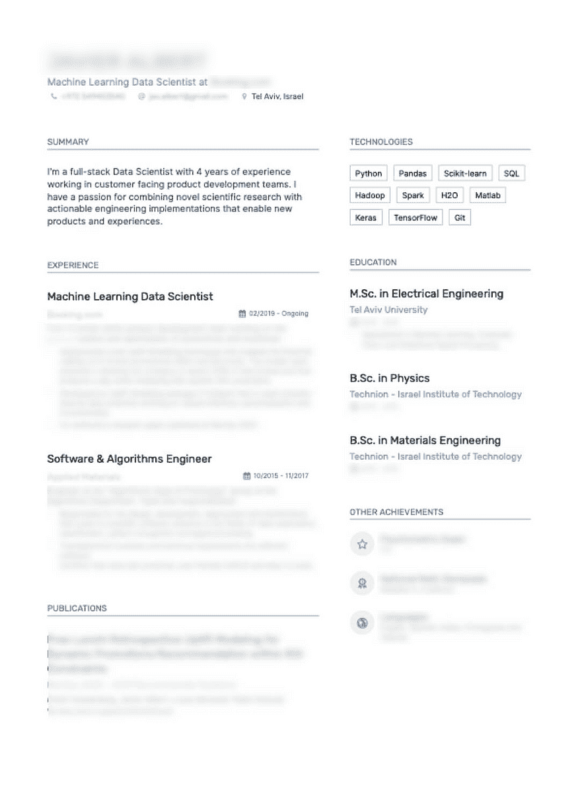

# 数据科学简历中的 7 个必备要素

> 原文：[`www.kdnuggets.com/2021/04/7-must-haves-data-science-cv.html`](https://www.kdnuggets.com/2021/04/7-must-haves-data-science-cv.html)

评论

**由 [Elad Cohen](https://www.linkedin.com/in/elad-cohen-ai/)，Riskified 数据科学与研究副总裁**。

* * *

## 我们的前三个课程推荐

 1\. [Google 网络安全证书](https://www.kdnuggets.com/google-cybersecurity) - 快速进入网络安全职业轨道。

 2\. [Google 数据分析专业证书](https://www.kdnuggets.com/google-data-analytics) - 提升你的数据分析技能

 3\. [Google IT 支持专业证书](https://www.kdnuggets.com/google-itsupport) - 支持你组织的 IT

* * *

*图片由 [Riskified](https://www.riskified.com/) 提供（经许可使用）。*

管理 [Riskified](https://medium.com/riskified-technology) 的数据科学部门需要大量的招聘工作——我们在不到一年半的时间里增长了两倍多。作为多个职位的招聘经理，我也会阅读很多简历。招聘人员 [在 7.4 秒内筛选简历](https://www.prnewswire.com/news-releases/ladders-updates-popular-recruiter-eye-tracking-study-with-new-key-insights-on-how-job-seekers-can-improve-their-resumes-300744217.html)，经过多年的招聘经验，我的平均时间也很快，但还不到那种极端的程度。在这篇博客中，我将介绍帮助我筛选简历的个人启发式方法（‘窍门’）。虽然我不能保证其他人使用相同的启发式方法，不同的职位对每个要点的重要性也会有所不同，但注意这些要点可以帮助你征服简历筛选阶段。此外，这些启发式方法可能看起来不公平或可能忽视合格的候选人。我同意那些不投资于简历的有才华的机器学习从业者可能会被这个筛选拒绝，但考虑到时间，这还是最佳的权衡。请记住，竞争激烈的职位可能会吸引一百份或更多的简历。如果你想要一个高效的过程，简历筛选必须快速。

这里是用来快速筛选你的数据科学简历的 7 个启发式方法：

### 1\. 具有数据科学家的工作经验

我将快速浏览你的简历，查看你之前的职位，并确认哪些职位被标记为“数据科学家”。还有一些相邻的术语（具体取决于我招聘的角色），例如“机器学习工程师”、“研究科学家”或“算法工程师”。我不包括“数据分析师”在这个类别中，因为日常工作通常与数据科学家不同，而且数据分析师的职位称谓范围非常广泛。

如果你在目前的工作中从事数据科学工作，并且有其他创造性的职位描述，最好还是将你的职称更改为数据科学家。这对那些实际上是数据科学家的数据分析师尤其适用。请记住，即使简历中包含了你参与过的项目的描述（包括机器学习），如果职称不是数据科学家，会增加不必要的模糊性。

此外，如果你曾经参加过数据科学训练营或全日制硕士课程，这可能会被视为你数据科学经验的开始（除非你之前在类似角色工作过，这将在后续阶段引发问题）。

### 2\. 以业务为导向的成就

理想情况下，我希望了解你所做的工作（技术方面）以及业务结果如何。缺乏能够用业务术语交流的技术精湛的数据科学家[（了解业务术语的数据科学家）](https://medium.com/riskified-technology/data-vs-insight-the-thin-line-between-good-and-bad-reports-91997d5e9cd)。如果你能分享你的工作对业务 KPI 的影响，这在我看来是一个很大的优点。例如，说明你的模型在 AUC 上的改进是可以的，但如果能说明由于模型改进导致的转化率提升，这意味着你“明白了”——最终业务影响才是最重要的。比较以下两个描述相同工作的替代方案（技术与业务）：

1.  银行贷款违约率模型——将模型的精准率-召回率 AUC 从 0.94 提高到 0.96。

1.  银行贷款违约率模型——使业务单位的年收入增加了 3%（每年 50 万美元），同时保持违约率不变。

### 3\. 教育背景

你的正式教育背景是什么，专业是什么？是否来自知名机构？对于较新的毕业生，我还会关注他们的 GPA 以及是否获得过任何卓越奖项或荣誉，例如是否进入了校长名单或院长名单。由于数据科学是一个广泛开放的领域，没有任何标准化测试或必要的知识要求，人们可以通过各种方式进入这个领域。在我上一篇博客中，我写到了[进入数据科学领域的 3 条主要路径](https://towardsdatascience.com/3-ways-to-break-into-data-science-6a7a8fd679b3)，根据你的教育背景和时间安排，我会判断你可能采取了哪一种路径。因此，时间帮助理解你的故事——你是如何以及何时转入数据科学领域的。如果你没有正式的数据科学教育背景也没关系，但你需要展示在该领域的工作记录和/或类似领域的高级学位。

### 4\. 布局和视觉吸引力

我见过一些漂亮的简历（我也保存了一些供个人灵感使用），但我也收到过没有任何格式的文本文件（.txt）。制作简历可能是件痛苦的事，如果你选择了数据科学作为你的追求，你很可能不喜欢在空闲时间制作美观的设计。在不走极端的情况下，你确实希望找到一个合适的模板，使你能够在有限的空间内传达所有信息。明智地利用空间——将页面拆分并突出显示不属于按时间顺序排列的工作/教育经验的特定部分是有用的。这可以包括你熟悉的技术栈、自我项目列表、Github 或博客的链接等。几个简单的图标也有助于强调部分标题。

许多候选人在每种语言/工具旁边使用 1–5 星或条形图。我个人对这种方法不是很喜欢，原因有几个：

+   这极其主观——你的‘5 星’是否等同于别人的‘2 星’？

+   他们将语言与工具混合，最糟糕的是，还与软技能混合——说你在领导力方面‘4.5 星’没有帮助。作为一个坚定的[growth mentality](https://www.brainpickings.org/2014/01/29/carol-dweck-mindset/)的信仰者，声称在某项技能（尤其是难以量化和掌握的软技能）上达到极致，感觉非常自负。

我还见过这种方法的进一步滥用，将主观测量转化为饼图（30% python，10% team-player 等）。虽然这可能本来是为了以创意的方式脱颖而出，但它展示了对不同图表概念的基本理解的缺乏。

这里有两个我发现视觉上令人愉悦的简历示例，细节已模糊处理以保持匿名。

*感谢 Eva Mishor（经许可使用）。*

*数据科学家的视觉上令人愉悦的简历，细节已模糊处理。请注意两个示例中使用的垂直分割，以区分经验、技能、成就和出版物。在这两种情况下，简短的总结段落有助于描述他们的背景和愿望。经所有者许可使用。*

### 5\. 机器学习多样性

我寻找的两种多样性：

1.  *算法类型*——结构化/经典 ML 与深度学习。一些候选人只使用过深度学习，包括在可以更好地使用基于树的模型的结构化数据上。虽然成为深度学习专家本身没有问题，但限制你的工具集可能会限制你的解决方案。正如马斯洛所说：“如果你唯一的工具是锤子，你倾向于把每个问题都看作钉子。”在[Riskified](https://medium.com/riskified-technology)，我们处理的是结构化的、以领域驱动的、特征工程的数据，这些数据最好用各种形式的提升树来处理。拥有整个简历都指向深度学习的候选人是个问题。

1.  *机器学习领域*——这通常涉及到需要大量专业知识的两个领域——计算机视觉与自然语言处理。此领域的专家需求量大，在许多情况下，他们的整个职业生涯将专注于这些领域。虽然这对于寻找该领域的工作人员至关重要，但对于更一般的数据科学角色来说通常不适合。因此，如果你大部分经验都在自然语言处理领域，而你正在申请该领域以外的职位，尽量强调你在结构化数据方面的职位/项目，以展示你的多样性。

### 6\. 技术栈

这通常可以分为编程语言、特定包（如 scikit learn、pandas、dplyr 等）、云服务及其服务（如 AWS、Azure、GCP）或其他工具。一些候选人将这与他们熟悉的算法或架构（如 RNN、XGBoost、K-NN）混淆。就个人而言，我更希望这围绕技术和工具展开；当提到具体算法时，我会想知道候选人的理论机器学习知识是否仅限于那些特定的算法。

在这里，我关注的是技术栈的相关性——这些技术栈是否来自最近几年（这是候选人动手能力和学习新技能的积极信号），技术栈的广度（是否仅限于特定工具，或是否对多种工具都很熟悉），以及与我们的技术栈的契合程度（我们需要教他们多少东西）。

### 7\. 项目

是否有你在 GitHub 上可以分享的工作？任何 Kaggle 比赛或副项目都非常有帮助，并且可以查看简洁的代码、预处理类型、特征工程、探索性数据分析、算法选择以及需要解决的其他问题。添加你 GitHub 和 Kaggle 账户的链接，供面试官深入了解你的代码。如果你的经验不多，很可能会被问到一个或多个这些项目。在我进行的一些面试中，候选人对项目记忆不多，我们无法讨论他们做出选择的原因。确保你复习一下你做过的工作，或将其从简历中删除。同样，确保你展示了你最好的作品，并且你在其中投入了足够的时间和精力。拥有 2-3 个高质量的项目比 8-10 个中等（或更低）质量的项目更好。

### 总结

如果你正在寻找新的数据科学职位，请花些时间阅读本文中的要点。如果你无法勾选所有这些要点也没关系，但能做到的越多越好。希望这些建议能帮助你从众人中脱颖而出，并顺利通过简历筛选。

*祝你好运，求职顺利！*

[原文](https://towardsdatascience.com/7-must-haves-in-your-data-science-cv-9316841aeb78)。经许可转载。

**相关信息：**

+   [是什么让我这么久才找到数据科学家的工作](https://www.kdnuggets.com/2021/03/land-data-scientist-job.html)

+   [我从高效数据科学家那里学到的 15 个习惯](https://www.kdnuggets.com/2021/03/15-habits-learned-from-highly-effective-data-scientists.html)

+   [帮助你获得数据科学职位的 5 项支持技能](https://www.kdnuggets.com/2021/02/5-supporting-skills-data-science-job.html)

### 更多相关主题

+   [最佳文本分类任务架构：基准测试…](https://www.kdnuggets.com/2023/04/best-architecture-text-classification-task-benchmarking-options.html)

+   [将你的数据科学职业提升到新水平](https://www.kdnuggets.com/2021/12/sas-advance-data-science-career-next-level.html)

+   [通过西北大学的数据科学学位启动你的职业生涯](https://www.kdnuggets.com/2022/04/nwu-launch-career-northwestern-data-science-degree.html)

+   [理解贝叶斯定理的 3 种方法将提升你的数据科学能力](https://www.kdnuggets.com/2022/06/3-ways-understanding-bayes-theorem-improve-data-science.html)

+   [如何在没有工作经验的情况下获得你的第一份数据科学工作](https://www.kdnuggets.com/2021/02/first-job-data-science-without-work-experience.html)

+   [你需要的 6 项数据科学技术来构建你的供应链管道](https://www.kdnuggets.com/2022/01/6-data-science-technologies-need-build-supply-chain-pipeline.html)
