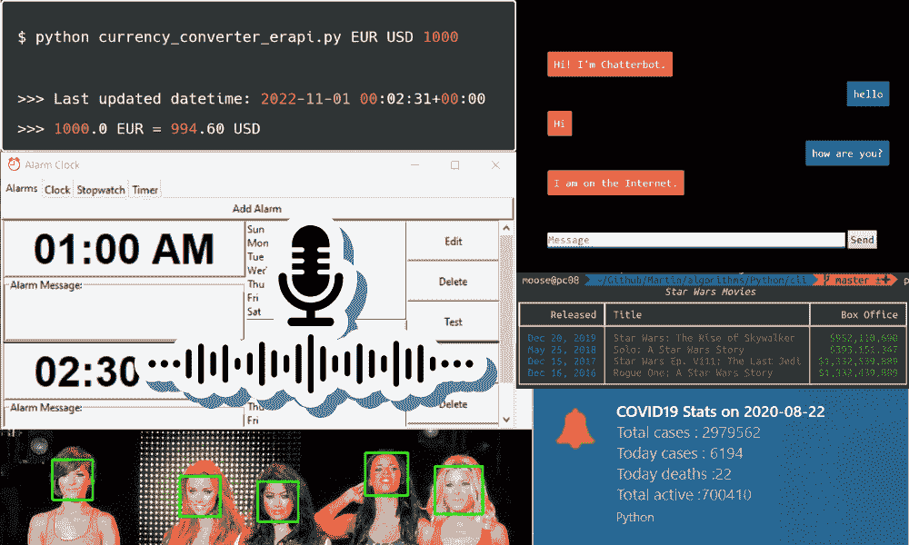
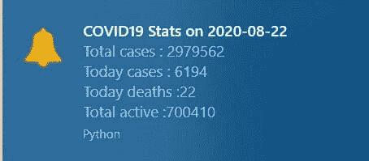
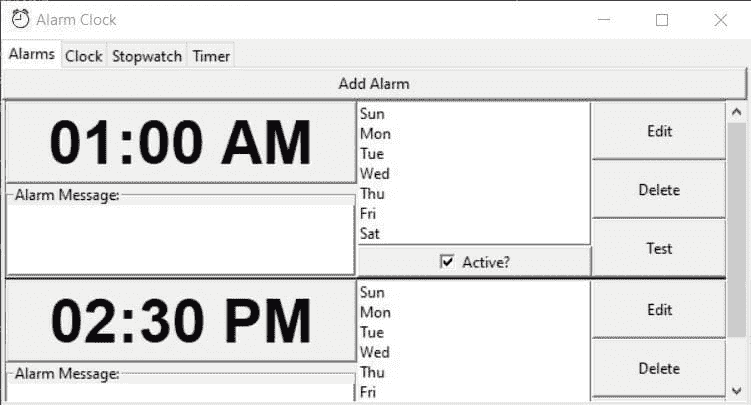
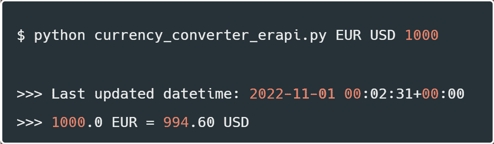
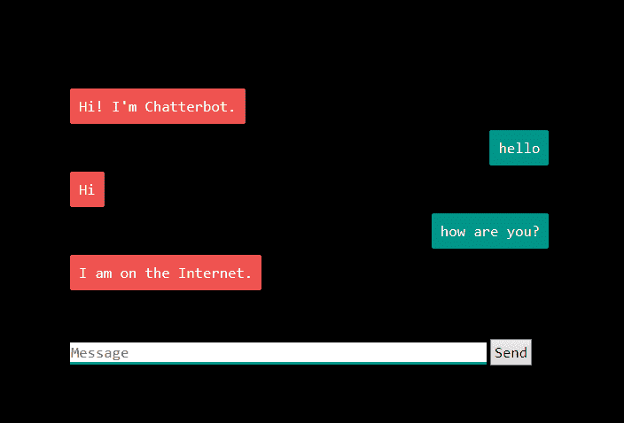
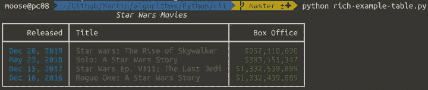

# 适合初学者的 7 个 Python 项目

> 原文：[`www.kdnuggets.com/2022/11/7-python-projects-beginners.html`](https://www.kdnuggets.com/2022/11/7-python-projects-beginners.html)

作者提供的图片

在学习了 Python 语言的基础后，你会想开始构建一些令人惊叹的东西。这 7 个 Python 项目将帮助你学习各种 Python 包和软件开发，并有助于你的职业组合和简历。

我们将学习的 Python 项目都很适合初学者，它们在提供各种类型应用的体验方面独特。你将使用 Tkinter 构建 GUI、通知、访问 API 和编写 Python 脚本、个人助理、聊天机器人、命令行工具和人脸识别。

# 桌面通知器

[桌面通知器应用](https://towardsdatascience.com/create-desktop-notifier-application-using-python-fb3b7b2c3cf3)简单却独特。你将使用请求来访问网页 API，并每 4 小时通过 plyer 显示桌面通知。这是一个有趣的项目，你可以显示 Covid 统计数据、股票市场位置、RSS 提要等。桌面通知的应用限于你的想象力。

图片来自 [桌面通知器](https://towardsdatascience.com/create-desktop-notifier-application-using-python-fb3b7b2c3cf3)

# Tkinter 闹钟

[闹钟](https://github.com/TeenageMutantCoder/Alarm-Clock) 项目将帮助你掌握 GUI 工具 Tkinter、pygame 模块和 SQLite 数据库。你将构建一个用户界面，在其中可以设置闹钟，显示时钟、秒表和计时器。该项目将在每一个层面上测试你的 Python 技能。你还将学习基本的 SQL 脚本，如果你想被顶级公司雇用，这总是一个加分项。

图片来自 [闹钟](https://github.com/TeenageMutantCoder/Alarm-Clock)

# 货币转换器

[货币转换器](https://www.thepythoncode.com/article/make-a-currency-converter-in-python)有点复杂，但对于初学者来说推荐。你将深入研究网页抓取和访问各种货币交易的网页 API。

首先，你将使用请求访问 API，用 Beautiful Soup 清理数据，并利用 Python 函数创建一个显示日期和时间以及货币兑换率的系统。教程中还提到了各种易于使用的货币兑换 API。

作者提供的图片

# 语音助手

[语音助手](https://github.com/jaspreetsidhu3/voice_assistant)是一个简单的项目，但如果你展示给朋友或同事，他们会感到兴奋。你将编写几行代码来将语音转换为文本，然后使用各种 Python 库和`if-else`语句来创建一个个人助手。

# 使用 Chatterbot 的聊天机器人

[使用 Chatterbot 的聊天机器人](https://www.edureka.co/blog/how-to-make-a-chatbot-in-python/)是一个很棒的项目，可以在简历上展示。它在现实世界中有多个应用。我们将使用 Flash 创建 Web 应用程序，使用 ChatterBot 训练我们的机器人以进行简单的回复。它简单而令人兴奋，你可以通过研究基于规则和自我学习的方法来使其接近完美。

来自 [项目](https://www.edureka.co/blog/how-to-make-a-chatbot-in-python/) 的图片

# 命令行应用程序

[命令行应用程序](https://betterprogramming.pub/designing-beautiful-command-line-applications-with-python-72bd2f972ea)教程将帮助你创建具有用户界面和图形的命令行工具。这不是一个完整的项目，但这就是诀窍，你将使用教程中提到的所有工具和示例来创建你的项目。

你可以查看 [构建和发布命令行应用程序](https://towardsdatascience.com/how-to-build-and-publish-command-line-applications-with-python-96065049abc1)教程以获得灵感。这有点高级，你将学习提取数据、创建 CLI 和将包推送到 PyPI 的各个部分。

来自 [项目](https://betterprogramming.pub/designing-beautiful-command-line-applications-with-python-72bd2f972ea) 的图片

# 人脸识别

[人脸识别](https://realpython.com/face-recognition-with-python/)将帮助你熟悉 OpenCV-2。你不会使用任何机器学习或深度学习模型来创建简单的人脸识别应用程序。只需 25 行代码，你就可以创建一个 Python 脚本，接受一张图片，并返回带有绿色边框的多张人脸图像。

来自 [教程](https://realpython.com/face-recognition-with-python/) 的图片

# 总结

通过项目学习是建立编程技能的最佳方式。你将学会修复错误、启动和完成项目、学习各种 Python 包，一些公司将其视为专业经验。

接下来呢？你将开始在 GitHub 上寻找开源项目并进行贡献。你也可以寻找公司实习以获得实际经验，或启动一个可以解决实际问题的大项目。

例如，你可以构建辅助写作的 Web 应用程序，创建一个播放合成生成音乐的 Spotify 应用程序，以及一个面向希望节省客户支持成本的公司的 Chatbot API。

**[Abid Ali Awan](https://www.polywork.com/kingabzpro)** ([@1abidaliawan](https://twitter.com/1abidaliawan)) 是一位认证的数据科学专业人士，热衷于构建机器学习模型。目前，他专注于内容创作，并撰写关于机器学习和数据科学技术的技术博客。Abid 拥有技术管理硕士学位和电信工程学士学位。他的愿景是利用图神经网络构建一个 AI 产品，帮助那些在心理健康方面挣扎的学生。

* * *

## 我们的三大课程推荐

 1\. [Google 网络安全证书](https://www.kdnuggets.com/google-cybersecurity) - 快速进入网络安全职业生涯。

 2\. [Google 数据分析专业证书](https://www.kdnuggets.com/google-data-analytics) - 提升你的数据分析技能

 3\. [Google IT 支持专业证书](https://www.kdnuggets.com/google-itsupport) - 支持你的组织 IT

* * *

### 更多相关内容

+   [5 个数据分析项目适合初学者](https://www.kdnuggets.com/2023/02/5-data-analysis-projects-beginners.html)

+   [7 个 Python 初学者技巧](https://www.kdnuggets.com/2022/09/7-tips-python-beginners.html)

+   [如何编写高效的 Python 代码：初学者教程](https://www.kdnuggets.com/how-to-write-efficient-python-code-a-tutorial-for-beginners)

+   [将 Python 字典转换为 JSON：初学者教程](https://www.kdnuggets.com/convert-python-dict-to-json-a-tutorial-for-beginners)

+   [5 个免费 Python 数据科学课程](https://www.kdnuggets.com/5-free-python-courses-for-data-science-beginners)

+   [Python 中将字节转换为字符串：初学者教程](https://www.kdnuggets.com/convert-bytes-to-string-in-python-a-tutorial-for-beginners)
