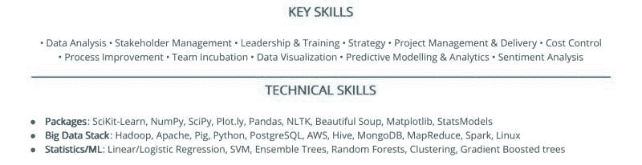
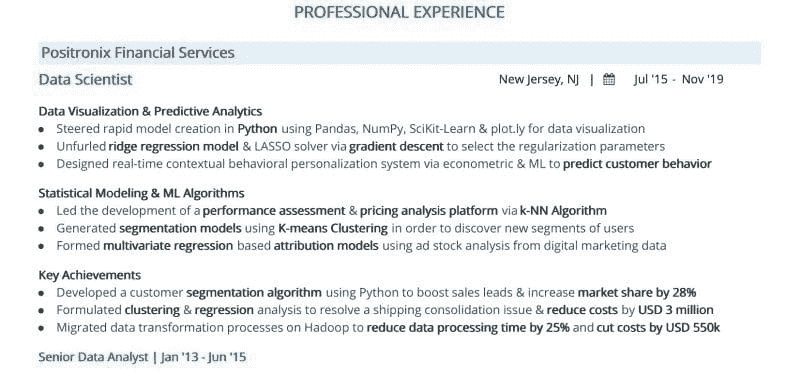

# 7 个步骤打造获奖的数据科学简历

> 原文：[`www.kdnuggets.com/2020/01/7-steps-job-winning-data-science-resume.html`](https://www.kdnuggets.com/2020/01/7-steps-job-winning-data-science-resume.html)

评论

**由 [Aditya Sharma](https://www.linkedin.com/in/aditya-sharma/)，Hiration 联合创始人**

根据 [LinkedIn 2017 年美国新兴职位报告](https://economicgraph.linkedin.com/research/LinkedIns-2017-US-Emerging-Jobs-Report)，数据科学家职位在新兴职位的前 20 名中排名第二，增长率为 6.5 倍（2012-2017）。

* * *

## 我们的前三大课程推荐

 1\. [Google 网络安全证书](https://www.kdnuggets.com/google-cybersecurity) - 快速进入网络安全职业道路。

 2\. [Google 数据分析专业证书](https://www.kdnuggets.com/google-data-analytics) - 提升你的数据分析技能

 3\. [Google IT 支持专业证书](https://www.kdnuggets.com/google-itsupport) - 支持你所在组织的 IT

* * *

鉴于全球各行各业对数据科学家的前所未有的需求，你可能会认为获得数据科学职位轻而易举。

但你在这方面严重误解了。

获得数据科学认证或参加 Kaggle 比赛并不足以确保你在这个行业找到工作。你可能已经培养了该领域的技能，但如果你未能在纸面上展示这些素质，那么即使你非常熟练也没有意义。

这就是为什么你的数据科学简历很重要。

在本文中，我们将讨论一些可以采取的实际步骤，以制作一份出色的数据科学简历并获得理想的工作。

不再赘述，让我们开始吧。

### 你的名字应该放在首位。不是‘简历’或‘履历’。

如果你的简历因为忘记在顶部写上你的名字而在一大堆文件中丢失了，这样的简历还有什么用呢？

尽管听起来令人惊讶，但我们确实经常遇到这样的情况，这也是我们在讨论数据科学简历的细节之前，决定提前说明的原因。

通常做法是确保你的名字位于顶部。不需要在顶部写上‘简历’或‘履历’，因为文档的性质已经很明显。

### 超越你的基本联系信息

你知道简历中需要包含哪些基本联系信息，对吧？为了重述，它们是你的：

+   手机号码：仅提及一个即可。

+   电子邮件地址：选择一个与当前/以前雇主无关的专业电子邮件地址。

+   位置：你可以提及你目前的位置。如果你正在搬迁，跳过简历中的这些细节，而在求职信中提及即可。

但这还不是全部。

作为一名数据科学家，你正在推动一场变革。除了这些基本信息外，随意添加你的作品集或其他公共细节，如 LinkedIn、GitHub、Kaggle 等。

只有在这样做会对你的简历增值的情况下才做。如果你链接的是一个空的 LinkedIn 个人资料或几个月前最后更新过的 GitHub 账户，那是没有意义的。如果 GitHub、Kaggle 或其他公共平台上有显著的成就，可以在简历的单独部分提及这些成就。

然而，这样做只有在你的工作经验部分缺乏数据科学相关内容时才有意义。如果你的工作经验本身已经证明了你的技能，你就不需要额外强调这些成就来验证它们。

但是，如果你正在过渡到数据科学，正确展示这些成就将对你进入那份梦寐以求的短名单发挥重要作用。

### 你的个人简介标题可能会决定你的机会。

首先，了解一下，并不是很多人在简历上有个人简介标题。所以，添加这样的标题将有助于让你在竞争中脱颖而出。

但在继续之前，什么是个人简介（或职位）标题呢？

这无非是你名字下方的一个标识符，传达你的职业身份。招聘人员不应该需要扫描你的工作经验来判断你是否适合他们。你添加职位标题是为了让他们的工作更轻松。

这里有一个快速的建议，告诉你如何根据你的职业阶段制定个人简介标题：

### 你有数据科学的认证但没有相关的工作经验。

比如说，你获得了数据科学认证作为任何在线课程的一部分，但你还没有工作经验。

你可以在简历上简单地写“认证数据科学专业人士”作为你的个人简介标题。

这样做可以立即传达即使你还没有专业经验，你也拥有相关的认证。

### 你有相关的工作经验。

假设你曾担任数据科学工程师或数据科学家。在这种情况下，只需在你名字下方提及你当前的职称即可。

假设你现在是数据分析师，而你的目标职位是数据工程师。不要试图欺骗招聘人员，把“数据工程师”写成你的职位名称。坚持事实是获得你想要的唯一可持续的方法。

### 你正在从相关（或不相关）领域过渡到数据科学。

如果你正在过渡到数据科学，提及你当前或最近担任的职务。如果你在过渡，你需要让招聘人员相信你对数据科学是认真的，即使你没有相关的工作经验。

如果你有任何认证来帮助你的情况，我们已经在第一点中涵盖了。如果没有，你可以在相关部分提及你的项目或竞赛。在这种情况下，职位标题可以变成类似“<当前职位> & 数据科学爱好者”。

### 在你的总结中少谈数据科学，更多地谈论“影响”

总结应该是一个简短的 3-4 行陈述，描述你能为下一个组织带来的影响。在这里不要过多涉及你的数据科学技能——这正是简历其他部分的内容。总之，仅仅提及你通过特定技能能带来的价值。

不要详细描述你熟悉的技术、算法和库。提及你能带来的商业影响：明智的决策、改进的流程、领导力支持等。

### 将你的技能分为“关键技能”和“技术技能”

作为数据科学家，请将你的核心技能与技术技能分开。这有助于你更有效地概述和传达你的技能。

以下快照展示了理想的数据科学简历中该部分的样子：

*数据科学简历中的关键技能和技术技能部分*

将你的技术技能按相关子标题分组，使招聘人员更容易快速阅读重要内容并跳过其余部分。

### 在专业经验部分量化你的成就

招聘人员最喜欢的就是实际展示你能带给组织的成果。公司不在乎你是否具备正确的技能——如果你无法展示使用这些技能所取得的成果，你可能连这些技能都不算具备。

从中学到什么？*尽可能量化你的成就*。

此外，

+   使用一行式要点展示你的主要成就，使用[以行动为导向的成就陈述](https://careerdevelopment.princeton.edu/sites/careerservices/files/media/resume_guide_2018.pdf)。

+   将类似的要点分组在独特的子标题或类别下。因此，与其在工作经验中写 10+点，不如将它们分成 4-5 点一组。

+   用一个[动词](https://careerservices.uni.edu/sites/default/files/docs/resume_verbs.pdf)开头每个要点。

+   使用绩效数据量化你的成就。如果你没有确切的数字，甚至一个大致的数字也可以。

同样，如果你详细描述你的项目/竞赛，请提供关于你贡献、参与者数量等的近似数据。以下是你数据科学简历中专业编排的工作经验部分的快照：

*数据科学简历中的专业经验部分*

### 说明你的认证、会议和出版物

认证的重要性是数据科学简历中的一个关键元素，因为它传达了你在不断变化的环境中的最新技能。

同时，在简历中列出你参加的会议和发表的学术论文也有助于留下良好印象。

### 关键要点

总结：

+   在简历标题中写上你的全名。

+   除了基本联系方式外，还要包含你的 GitHub/LinkedIn/Kaggle 详情。

+   如果你是一位有经验的专业人士，请正确地将你最新的职位名称作为个人资料标题。如果你还没有相关的工作经验，可以将个人资料标题简单地标记为“认证数据科学专业人士”。

+   你的简历总结应专注于你能够带来的影响，而不是充满行话。

+   将你的技能分为关键技能和技术技能，后者包含语言、库、工具等相关子标题。

+   使用行动动词和绩效数据列出你的专业经历部分。

+   确保你的简历在相关部分中列出你的认证、出版物和参加的会议。

就是这些！还有更多关于你数据科学简历的疑问吗？在下方留言！

附注：如果你想深入了解我们讨论的细节，或者想查看一个完整的数据科学简历样本，请查阅[这份详尽的指南](https://www.hiration.com/blog/data-scientist-resume/) [关于数据科学简历](https://www.hiration.com/blog/data-scientist-resume/)。

**简介：[Aditya Sharma](https://www.linkedin.com/in/aditya-sharma/)** 正在致力于帮助全球专业人士获得梦想工作。他对 Hiration — 一个由 AI 驱动的[简历生成器](https://www.hiration.com/)和帮助求职者在严酷的就业市场中找到方向的平台 — 充满热情，他是联合创始人及非正式的首席问题解决官（Chief Problem-solving Officer）。

**相关：**

+   我没有被聘用为数据科学家。所以我寻求了关于谁在聘用的数据。

+   数据科学家最受欢迎的技术技能

+   完整的数据科学 LinkedIn 个人资料指南

### 更多相关话题

+   [数据科学简历中的必备要素](https://www.kdnuggets.com/2022/06/musthaves-data-science-resume.html)

+   [学生在数据科学简历中遗漏的 7 件事](https://www.kdnuggets.com/7-things-students-are-missing-in-a-data-science-resume)

+   [7 个机器学习项目提升简历](https://www.kdnuggets.com/2022/09/7-machine-learning-portfolio-projects-boost-resume.html)

+   [7 个 AI 项目提升简历](https://www.kdnuggets.com/7-ai-portfolio-projects-to-boost-the-resume)

+   [KDnuggets 新闻，9 月 21 日：7 个机器学习项目…](https://www.kdnuggets.com/2022/n37.html)

+   [掌握数据宇宙：迈向成功数据科学职业的关键步骤](https://www.kdnuggets.com/mastering-the-data-universe-key-steps-to-a-thriving-data-science-career)
