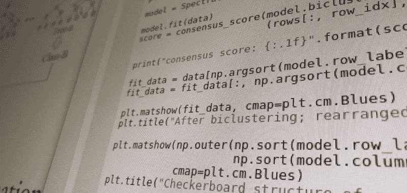

# Python 基础机器学习的 7 个步骤——2019 版

> 原文：[`www.kdnuggets.com/2019/01/7-steps-mastering-basic-machine-learning-python.html`](https://www.kdnuggets.com/2019/01/7-steps-mastering-basic-machine-learning-python.html)

 评论

对于那些对 Python 机器学习速成课程感兴趣的人来说，那里有大量免费材料可供使用。

不久前，我写了掌握 Python 机器学习的 7 个步骤和掌握 Python 机器学习的 7 个附加步骤，这两篇文章试图将一些优质的材料汇总和组织成一个速成课程。然而，这些文章已经有几年时间了，随着新的一年的到来，我认为是时候重新审视这个概念，并为掌握 Python 机器学习制定一条新的学习路径。

这一次，我们将把路径分成 3 篇文章，每篇文章分别覆盖基础、中级和高级主题。然而，我们需要相对看待这些术语，不要期望在完成（最终的）高级文章后成为研究级机器学习工程师。学习路径面向那些对编程、计算机科学概念和/或机器学习有一定理解的人，他们希望能够使用流行 Python 库的机器学习算法实现来构建自己的机器学习模型。

第一篇文章将从零开始，引导读者设置环境、理解 Python，并尝试各种算法以应对不同的场景。我们将利用现有的教程、视频和各种作者的作品，因此任何包含在此的内容的感谢应该仅向他们致以。

与其对每个主题步骤（比如 *聚类*）提供大量资源，我尝试选择一两个优质教程，并附上一个简明视频，初步介绍给定主题的基础理论、数学或直觉。

如果这些步骤大多针对机器学习算法，不必担心，因为在过程中你还会遇到其他重要概念，如数据预处理、损失度量、数据可视化等等。

所以，拿起一杯你喜欢的饮料，准备好迎接系列的第一篇文章，开始通过这 7 个步骤掌握基础的 Python 机器学习。

### 第一步：掌握 Python 基础

我寻找了一些更新的材料，以补充我在之前的版本中指出的内容，这不仅是为了变化，也为了跟上最新的 Python 版本。

[**这个 GitHub 库**](https://github.com/jerry-git/learn-python3)由 Jerry Pussinen 创建，包含了“用于教学/学习 Python 3 的 Jupyter 笔记本”，似乎提供了对 Python 的一个不错概述，那些有编程基础或有动力的人可以在几个小时内完成。你需要安装 Python 3.5+以及 Jupyter 笔记本。

由于在进展过程中你会需要使用到多个流行的 Python 科学库，我建议使用 Anaconda 发行版，[**你可以在这里下载**](https://www.anaconda.com/download)（选择最新的 Python 3.X 版本，**而不是** Python 2.X），而不是单独安装各个组件。只需启动安装程序，安装完成后你将拥有 Python、Jupyter 笔记本以及前进所需的一切。

### 第 2 步：理解 Python 科学计算环境

所以，你已经安装并准备好使用 Python 和科学计算栈了。但为什么？

在深入探讨之前，了解科学计算栈是什么，它最突出的和重要的组件有哪些，以及它们在机器学习环境中如何使用是一个好主意。

这篇来自 Dataquest 的文章，恰当地标题为[**Jupyter 笔记本入门：教程**](https://www.dataquest.io/blog/jupyter-notebook-tutorial/)，深入探讨了我们为何使用 Jupyter 笔记本，并介绍了一些你在这条路上会遇到的最重要的 Python 库，即 Pandas、Numpy 和 Matplotlib。

本教程不涉及 Scikit-learn，这是 Python 生态系统中实际机器学习过程的主要引擎之一，其中包含了数十种算法的实现，供你在自己的项目中使用。然而，来自 Scikit-learn 维护者的介绍性文章[**Scikit-learn 机器学习简介**](https://scikit-learn.org/stable/tutorial/basic/tutorial.html)将帮助你在 5 分钟内了解其基础知识。

作为留给读者的练习，我建议找到并熟悉 Pandas、Numpy、Matplotlib 和 Scikit-learn 的文档内容，并将链接作为参考保存。无论如何，确保你对这 4 个工具的基础知识感到熟悉，因为它们在基础 Python 机器学习中被广泛使用。

### 第 3 步：分类

分类是监督学习的主要方法之一，它是对具有类别标签的数据进行预测的方式。分类涉及找到描述数据类别的模型，然后可以用来对未知数据的实例进行分类。训练数据与测试数据的概念对于分类至关重要。用于模型构建的流行分类算法以及展示分类器模型的方式包括（但不限于）决策树、逻辑回归、支持向量机和神经网络。

首先，观看麻省理工学院教授约翰·古塔格关于分类的讲座。

然后查看以下教程，每个教程都涵盖了一个基础的机器学习分类算法（多么激动人心，你的第一个机器学习算法！）。

苏珊·李在[**用 Python 构建逻辑回归，从头到尾**](https://towardsdatascience.com/building-a-logistic-regression-in-python-step-by-step-becd4d56c9c8)中提供了关于实现最基本分类器——逻辑回归的详细概述。

完成苏珊的教程后，继续阅读拉塞尔·布朗的简明教程 **[用 Python 创建和可视化决策树](https://medium.com/@rnbrown/creating-and-visualizing-decision-trees-with-python-f8e8fa394176)**。

作为额外内容，由于我们还在学习如何使用 Jupyter Notebook，请查看达夫尼·西迪罗普洛的[**用 Jupyter 小部件进行决策树的交互式可视化**](https://towardsdatascience.com/interactive-visualization-of-decision-trees-with-jupyter-widgets-ca15dd312084)，以了解使用 Jupyter Notebook 进行模型可视化和调整的一些好处。

### 第 4 步：回归

回归与分类类似，都是另一种主流的监督学习形式，对预测分析很有用。它们的不同之处在于分类用于预测具有不同有限类别的数据，而回归用于预测连续的数值数据。作为一种监督学习形式，训练/测试数据在回归中也是一个重要概念。

首先，观看卡内基梅隆大学教授汤姆·米切尔关于回归的讲座。

然后查看并跟随 Adi Bronshtein 的教程，标题为 **[Python 中的简单线性回归和多重线性回归](https://towardsdatascience.com/simple-and-multiple-linear-regression-in-python-c928425168f9)**。

### 第 5 步：聚类

聚类用于分析不包含预先标记的类别的数据。数据实例通过最大化类内相似性和最小化不同类别之间的相似性来进行分组。这意味着聚类算法会识别并分组非常相似的实例，而不是将彼此之间相似度较低的实例进行分组。由于聚类不需要预先标记类别，因此它是一种无监督学习形式。

首先，观看 MIT 的 John Guttag 的讲座。

k-means 聚类可能是最著名的聚类算法，但并不是唯一的。存在不同的聚类方案，包括层次聚类、模糊聚类和密度聚类，还有不同的质心式聚类方法（k-means 所属的家族）。要了解更多，阅读 Jake Huneycutt 的 [**Python 中聚类算法简介**](https://towardsdatascience.com/an-introduction-to-clustering-algorithms-in-python-123438574097)。然后阅读 Michael J. Garbade 的 [**理解机器学习中的 k-means 聚类**](https://towardsdatascience.com/understanding-k-means-clustering-in-machine-learning-6a6e67336aa1) 并亲自实现 *k*-means。

然后查看 Gabriel Pierobon 的 **[DBSCAN 聚类处理 k-means 无法处理的数据形状（在 Python 中）](https://towardsdatascience.com/dbscan-clustering-for-data-shapes-k-means-cant-handle-well-in-python-6be89af4e6ea)**，以实现基于密度的聚类模型。

### 第 6 步：更多分类

现在我们已经采样过了，让我们切换回分类，查看更复杂的算法。

观看 CMU 的 Maria Florina Balcan 讨论支持向量机（SVM）的讲座视频。

阅读 Aakash Tandel 的 **[支持向量机——简要概述](https://towardsdatascience.com/support-vector-machines-a-brief-overview-37e018ae310f)**，这是对 SVM 的高级处理。接着阅读 Georgios Drakos 的 **[支持向量机与逻辑回归的比较](https://towardsdatascience.com/support-vector-machine-vs-logistic-regression-94cc2975433f)**。

最后，通过阅读 Jake VanderPlas 的**[深入了解：支持向量机](https://jakevdp.github.io/PythonDataScienceHandbook/05.07-support-vector-machines.html)**，这是一段他强烈推荐的[Python 数据科学手册](http://shop.oreilly.com/product/0636920034919.do)中的摘录，来完善你对支持向量机的理解。

### 第 7 步：集成方法

最后，让我们了解一下集成方法。

首先，观看 Vrije University 的 Peter Bloem 讲授的视频课程。

然后阅读这两个主要是解释性文章：

+   **[从零开始的梯度提升](https://medium.com/mlreview/gradient-boosting-from-scratch-1e317ae4587d)**，作者 Prince Grover

+   **[随机森林简单解释](https://medium.com/@williamkoehrsen/random-forest-simple-explanation-377895a60d2d)**，作者 Will Koehrsen

最后，跟随这些教程尝试一下集成方法。

+   [**Python 集成方法简介**](https://www.dataquest.io/blog/introduction-to-ensembles/)，作者 Sebastian Flennerhag

+   [**CatBoost vs. Light GBM vs. XGBoost**](https://www.kdnuggets.com/2018/03/catboost-vs-light-gbm-vs-xgboost.html)，作者 Alvira Swalin

+   [**在 Python 中使用 XGBoost**](https://www.datacamp.com/community/tutorials/xgboost-in-python)，作者 Manish Pathak

希望你已经从这 7 个步骤中受益，掌握了基本的机器学习（Python）。下次加入我们时，我们将深入探讨一些更高级的话题。

**相关内容**：

+   掌握机器学习的 7 个步骤（Python）

+   掌握机器学习的 7 个额外步骤（Python）

+   掌握数据准备的 7 个步骤（Python）

* * *

## 我们的前三个课程推荐

 1\. [Google 网络安全证书](https://www.kdnuggets.com/google-cybersecurity) - 快速进入网络安全职业轨道。

 2\. [Google 数据分析专业证书](https://www.kdnuggets.com/google-data-analytics) - 提升你的数据分析技能

 3\. [Google IT 支持专业证书](https://www.kdnuggets.com/google-itsupport) - 支持你所在组织的 IT

* * *

### 更多相关主题

+   [成为优秀数据科学家所需的 5 项关键技能](https://www.kdnuggets.com/2021/12/5-key-skills-needed-become-great-data-scientist.html)

+   [每个初学者数据科学家应掌握的 6 种预测模型](https://www.kdnuggets.com/2021/12/6-predictive-models-every-beginner-data-scientist-master.html)

+   [2021 年最佳 ETL 工具](https://www.kdnuggets.com/2021/12/mozart-best-etl-tools-2021.html)

+   [为什么我们始终需要人类来训练 AI — 有时甚至是实时的](https://www.kdnuggets.com/2021/12/why-we-need-humans-training-ai.html)

+   [使用管道编写干净的 Python 代码](https://www.kdnuggets.com/2021/12/write-clean-python-code-pipes.html)

+   [是什么让 Python 成为初创企业理想的编程语言](https://www.kdnuggets.com/2021/12/makes-python-ideal-programming-language-startups.html)
