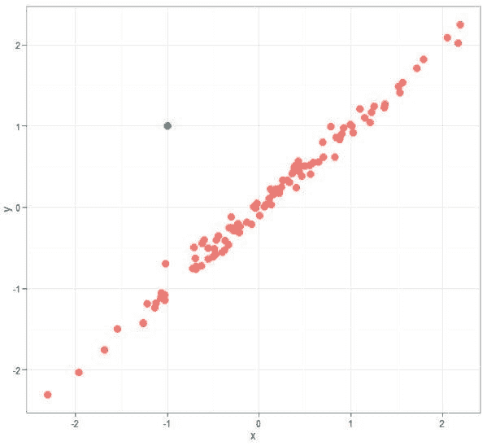
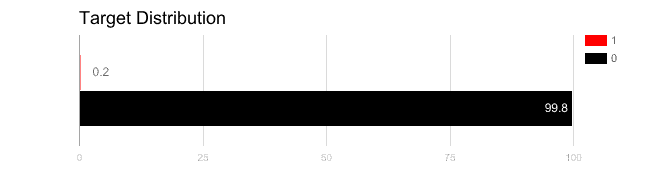
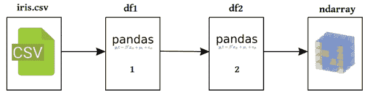

# 7 步掌握 Python 数据准备

> 原文：[`www.kdnuggets.com/2017/06/7-steps-mastering-data-preparation-python.html/2`](https://www.kdnuggets.com/2017/06/7-steps-mastering-data-preparation-python.html/2)

### 第 4 步：处理异常值

这不是关于制定处理数据中异常值策略的教程；在建模时，有时包括异常值是合适的，有时则不合适（无论有人怎样告诉你）。这取决于情况，没人能对你的情况是否属于 A 列或 B 列做出笼统的断言。

你能找到异常值吗？

* * *

## 我们的三大课程推荐

 1\. [谷歌网络安全证书](https://www.kdnuggets.com/google-cybersecurity) - 快速进入网络安全职业道路。

 2\. [谷歌数据分析专业证书](https://www.kdnuggets.com/google-data-analytics) - 提升你的数据分析技能

 3\. [谷歌 IT 支持专业证书](https://www.kdnuggets.com/google-itsupport) - 支持你的组织 IT

* * *

一些关于处理异常值的讨论：

+   [异常值：删除还是保留](http://www.theanalysisfactor.com/outliers-to-drop-or-not-to-drop/)，The Analysis Factor

+   [从数据中去除异常值可以吗？](https://stats.stackexchange.com/questions/200534/is-it-ok-to-remove-outliers-from-data/200923)，Stack Exchange

异常值可能是由于数据收集不当，也可能是真正的异常数据。这是两种不同的情况，必须以不同的方式处理，因此没有“一刀切”的建议，类似于处理缺失值。以上来自 Analysis Factor 文章的一个特别有价值的见解如下：

> 一个选项是尝试变换。平方根和对数变换都能拉拢高值。如果异常值是因变量，这可以使假设工作得更好；如果异常值是自变量，这可以减少单个点的影响。

我们将决定是否在数据集中保留异常值留给你。然而，如果你的模型确实需要以某种方式处理异常值，这里有一些讨论方法：

+   处理异常值的 3 种方法，作者：Alberto Quesada

+   使用标准差去除 Python 中的异常值，作者：Punit Jajodia

+   [使用百分位数在 Pandas DataFrame 中去除异常值](https://stackoverflow.com/questions/35827863/remove-outliers-in-pandas-dataframe-using-percentiles)，Stack Overflow

### 第 5 步：处理不平衡数据

那么，如果你的数据集在其他方面都很强大——没有缺失值和异常值——但由 2 个类别组成：一个包含 95%的实例，另一个仅包含 5%？或者更糟——99.8%对 0.2%？

如果是这样，那么你的数据集是不平衡的，至少在类别方面是这样。这可能会带来问题，我相信这些问题不需要指出。但也无需急于抛弃数据；当然有处理这种情况的策略。

请注意，虽然这可能不真正是数据准备任务，但这种数据集特征会在数据准备阶段早期显现出来（EDA 的重要性），并且这种数据的有效性可以在这一准备阶段初步评估。

首先，看看 Tom Fawcett 对如何处理的讨论：

+   从不平衡类中学习，作者 Tom Fawcett

接下来，看看关于处理类别不平衡的技术的讨论：

+   处理不平衡数据的 7 种技术，作者 Ye Wu & Rick Radewagen

识别和处理不平衡是很重要的。

对于为什么我们可能会遇到不平衡数据的一个很好的解释，以及为什么在某些领域中我们可能比其他领域更频繁地遇到这种情况（来自上述链接的《处理不平衡数据的 7 种技术》）：

> 这些领域使用的数据通常包含不到 1%的稀有但“有趣”的事件（例如，信用卡欺诈者，用户点击广告或损坏的服务器扫描其网络）。然而，大多数机器学习算法在处理不平衡数据集时效果不好。以下七种技术可以帮助你训练分类器以检测异常类别。

### 第 6 步：数据变换

维基百科将 [数据变换](https://en.wikipedia.org/wiki/Data_transformation_(statistics)) 定义为：

> 在统计学中，数据变换是将确定性的数学函数应用于数据集中的每一个点 —— 即，每个数据点 zi 被替换为变换后的值 *y[i]* = *f(z[i])*，其中 *f* 是一个函数。通常应用变换是为了使数据更符合要应用的统计推断程序的假设，或改善图表的可解释性或外观。

数据变换是数据准备中最重要的方面之一，并且比大多数其他方面更需要技巧。当数据中出现缺失值时，它们通常很容易被发现，并可以通过上述常见方法（至少从表面上看）处理，或者通过在领域中获得的深入见解使用更复杂的措施。然而，何时需要数据变换——更不用说所需的变换类型——往往不那么容易识别。

存在大量的转换；与其尝试概括何时以及为什么转换有用，不如看几个具体的转换，以便更好地掌握它们。

Scikit-learn 文档中的这一概述提供了对一些最重要的预处理转换的理由，即标准化、归一化和二值化（还有一些其他的转换）：

+   [数据预处理](http://scikit-learn.org/stable/modules/preprocessing.html)，Scikit-learn 文档

独热编码转换的示例结果。

独热编码“将分类特征转换为更适合分类和回归算法的格式”（取自下文的第一个链接）。参见对独热转换的讨论以及使用 Pandas 的方法：

+   [什么是独热编码，它在数据科学中什么时候使用？](https://www.quora.com/What-is-one-hot-encoding-and-when-is-it-used-in-data-science/answer/H%C3%A5kon-Hapnes-Strand)，Håkon Hapnes Strand 在 Quora 的回答

+   [如何在 Python 中进行独热编码？](http://stackoverflow.com/questions/37292872/how-can-i-one-hot-encode-in-python)，Stack Overflow

对数分布转换在“你假设一个非线性模型形式，但可以转换为线性模型”的情况下可能会很有用（取自下文）。稍微阅读一下这种被低估的转换类型：

+   [什么时候（以及为什么）应该对分布（数据）取对数？](https://stats.stackexchange.com/questions/18844/when-and-why-should-you-take-the-log-of-a-distribution-of-numbers)，Stack Exchange

如上所述，取决于数据和需求，可以进行多种转换。我希望未来能更详细地探讨数据转换，并在那时进行更深入的讨论。

请注意，整个讨论完全有意跳过了特征选择的提及，原因是：它在这篇更广泛的讨论中值得比简单几句话更多的关注。即将发布的特征选择专门指南将在完成后链接到这里。

### 第 7 步：最后润色与前进

好的，你的数据是“干净”的。就我们而言，这意味着你此时拥有一个有效且可用的 Pandas DataFrame。但你该如何处理它呢？

如果你想直接将数据输入到机器学习算法中以尝试构建模型，你可能需要将数据以更合适的表示形式准备。在 Python 生态系统中，这通常是 numpy ndarray（或矩阵）。你可以查看以下内容，以获取一些初步的想法（从基础的角度）：

+   [将 Pandas DataFrame 转换为数组并评估多元线性回归模型](https://stackoverflow.com/questions/28334091/turning-a-pandas-dataframe-to-an-array-and-evaluate-multiple-linear-regression-m)，Stack Overflow

非常简单的数据准备过程。

一旦你在 Python 中获得了适合机器学习的干净数据，为什么不看看以下这对文章呢，它们旨在涵盖你现在已经准备好的领域：

+   掌握 Python 机器学习的 7 个步骤，作者 Matthew Mayo

+   掌握 Python 机器学习的 7 个额外步骤，作者 Matthew Mayo

如果你不想马上进入建模阶段怎么办？或者，即使你想进入建模阶段，但你希望将数据输出到更适合你情况的存储形式呢？以下是有关 Pandas DataFrame 存储的一些信息：

+   [将 Pandas DataFrame 写入 MySQL](https://stackoverflow.com/questions/39939716/writing-a-pandas-dataframe-to-mysql)，Stack Overflow

+   [快速使用 Pandas 处理 HDF5](https://dzone.com/articles/quick-hdf5-pandas)，作者 Giuseppe Vettigli

不要忘记，在继续之前，还有一些数据集特定和相关的注意事项，包括（特别是？）将数据集拆分为训练集和测试集，这是所有机器学习任务都适用的过程：

+   [Numpy: 如何将数据集（数组）拆分/分区为训练集和测试集，例如用于交叉验证？](https://stackoverflow.com/questions/3674409/numpy-how-to-split-partition-a-dataset-array-into-training-and-test-datasets)，Stack Overflow

+   [有没有 Python 函数可以将数据拆分为训练集、交叉验证集和测试集？](https://www.quora.com/Is-there-a-Python-function-that-splits-data-into-train-cross-validation-and-test-sets/answer/Harizo-Rajaona)，Quora 上 Harizo Rajaona 的回答

作为纯粹的惩罚，以下是一些关于数据准备的额外见解：

+   在 Python 中整理数据，作者 Jean-Nicholas Hould

+   数据科学实践：Kaggle 指南 第三部分 – 清理数据，作者 Brett Romero

+   从零开始的 Python 机器学习工作流 第一部分：数据准备，作者 Matthew Mayo

**相关内容：**

+   理解 NoSQL 数据库的 7 个步骤

+   掌握数据科学 SQL 的 7 个步骤

+   理解深度学习的 7 个步骤

### 更多相关内容

+   [每个数据科学家都应该知道的三个 R 库（即使你使用 Python）](https://www.kdnuggets.com/2021/12/three-r-libraries-every-data-scientist-know-even-python.html)

+   [使用管道编写干净的 Python 代码](https://www.kdnuggets.com/2021/12/write-clean-python-code-pipes.html)

+   [是什么让 Python 成为初创公司的理想编程语言](https://www.kdnuggets.com/2021/12/makes-python-ideal-programming-language-startups.html)

+   [停止学习数据科学以寻找目标，并寻找目标以…](https://www.kdnuggets.com/2021/12/stop-learning-data-science-find-purpose.html)

+   [成为优秀数据科学家所需的 5 个关键技能](https://www.kdnuggets.com/2021/12/5-key-skills-needed-become-great-data-scientist.html)

+   [每个初学者数据科学家应该掌握的 6 个预测模型](https://www.kdnuggets.com/2021/12/6-predictive-models-every-beginner-data-scientist-master.html)
