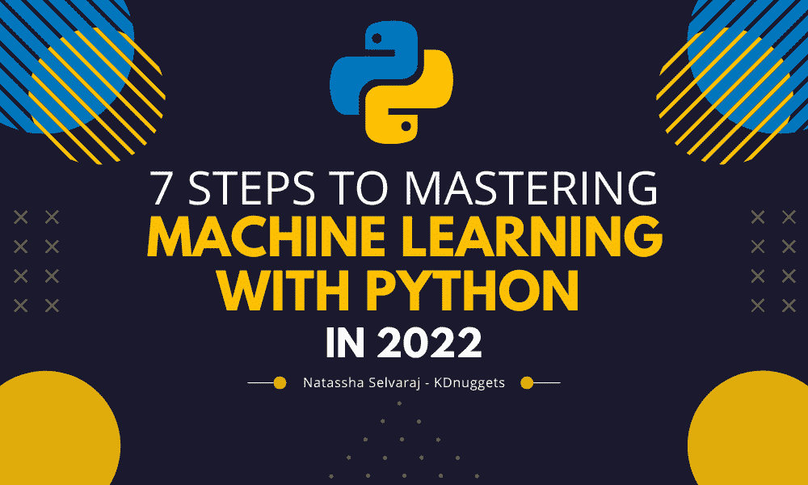
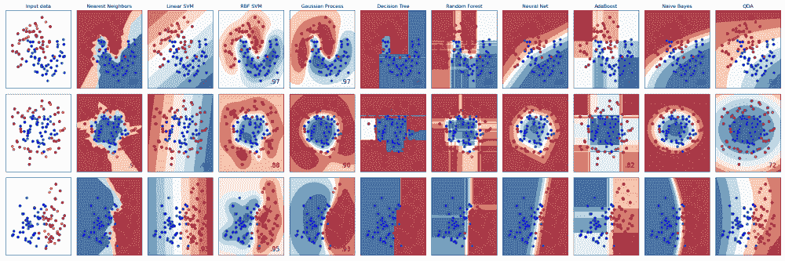
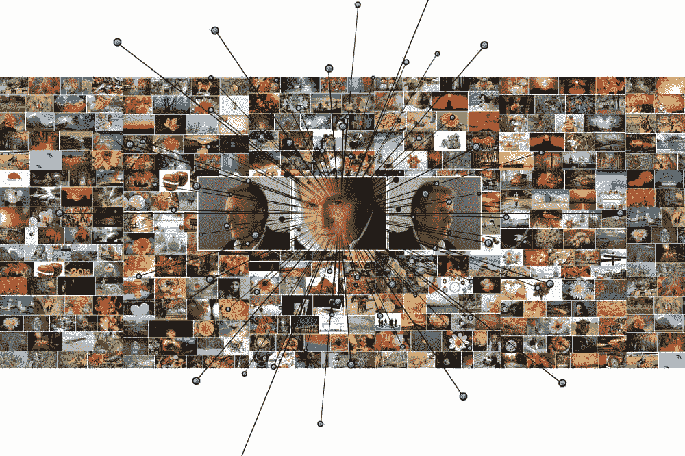

# 2022 年掌握 Python 机器学习的 7 个步骤

> 原文：[`www.kdnuggets.com/2022/02/7-steps-mastering-machine-learning-python.html`](https://www.kdnuggets.com/2022/02/7-steps-mastering-machine-learning-python.html)

图片由编辑提供

# 引言

* * *

## 我们的 3 大课程推荐

 1\. [Google 网络安全证书](https://www.kdnuggets.com/google-cybersecurity) - 快速进入网络安全职业道路。

 2\. [Google 数据分析专业证书](https://www.kdnuggets.com/google-data-analytics) - 提升你的数据分析能力

 3\. [Google IT 支持专业证书](https://www.kdnuggets.com/google-itsupport) - 支持你的组织进行 IT 管理

* * *

你是否正在尝试从零开始自学机器学习，但不知道从哪里开始？或者你可能已经参加了一两门在线课程，但在学习过程中遇到阻碍，不知道如何继续。

两年前我也处于类似的境地。我在大学花费了超过$25K，但仍然经验不足，未为就业市场做好准备。

我经过了大量的反复试验才制定出机器学习路线图。我观看了在线课程、YouTube 视频，并下载了无数电子书。我在线获得的知识超越了我在大学学到的所有知识。而且最棒的是——它的成本仅是大学费用的一小部分！

在这篇文章中，我将尝试将我多年来使用的所有资源浓缩成 7 个步骤，你可以按照这些步骤自学机器学习。

# 步骤 1：学习机器学习编程

在深入机器学习之前，你需要具备一定的编程知识。大多数数据科学家使用 Python 或 R 来构建机器学习模型。

我从 Python 开始，因为它是一种通用编程语言，需求量高于 R。

Python 技能也可以转移到不同领域，因此，如果将来你想扩展到网页开发或数据分析等领域，转换会更容易。

[2022 年完整 Python 训练营](https://www.udemy.com/course/complete-python-bootcamp/)课程由 Jose Portilla 主讲，如果你是编程新手，这是一个很好的 Python 入门课程。该课程在 Udemy 上提供，他们经常有促销活动，可以将课程价格降到$10\. 购买之前等促销活动是个不错的主意。

参加这门课程的另一个好处是它完全通过 Jupyter Notebook 进行教学。这是数据科学家最常用的 Python IDE，Jose 会让你熟悉这个界面，这样你就不需要花时间自己去学习了。

如果你希望寻找免费的课程替代选项，以下是我的建议：

+   [Jupyter Notebook 教程：简介、设置和操作指南](https://www.youtube.com/watch?v=HW29067qVWk) — 这门课程将帮助你熟悉 Jupyter 的界面。

+   [学习 Python：初学者完整课程 [教程]](https://www.youtube.com/watch?v=rfscVS0vtbw) — 这门课程将带你了解 Python 编程的基础知识，如变量、数据类型、函数、条件语句和循环。它使用 Pycharm IDE 教学，但你也可以使用 Jupyter Notebook 代替。

+   [Python for Everybody](https://www.py4e.com/book.php) — 这是一本可以免费下载的电子书。这本书与其他在线 Python 教程不同，它通过解决数据问题来介绍编程概念，使其成为数据科学有志者的理想读物。

一旦你掌握了 Python 基础，就开始将这些概念应用于解决问题。尽管完成了三年的计算机科学本科学位，但我从未真正学会编程，因为我从未将所学概念应用于实际问题。

因此，我对如何编程有了理论上的理解，但缺乏将问题分解并编写解决方案的能力。

一个帮助我提高解决问题能力的工具是 [HackerRank](https://www.hackerrank.com/)。HackerRank 是一个提供各种编程挑战的平台，难度级别各异。每天尝试解决至少 2-3 道 HackerRank 问题。从最简单的开始，然后逐渐提高难度。

如果你在解决问题时遇到困难，可以随时参考其他人的解决方案，以了解他们是如何解决的。然后，尝试用自己的代码复制他们的思路。

随着你不断进行这些练习题，你将开始对自己的编码能力充满信心。

然后你可以进入下一步——学习如何在 Python 中处理数据。

# 步骤 2：Python 中的数据收集和预处理

现在你已经知道如何用 Python 编程了，你可以开始学习数据收集和预处理。

我发现大多数数据科学行业的初学者有一个共性，那就是他们直接跳入掌握机器学习的阶段。他们没有过多关注数据收集或分析，这本身就是一项独立的技能。

因此，当被要求执行如寻找第三方数据或为机器学习建模准备数据等任务时，他们在工作中常常会遇到困难。

这里有一些我推荐的课程来完成上述任务。我还会提供一些免费的替代选项，你可以选择去学习。

+   数据收集 — 许多公司需要外部数据收集来支持他们的数据科学工作流程。你可以使用 API 来收集这些数据，或者根据你被分配的任务类型从零开始创建网页抓取器。由 365datascience 提供的 [网页抓取和 API 基础](https://365datascience.com/courses/web-scraping-and-api-fundamentals-in-python/) 课程将教你如何在 Python 中收集网页数据。如果你想要一个免费的替代方案，那么我建议你跟着 [Python API](https://www.dataquest.io/blog/python-api-tutorial/) 教程进行编码，然后是 Dataquest 上的 [Python 网页抓取](https://365datascience.com/courses/web-scraping-and-api-fundamentals-in-python/) 教程。

+   数据预处理 — 你收集的数据可能会以许多不同的格式出现。你需要能够将这些数据转换成机器学习模型可以接受的格式。这通常是通过使用一个叫做 Pandas 的 Python 库来完成的，在开始学习 ML 建模之前，掌握这个库是个好主意。你可以从 365datascience 提供的这个 [使用 Pandas 进行数据预处理](https://365datascience.com/courses/data-cleaning-preprocessing-pandas/) 课程开始。如果你想要一个替代课程，你可以观看一个免费的 YouTube 视频，[Python 数据预处理简介](https://www.youtube.com/watch?v=5rNu16O3YNE)。

# 第 3 步：在 Python 中进行数据分析

接下来，开始学习使用 Python 进行数据分析是一个好主意。数据分析是识别大量数据中的模式并发现有价值的见解的过程。

在创建任何机器学习模型之前，你需要了解你所处理的数据。探究数据集中不同变量之间的关系。一个变量可以告诉你关于另一个变量什么信息？你能基于在数据集中发现的见解提供推荐吗？

我建议你参加由 Jose Portilla 主讲的《Python 数据分析与可视化学习》课程，以提高你在这一领域的技能。

在 Python 中，有四个主要用于数据分析的库：Pandas、Numpy、Matplotlib 和 Seaborn。Jose 的课程将教你使用所有这些库进行数据分析。这个课程的最佳部分是他包括了与现实世界中的例子类似的示例项目。

如果你在寻找免费的替代方案，你可以参加 FreeCodeCamp 的 [使用 Python 进行数据分析](https://www.freecodecamp.org/learn/data-analysis-with-python/) 课程，或者下载 [使用 Python 进行探索性数据分析](https://greenteapress.com/thinkstats2/thinkstats2.pdf) 电子书。

图片来自 [Scikit-learn 文档](https://scikit-learn.org/stable/auto_examples/classification/plot_classifier_comparison.html)

# 第四步：使用 Python 进行机器学习

最后，你可以开始学习机器学习了！我总是建议采用自上而下的方法来学习机器学习。

与其学习理论和机器学习模型的深入工作，不如首先采用实现优先的方法。

首先学习如何使用 Python 包来构建预测模型。在真实世界的数据集上运行模型并观察结果。一旦你对机器学习在实践中的表现有了了解，就可以深入研究每个算法的工作原理。

[Python for Data Science and Machine Learning](https://www.udemy.com/course/python-for-data-science-and-machine-learning-bootcamp/)是一个很好的课程，你可以通过它学习在 Python 中实现机器学习模型。同样，这也是由 Jose Portilla 讲授的，是我曾经参加过的最好的入门机器学习课程之一。

Jose 将带你通过整个机器学习工作流程。你将学习如何使用名为 Scikit-Learn 的库在 Python 中构建、训练和评估机器学习模型。

Jose 会让你逐渐熟悉机器学习概念，而不会深入到令人不知所措的细节中，这使得它成为你入门的一个很好的课程。

FreeCodeCamp 的[Machine Learning with Scikit-Learn](https://www.freecodecamp.org/news/machine-learning-with-scikit-learn-full-course/)课程是一个很好的免费替代选择。如果你喜欢阅读，你可以下载一本免费的电子书，标题为[Building Machine Learning Systems with Python](http://totoharyanto.staff.ipb.ac.id/files/2012/10/Building-Machine-Learning-Systems-with-Python-Richert-Coelho.pdf)。这是一本简短的动手教材，将提供大量实际例子，而不会过多涉及每个算法的工作原理。

# 第五步：深入学习机器学习算法

一旦你对不同的模型及其实现方式有了了解，就可以开始学习这些模型背后的底层算法。

我建议你参考两个资源：

+   [统计学习](https://www.edx.org/course/statistical-learning)—edX：本课程将提供对不同机器学习算法如何工作的深入理解。该课程对复杂数学公式的依赖较少，如果你没有数学背景，这使得课程更易于跟随。

本课程涵盖了监督学习和非监督学习的技术，如线性回归、逻辑回归、线性判别分析、K 均值聚类和层次聚类。讲师还介绍了交叉验证和正则化等概念，以避免模型过拟合——这些在处理真实世界数据集时非常有用。

本课程中的一些实用讲座是用 R 语言讲授的，你可以随意跳过这些部分，因为课程的主要价值在于其理论材料。

这门课程基于由其讲师编写的书籍《[统计学习导论](https://www.statlearning.com/)》。这也是一个包含 R 语言代码示例的资源。然而，我找到了一本将所有代码示例翻译为 Python 的[GitHub 库](https://github.com/shilpa9a/Introduction_to_statistical_learning_Summary_Python)，这样你可以阅读书籍并跟随 Python 示例进行编程。

以上所有资源都可以免费获取。虽然 edX 课程需要付费，但你可以申请财政援助以免除课程费用。你还可以免费下载上述提到的电子书。

+   [Krish Naik 的机器学习播放列表](https://www.youtube.com/playlist?list=PLZoTAELRMXVOnN_g96ayzXX5i7RRO0QhL)——YouTube：Krish Naik 是一位数据科学家，他在 YouTube 上创建了机器学习教程，可以免费访问。

在这个播放列表中，他有视频带领学习者了解不同机器学习模型背后的数学直觉。他解释了线性和逻辑回归的基础算法、诸如袋装和提升的概念，以及 K 均值和层次聚类等无监督学习技术。

与统计学习课程类似，他没有用复杂的数学符号来解释这些内容。相反，他用简单的英语解释每个算法的工作原理，以便不同背景的学习者容易理解。

图片来源：[geralt 在 Pixabay](https://pixabay.com/users/geralt-9301/)

# 第 6 步：深度学习

到目前为止，以上所有资源都专注于传统的机器学习算法，或称为“浅层学习算法”。现在你可以开始学习另一类机器学习算法——深度学习。

深度学习算法能够在几乎不需要特征工程的情况下识别数据中的表示。深度学习算法能够直接从数据中识别表示并推导特征。因此，深度学习通常用于处理没有显式特征的数据，例如图像、语音和文本数据。

我建议的两个开始深度学习的资源是：

+   [Andrew Ng 的深度学习专业课程](https://www.coursera.org/specializations/deep-learning)——Coursera：这是学习深度学习最受欢迎的在线资源之一。Andrew Ng 将教你如何构建和训练神经网络，并将深度学习技术应用于图像和文本数据。Coursera 在你报名课程时会收取月费，完成课程后会提供证书。然而，你可以选择旁听该课程，免费获得所有课程材料。

+   [《Python 深度学习》](https://www.manning.com/books/deep-learning-with-python) — 这是我最喜欢的深度学习资源。这本教材将带你深入理解深度学习模型的理论和实现。作者假设读者没有数学背景，因此所有概念都用简单的英语解释。我更喜欢这本书而不是 Andrew Ng 的深度学习课程，因为它提供了更多的现实世界例子和 Python 代码。我能够将所学应用于现实项目，相比之下 Andrew Ng 的课程则更理论化。

# 第 7 步：项目

最后一步：构建项目！

上面提供了大量的资料。如果你不将其应用于现实项目，你会忘记所学的内容。你可以记住概念、获得认证，参加尽可能多的考试。但只有当你开始动手构建项目时，你才真正学到了东西。

[这里](https://data-flair.training/blogs/machine-learning-project-ideas/)有一篇文章，汇总了其他数据科学家创建的机器学习项目，并提供了源代码供参考。你可以跟随这些项目的代码进行一些小的修改，然后再从零开始做自己的项目。

这里还有一些资源可以帮助你入门：

+   [抓取亚马逊书评](https://www.natasshaselvaraj.com/web-scraping/)

+   [带有源代码的深度学习项目](https://data-flair.training/blogs/deep-learning-project-ideas/)

+   [Krish Naik 的机器学习项目播放列表](https://www.youtube.com/watch?v=CTu0qnuMxgA&list=PLZoTAELRMXVOFnfSwkB_uyr4FT-327noK)

+   [从面部照片构建年龄检测模型](https://www.thepythoncode.com/article/predict-age-using-opencv)

自学机器学习可能耗时且令人不知所措。然而，这也是一段非常有价值的旅程。每当你学习一个新概念或解决一个你认为不可能的问题时，你距离掌握机器学习的目标就更近一步。

**[Natassha Selvaraj](https://www.natasshaselvaraj.com/)** 是一位自学成才的数据科学家，对写作充满热情。你可以在[LinkedIn](https://www.linkedin.com/in/natassha-selvaraj-33430717a/)上与她联系。

### 更多相关主题

+   [KDnuggets™新闻 22:n05，2 月 2 日：掌握机器学习的 7 个步骤…](https://www.kdnuggets.com/2022/n05.html)

+   [KDnuggets 新闻 2022 年 3 月 16 日：学习数据科学基础及 5…](https://www.kdnuggets.com/2022/n11.html)

+   [人工智能、分析、机器学习、数据科学、深度学习…](https://www.kdnuggets.com/2021/12/developments-predictions-ai-machine-learning-data-science-research.html)

+   [掌握数据科学的 Python 的 7 个步骤](https://www.kdnuggets.com/2022/06/7-steps-mastering-python-data-science.html)

+   [掌握 Pandas 和 Python 进行数据整理的 7 个步骤](https://www.kdnuggets.com/7-steps-to-mastering-data-wrangling-with-pandas-and-python)

+   [掌握使用 Python 和 Pandas 进行数据清洗的 7 个步骤](https://www.kdnuggets.com/7-steps-to-mastering-data-cleaning-with-python-and-pandas)
