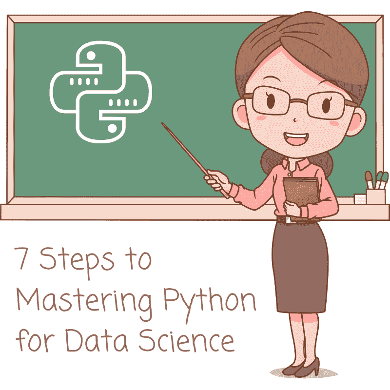

# 精通数据科学中的 Python 的 7 个步骤

> 原文：[`www.kdnuggets.com/2022/06/7-steps-mastering-python-data-science.html`](https://www.kdnuggets.com/2022/06/7-steps-mastering-python-data-science.html)

图片来源：[编辑提供的图片](https://www.pexels.com/photo/woman-programming-on-a-notebook-1181359/)

尽管获得了计算机科学学位，我毕业后仍然不知道如何编码。我在大学时修的编程课程非常理论化，我无法将学到的概念应用于解决实际问题。

* * *

## 我们的三大课程推荐

 1\. [Google 网络安全证书](https://www.kdnuggets.com/google-cybersecurity) - 快速进入网络安全职业道路。

 2\. [Google 数据分析专业证书](https://www.kdnuggets.com/google-data-analytics) - 提升你的数据分析能力

 3\. [Google IT 支持专业证书](https://www.kdnuggets.com/google-itsupport) - 支持你的组织 IT 工作

* * *

我想从事数据科学和分析的职业，但缺乏获得相关工作的编程技能。

即使跟随了无数编程 YouTube 视频进行编码，我发现自己仍然无法独立完成整个项目。我根本不知道从哪里开始，解决问题时没有编码教程的帮助，我感到很挣扎。

在经历了看似无尽的 Python 学习失败后，我最终向几位在该领域有经验的程序员和数据科学家寻求建议。

我根据他们给我的建议制定了一个 Python 学习路线图，并严格遵循。在花了大约每天 7-8 小时编程三个月后，我在 Python 方面变得足够熟练，顺利获得了我的第一个数据科学实习。

在这篇文章中，我将把我用来学习 Python 的所有资源浓缩成 7 个步骤。为了确保这个路线图对每个人都能获取，我还将提供每个资源的免费替代方案。

# 第一步：学习基础知识

如果你是一个完全没有编程知识的初学者，首先要学习 Python 的基础知识。这包括以下概念：

+   变量

+   运算符

+   条件语句

+   控制流

+   数据结构

+   方法

+   函数

这些基础概念是每种编码语言的支柱，你必须掌握它们以建立坚实的编程基础。

为了学习 Python 编程基础，我推荐在 Udemy 上参加 [2022 完整 Python 训练营](https://www.udemy.com/course/complete-python-bootcamp/)。Jose Portilla 是一位专业的数据科学和编程培训师，是我学到的最优秀的讲师之一。

编程曾经是一个令我感到畏惧的学科，有时甚至让我感到不知所措，但 Jose 的教学风格让我觉得这门学科很有趣。他的课程从简单的讲解和练习开始，复杂度逐渐增加，进度也很容易跟上。

如果你想要一个免费的课程替代方案，可以跟随 [FreeCodeCamp’s](https://www.youtube.com/watch?v=rfscVS0vtbw) 在 YouTube 上的 4 小时 Python 教程来学习语言基础。补充观看 [W3School’s Python 学习路径](https://www.w3schools.com/python/)，其中包含了 FreeCodeCamp 教程中没有涉及的如读写文件等主题。

# 第 2 步：练习编码挑战

单靠在线课程不足以学习编程。

当我第一次尝试学习编程时，我犯了一个错误，就是不断参加在线课程。我花了很多小时跟着教程进行编码，但在尝试编写自己的程序时完全迷失了方向。

这种情况被称为 **教程陷阱**。许多程序员不断地参加在线课程，却无法将学到的概念付诸实践。因此，他们无法解决真实世界的编程挑战，也无法在没有教程帮助的情况下编写代码。

教程陷阱是一个可怕的境地，因此我建议只参加一到两个编程在线课程。你不需要更多的课程来学习编码基础。

在掌握了编程基础之后，开始将你的知识付诸实践。

[HackerRank](https://www.hackerrank.com/) 是一个编码挑战平台，提供各种语言的编程问题。你可以用 Python 来解决这些挑战。从最简单的问题开始，逐步提升到更复杂的问题。

当我第一次开始在 HackerRank 上解决编码挑战问题时，即使是最简单的问题也需要我花费几个小时才能完成。随着我不断练习和复习其他程序员的解决方案，我开始变得越来越擅长，并能够更快地解决更难的问题。

这里是 HackerRank 提供的那种问题的一个例子 *(这些挑战随着你不断解决它们而变得越来越困难)*：

HackerRank 也常被公司用来在面试过程中评估候选人，因此在该平台上练习编码挑战将使你更容易通过技术数据科学面试。

# 第 3 步：Python 数据分析

一旦你在像 HackerRank 这样的网站上解决编码问题，你将对 Python 编程有一个相当强的掌握。

接下来，你需要学习如何利用这些编程技能来处理和分析大量数据。Python 拥有丰富的库，可用于数据处理和分析，例如 Pandas、Matplotlib 和 Seaborn。

如果你想学习用于数据分析的 Python，你可以参加 Jose Portilla 的 [Python 数据分析与可视化](https://www.udemy.com/course/learning-python-for-data-analysis-and-visualization/) 课程。

另一种选择是 Datacamp 提供的《Python 探索性数据分析》课程。这个课程的第一个模块可以免费学习，因此你可以在购买之前先试用一下。

如果你想要一个完全免费的课程，可以查看 FreeCodeCamp 的 [Python 数据分析](https://www.youtube.com/watch?v=r-uOLxNrNk8) 4 小时 YouTube 教程。

# 第 4 步：用于机器学习的 Python

作为数据科学家，你必须了解如何使用像 Scikit-Learn 这样的 Python 包来构建和解释预测算法的性能。

《Python 机器学习基础》是 Datacamp 提供的一门优秀课程，你可以通过它学习在 Python 中实现 ML 模型。

本程序将指导你如何使用 Scikit-Learn 库构建、训练和评估监督学习和无监督学习的 ML 算法。此外，你还将学习关于线性分类器，如支持向量机及其内部工作原理的知识。

最后，本课程将教你如何使用 Keras 框架在 Python 中实现深度学习算法。

如果你想要一个免费的替代课程，我建议跟随 Krish Naik 的 [Python 机器学习](https://www.youtube.com/playlist?list=PLZoTAELRMXVPBTrWtJkn3wWQxZkmTXGwe) 播放列表进行编码。这个播放列表包含了上述 Datacamp 课程中涉及的所有概念，尽管顺序和教学风格可能略有不同。

# 第 5 步：用于数据收集的 Python

许多公司依赖公开的外部数据来构建机器学习项目。作为数据科学家，你可能需要从在线来源收集数据，例如政府报告、社会情绪和评论。

要实现这一点，你需要能够从网页上自动提取大量数据——无论是通过 API 还是网页抓取。Python 提供了内置库，如 BeautifulSoup，可以帮助你轻松地收集和解析外部数据。

如果你想学习如何构建自动化网页抓取工具，Datacamp 的 [Python 网页抓取](https://www.datacamp.com/courses/web-scraping-with-python) 课程是一个很好的起点。这个课程的免费替代方案是 FreeCodeCamp 的 [使用 BeautifulSoup 的网页抓取](https://www.youtube.com/watch?v=XVv6mJpFOb0) 教程。

你还可以跟随我不久前创建的 [这个](https://www.natasshaselvaraj.com/web-scraping/) 网页抓取教程进行编码。

# 第 6 步：项目

完成上述所有步骤后，你应该对 Python 编程有足够的掌握，能够开始创建自己的项目。

构建一个端到端的项目是提升你编程技能的最佳方式之一。如果你没有技术学位，项目将让招聘经理对你的编程能力充满信心。

许多没有技术背景的数据科学 aspirants 通过展示他们的项目成功[转行进入该领域](https://www.listennotes.com/podcasts/kens-nearest/uber-driver-to-machine-es9KVCS12op/)。

建立展示多种技能的项目是非常重要的。

数据科学家的角色通常涉及使用编程工具来收集数据、进行探索性分析和可视化，以及构建预测模型。

确保创建各种项目，以展示你在所有这些领域的能力，这将帮助你在只具备一两个领域技能的候选人中脱颖而出。

如果你想用 Python 构建数据科学项目但不确定从哪里开始，可以阅读这篇文章，获取可以让你的简历脱颖而出的项目创意。

# 第七步：建立一个引人注目的作品集

现在你已经学会了 Python 并创建了展示你技能的项目，你可以建立一个作品集来集中展示你所有的工作。

我建议建立一个作品集网站并在线托管。这样，人们可以通过一个链接看到你所有的工作。

当我申请我的第一个数据科学实习时，我只是给招聘经理发了一个指向我作品集网站的链接。尽管那个网站当时还不完整，只展示了三个项目，但它足够打动了他，让我获得了面试机会——甚至没有询问我的学位、成绩或技术背景。

我使用 GitHub 页面创建了我的作品集，你可以阅读我如何做到这一点的[这里](https://towardsdatascience.com/how-to-create-a-data-science-portfolio-website-dcba6bf00994?source=---------8------------------).

如果你想要一个更简单的无代码替代方案，你可以使用 Wix 或 WordPress 等网站构建器来建立你的作品集网站。

# 记住，实践成就完美。

学习编码可能会令人不知所措，这是许多数据科学 aspirants 在尝试进入该领域时遇到的障碍。然而，经验丰富的程序员和新手程序员之间只有一个区别，那就是实践。随着你不断构建项目和尝试编程挑战，你的编码技能将不断提高。

**[Natassha Selvaraj](https://www.natasshaselvaraj.com/)** 是一位自学成才的数据科学家，热爱写作。你可以通过[LinkedIn](https://www.linkedin.com/in/natassha-selvaraj-33430717a/)与她联系。

### 更多相关内容

+   [KDnuggets™ 新闻 22:n05，2 月 2 日：掌握机器学习的 7 个步骤…](https://www.kdnuggets.com/2022/n05.html)

+   [掌握 Pandas 和 Python 数据清理的 7 个步骤](https://www.kdnuggets.com/7-steps-to-mastering-data-wrangling-with-pandas-and-python)

+   [掌握 Python 和 Pandas 数据清洗的 7 个步骤](https://www.kdnuggets.com/7-steps-to-mastering-data-cleaning-with-python-and-pandas)

+   [2022 年掌握 Python 机器学习的 7 个步骤](https://www.kdnuggets.com/2022/02/7-steps-mastering-machine-learning-python.html)

+   [掌握数据宇宙：成功的数据科学职业的关键步骤](https://www.kdnuggets.com/mastering-the-data-universe-key-steps-to-a-thriving-data-science-career)

+   [掌握数据科学 SQL 的 7 个步骤](https://www.kdnuggets.com/2022/04/7-steps-mastering-sql-data-science.html)
