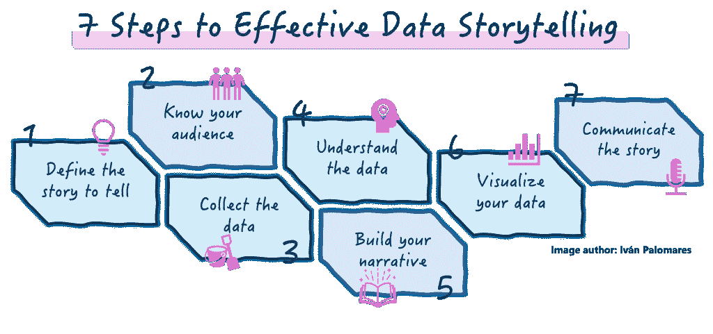

# 数据讲述的 7 个步骤

> 原文：[`www.kdnuggets.com/7-steps-to-master-the-art-of-data-storytelling`](https://www.kdnuggets.com/7-steps-to-master-the-art-of-data-storytelling)

作者提供的图片 | Midjourney & Freepik

如果数据可以被转化为信息丰富的视觉表现形式，那为什么不利用数据来阐述和传达一个故事呢？本教程强调了数据讲述的重要性，并通过七个步骤解释了如何成为一名熟练的数据讲述者。

* * *

## 我们的前 3 名课程推荐

 1\. [谷歌网络安全证书](https://www.kdnuggets.com/google-cybersecurity) - 快速进入网络安全职业道路

 2\. [谷歌数据分析专业证书](https://www.kdnuggets.com/google-data-analytics) - 提升你的数据分析技能

 3\. [谷歌 IT 支持专业证书](https://www.kdnuggets.com/google-itsupport) - 支持你的组织 IT 部门

* * *

**数据讲述**是有效利用数据讲述一个历史的艺术和过程，该过程向预期受众传达信息和见解。它是一种有价值的工具，用于传达数据分析结果，使数据驱动的见解对更广泛的受众更具可及性，或以更吸引人的方式传播数据。

没有唯一的方式来进行数据讲述，但以下步骤构成了一种方法，如果按顺序进行，将最大化成功讲述关于数据的有洞察力、吸引人且令人信服的故事的机会。

作者提供的图片

## 第一步：定义你想讲述的故事

这一步为一个引人入胜的数据故事奠定了基础。从确定通过数据传达的关键消息开始。识别你希望受众掌握的主要见解，并指明通向这些见解的明确方向。

假设你正在分析一个时尚零售公司的销售数据。你故事的意图可能是展示季节性趋势并突出高峰期。这个清晰的定义将帮助你提取出不同季节对销售的影响，并据此制定营销策略。

## 第二步：了解你的受众

了解你的受众是谁，他们的背景、兴趣和听取你意见的动机是什么，对于打造一个量身定制的引人入胜的数据故事至关重要。

例如，对于时尚零售销售故事，你的受众可能包括公司的高层管理人员和营销部门，他们需要有关销售的见解，以优化促销活动和库存管理。这一档案分析帮助你确定合适的可操作见解，并调整围绕数据使用的语言，使其对决策者具有相关性和可访问性。

## 第 3 步：收集适当的数据

确保你准确全面地收集故事所需的数据，捕捉所有必要的细节，以符合其目标并支持你的叙述。收集的数据应当是相关的、可靠的，并且足够支持你的核心信息。

收集过去四年的销售数据，并按季节、产品类别和地点分类，这有助于发现有洞察力的销售模式，从而支持你的叙述。

## 第 4 步：理解数据

分析收集到的数据以揭示趋势，例如假期销售高峰或夏季开始时泳装销售的激增。识别异常现象，如意外的销售下降，并比较各年度的月销售数据。这个分析过程对于突出关键洞察至关重要，例如找出推出某些促销活动的最佳时机。

## 第 5 步：构建你的叙述

你的分析是否揭示了关于季节性销售趋势的有趣事实？那么，是时候围绕这些事实构建一个扎实的叙述了。这是一个关键步骤，你需要认真考虑以下几点来构建一个引人入胜且信息丰富的故事：

1.  介绍背景，强调数据背后的重要事实，例如描述理解销售波动的重要性。

1.  突出描述涉及的关键元素或参与者，例如畅销产品和商店。

1.  描述发现的挑战，例如销售数据的不一致或意外的销售下降，并提出解决方案，如在关键时期开展有针对性的活动。

### 第 6 步：可视化你的数据

没有视觉支持的数据故事是不完整的。确定合适的图表类型来可视化数据中的事实或属性：折线图用于展示随时间变化的销售趋势，柱状图用于比较不同产品类别的销售，或者热力图用于指出销售最好的地点。

视觉效果是数据故事的灵魂：使复杂的数据变得易于理解，并通过帮助观众把握关键信息来对其产生积极影响。

## 第 7 步：向观众传达故事

最后，是时候通过一份全面的报告和一个包含第 6 步制作的可视化内容的互动仪表板向你的观众展示你的数据故事了。

记得在这里回到第 2 步（了解你的观众），使用清晰、简洁的语言，调整你的展示以满足他们的需求，并强调可操作的洞察。

在时尚零售的场景中，你可能会想通过概述利用高峰销售期的策略和应对意外销售下降的措施来结束。这将使你的观众在离开时感到有能力根据你刚刚传达的见解来提升他们的营销和销售策略。

## 总结

通过实施这七个步骤来打造引人入胜的数据故事，你将能够将原始数据转化为有洞察力的故事，推动参与度，赋能你的观众做出明智的决策，并最终实现成功的结果。

****[伊万·帕洛马雷斯·卡拉索萨](https://www.linkedin.com/in/ivanpc/)**** 是人工智能、机器学习、深度学习和大语言模型领域的领导者、作家、演讲者和顾问。他训练和指导他人将人工智能应用于现实世界。

### 更多相关内容

+   [掌握数据讲故事的艺术：数据科学家的指南](https://www.kdnuggets.com/2023/06/mastering-art-data-storytelling-guide-data-scientists.html)

+   [数据讲故事——通过数据讲述故事的艺术](https://www.kdnuggets.com/2023/07/manning-data-storytelling-the-art-telling-stories-data.html)

+   [通过这个 GitHub 仓库掌握命令行的艺术](https://www.kdnuggets.com/master-the-art-of-command-line-with-this-github-repository)

+   [将数据管理与数据讲故事结合以创造价值](https://www.kdnuggets.com/combining-data-management-and-data-storytelling-to-generate-value)

+   [掌握 Python 数据清洗的艺术](https://www.kdnuggets.com/mastering-the-art-of-data-cleaning-in-python)

+   [特征选择：科学与艺术的结合](https://www.kdnuggets.com/2021/12/feature-selection-science-meets-art.html)
