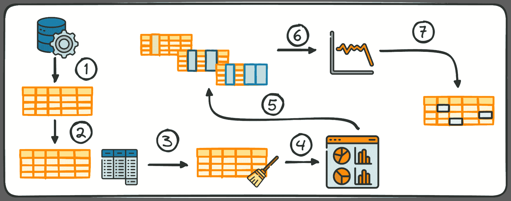
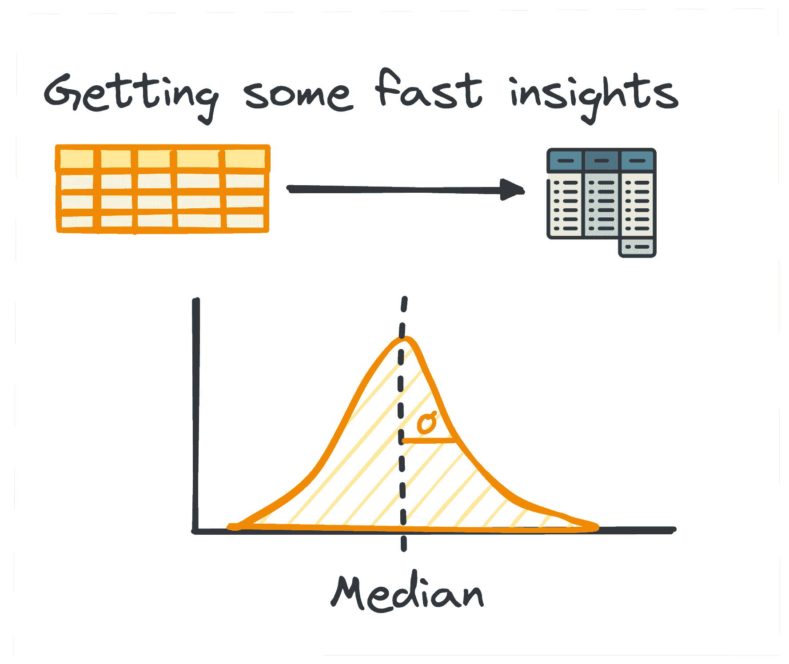
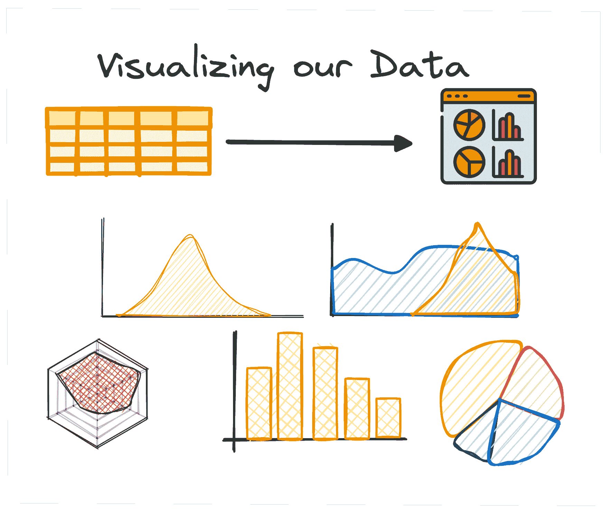

# 掌握探索性数据分析的 7 个步骤

> 原文：[`www.kdnuggets.com/7-steps-to-mastering-exploratory-data-analysis`](https://www.kdnuggets.com/7-steps-to-mastering-exploratory-data-analysis)

作者提供的图片

探索性数据分析（或 EDA）是数据分析过程中的核心阶段，强调对数据集内部细节和特征的彻底调查。

* * *

## 我们的前 3 个课程推荐

 1\. [谷歌网络安全证书](https://www.kdnuggets.com/google-cybersecurity) - 快速开启网络安全职业生涯

 2\. [谷歌数据分析专业证书](https://www.kdnuggets.com/google-data-analytics) - 提升你的数据分析技能

 3\. [谷歌 IT 支持专业证书](https://www.kdnuggets.com/google-itsupport) - 支持你的组织 IT

* * *

它的主要目的是揭示潜在模式，理解数据集的结构，并识别变量之间的任何潜在异常或关系。

通过执行 EDA，数据专业人员检查数据的质量。因此，它确保进一步的分析基于准确和有洞察力的信息，从而减少后续阶段出现错误的可能性。

所以，让我们一起尝试理解如何进行良好的 EDA，为我们的下一个数据科学项目做好准备。

# EDA 的重要性

我非常确定你已经听过这个短语：

垃圾进，垃圾出

输入数据质量始终是任何成功数据项目中最重要的因素。

不幸的是，大多数数据一开始都是杂乱的。通过探索性数据分析的过程，几乎可以用的数据集可以转变为完全可用的数据集。

需要澄清的是，这并不是一个用于净化任何数据集的魔法解决方案。尽管如此，许多 EDA 策略在解决数据集中的常见问题时是有效的。

所以……让我们根据 Ayodele Oluleye 在他的《使用 Python 烹饪书进行探索性数据分析》一书中学习最基本的步骤。

## 步骤 1：数据收集

任何数据项目的第一步是获得数据本身。这一步骤就是从各种来源收集数据以进行后续分析。

## 2\. 概要统计

在数据分析中，处理表格数据是很常见的。在分析这种数据时，通常需要快速洞察数据的模式和分布。

这些初步洞察为进一步探索和深入分析提供了基础，被称为概要统计。

这些方法提供了数据集分布和模式的简要概述，通过均值、中位数、众数、方差、标准差、范围、百分位数和四分位数等指标来概括。

作者图片

## 3\. 数据准备以进行探索性数据分析

在开始探索之前，数据通常需要为进一步分析做好准备。数据准备涉及使用 Python 的 pandas 库对数据进行转换、聚合或清理，以适应分析的需求。

这一步骤针对数据的结构，可能包括分组、附加、合并、排序、分类和处理重复项。

在 Python 中，使用 pandas 库的各种模块可以方便地完成这一任务。

表格数据的准备过程并没有遵循通用的方法；而是由数据的具体特征决定，包括其行、列、数据类型和包含的值。

## 4\. 数据可视化

可视化是探索性数据分析的核心组件，使数据集中的复杂关系和趋势易于理解。

使用合适的图表可以帮助我们识别大型数据集中的趋势，发现隐藏的模式或异常值。Python 提供了不同的数据可视化库，包括 Matplotlib 和 Seaborn 等。

作者图片

## 5\. 变量分析：

变量分析可以是单变量、双变量或多变量。每种分析方法提供了对数据集中变量之间分布和相关性的见解。技术的使用根据分析的变量数量而有所不同：

### 单变量

单变量分析的主要关注点是检查数据集中每个变量本身。在这一分析过程中，我们可以揭示如中位数、众数、最大值、范围和异常值等见解。

这种类型的分析适用于分类变量和数值变量。

### 双变量

双变量分析旨在揭示两个选定变量之间的见解，并专注于理解这两个变量之间的分布和关系。

当我们同时分析两个变量时，这种类型的分析可能会更复杂。它可以包括三种不同的变量对：数值-数值、数值-分类和分类-分类。

### 多变量

大数据集的一个常见挑战是同时分析多个变量。尽管单变量和双变量分析方法提供了有价值的见解，但通常不足以分析包含多个变量（通常超过五个）的数据集。

管理高维数据的问题，通常被称为维度灾难，已经被充分记录。大量变量可能带来好处，因为它允许提取更多的见解。与此同时，这种优势也可能对我们不利，因为可用于同时分析或可视化多个变量的技术有限。

## 6\. 时间序列数据分析

这一步骤重点在于检查在规律时间间隔内收集的数据点。时间序列数据适用于随时间变化的数据。这基本上意味着我们的数据集由一组在规律时间间隔内记录的数据点组成。

当我们分析时间序列数据时，我们通常可以发现随时间重复的模式或趋势，并呈现出时间上的季节性。时间序列数据的关键组成部分包括趋势、季节变动、周期变动和不规则变动或噪声。

## 7. 处理异常值和缺失值

异常值和缺失值如果没有得到妥善处理，会扭曲分析结果。这就是为什么我们应始终考虑一个阶段来处理它们。

确定、移除或替换这些数据点对维持数据集分析的完整性至关重要。因此，在开始分析数据之前，处理这些问题是非常重要的。

+   异常值是与其他数据点显著偏离的点。它们通常呈现出异常高或低的值。

+   缺失值是指缺少与特定变量或观察相关的数据点。

处理缺失值和异常值的一个关键初步步骤是了解它们为何存在于数据集中。这种理解通常指导了选择最适合的处理方法。需要考虑的其他因素包括数据的特征以及将要进行的具体分析。

# 结论

EDA 不仅提升了数据集的清晰度，还使数据专业人士能够通过提供管理具有众多变量的数据集的策略来应对维度灾难。

通过这些细致的步骤，使用 Python 进行的探索性数据分析（EDA）为分析师提供了提取有意义洞察所需的工具，为所有后续的数据分析工作奠定了坚实的基础。

****[Josep Ferrer](https://www.linkedin.com/in/josep-ferrer-sanchez)**** 是一位来自巴塞罗那的分析工程师。他毕业于物理工程专业，目前在应用于人类移动的数据科学领域工作。他还是一名兼职内容创作者，专注于数据科学和技术。Josep 涵盖了人工智能领域的最新发展。

### 更多信息

+   [掌握 SQL、Python、数据清理、数据…的指南集合](https://www.kdnuggets.com/collection-of-guides-on-mastering-sql-python-data-cleaning-data-wrangling-and-exploratory-data-analysis)

+   [非结构化数据的探索性数据分析技术](https://www.kdnuggets.com/2023/05/exploratory-data-analysis-techniques-unstructured-data.html)

+   [数据科学家探索性数据分析必备指南](https://www.kdnuggets.com/2023/06/data-scientist-essential-guide-exploratory-data-analysis.html)

+   [掌握数据宇宙：迈向成功数据科学职业的关键步骤](https://www.kdnuggets.com/mastering-the-data-universe-key-steps-to-a-thriving-data-science-career)

+   [KDnuggets™ 新闻 22:n05，2 月 2 日：掌握机器学习的七步骤…](https://www.kdnuggets.com/2022/n05.html)

+   [掌握数据科学的 SQL 七步骤](https://www.kdnuggets.com/2022/04/7-steps-mastering-sql-data-science.html)
