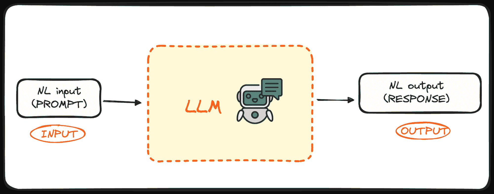
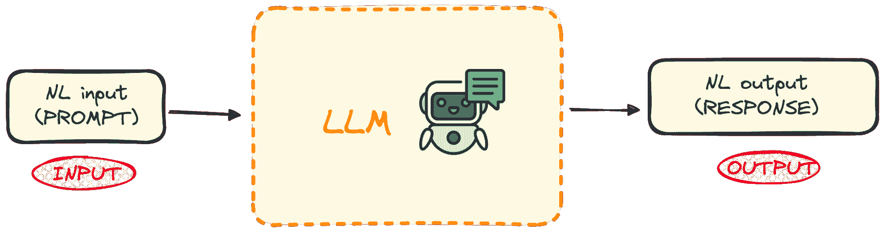
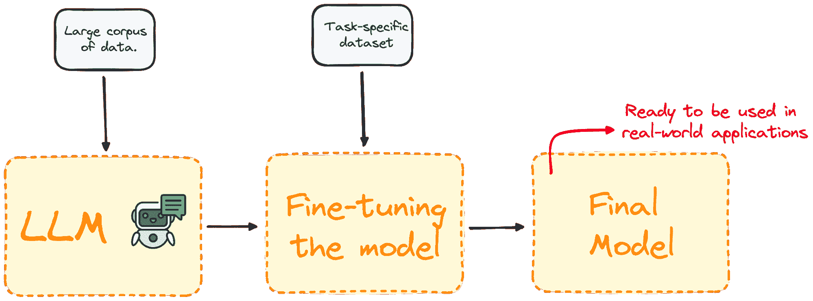
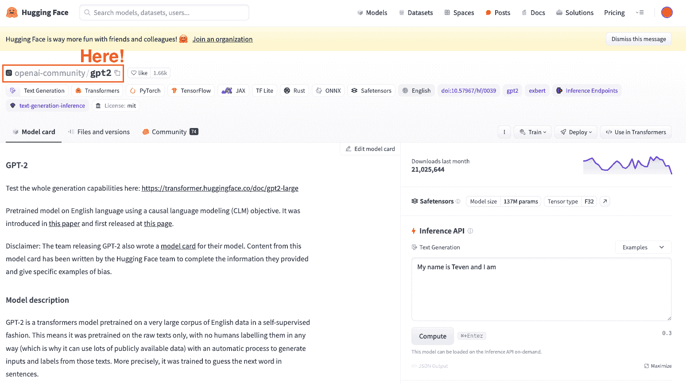
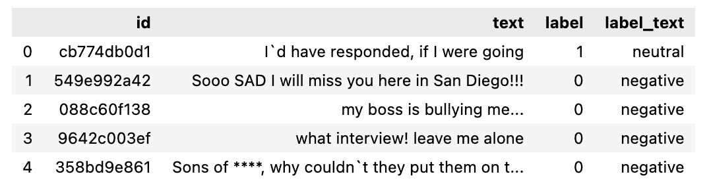

# 掌握大型语言模型微调的 7 个步骤

> 原文：[`www.kdnuggets.com/7-steps-to-mastering-large-language-model-fine-tuning`](https://www.kdnuggets.com/7-steps-to-mastering-large-language-model-fine-tuning)



作者提供的图像

在过去一年半中，自然语言处理（NLP）的格局发生了显著演变，这主要得益于大型语言模型（LLMs）如 OpenAI 的 GPT 系列的崛起。

* * *

## 我们的前三个课程推荐

 1\. [谷歌网络安全证书](https://www.kdnuggets.com/google-cybersecurity) - 快速进入网络安全职业道路。

 2\. [谷歌数据分析专业证书](https://www.kdnuggets.com/google-data-analytics) - 提升你的数据分析能力

 3\. [谷歌 IT 支持专业证书](https://www.kdnuggets.com/google-itsupport) - 支持你的组织的 IT

* * *

这些强大的模型已经彻底改变了我们处理自然语言任务的方法，提供了前所未有的翻译、情感分析和自动文本生成能力。它们理解和生成类似人类的文本的能力开辟了曾经被认为无法实现的可能性。

然而，尽管它们具有令人印象深刻的能力，训练这些模型的过程仍然充满挑战，如所需的大量时间和财务投资。

这引出了微调 LLMs 的关键作用。

通过微调这些预训练的模型以更好地适应特定应用或领域，我们可以显著提升它们在特定任务上的表现。这一步骤不仅提升了它们的质量，还扩展了它们在广泛领域中的实用性。

本指南旨在将这个过程分解为 7 个简单的步骤，以便将任何 LLM 微调到特定任务。

# 理解预训练的大型语言模型

LLMs 是机器学习算法的一个专门类别，旨在根据前面的词语提供的上下文预测序列中的下一个词。这些模型建立在变换器架构上，这是一项机器学习技术的突破，首次在谷歌的[你所需要的只是注意力](https://arxiv.org/abs/1706.03762)文章中解释。

像 GPT（生成预训练变换器）这样的模型是预训练语言模型的例子，这些模型已经接触到了大量的文本数据。这种广泛的训练使它们能够捕捉语言使用的基本规则，包括词语如何组合成连贯的句子。



作者提供的图像

这些模型的一个关键优势在于它们不仅能理解自然语言，还能根据给定的输入生成接近人类写作风格的文本。

那么这有什么好处呢？

这些模型已经通过 API 向大众开放。

## 什么是微调，为什么它很重要？

微调是选择一个预训练模型，并通过在特定领域数据集上进一步训练来改进它的过程。

大多数大型语言模型具有非常好的自然语言处理能力和通用知识表现，但在特定任务导向的问题上表现较差。微调过程提供了一种方法，以提高模型在特定问题上的性能，同时降低计算开支，无需从头构建模型。



作者提供的图片

简而言之，微调使模型在特定任务上的表现更好，从而使其在实际应用中更有效、更具适应性。这个过程对于改进现有模型以适应特定任务或领域至关重要。

# 微调 LLM 的逐步指南

让我们通过在仅仅 7 个步骤中微调一个实际模型来说明这个概念。

### 第一步：明确我们的具体目标

想象一下，我们想要推断任何文本的情感，并决定尝试使用 GPT-2 来完成这个任务。

我敢肯定，毫无惊讶，我们很快会发现它在这方面的表现相当糟糕。然后，一个自然的问题是：

我们能做些什么来提高它的性能？

当然，答案是我们可以！

通过利用微调，对 Hugging Face Hub 上的预训练 GPT-2 模型进行训练，使用一个包含推文及其相应情感的数据集，从而提高性能。

我们的最终目标是**拥有一个能够准确推断文本情感的模型。**

### 第二步：选择一个预训练模型和一个数据集

第二步是选择一个作为基础模型的模型。在我们的案例中，我们已经选择了模型：GPT-2。因此，我们将对其进行一些简单的微调。



Hugging Face 数据集中心的截图。选择 OpenAI 的 GPT2 模型。

始终记住选择一个适合你任务的模型。

### 第三步：加载要使用的数据

现在我们已经有了模型和主要任务，我们需要一些数据来进行操作。

但不用担心，Hugging Face 已经安排好了所有内容！

这就是它们的数据集库发挥作用的地方。

在这个例子中，我们将利用 Hugging Face 数据集库导入一个包含推文及其相应情感（积极、中性或消极）标签的数据集。

```py
from datasets import load_dataset

dataset = load_dataset("mteb/tweet_sentiment_extraction")
df = pd.DataFrame(dataset['train'])
```

数据大致如下：



要使用的数据集。

### 第四步：分词器

现在我们已经拥有了模型和要微调的数据集。所以下一步自然是加载一个标记器。由于 LLMs 以令牌（而非单词！！）为单位工作，我们需要一个标记器来将数据发送到模型中。

我们可以利用 map 方法轻松地对整个数据集进行标记化。

```py
from transformers import GPT2Tokenizer

# Loading the dataset to train our model
dataset = load_dataset("mteb/tweet_sentiment_extraction")
tokenizer = GPT2Tokenizer.from_pretrained("gpt2")
tokenizer.pad_token = tokenizer.eos_token

def tokenize_function(examples):
   return tokenizer(examples["text"], padding="max_length", truncation=True)

tokenized_datasets = dataset.map(tokenize_function, batched=True)
```

**附加内容：** 为了提高我们的处理性能，生成了两个较小的子集：

+   **训练集：** 用于微调我们的模型。

+   **测试集：** 用于评估它。

```py
small_train_dataset = tokenized_datasets["train"].shuffle(seed=42).select(range(1000))
small_eval_dataset = tokenized_datasets["test"].shuffle(seed=42).select(range(1000))
```

### 第 5 步：初始化我们的基础模型

一旦我们拥有要使用的数据集，我们加载我们的模型并指定预期的标签数量。通过 Tweet 的情感数据集，你可以知道有三种可能的标签：

+   0 或 消极

+   1 或 中性

+   2 或 积极

```py
from transformers import GPT2ForSequenceClassification

model = GPT2ForSequenceClassification.from_pretrained("gpt2", num_labels=3)
```

### 第 6 步：评估方法

Transformers 库提供了一个名为“Trainer”的类，用于优化我们模型的训练和评估。因此，在实际训练开始之前，我们需要定义一个函数来评估微调后的模型。

```py
import evaluate

metric = evaluate.load("accuracy")

def compute_metrics(eval_pred):
   logits, labels = eval_pred
   predictions = np.argmax(logits, axis=-1)
   return metric.compute(predictions=predictions, references=labels)
```

### 第 7 步：使用 Trainer 方法进行微调

最终步骤是微调模型。为此，我们设置训练参数以及评估策略，并执行 Trainer 对象。

要执行 Trainer 对象，我们只需使用 train()命令。

```py
from transformers import TrainingArguments, Trainer

training_args = TrainingArguments(
   output_dir="test_trainer",
   #evaluation_strategy="epoch",
   per_device_train_batch_size=1,  # Reduce batch size here
   per_device_eval_batch_size=1,    # Optionally, reduce for evaluation as well
   gradient_accumulation_steps=4
   )

trainer = Trainer(
   model=model,
   args=training_args,
   train_dataset=small_train_dataset,
   eval_dataset=small_eval_dataset,
   compute_metrics=compute_metrics,

)

trainer.train()
```

一旦我们的模型被微调，我们使用测试集来评估其性能。Trainer 对象已经包含了一个优化的 evaluate()方法。

```py
import evaluate

trainer.evaluate()
```

这是对任何 LLM 进行微调的基本过程。

同样，请记住，微调 LLM 的过程计算要求非常高，因此你的本地计算机可能没有足够的性能来执行它。

# 主要结论

今天，针对特定任务对预训练的大型语言模型（如 GPT）进行微调对于提升 LLMs 在特定领域的表现至关重要。这使我们能够利用它们的自然语言能力，同时提高其效率和定制化的潜力，使得这一过程变得可及且具有成本效益。

按照这 7 个简单步骤——从选择合适的模型和数据集到训练和评估微调后的模型——我们可以在特定领域实现更优的模型性能。

对于那些想查看完整代码的人，可以在我的 [大型语言模型 GitHub 仓库](https://github.com/rfeers/large-language-models/blob/main/7%20Steps%20to%20Fine-Tune%20LLMs.ipynb) 中找到。

**[](https://www.linkedin.com/in/josep-ferrer-sanchez/)**[Josep Ferrer](https://www.linkedin.com/in/josep-ferrer-sanchez)**** 是一位来自巴塞罗那的分析工程师。他毕业于物理工程专业，目前在应用于人类移动性的领域从事数据科学工作。他还是一位兼职内容创作者，专注于数据科学和技术。Josep 撰写有关人工智能的内容，涵盖该领域持续爆炸的应用。

### 更多相关内容

+   [掌握大型语言模型（LLMs）的 7 个步骤](https://www.kdnuggets.com/7-steps-to-mastering-large-language-models-llms)

+   [RAG 与微调：哪个是提升你的 LLM 应用的最佳工具？](https://www.kdnuggets.com/rag-vs-finetuning-which-is-the-best-tool-to-boost-your-llm-application)

+   [终极开源大语言模型生态系统](https://www.kdnuggets.com/2023/05/ultimate-opensource-large-language-model-ecosystem.html)

+   [NExT-GPT 介绍：任何到任何的多模态大语言模型](https://www.kdnuggets.com/introduction-to-nextgpt-anytoany-multimodal-large-language-model)

+   [探索 Zephyr 7B：最新大语言模型的全面指南](https://www.kdnuggets.com/exploring-the-zephyr-7b-a-comprehensive-guide-to-the-latest-large-language-model)

+   [免费精通课程：成为大语言模型专家](https://www.kdnuggets.com/ree-mastery-course-become-a-large-language-model-expert)
