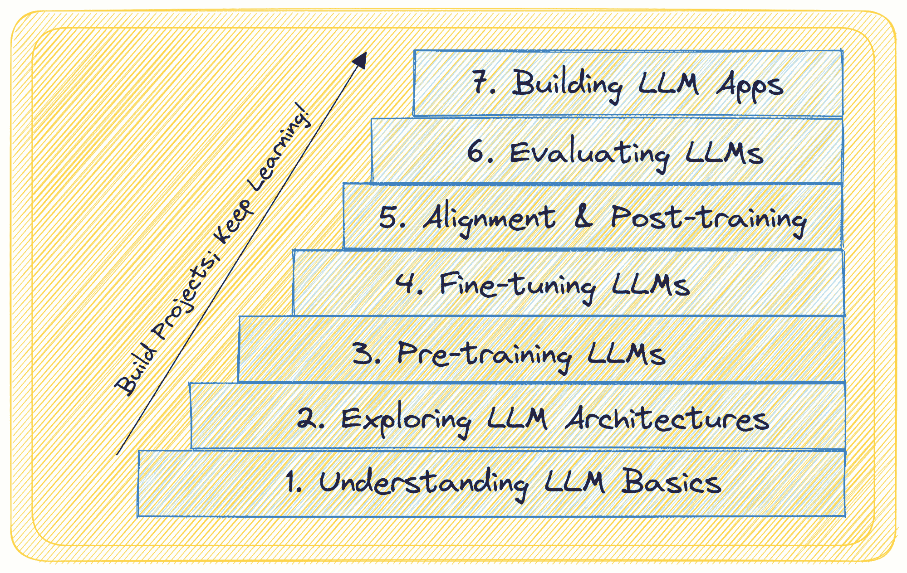
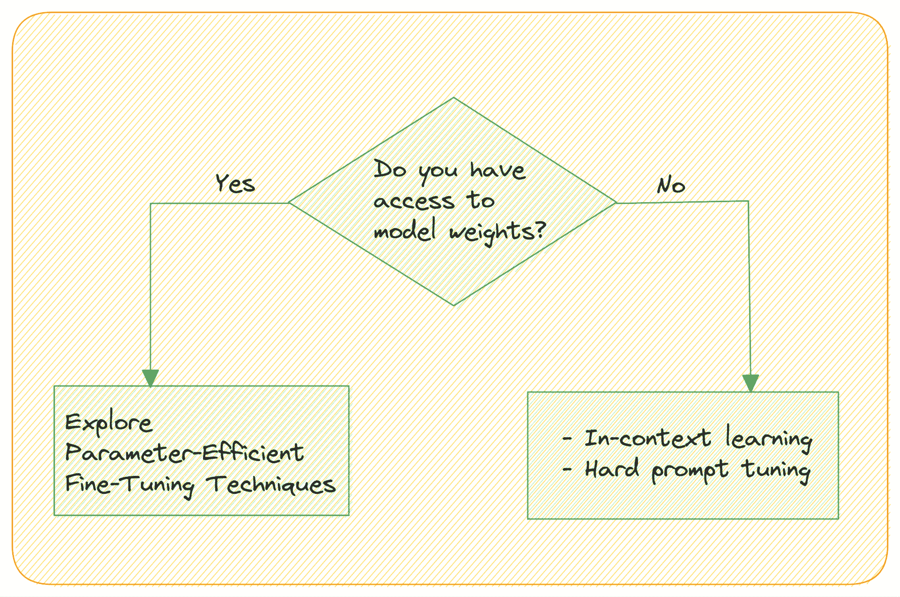
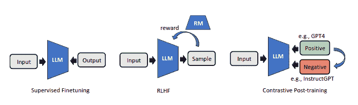
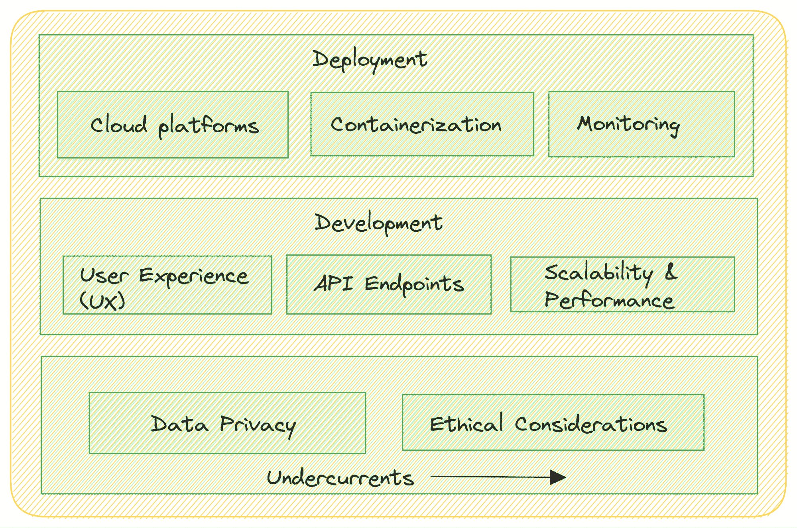

# 掌握大型语言模型（LLMs）的 7 个步骤

> 原文：[`www.kdnuggets.com/7-steps-to-mastering-large-language-models-llms`](https://www.kdnuggets.com/7-steps-to-mastering-large-language-models-llms)

图片来源：作者

GPT-4、Llama、Falcon 等——大型语言模型（LLMs）——真的是当下的**热门话题**。如果你正在阅读这些内容，你很可能已经通过聊天界面或 API 使用过一个或多个这些大型语言模型。

* * *

## 我们的前三个课程推荐

 1\. [Google 网络安全证书](https://www.kdnuggets.com/google-cybersecurity) - 快速进入网络安全职业。

 2\. [Google 数据分析专业证书](https://www.kdnuggets.com/google-data-analytics) - 提升你的数据分析技能

 3\. [Google IT 支持专业证书](https://www.kdnuggets.com/google-itsupport) - 支持你的组织的 IT 需求

* * *

如果你曾经好奇 LLMs 到底是什么，*它们如何工作*，以及*你可以用它们构建什么*，这份指南将是你所需要的。不论你是对大型语言模型感兴趣的数据专业人士，还是对它们感到好奇的普通人，这都是一份全面的 LLM 领域指南。

从 LLMs 是什么到如何构建和部署应用程序，我们将分解成 7 个简单的步骤，帮助你全面了解大型语言模型，内容包括：

+   你应该知道的事项

+   概念概览

+   学习资源

让我们开始吧！

# 第一步：理解 LLM 基础知识

如果你是大型语言模型的新手，首先了解 LLMs 的高层次概况以及它们为何如此强大是有帮助的。从尝试回答这些问题开始：

+   LLMs 究竟是什么？

+   为什么它们如此受欢迎？

+   LLMs 与其他深度学习模型有什么不同？

+   常见的 LLM 使用案例有哪些？（你可能已经熟悉这些；仍然是一个列出它们的好练习）

你能回答所有这些问题吗？好吧，让我们一起做吧！

## 什么是 LLMs？

大型语言模型（Large Language Models，简称 LLMs）是深度学习模型的一个子集，**经过大规模文本数据的训练**。它们非常**庞大**——拥有数百亿个参数——并且在各种**自然语言任务**上表现极为出色。

## 它们为什么这么受欢迎？

LLMs 具备**理解和生成**连贯、上下文相关且语法准确的文本的能力。它们的受欢迎和广泛应用的原因包括：

+   在各种语言任务上表现卓越

+   预训练 LLMs 的可访问性和可用性，使 AI 驱动的自然语言理解和生成得以民主化

## 那么 LLMs 与其他深度学习模型有何不同？

由于其规模和架构，包括自注意力机制，LLMs 与其他深度学习模型不同。关键差异包括：

+   **变换器架构**，它彻底改变了自然语言处理并支撑了 LLMs *(在我们的指南中即将介绍)*

+   捕捉**长距离依赖**的能力，能够**更好地理解上下文**

+   能够处理各种语言任务，从文本生成到翻译、总结和问答

## LLMs 的常见应用案例有哪些？

LLMs 在语言任务中得到了应用，包括：

+   **自然语言理解**：LLMs 在情感分析、命名实体识别和问答等任务中表现出色。

+   **文本生成**：它们可以为聊天机器人和其他内容生成任务生成类人文本。*(如果你曾使用过 ChatGPT 或其替代品，这完全不会让你感到惊讶)*

+   **机器翻译**：LLMs 显著提高了机器翻译的质量。

+   **内容总结**：LLMs 可以生成长篇文档的简明总结。你是否尝试过总结 YouTube 视频的文字记录？

现在你对 LLMs 及其能力有了初步了解，以下是一些资源，如果你有兴趣进一步探索：

+   [生成 AI 简介](https://www.cloudskillsboost.google/journeys/118/course_templates/536)

+   [大型语言模型简介](https://www.cloudskillsboost.google/journeys/118/course_templates/539)

# 步骤 2：探索 LLM 架构

既然你已经了解了什么是 LLMs，让我们继续学习支撑这些强大 LLMs 的变换器架构。所以，在 LLM 的学习过程中，这一步中**变换器需要你所有的注意力** *(没有任何双关意思)*

原始变换器架构，在论文"[Attention Is All You Need](https://arxiv.org/abs/1706.03762)"中介绍，彻底改变了自然语言处理：

+   **关键特性**：自注意力层、多头注意力、前馈神经网络、编码器-解码器架构。

+   **应用案例**：变换器是著名的语言模型（LLMs），如 BERT 和 GPT 的基础。

原始变换器架构使用编码器-解码器架构；但也存在仅编码器和仅解码器的变体。这里是这些架构的全面概述，包括它们的特性、著名 LLMs 和应用案例：

| **架构** | **关键特性** | **著名 LLMs** | **应用案例** |
| --- | --- | --- | --- |
| **仅编码器** | 捕捉双向上下文；适用于自然语言理解 |

+   BERT

+   同样基于 BERT 架构的 RoBERTa，XLNet

|

+   文本分类

+   问答系统

|

| **仅解码器** | 单向语言模型；自回归生成 |
| --- | --- |

+   GPT

+   PaLM

|

+   文本生成（各种内容创建任务）

+   文本补全

|

| **编码器-解码器** | 输入文本到目标文本；任何文本到文本的任务 |
| --- | --- |

+   T5

+   BART

|

+   总结

+   翻译

+   问答系统

+   文档分类

|

以下是学习变换器的绝佳资源：

+   [《注意力机制至关重要》](https://arxiv.org/abs/1706.03762)（必读）

+   [杰伊·阿拉马尔的《插图变换器》](http://jalammar.github.io/illustrated-transformer/)

+   [斯坦福 CS324：大型语言模型中的建模模块](https://stanford-cs324.github.io/winter2022/lectures/modeling/)

+   [HuggingFace Transformers 课程](https://huggingface.co/learn/nlp-course/chapter1/1)

# 第 3 步：预训练 LLMs

既然你已经熟悉了大型语言模型（LLMs）和变换器架构的基础知识，你可以继续学习 LLMs 的预训练。预训练为 LLMs 奠定基础，通过**让它们接触大量的文本数据，使它们能够理解语言的各个方面和细微差别**。

这里是你应该了解的概念概览：

+   **LLMs 预训练的目标**：让 LLMs 接触大量文本语料，以学习语言模式、语法和上下文。了解具体的预训练任务，如*掩蔽语言建模*和*下一句预测*。

+   **LLMs 预训练的文本语料**：LLMs 在大量多样化的文本语料上进行训练，包括网页文章、书籍和其他来源。这些是大规模数据集——包含数十亿到万亿的文本标记。常见的数据集包括 C4、BookCorpus、Pile、OpenWebText 等。

+   **训练过程**：理解预训练的技术细节，包括优化算法、批量大小和训练轮次。了解挑战，如减轻数据中的偏差。

如果你有兴趣进一步学习，请参考 CS324: 大型语言模型中的[LLM 训练模块](https://stanford-cs324.github.io/winter2022/lectures/training/)。

这些预训练的 LLMs 作为微调特定任务的起点。是的，微调 LLMs 是我们的下一步！

# 第 4 步：微调 LLMs

在对 LLMs 进行大规模文本语料的预训练后，下一步是对其进行特定自然语言处理任务的微调。微调可以让你**使预训练模型适应执行特定任务**，如情感分析、问答或翻译，以更高的准确性和效率完成任务。

## 为什么要微调 LLMs

微调是必要的，原因有几个：

+   预训练的 LLMs 已经获得了通用的语言理解，但需要微调才能在特定任务上表现良好。微调帮助模型学习目标任务的细微差别。

+   微调相比从头训练模型显著减少了所需的数据和计算量。因为它利用了预训练模型的理解，所以微调数据集可以比预训练数据集小得多。

## 如何微调 LLMs

现在让我们深入了解微调 LLMs 的*方法*：

+   **选择预训练 LLM：** 选择与任务匹配的预训练 LLM。例如，如果你在处理问答任务，选择一个有助于自然语言理解的预训练模型。

+   **数据准备**：为 LLM 执行的特定任务准备数据集。确保数据集包含标记的示例，并格式正确。

+   **微调**：在选择了基础 LLM 并准备好数据集之后，接下来就是真正的微调模型。*但怎么做呢？*

*有没有参数高效的技术？* 请记住，LLM 有数十亿个参数。权重矩阵非常庞大！

*如果你无法访问权重怎么办？*

图片由作者提供

当你无法访问模型的权重并通过 API 访问模型时，如何微调 LLM？大型语言模型具备**上下文学习**的能力——无需明确的微调步骤。你可以通过提供输入和任务的示例输出来利用它们从类比中学习。

**提示调优**——修改提示以获取更有帮助的输出——可以是：*硬提示调优*或*(软)提示调优*。

硬提示调优涉及直接修改提示中的输入令牌，因此不会更新模型的权重。

软提示调优将输入嵌入与一个可学习的张量拼接在一起。一个相关的想法是**前缀调优**，在每个 Transformer 块中使用可学习的张量，而不仅仅是输入嵌入。

如前所述，大型语言模型具有数十亿个参数。因此，微调所有层中的权重是一项资源密集型任务。最近，**参数高效微调技术（PEFT**）如 LoRA 和 QLoRA 变得流行。使用 QLoRA，你可以在单个消费级 GPU 上微调 4 位量化的 LLM，而不会降低性能。

这些技术引入了一小组可学习的参数——**适配器**——而不是整个权重矩阵。以下是一些有用的资源，以了解更多关于微调 LLMs 的内容：

+   [QLoRA 是你所需的一切 - Sentdex](https://www.youtube.com/watch?v=J_3hDqSvpmg)

+   [通过 bitsandbytes、4 位量化和 QLoRA 让 LLMs 更易获取](https://huggingface.co/blog/4bit-transformers-bitsandbytes)

# 第 5 步：LLMs 中的对齐和后训练

大型语言模型可能会生成有害、偏见或与用户实际期望不符的内容。对齐是指**将 LLM 的行为与人类偏好和伦理原则对齐的过程**。其目的是减少模型行为相关的风险，包括偏见、争议性回应和有害内容生成。

你可以探索以下技术：

+   从人类反馈中强化学习（RLHF）

+   对比后训练

RLHF 使用人类偏好注释来优化 LLM 输出，并根据这些注释拟合奖励模型。对比后训练旨在利用对比技术自动构建偏好对。

LLM 中的对齐技术 | [图片来源](https://arxiv.org/abs/2310.02263v1)

欲了解更多信息，请查看以下资源：

+   [从人类反馈中阐述强化学习 (RLHF)](https://huggingface.co/blog/rlhf)

+   [对数据课程的对比后训练大语言模型](https://arxiv.org/abs/2310.02263v1)

# 第 6 步：LLM 中的评估与持续学习

一旦你为特定任务微调了 LLM，评估其性能并考虑持续学习和适应的策略至关重要。此步骤确保你的 LLM 保持有效并与时俱进。

## LLM 的评估

评估性能以衡量其有效性并识别改进领域。以下是 LLM 评估的关键方面：

+   **任务特定指标**：为你的任务选择合适的指标。例如，在文本分类中，你可以使用传统的评估指标，如准确率、精确率、召回率或 F1 分数。对于语言生成任务，常用的指标有困惑度和 BLEU 分数。

+   **人类评估**：让专家或众包标注员在现实场景中评估生成内容或模型的响应质量。

+   **偏见与公平性**：评估 LLM 的偏见和公平性问题，特别是在将其应用于现实世界时。分析模型在不同人口群体中的表现，并解决任何差异。

+   **鲁棒性与对抗测试**：通过对 LLM 进行对抗攻击或挑战性输入来测试其鲁棒性。这有助于发现漏洞并增强模型安全性。

## 持续学习与适应

为了保持 LLM 与新数据和任务的同步，考虑以下策略：

+   **数据增强**：持续扩充数据存储，以避免因缺乏最新信息而导致的性能下降。

+   **重新训练**：定期用新数据重新训练 LLM，并对其进行针对不断变化任务的微调。对最新数据的微调有助于模型保持最新状态。

+   **主动学习**：实施主动学习技术以识别模型不确定或可能出错的实例。收集这些实例的注释以完善模型。

LLM 的另一个常见问题是幻觉。确保探索像**检索增强**这样的技术来减轻幻觉。

这里有一些有用的资源：

+   [大语言模型评估综述](https://arxiv.org/abs/2307.03109)

+   [RAG 应用评估的最佳实践](https://www.databricks.com/blog/LLM-auto-eval-best-practices-RAG)

# 第 7 步：构建和部署 LLM 应用

在为特定任务开发和微调 LLM 后，开始构建和部署利用 LLM 能力的应用程序。实质上，**利用 LLM 构建有用的现实世界解决方案**。

图片由作者提供

## 构建 LLM 应用程序

以下是一些考虑事项：

+   **任务特定的应用开发**：开发针对特定用例的应用程序。这可能涉及创建基于网页的界面、移动应用、聊天机器人或集成到现有软件系统中。

+   **用户体验（UX）设计**：关注以用户为中心的设计，确保你的 LLM 应用程序直观且易于使用。

+   **API 集成**：如果你的 LLM 作为语言模型后台，创建 RESTful API 或 GraphQL 端点，以便其他软件组件能够无缝地与模型互动。

+   **可扩展性和性能**：设计应用程序以处理不同级别的流量和需求。优化性能和可扩展性，以确保流畅的用户体验。

## 部署 LLM 应用程序

你已经开发了你的 LLM 应用程序，并准备将其部署到生产环境中。以下是你应该考虑的事项：

+   **云部署**：考虑将 LLM 应用程序部署到 AWS、Google Cloud 或 Azure 等云平台，以实现可扩展性和便于管理。

+   **容器化**：使用 Docker 和 Kubernetes 等容器化技术打包应用程序，并确保在不同环境中的一致部署。

+   **监控**：实施监控以跟踪已部署的 LLM 应用程序的性能，并实时检测和解决问题。

## 合规性和法规

数据隐私和伦理考虑是潜在的：

+   **数据隐私**：在处理用户数据和个人身份信息（PII）时，确保遵守数据隐私法规。

+   **伦理考虑**：在部署 LLM 应用程序时遵循伦理指南，以减轻潜在的偏见、虚假信息或有害内容生成。

你还可以使用像 LlamaIndex 和 LangChain 这样的框架来帮助你构建端到端的 LLM 应用程序。以下是一些有用的资源：

+   [全栈 LLM 训练营](https://fullstackdeeplearning.com/llm-bootcamp/)

+   [使用大型语言模型进行开发 - freeCodeCamp](https://www.youtube.com/watch?v=xZDB1naRUlk)

# 总结

我们通过定义大型语言模型是什么、为什么它们受到欢迎开始讨论，逐渐深入技术方面。我们总结了构建和部署 LLM 应用程序的讨论，这需要仔细规划、以用户为中心的设计、强大的基础设施，同时优先考虑数据隐私和伦理。

正如你可能已经意识到的，跟进该领域的最新进展并不断构建项目是重要的。如果你有一些自然语言处理的经验，本指南将在此基础上进行深入探讨。即使没有经验，也不用担心。我们的 7 个步骤掌握自然语言处理指南将帮助你。祝学习愉快！

****[Bala Priya C](https://www.kdnuggets.com/wp-content/uploads/bala-priya-author-image-update-230821.jpg)**** 是来自印度的开发者和技术作家。她喜欢在数学、编程、数据科学和内容创作的交叉点工作。她的兴趣和专业领域包括 DevOps、数据科学和自然语言处理。她喜欢阅读、写作、编码和喝咖啡！目前，她正在通过编写教程、如何做指南、观点文章等，学习并与开发者社区分享她的知识。Bala 还制作引人入胜的资源概述和编码教程。

### 更多相关话题

+   [掌握大型语言模型微调的 7 个步骤](https://www.kdnuggets.com/7-steps-to-mastering-large-language-model-fine-tuning)

+   [顶级开源大型语言模型](https://www.kdnuggets.com/2022/09/john-snow-top-open-source-large-language-models.html)

+   [更多免费的大型语言模型课程](https://www.kdnuggets.com/2023/06/free-courses-large-language-models.html)

+   [了解大型语言模型](https://www.kdnuggets.com/2023/03/learn-large-language-models.html)

+   [介绍来自 John Snow Labs 的医疗保健专用大型语言模型](https://www.kdnuggets.com/2023/04/john-snow-introducing-healthcare-specific-large-language-models-john-snow-labs.html)

+   [大型语言模型是什么以及它们如何工作？](https://www.kdnuggets.com/2023/05/large-language-models-work.html)
