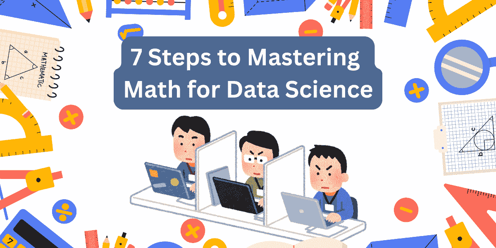

# 掌握数据科学数学的 7 个步骤

> 原文：[`www.kdnuggets.com/7-steps-to-mastering-math-for-data-science`](https://www.kdnuggets.com/7-steps-to-mastering-math-for-data-science)

作者提供的图片 | 创建于 Canva

由于有大量免费的高质量资源，学习数据科学变得更加容易。因此，如果你有兴趣，你可以免费自学数据科学——学习和实践。

* * *

## 我们的前三大课程推荐

 1\. [谷歌网络安全证书](https://www.kdnuggets.com/google-cybersecurity) - 快速进入网络安全职业生涯。

 2\. [谷歌数据分析专业证书](https://www.kdnuggets.com/google-data-analytics) - 提升你的数据分析技能

 3\. [谷歌 IT 支持专业证书](https://www.kdnuggets.com/google-itsupport) - 支持你的组织 IT

* * *

学习编程语言和其他工具及库可能很简单。但你也需要学习数据科学的数学基础。如果你没有数学或计算机科学的背景，这可能会相当令人生畏。但这仍然是可以做到的。

有一个指导来帮助你学习数据科学的数学可以使事情变得更简单。这就是为什么我们编写了这个指南来帮助你学习数据科学的数学。让我们开始吧。

## 第一步：复习代数基础

从你已经知道的东西开始总是很容易。因此，从复习代数基础开始（你应该已经通过学校的数学课程熟悉这些内容）。

你可以复习如何解方程组、解未知数以及绘制函数。

#### 重点关注

+   **线性方程和不等式**：学习如何解带有一个或多个变量的方程，并解释解的意义。

+   **函数和图形**：了解不同类型的函数以及如何绘制它们。

+   **多项式**：使用多项式函数，这些函数在各种回归模型中用于拟合数据点。

+   **矩阵和向量**：这些在对数据集进行操作时非常关键，尤其是在高维数据中。你可以在关注线性代数时学到更多。

#### 资源

+   [数据科学数学技能 | Coursera](https://www.coursera.org/learn/datasciencemathskills)

+   [代数 I | MIT 开放课程](https://ocw.mit.edu/courses/18-701-algebra-i-fall-2010/)

## 第二步：学习微积分基础

微积分是数据科学中的另一个重要数学工具。它对于理解数据随时间变化、建模连续数据以及优化算法至关重要。

你应该学习如何对一个或多个变量的函数进行微分。积分在学习概率和随机变量时会派上用场——用于计算曲线下的面积——代表累计分布函数或概率密度。

#### 关注的重点

+   **极限和连续性**：理解极限和连续性的概念，以及它们如何用于理解函数在输入接近某些值时的行为。

+   **微分**：学习如何计算和解释导数，导数表示变化率。

+   **多变量微积分**：扩展你的知识到多个变量的函数，这对于理解涉及多个输入的复杂模型至关重要。

+   **积分**：理解积分过程及其用于计算曲线下面积的方法。

#### 资源

+   [微积分 I: 单变量微积分 | MIT 开放课程](https://ocw.mit.edu/courses/18-01-calculus-i-single-variable-calculus-fall-2020/)

+   [多变量微积分 | MIT 开放课程](https://ocw.mit.edu/courses/18-02-multivariable-calculus-fall-2007/)

## 第三步：熟悉线性代数

线性代数对于数据科学中的许多算法至关重要，包括用于降维（如 PCA）、数据变换等的算法。

它提供了处理具有多维数据集的数学框架，并帮助高效存储和操作高维空间中的数据。

#### 关注的重点

+   **向量和向量空间**：学习如何处理向量，这对高维数据表示至关重要。理解向量空间对于数据变换和机器学习算法是必要的。

+   **矩阵运算**：掌握矩阵乘法、逆矩阵和行列式等操作，这些都是许多机器学习模型的基础，尤其是在处理数据变换和多变量分析时。

+   **线性变换**：理解线性变换如何用于将数据从一个空间映射到另一个空间。

+   **特征值和特征向量**：理解方阵的特征分解及其重要性，特别是在那些减少数据维度或提取特征的算法中。

#### 资源

+   [3blue1brown – 线性代数](https://www.3blue1brown.com/topics/linear-algebra)

+   [线性代数 | MIT 开放课程](https://ocw.mit.edu/courses/18-06-linear-algebra-spring-2010/)

## 第四步：学习离散数学

如果你想自学计算机科学和数据科学，应该参加一个（短期）离散数学课程。

这在图论、密码学和组合优化等领域尤为重要。离散数学帮助你理解并解决数据库、计算机算法和网络分析中的问题。

#### 关注的重点

+   **集合论**：学习集合的基本知识，包括并集、交集和差集等操作。集合论对于理解逻辑、函数和数据库及算法中的关系是必不可少的。

+   **组合学**：学习计数、排列和组合的技巧。这对概率和算法分析很有帮助。

+   **图论**：了解图（网络）的属性以及它们如何用于建模实体之间的关系。

+   **布尔代数**：探索布尔逻辑的基本知识，这对于设计和理解算法尤其是在决策过程中的基础是非常重要的。

#### 资源

+   [计算机科学数学 | MIT 开放课程](https://ocw.mit.edu/courses/6-042j-mathematics-for-computer-science-fall-2010/)

+   [计算机科学离散数学导论 | Coursera](https://www.coursera.org/specializations/discrete-mathematics)

## 第 5 步：学习概率与统计

概率与统计可以让你根据数据做出明智的决策，建模不确定性和检验假设。这些都是数据科学中预测建模、风险评估和数据解释的基础工具。

从构建概率模型到理解数据分布，对这些概念的深入掌握都是必不可少的。

#### 重点关注

+   **概率论**：了解概率的基本知识，包括条件概率、贝叶斯定理和独立性。

+   **随机变量与概率分布**：了解不同类型的随机变量（离散和连续）的行为，以及如何使用概率分布（如正态分布、二项分布和泊松分布）对其建模。

+   **描述性统计与推断统计**：掌握总结数据（均值、中位数、众数、方差）和基于样本数据对总体进行推断的技术。

+   **假设检验**：学习如何执行和解释假设检验，这些检验用于通过评估证据对抗零假设来做出数据驱动的决策。

#### 资源

+   [使用 Python 的统计学 | Coursera](https://www.coursera.org/specializations/statistics-with-python)

+   [概率 | Khan Academy](https://www.khanacademy.org/math/probability)

## 第 6 步：探索优化技术

在处理机器学习算法和统计模型时，你会遇到优化问题。无论是寻找模型的最佳参数还是最小化误差率，理解优化技术可以提高模型的性能和效率。在进行优化时，你会发现需要掌握微积分和线性代数。

#### 重点关注

+   **线性规划**：学习如何在约束条件下优化线性函数。

+   **梯度下降**：学习这一基本优化算法，它用于在机器学习和深度学习模型中最小化损失函数。

+   **凸优化**：理解凸函数的性质，以及如何将某些优化问题表述为简化问题。

+   **有约束与无约束优化**：学习有约束和无约束优化问题的区别，以及如何使用适当的算法解决这些问题。

#### 资源

+   [凸优化 | 斯坦福在线](https://www.edx.org/learn/engineering/stanford-university-convex-optimization)

+   [凸优化导论 | 麻省理工学院开放课程](https://ocw.mit.edu/courses/6-079-introduction-to-convex-optimization-fall-2009/)

## 第 7 步：拥抱**及时**学习

我们已经讲解了数据科学中你需要了解的不同数学主题。但你也可能意识到，事先掌握每一个数学概念是不可能的。一旦你获得了一些基础知识，你可以根据需要**及时**学习其他概念。

面对特定问题时，识别解决它所需的数学技术——无论是统计方法、优化算法还是矩阵变换——并**随时**学习这些概念。

## 总结

就这样结束了！

我希望你发现这份关于数据科学数学学习的指南对你有所帮助。如前所述，你需要了解的所有内容列表似乎很长。但你可以在进行项目时随时学习所需的数学知识。

学习愉快！

****[Bala Priya C](https://www.kdnuggets.com/wp-content/uploads/bala-priya-author-image-update-230821.jpg)**** 是来自印度的开发者和技术作家。她喜欢在数学、编程、数据科学和内容创作的交叉点工作。她的兴趣和专长包括 DevOps、数据科学和自然语言处理。她喜欢阅读、写作、编码和喝咖啡！目前，她正在通过编写教程、操作指南、意见文章等，与开发者社区分享她的知识。Bala 还创建了引人入胜的资源概述和编码教程。

### 更多相关话题

+   [如何克服对数学的恐惧，并学习数据科学所需的数学](https://www.kdnuggets.com/2021/03/overcome-fear-learn-math-data-science.html)

+   [掌握数据宇宙：成功数据科学职业的关键步骤](https://www.kdnuggets.com/mastering-the-data-universe-key-steps-to-a-thriving-data-science-career)

+   [KDnuggets™ 新闻 22:n05，2 月 2 日：掌握机器学习的 7 个步骤…](https://www.kdnuggets.com/2022/n05.html)

+   [掌握数据科学的 SQL 的 7 个步骤](https://www.kdnuggets.com/2022/04/7-steps-mastering-sql-data-science.html)

+   [掌握数据科学的 Python 的 7 个步骤](https://www.kdnuggets.com/2022/06/7-steps-mastering-python-data-science.html)

+   [通过敏捷方法掌握数据科学项目管理的 7 个步骤](https://www.kdnuggets.com/2023/07/7-steps-mastering-data-science-project-management-agile.html)
