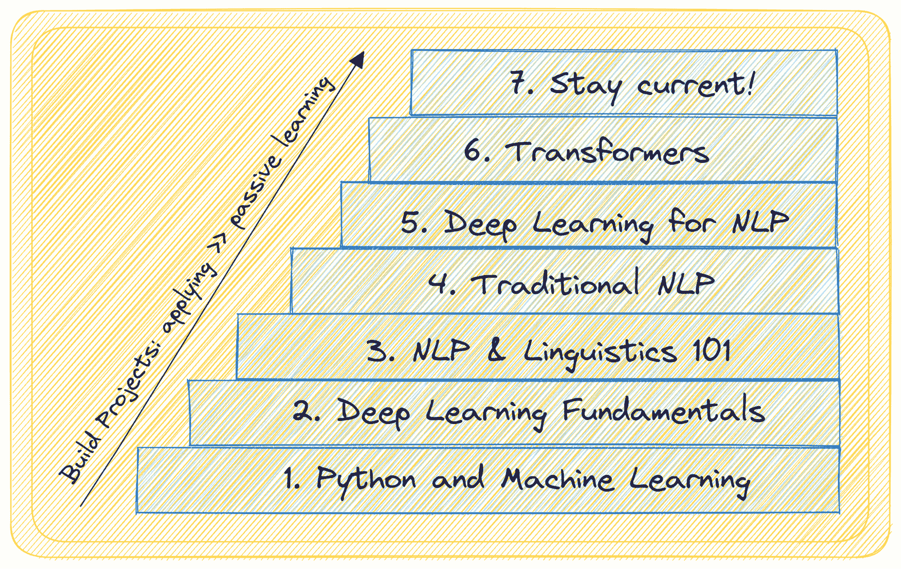

# 掌握自然语言处理的 7 个步骤

> 原文：[`www.kdnuggets.com/7-steps-to-mastering-natural-language-processing`](https://www.kdnuggets.com/7-steps-to-mastering-natural-language-processing)

作者提供的图片

现在是进入自然语言处理（NLP）最激动人心的时刻。你是否有一些构建机器学习模型的经验，并且对探索自然语言处理感兴趣？也许你已经使用了如 ChaGPT 这样的 LLM 驱动的应用程序，并且意识到它们的实用性，并希望深入研究自然语言处理？

* * *

## 我们的前三大课程推荐

 1\. [Google 网络安全证书](https://www.kdnuggets.com/google-cybersecurity) - 快速进入网络安全职业生涯。

 2\. [Google 数据分析专业证书](https://www.kdnuggets.com/google-data-analytics) - 提升你的数据分析技能

 3\. [Google IT 支持专业证书](https://www.kdnuggets.com/google-itsupport) - 在 IT 领域支持你的组织

* * *

好吧，你可能还有其他理由。不过既然你已经在这里，这里有一个关于 NLP 的 7 步指南。在每一步中，我们提供：

+   你应该学习和理解的概念概述

+   一些学习资源

+   你可以构建的项目

让我们开始吧。

# 第一步：Python 和机器学习

第一步，你应该在 Python 编程上打下坚实的基础。此外，熟练掌握 NumPy 和 Pandas 这样的库用于数据处理也是必要的。在深入 NLP 之前，了解机器学习模型的基础知识，包括常用的监督学习和无监督学习算法。

熟悉如 scikit-learn 这样的库，它们使得实现机器学习算法变得更加容易。

总结一下，你需要知道以下内容：

+   Python 编程

+   熟练掌握类似 NumPy 和 Pandas 这样的库

+   机器学习基础（从数据预处理和探索到评估和选择）

+   熟悉监督学习和无监督学习两种范式

+   类似 Scikit-Learn 这样的 Python 机器学习库

查看这个 [freeCodeCamp 提供的 Scikit-Learn 入门课程](https://www.youtube.com/watch?v=0B5eIE_1vpU)。

这是一些你可以进行的项目：

+   房价预测

+   贷款违约预测

+   用于客户细分的聚类

# 第二步：深度学习基础

在你掌握机器学习并对模型构建和评估感到舒适之后，你可以继续学习深度学习。

从理解神经网络、其结构以及如何处理数据开始。了解激活函数、损失函数和优化器，这些都是训练神经网络所必需的。

理解反向传播的概念，它促进了神经网络的学习，以及梯度下降作为优化技术。熟悉深度学习框架如 TensorFlow 和 PyTorch 以便于实际应用。

总结来说，你应该了解：

+   神经网络及其架构

+   激活函数、损失函数和优化器

+   反向传播和梯度下降

+   TensorFlow 和 PyTorch 等框架

以下资源将对学习 PyTorch 和 TensorFlow 的基础知识非常有帮助：

+   [PyTorch 深度学习](https://www.youtube.com/watch?v=GIsg-ZUy0MY)

+   [TensorFlow 2.0 完整课程](https://www.youtube.com/watch?v=tPYj3fFJGjk)

你可以通过以下项目来应用所学知识：

+   手写数字识别

+   CIFAR-10 或类似数据集上的图像分类

# 第 3 步：NLP 基础和重要语言学概念

首先了解 NLP *是什么*及其广泛应用，从情感分析到机器翻译、问答系统等。

理解语言学概念，如分词，这涉及将文本分解为更小的单位（标记）。了解词干提取和词形还原，这些技术将单词还原为其根形式。

还需探索词性标注和命名实体识别等任务。

总结来说，你应该理解：

+   NLP 及其应用介绍

+   分词、词干提取和词形还原

+   词性标注和命名实体识别

+   基本语言学概念，如句法、语义和依存句法分析

[CS 224n 的依存句法分析讲座](https://web.stanford.edu/class/archive/cs/cs224n/cs224n.1224/)提供了你所需语言学概念的良好概述。免费的书籍[用 Python 进行自然语言处理](https://www.nltk.org/book/)（NLTK）也是一个很好的参考资源。

尝试构建一个命名实体识别（NER）应用程序，选择一个用例（如解析简历和其他文档）。

# 第 4 步：传统自然语言处理技术

在深度学习革命化 NLP 之前，传统技术奠定了基础。你应该理解词袋模型（BoW）和 TF-IDF 表示，这些方法将文本数据转换为机器学习模型所需的数值形式。

学习 N-grams，它们捕捉单词的上下文及其在文本分类中的应用。接着，探索情感分析和文本摘要技术。此外，理解隐马尔可夫模型（HMMs）用于词性标注等任务，矩阵分解及其他算法如潜在狄利克雷分配（LDA）用于主题建模。

因此，你应该熟悉：

+   词袋模型（BoW）和 TF-IDF 表示

+   N-grams 和文本分类

+   情感分析、主题建模和文本摘要

+   隐马尔可夫模型（HMMs）用于词性标注

这里有一个学习资源：[完整的 Python 自然语言处理教程](https://www.youtube.com/watch?v=M7SWr5xObkA)。

以及几个项目想法：

+   垃圾邮件分类器

+   在新闻源或类似数据集上的主题建模

# 第五步：深度学习用于自然语言处理

目前，你已经熟悉了 NLP 和深度学习的基础知识。现在，将你的深度学习知识应用于 NLP 任务。从词嵌入开始，例如 Word2Vec 和 GloVe，它们将单词表示为密集向量并捕捉语义关系。

然后深入学习序列模型，例如递归神经网络（RNNs），用于处理顺序数据。理解长短期记忆（LSTM）和门控递归单元（GRU），它们以捕捉文本数据中的长期依赖关系而著称。探索序列到序列模型用于诸如机器翻译等任务。

总结：

+   RNNs

+   LSTM 和 GRUs

+   序列到序列模型

[CS 224n：深度学习自然语言处理](https://web.stanford.edu/class/archive/cs/cs224n/cs224n.1224/) 是一个优秀的资源。

一些项目想法：

+   语言翻译应用

+   在自定义语料库上的问答

# 第六步：使用 Transformers 进行自然语言处理

**Transformers**的出现彻底改变了 NLP 领域。了解**注意力机制**，这是 Transformers 的一个关键组成部分，使模型能够专注于输入的相关部分。了解 Transformer 架构及其各种应用。

你应该理解：

+   注意力机制及其重要性

+   Transformer 架构简介

+   Transformers 的应用

+   利用预训练语言模型；对预训练模型进行微调以适应特定的自然语言处理任务

学习 NLP 与 Transformers 最全面的资源是[HuggingFace 团队的 Transformers 课程](https://huggingface.co/learn/nlp-course/chapter1/1)。

你可以构建的有趣项目包括：

+   客户聊天机器人/虚拟助手

+   文本情感检测

# 第七步：构建项目、继续学习并保持最新

在像自然语言处理这样的快速发展领域（或任何领域），你只能不断学习并通过更具挑战性的项目进行探索。

实践项目是必不可少的，因为它们提供了实际经验，并加深对概念的理解。此外，通过博客、研究论文和在线社区保持与自然语言处理研究社区的互动，将帮助你跟上 NLP 的最新进展。

OpenAI 的 ChatGPT 在 2022 年底上市，GPT-4 于 2023 年初发布。同时（我们已经看到并且仍在看到）有大量开源大型语言模型的发布、LLM 驱动的编码助手、新颖且资源高效的微调技术等。

如果你希望提升你的 LLM 技能，这里有一份由两部分组成的有用资源汇编：

+   大型语言模型的顶级免费课程

+   更多关于大型语言模型的免费课程

你还可以探索像 Langchain 和 LlamaIndex 这样的框架，以构建有用且有趣的 LLM 驱动的应用程序。

# 总结

希望你觉得这份掌握自然语言处理的指南对你有帮助。这里回顾了七个步骤：

+   第一步：Python 和机器学习基础

+   第二步：深度学习基础

+   第三步：自然语言处理基础和重要语言学概念

+   第四步：传统自然语言处理技术

+   第五步：自然语言处理的深度学习

+   第六步：使用变换器进行自然语言处理

+   第七步：构建项目，持续学习，并保持更新！

如果你在寻找教程、项目演练等，查看 KDnuggets 上的 自然语言处理资源合集。

**[Bala Priya C](https://www.linkedin.com/in/bala-priya/)** 是来自印度的开发者和技术作家。她喜欢在数学、编程、数据科学和内容创作的交汇处工作。她的兴趣和专长包括 DevOps、数据科学和自然语言处理。她喜欢阅读、写作、编程和咖啡！目前，她正在通过撰写教程、操作指南、观点文章等方式，学习并与开发者社区分享她的知识。

### 相关阅读

+   [自然语言处理中的 N-gram 语言建模](https://www.kdnuggets.com/2022/06/ngram-language-modeling-natural-language-processing.html)

+   [自然语言处理的关键术语解释](https://www.kdnuggets.com/2017/02/natural-language-processing-key-terms-explained.html)

+   [自然语言处理任务的数据表示](https://www.kdnuggets.com/2018/11/data-representation-natural-language-processing.html)

+   [图像识别和自然语言处理的迁移学习](https://www.kdnuggets.com/2022/01/transfer-learning-image-recognition-natural-language-processing.html)

+   [如何开始使用 PyTorch 进行自然语言处理](https://www.kdnuggets.com/2022/04/start-natural-language-processing-pytorch.html)

+   [自然语言处理的温和介绍](https://www.kdnuggets.com/2022/06/gentle-introduction-natural-language-processing.html)
