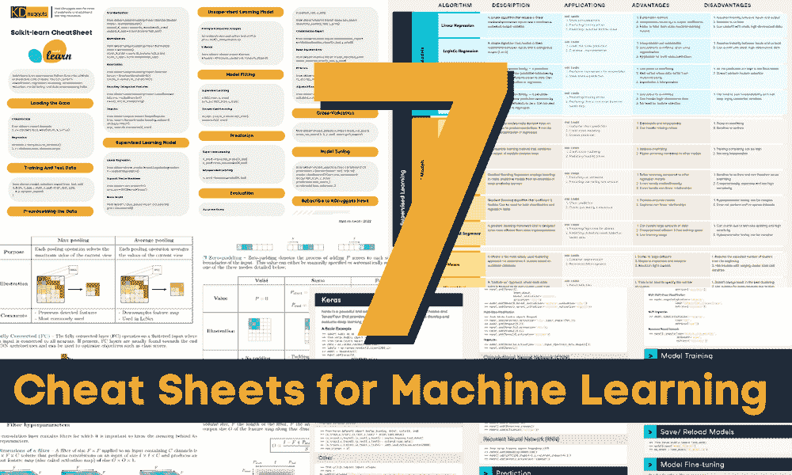
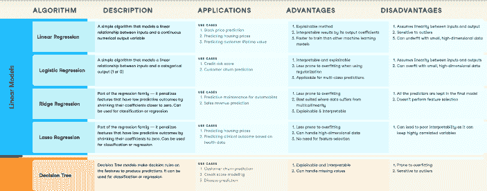
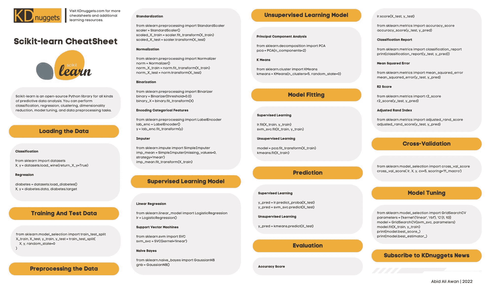
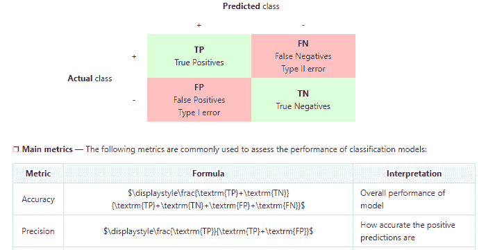
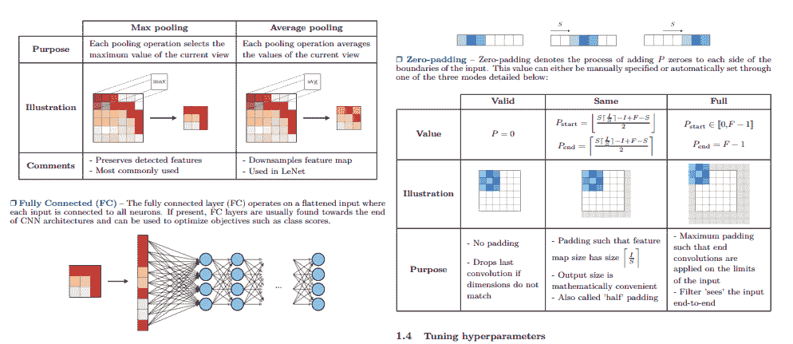
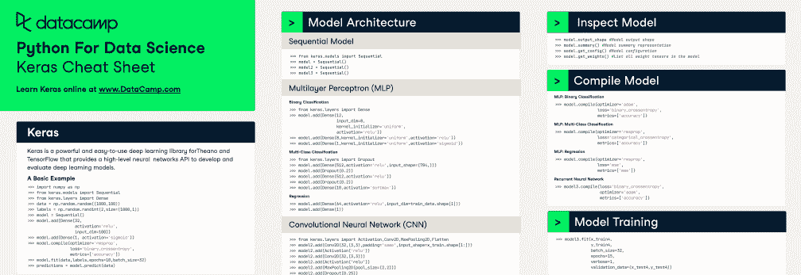
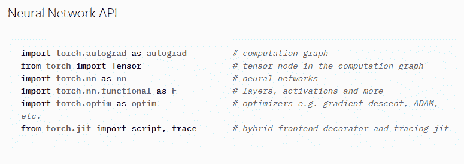
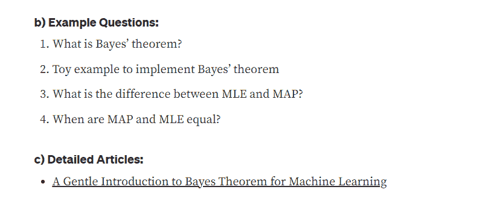

# 7 个你需要掌握的超级备忘单以应对机器学习面试

> 原文：[`www.kdnuggets.com/2022/12/7-super-cheat-sheets-need-ace-machine-learning-interview.html`](https://www.kdnuggets.com/2022/12/7-super-cheat-sheets-need-ace-machine-learning-interview.html)

图片由作者提供

在这篇文章中，你将学习机器学习和深度学习的算法和框架。此外，你还将学习如何处理数据、选择指标以及提高模型性能的小窍门。

* * *

## 我们的前三名课程推荐

 1\. [谷歌网络安全证书](https://www.kdnuggets.com/google-cybersecurity) - 快速进入网络安全职业道路。

 2\. [谷歌数据分析专业证书](https://www.kdnuggets.com/google-data-analytics) - 提升你的数据分析技能

 3\. [谷歌 IT 支持专业证书](https://www.kdnuggets.com/google-itsupport) - 支持你的组织的 IT 需求

* * *

最后也是最重要的备忘单是关于机器学习面试问题及答案，并附有视觉示例。

# 机器学习算法备忘单

[机器学习算法](https://www.datacamp.com/cheat-sheet/machine-learning-cheat-sheet) 备忘单涵盖了算法的描述、应用、优缺点。它是你进入监督和无监督机器学习模型世界的门户，在这里你将学习到线性模型和基于树的模型、聚类以及关联分析。

图片来源于 [备忘单](https://www.datacamp.com/cheat-sheet/machine-learning-cheat-sheet)

备忘单包含：

1.  线性回归

1.  逻辑回归

1.  岭回归

1.  Lasso 回归

1.  决策树

1.  随机森林

1.  梯度提升回归

1.  XGBoost

1.  LightGBM 回归器

1.  K-Means

1.  层次聚类

1.  高斯混合模型

1.  Apriori 算法

# Scikit-learn 机器学习备忘单

Scikit-learn 机器学习备忘单 包含了 Scikit-learn 的数据加载、数据拆分、监督和无监督模型、预测、模型评估和模型调优的 API。

你将学习数据处理、特征工程、应用各种模型以及使用 Grid Search 改善模型性能。

图片来源于 备忘单

备忘单包含：

1.  数据加载

1.  训练和测试数据

1.  数据预处理

1.  监督学习模型

1.  无监督学习模型

1.  模型拟合

1.  预测

1.  评估

1.  交叉验证

1.  模型调优

# 机器学习技巧和窍门备忘单

[机器学习技巧和窍门](https://stanford.edu/~shervine/teaching/cs-229/cheatsheet-machine-learning-tips-and-tricks) 备忘单主要涉及模型指标、模型选择和评估。这是一份由斯坦福大学提供的网络备忘单，您可以了解分类和回归、交叉验证和正则化，以及偏差与方差的权衡。

来自 [备忘单](https://stanford.edu/~shervine/teaching/cs-229/cheatsheet-machine-learning-tips-and-tricks) 的图片

备忘单包括：

1.  分类指标

1.  回归指标

1.  模型选择

1.  诊断

# 深度学习超级 VIP 备忘单

[深度学习超级 VIP](https://github.com/afshinea/stanford-cs-230-deep-learning/blob/master/en/super-cheatsheet-deep-learning.pdf) 备忘单解释了深度学习的各种组件，通过图表和数学讲解。您将学习卷积神经网络、递归神经网络、深度学习技巧和窍门，深入了解计算机视觉和自然语言处理模型。

来自 [备忘单](https://github.com/afshinea/stanford-cs-230-deep-learning/blob/master/en/super-cheatsheet-deep-learning.pdf) 的图片

备忘单包括：

1.  神经网络层的类型

1.  筛选超参数

1.  调整超参数

1.  常用激活函数

1.  对象检测

1.  处理长期依赖关系

1.  学习词向量表示

1.  比较词汇

1.  语言模型

1.  机器翻译

1.  注意力

1.  数据处理

1.  训练神经网络

1.  参数调整

1.  正则化

# Keras 中的神经网络备忘单

在 [Keras：Python 中的神经网络](https://datacamp-community-prod.s3.amazonaws.com/af9bb467-170d-41c9-a0bd-26e675384c4e) 备忘单中，您将学习如何处理和准备神经网络模型的数据。此外，您将学习如何构建模型架构、编译、训练、调优以及执行模型评估。

这份备忘单是快速复习 Keras 命令和学习新知识的好方法。

来自 [备忘单](https://datacamp-community-prod.s3.amazonaws.com/af9bb467-170d-41c9-a0bd-26e675384c4e) 的图片

备忘单包括：

1.  加载数据

1.  预处理

1.  模型架构

1.  预测

1.  检查模型

1.  编译模型

1.  模型训练

1.  模型评估

1.  保存和重新加载模型

1.  模型微调

# 使用 Pytorch 的深度学习备忘单

[PyTorch 官方备考清单](https://pytorch.org/tutorials/beginner/ptcheat.html)包括处理数据和构建深度学习模型的命令和 API。它是一个为有经验的 PyTorch 用户提供的简明 API。

图片来源于[备考清单](https://pytorch.org/tutorials/beginner/ptcheat.html)

备考清单包括：

1.  **导入：** 神经网络 API、Torchscript 和 JIT、ONNX、Vision 以及分布式训练。

1.  **张量：** 创建、维度、代数以及 GPU 使用。

1.  **深度学习：** 损失函数、激活函数、优化器和学习率调度。

1.  **数据工具：** 数据集、数据加载器和数据采样器。

# 机器学习面试备考清单

在[机器学习面试备考清单](https://medium.com/swlh/cheat-sheets-for-machine-learning-interview-topics-51c2bc2bab4f)中，作者通过图形化表示解释了机器学习面试中最常见的问题。该备考清单将帮助你通过了解各种机器学习算法、问题、权衡、数据处理和模型调优来在面试中取得成功。

图片来源于[备考清单](https://medium.com/swlh/cheat-sheets-for-machine-learning-interview-topics-51c2bc2bab4f)

面试备考清单包括：

1.  偏差与方差

1.  数据不平衡

1.  贝叶斯定理

1.  降维

1.  回归

1.  正则化

1.  卷积神经网络

1.  著名的深度神经网络

1.  集成学习

1.  自编码器和变分自编码器

# 结论

除了备考清单，你还可以阅读书籍、参加编码评估测试，甚至与同事进行模拟面试，以提高通过面试阶段的几率。

我强烈推荐你阅读[征服数据科学面试](https://www.amazon.com/Ace-Data-Science-Interview-Questions/dp/0578973839/ref=pd_bxgy_img_sccl_1/137-5550312-9155521?pd_rd_w=ejc5s&content-id=amzn1.sym.7f0cf323-50c6-49e3-b3f9-63546bb79c92&pf_rd_p=7f0cf323-50c6-49e3-b3f9-63546bb79c92&pf_rd_r=9RGK6EDVMAK9Q15PY7X3&pd_rd_wg=CJZdZ&pd_rd_r=885ddd39-ad7f-4047-ab2e-02cbab370bd3&pd_rd_i=0578973839&psc=1) 这本书，并参加[LeetCode 75](https://leetcode.com/study-plan/leetcode-75/)的数据科学和机器学习面试学习计划。

如果你喜欢我的工作，请在社交媒体上分享，或者如果你对职业有任何疑问，可以通过[LinkedIn](https://www.linkedin.com/in/1abidaliawan/)联系我。

**[Abid Ali Awan](https://www.polywork.com/kingabzpro)** ([@1abidaliawan](https://twitter.com/1abidaliawan)) 是一名认证数据科学专业人士，他热衷于构建机器学习模型。目前，他专注于内容创作和撰写关于机器学习和数据科学技术的技术博客。Abid 拥有技术管理硕士学位和电信工程学士学位。他的愿景是使用图神经网络为那些面临心理健康问题的学生开发一个人工智能产品。

### 更多相关话题

+   [10 个你需要的速查表助你征服数据科学面试](https://www.kdnuggets.com/2022/10/10-cheat-sheets-need-ace-data-science-interview.html)

+   [7 个必备速查表助你征服数据科学面试](https://www.kdnuggets.com/top-7-essential-cheat-sheets-to-ace-your-data-science-interview)

+   [5 个超实用的 SQL 速查表你不能错过！](https://www.kdnuggets.com/5-super-helpful-sql-cheat-sheets-you-cant-miss)

+   [5 个超实用的速查表掌握数据科学](https://www.kdnuggets.com/5-super-cheat-sheets-to-master-data-science)

+   [10 个统计学问题助你征服数据科学面试](https://www.kdnuggets.com/10-statistics-questions-to-ace-your-data-science-interview)

+   [KDnuggets™ 新闻 22:n06, 2 月 9 日: 数据科学编程…](https://www.kdnuggets.com/2022/n06.html)
