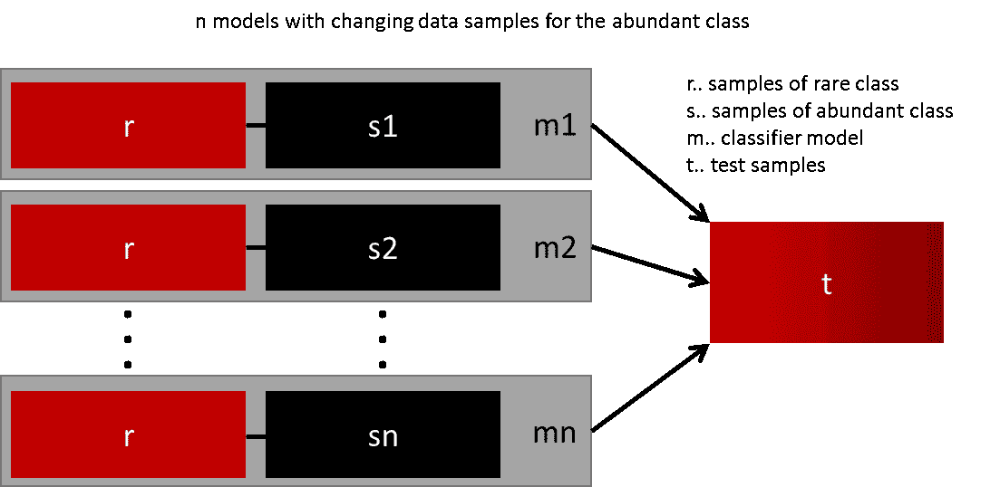
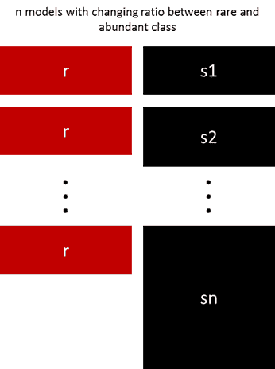
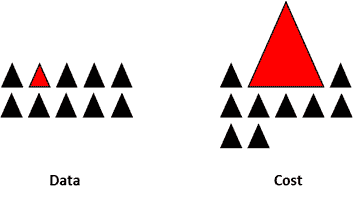

# 处理不平衡数据的 7 种技术

> 原文：[`www.kdnuggets.com/2017/06/7-techniques-handle-imbalanced-data.html`](https://www.kdnuggets.com/2017/06/7-techniques-handle-imbalanced-data.html)

**作者：Ye Wu & Rick Radewagen**

# 介绍

像银行欺诈检测、市场实时竞标或网络入侵检测等领域的数据集有什么共同之处？

* * *

## 我们的前三个课程推荐

 1\. [谷歌网络安全证书](https://www.kdnuggets.com/google-cybersecurity) - 快速进入网络安全职业生涯。

 2\. [谷歌数据分析专业证书](https://www.kdnuggets.com/google-data-analytics) - 提升你的数据分析技能

 3\. [谷歌 IT 支持专业证书](https://www.kdnuggets.com/google-itsupport) - 支持你的组织进行 IT 管理

* * *

这些领域使用的数据通常少于 1% 是稀有但“有趣”的事件（例如，欺诈者使用信用卡、用户点击广告或受损服务器扫描其网络）。然而，大多数机器学习算法在处理不平衡数据集时效果并不好。以下七种技术可以帮助你训练一个分类器来检测异常类别。

# 1\. 使用正确的评估指标

使用不平衡数据生成模型时应用不适当的评估指标可能会很危险。假设我们的训练数据如上图所示。如果使用准确率来衡量模型的好坏，一个将所有测试样本分类为“0”的模型将具有优秀的准确率（99.8%），但显然，这个模型对我们没有任何有价值的信息。

在这种情况下，还可以应用其他替代评估指标，如：

+   精确率/特异性：选择的实例中有多少是相关的。

+   召回率/敏感性：选择了多少相关实例。

+   F1 分数：精确率和召回率的调和均值。

+   MCC：观察到的二分类和预测二分类之间的相关系数。

+   AUC：真实正例率和假正例率之间的关系。

# 2\. 重新采样训练集

除了使用不同的评估标准外，还可以尝试获取不同的数据集。从不平衡数据集中制作平衡数据集的两种方法是欠采样和过采样。

## 2.1\. 欠采样

欠采样通过减少大量类别的大小来平衡数据集。当数据量足够时使用这种方法。通过保留稀有类别中的所有样本，并随机选择大量类别中的相同数量样本，可以获得一个平衡的新数据集以进行进一步建模。

## 2.2\. 过采样

相反，当数据量不足时使用过采样。它试图通过增加稀有样本的大小来平衡数据集。不是去除丰裕样本，而是通过使用例如重复、自助法或 SMOTE（合成少数类过采样技术）[1]生成新的稀有样本。

请注意，没有一种重采样方法比另一种方法绝对优越。这两种方法的应用取决于其适用的用例和数据集本身。过采样和欠采样的组合通常也会成功。

# 3\. 以正确的方式使用 K 折交叉验证

值得注意的是，使用过采样方法时，交叉验证应正确应用，以解决不平衡问题。

请记住，过采样会取出观察到的稀有样本，并应用自助法生成基于分布函数的新随机数据。如果在过采样后应用交叉验证，那么我们实际上是在将模型过拟合到特定的人工自助结果。这就是为什么交叉验证应始终在数据过采样之前进行，就像特征选择应实施一样。只有通过重复重采样数据，才能将随机性引入数据集，确保不会出现过拟合问题。

# 4\. 集成不同的重采样数据集

成功地推广模型的最简单方法是使用更多数据。问题在于，开箱即用的分类器，如逻辑回归或随机森林，往往通过丢弃稀有类来进行泛化。一个简单的最佳实践是构建 n 个模型，这些模型使用稀有类的所有样本和 n 个不同的丰裕类样本。假设你要集成 10 个模型，你会保留例如稀有类的 1,000 个案例，并随机抽取 10,000 个丰裕类案例。然后你只需将这 10,000 个案例分成 10 个块，并训练 10 个不同的模型。

这种方法很简单，如果你有大量数据，它在水平扩展上也非常好，因为你可以在不同的集群节点上训练和运行模型。集成模型通常也能更好地进行泛化，这使得这种方法易于处理。

# 5\. 使用不同的比例重采样

之前的方法可以通过调整稀有类和丰裕类之间的比例来进行微调。最佳比例严重依赖于数据和所使用的模型。但不是所有模型都以相同的比例进行集成，值得尝试集成不同的比例。因此，如果训练 10 个模型，可能会有一个模型的比例是 1:1（稀有:丰裕），另一个是 1:3，甚至是 2:1。根据所用模型，这可以影响一个类获得的权重。

# 6\. 对丰裕类进行聚类

Sergey 在 Quora 上提出了一种优雅的方法[2]。他建议将丰富类划分为 r 组，其中 r 为 r 中的案例数，而不是依赖随机样本来覆盖训练样本的多样性。对于每个组，仅保留 medoid（簇的中心）。然后仅用稀有类和 medoids 来训练模型。

# 7\. 设计你的模型

之前的方法都集中于数据，并将模型作为固定组件。但实际上，如果模型适用于不平衡数据，则无需重新抽样数据。著名的 XGBoost 已经是一个很好的起点，如果类别没有过于偏斜，因为它内部会处理所训练的袋子不平衡的问题。但即使如此，数据确实会被重新抽样，只是这个过程是秘密进行的。

通过设计一个对稀有类别错误分类给予更高惩罚的成本函数，可以设计出许多自然倾向于稀有类别的模型。例如，调整 SVM，以相同的比例惩罚稀有类别的错误分类，这个比例是该类别的不足比例。

# 最后的备注

这不是处理不平衡数据的独家技术列表，而是处理不平衡数据的起点。没有一种最适合所有问题的方法或模型，强烈建议尝试不同的技术和模型，以评估哪个效果最好。尝试创造性地结合不同的方法。还需要注意的是，在许多领域（例如欺诈检测、实时竞标）中，不平衡类别发生时，“市场规则”是不断变化的。因此，检查过去的数据是否可能已变得过时。

[1] [arxiv.org/pdf/1106.1813.pdf](https://arxiv.org/pdf/1106.1813.pdf)

[2] [www.quora.com/In-classification-how-do-you-handle-an-unbalanced-training-set/answers/1144228?srid=h3G6o](https://www.quora.com/In-classification-how-do-you-handle-an-unbalanced-training-set/answers/1144228?srid=h3G6o)

[**Ye Wu**](https://www.linkedin.com/in/ye-wu-424350b6/) 是 FARFETCH 的高级数据分析师。她具有会计背景，并在市场营销和销售预测方面有实际经验。

[**Rick Radewagen**](https://www.linkedin.com/in/radewagen/) 是 Sled 的共同创建者，同时也是一位有计算机科学背景的有抱负的数据科学家。

### 更多相关主题

+   [KDnuggets 新闻，8 月 31 日：完整的数据科学学习路线图…](https://www.kdnuggets.com/2022/n35.html)

+   [克服现实世界中不平衡数据挑战](https://www.kdnuggets.com/2023/07/overcoming-imbalanced-data-challenges-realworld-scenarios.html)

+   [无监督的解缠代表学习在类别…](https://www.kdnuggets.com/2023/01/unsupervised-disentangled-representation-learning-class-imbalanced-dataset-elastic-infogan.html)

+   [如何使用 Scikit-learn 的 Imputer 模块处理缺失数据](https://www.kdnuggets.com/how-to-handle-missing-data-with-scikit-learns-imputer-module)

+   [NumPy 中的掩码数组以处理缺失数据](https://www.kdnuggets.com/masked-arrays-in-numpy-to-handle-missing-data)

+   [如何使用 Pandas 处理数据集中的异常值](https://www.kdnuggets.com/how-to-handle-outliers-in-dataset-with-pandas)
