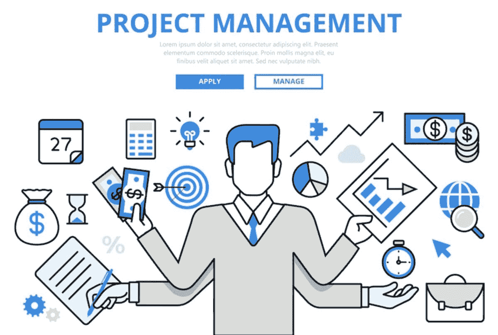

# 数据科学项目管理的 7 个技巧

> 原文：[`www.kdnuggets.com/2023/03/7-tips-data-science-project-management.html`](https://www.kdnuggets.com/2023/03/7-tips-data-science-project-management.html)

图片由 [freepik](https://www.freepik.com/) 提供

项目管理是数据科学中的一个重要方面。良好的项目管理技能将有助于提高你的效率和生产力。本文将讨论一些管理数据科学项目的技巧。

* * *

## 我们的前三个课程推荐

 1\. [谷歌网络安全证书](https://www.kdnuggets.com/google-cybersecurity) - 快速开启网络安全职业生涯。

 2\. [谷歌数据分析专业证书](https://www.kdnuggets.com/google-data-analytics) - 提升你的数据分析技能

 3\. [谷歌 IT 支持专业证书](https://www.kdnuggets.com/google-itsupport) - 支持你的组织进行 IT 管理

* * *

# 1\. 提出正确的问题

提出正确的问题是数据科学项目中最重要的步骤之一。你需要确定你希望从数据中获得什么见解。在某些情况下，你甚至需要在数据收集过程之前就提出正确的问题。

# 2\. 收集数据

你有可供分析的数据吗？如果数据已经存在，你可以进入下一步。如果数据不可用，你可能需要找出如何收集数据，例如通过调查，或购买已经存在的数据。如果你需要自己收集数据，需要注意以下几点：所需数据的数量、数据收集所需时间以及数据收集的成本。你还需要确保数据能够代表整体人群。不论你的数据来自何处，确保所收集的数据质量良好，因为不良数据会产生低质量且不可靠的预测模型。

# 3\. 清理和处理数据

任何收集的数据都会存在缺陷，如缺失数据或数据可能以错误格式输入到问卷中。原始数据需要进行清理和预处理，以使其适合进一步分析。

# 4\. 决定哪个模型是适合的

你需要决定适合该项目的模型。你是对描述性数据科学感兴趣，如数据可视化，还是使用数据进行预测分析？对于预测分析，你可以使用线性回归（用于连续目标变量）或分类（用于离散目标变量）。如果数据没有目标变量，你可以使用聚类算法进行模式识别建模。

# 5\. 构建、评估和测试模型

对于机器学习模型，如线性回归、分类或聚类，你需要构建、测试和评估你的模型。这将涉及将数据分为训练集和测试集。然后你需要确定适合的评估指标，如均方误差、R2 得分、平均绝对误差、整体准确度、敏感性、特异性、混淆矩阵、交叉验证得分等。

# 6\. 决定是否需要团队

你是在独自完成项目还是与合作者一起进行？大规模项目可能需要团队。如果与团队合作，确保根据成员的经验和专长分配角色。确保团队成员之间有有效的沟通，这将有助于提高生产力。

# 7\. 撰写项目报告以总结你的发现

项目完成后，撰写项目报告以总结你的分析结果。重要的是以一种不太技术性的方式总结你的结果。

# 结论

总结一下，我们讨论了在管理数据科学项目时需要牢记的重要提示。谨慎的准备、规划和执行将帮助你高效、及时地完成数据科学项目。

**[本杰明·O·泰约](https://www.linkedin.com/in/benjamin-o-tayo-ph-d-a2717511/)** 是一位物理学家、数据科学教育者和作家，同时也是 DataScienceHub 的创始人。之前，本杰明曾在中奥克拉荷马大学、大峡谷大学和匹兹堡州立大学教授工程学和物理学。

### 更多相关话题

+   [数据科学项目管理方法指南](https://www.kdnuggets.com/2023/07/guide-data-science-project-management-methodologies.html)

+   [掌握数据科学项目管理的 7 个步骤：敏捷方法](https://www.kdnuggets.com/2023/07/7-steps-mastering-data-science-project-management-agile.html)

+   [为什么数据管理对数据科学如此重要？](https://www.kdnuggets.com/2022/08/data-management-important-data-science.html)

+   [免费数据管理与数据科学学习：CS639](https://www.kdnuggets.com/2023/01/free-data-management-data-science-learning-cs639.html)

+   [数据科学的数据管理原则](https://www.kdnuggets.com/data-management-principles-for-data-science)

+   [免费的 4 周数据科学课程：人工智能质量管理](https://www.kdnuggets.com/2022/02/truera-free-4-week-data-science-course-ai-quality-management.html)
